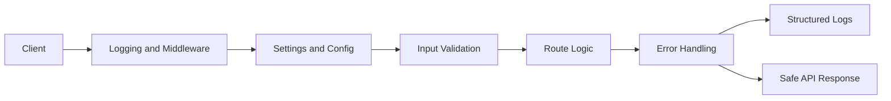

# Improving the API — Production Best Practices

> **Video:** [Watch on YouTube](https://www.youtube.com/watch?v=M17qwKnmG38) · **Series:** FastAPI for ML – CampusX

---

## Request Lifecycle in Production



## The Gap Between Development and Production

The prediction API from Video 8 works perfectly on your laptop. "Working on my laptop" is not the same as "production-ready." When this API runs in the cloud handling real traffic, you need answers to questions like:

- **Debugging 3 AM:** An alert fires. Predictions are returning 500 errors. What happened? What input triggered it? What was the stack trace?
- **Operations:** Is the API running? Is the model loaded? How long did each request take?
- **Configuration:** The staging environment uses a different model path. Production has a different API key. How do we manage this?
- **Client errors:** A client sends invalid input. Do they get a useful error or a cryptic Python exception?

This video adds four production essentials:
1. **Structured logging** — permanent, searchable records of what happened
2. **Configuration management** — env vars instead of hardcoded values
3. **Request logging middleware** — log every request automatically
4. **Custom exception handlers** — meaningful errors for clients

---

## 1. Structured Logging

### Why Not `print()`?

`print()` writes to stdout with no metadata. You can't filter by severity. You can't search by request ID. Log aggregation tools (Datadog, CloudWatch, ELK) can't parse it.

```python
# print() output — useless in production
Prediction request received
Training completed in 234 seconds
Error: list index out of range

# Structured logging output — fully searchable
{"timestamp":"2024-01-15T14:32:01Z","level":"INFO","event":"prediction_request","request_id":"a3f8","age":35}
{"timestamp":"2024-01-15T14:32:01Z","level":"INFO","event":"prediction_complete","request_id":"a3f8","prediction":"medium","confidence":0.76}
{"timestamp":"2024-01-15T14:32:01Z","level":"ERROR","event":"inference_failed","request_id":"a3f8","error":"list index out of range"}
```

With structured logs you can search: "show me all failed predictions for age > 60 in the last hour."

### Setting Up JSON Logging

```python title="app/core/logging_setup.py"
import logging
import json
import sys
from datetime import datetime, timezone

class JSONFormatter(logging.Formatter):
    """
    Converts each log record into a JSON object.
    
    Works with all major log aggregation services:
    - AWS CloudWatch: parses JSON fields automatically
    - Datadog: indexes JSON attributes for search
    - ELK Stack: Elasticsearch ingests JSON natively
    - Splunk: JSON is a first-class format
    """
    
    def format(self, record: logging.LogRecord) -> str:
        log_entry = {
            "timestamp": datetime.now(timezone.utc).isoformat(),
            "level": record.levelname,    # DEBUG, INFO, WARNING, ERROR, CRITICAL
            "logger": record.name,         # the logger name (e.g., "insurance_api")
            "message": record.getMessage(),
        }
        
        # Include exception details if this log was triggered by an exception
        if record.exc_info:
            log_entry["exception"] = self.formatException(record.exc_info)
        
        return json.dumps(log_entry)


def configure_logging(level: str = "INFO"):
    """
    Replace Python's default text logging with JSON logging.
    Call once at application startup.
    """
    handler = logging.StreamHandler(sys.stdout)
    handler.setFormatter(JSONFormatter())
    
    # Configure the root logger
    root_logger = logging.getLogger()
    root_logger.setLevel(getattr(logging, level.upper(), logging.INFO))
    root_logger.handlers = []     # remove any existing handlers
    root_logger.addHandler(handler)
```

Usage:
```python
import logging
logger = logging.getLogger("insurance_api")

logger.info("Prediction endpoint called")
logger.warning("Low confidence prediction", extra={"confidence": 0.41})
logger.error("Inference failed", exc_info=True)   # includes full stack trace
```

---

## 2. Configuration Management

Never hardcode paths, keys, or settings. They need to differ between environments (development, staging, production) and change without code modification.

```python title="app/core/config.py"
from pydantic_settings import BaseSettings   # pip install pydantic-settings
from functools import lru_cache

class Settings(BaseSettings):
    """
    All configuration in one place.
    
    pydantic_settings reads values from:
    1. Environment variables (highest priority)
    2. .env file (if present)
    3. Default values (lowest priority)
    
    Why pydantic_settings over os.environ?
    - Type conversion: "4" → 4 (int), "true" → True (bool)
    - Validation: required fields raise errors at startup (not later)
    - Documentation: field descriptions document what each var does
    - IDE support: autocomplete on settings.model_path
    """
    
    # Application
    app_name: str = "Insurance Premium API"
    app_version: str = "1.0.0"
    debug: bool = False
    log_level: str = "INFO"
    
    # ML Model
    model_path: str = "artifacts/insurance_model.pkl"
    model_version: str = "1.0.0"
    
    # Security (empty string = disabled, for development only)
    api_key: str = ""
    
    class Config:
        env_file = ".env"              # read from .env file if it exists
        env_file_encoding = "utf-8"

@lru_cache()    # parse settings only once, cache forever
def get_settings() -> Settings:
    return Settings()
```

```bash title=".env"
# Development settings — NEVER commit this file to git!
# Add .env to your .gitignore
DEBUG=true
LOG_LEVEL=DEBUG
MODEL_PATH=artifacts/insurance_model_v2.pkl
MODEL_VERSION=2.0.0
API_KEY=dev-only-key-not-secure
```

```bash title=".env.example"
# Template for other developers — safe to commit
# Copy this to .env and fill in real values
DEBUG=false
LOG_LEVEL=INFO
MODEL_PATH=artifacts/insurance_model.pkl
MODEL_VERSION=1.0.0
API_KEY=your-api-key-here
```

On production servers: set real environment variables. No `.env` file needed.

---

## 3. Request Logging Middleware

Middleware runs for **every** request, before and after your endpoint function. Use it for cross-cutting concerns like logging, authentication, and request IDs.

```python title="app/middleware/logging_middleware.py"
import time
import uuid
import logging
from starlette.middleware.base import BaseHTTPMiddleware
from fastapi import Request, Response

logger = logging.getLogger("api.middleware")

class RequestLoggingMiddleware(BaseHTTPMiddleware):
    """
    Logs every request and response.
    
    Attaches a unique Request ID to every request.
    The Request ID appears in:
    - All log lines for this request (makes tracing trivial)
    - The response header X-Request-ID (clients include it in bug reports)
    
    When a user says "I got an error around 3 PM", you search logs
    for their X-Request-ID and find every log line for their request.
    """
    
    async def dispatch(self, request: Request, call_next) -> Response:
        # Generate a short unique ID for this specific request
        request_id = str(uuid.uuid4())[:8]   # e.g., "a3f8b2c1"
        start_time = time.perf_counter()
        
        # Log the incoming request
        logger.info({
            "event": "request_start",
            "request_id": request_id,
            "method": request.method,
            "path": str(request.url.path),
            "client_ip": request.client.host if request.client else "unknown",
        })
        
        # Pass the request to the actual endpoint function
        response = await call_next(request)
        
        # Calculate how long the request took
        duration_ms = round((time.perf_counter() - start_time) * 1000, 2)
        
        # Log the response
        logger.info({
            "event": "request_end",
            "request_id": request_id,
            "status_code": response.status_code,
            "duration_ms": duration_ms,
            "path": str(request.url.path),
        })
        
        # Attach the request ID to the response so clients can reference it
        response.headers["X-Request-ID"] = request_id
        
        return response
```

Register in your app:
```python title="main.py"
from middleware.logging_middleware import RequestLoggingMiddleware

app.add_middleware(RequestLoggingMiddleware)
```

---

## 4. Custom Exception Handlers

### Improving the 422 Validation Error

FastAPI's default 422 error is detailed but verbose. Customize it to be cleaner:

```python
from fastapi import Request
from fastapi.responses import JSONResponse
from fastapi.exceptions import RequestValidationError

@app.exception_handler(RequestValidationError)
async def handle_validation_error(request: Request, exc: RequestValidationError):
    """
    Called automatically whenever Pydantic validation fails (422 errors).
    
    We reformat the error to be cleaner and more actionable for clients.
    We also log it (with WARNING level — it's client's fault, not ours).
    """
    # Reformat errors into a cleaner structure
    formatted_errors = []
    for error in exc.errors():
        # loc is like ["body", "age"] — join with dot for readability
        field_path = ".".join(str(part) for part in error["loc"][1:])
        formatted_errors.append({
            "field": field_path,
            "message": error["msg"],
            "type": error["type"],
        })
    
    logger.warning({
        "event": "validation_error",
        "path": str(request.url.path),
        "error_count": len(formatted_errors),
        "errors": formatted_errors,
    })
    
    return JSONResponse(
        status_code=422,
        content={
            "error": "Validation failed",
            "message": "One or more input fields are invalid. See 'details' for specifics.",
            "details": formatted_errors,
        }
    )
```

### The Critical 500 Error Handler

Default FastAPI 500 responses expose Python exception messages — potentially leaking file paths, database info, or model internals. Always override:

```python
@app.exception_handler(Exception)
async def handle_unhandled_exception(request: Request, exc: Exception):
    """
    Catches any exception not handled by your endpoint code.
    
    WE LOG THE FULL DETAILS (for debugging).
    WE RETURN A SAFE MESSAGE (no internal details to clients).
    
    This is security-critical: never expose stack traces or error messages
    from internal errors to external clients.
    """
    logger.error({
        "event": "unhandled_exception",
        "error_type": type(exc).__name__,
        "error_message": str(exc),
        "path": str(request.url.path),
        "method": request.method,
    }, exc_info=True)   # exc_info=True includes full stack trace in the log
    
    return JSONResponse(
        status_code=500,
        content={
            "error": "Internal server error",
            "message": "An unexpected error occurred. Our team has been notified.",
            # Never include str(exc) or traceback here — that's a security risk!
        }
    )
```

---

## 5. Improved Predict Endpoint

Putting it all together — the prediction endpoint with proper logging:

```python
@app.post("/predict", response_model=PredictionOutput, tags=["prediction"])
def predict(data: InsuranceInput, request: Request):
    """
    Run insurance premium prediction with full logging.
    """
    # Get the request ID that the middleware attached
    request_id = request.headers.get("X-Request-ID", "unknown")
    
    logger.info({
        "event": "prediction_request",
        "request_id": request_id,
        "age": data.age,
        "smoker": data.smoker,
        "region": data.region,
        # Don't log all fields — avoid logging sensitive information
    })
    
    if not model_store.get("model"):
        logger.error({"event": "model_unavailable", "request_id": request_id})
        raise HTTPException(503, "Prediction service unavailable — model not loaded")
    
    try:
        input_df = pd.DataFrame([data.model_dump()])
        model = model_store["model"]
        prediction = str(model.predict(input_df)[0])
        proba = model.predict_proba(input_df)[0]
        classes = model_store["classes"]
        probabilities = {c: round(float(p), 4) for c, p in zip(classes, proba)}
        confidence = probabilities[prediction]
        
        logger.info({
            "event": "prediction_success",
            "request_id": request_id,
            "prediction": prediction,
            "confidence": confidence,
        })
        
        return PredictionOutput(
            prediction=prediction,
            confidence=confidence,
            probabilities=probabilities,
            model_version=MODEL_VERSION
        )
    
    except Exception as e:
        logger.error({
            "event": "inference_error",
            "request_id": request_id,
            "error": str(e),
        }, exc_info=True)
        raise HTTPException(500, "Inference failed. Please check your input values.")
```

---

## Q&A

**Q: Should I log the entire request body in production?**

Be careful. Log enough to debug, not so much that you create privacy issues. Log metadata (which endpoint, which user, which features caused the issue) but avoid logging personally identifiable information (names, phone numbers, exact financial amounts) unless required. For GDPR/HIPAA compliance, discuss with your legal team what can be logged.

**Q: What log level should each event be?**

| Level | When to use |
|-------|-------------|
| `DEBUG` | Detailed step-by-step info for troubleshooting (disabled in production) |
| `INFO` | Normal operations — request received, prediction made, model loaded |
| `WARNING` | Unexpected but handled — validation error, low confidence, rate limit hit |
| `ERROR` | Something went wrong — inference failed, database error, external service down |
| `CRITICAL` | System is unusable — can't load model, can't connect to anything |

**Q: What is middleware and what else can it do?**

Middleware is code that wraps every request. Common middleware uses:
- **Request logging** (this video)
- **Authentication** — validate tokens before any endpoint runs
- **CORS** — add cross-origin headers for web frontends
- **GZip compression** — compress large responses
- **Rate limiting** — count requests per client
- **Request ID injection** — attach a unique ID to every request

**Q: How do I see the X-Request-ID in Swagger UI?**

After making a request in Swagger UI, click the response area to expand it. Under "Response headers" you'll see `X-Request-ID: a3f8b2c1`. Include this value in your bug reports or when searching logs.

**Q: Is pydantic-settings the same as pydantic?**

No — it's a separate package (`pip install pydantic-settings`) that adds environment variable and `.env` file reading on top of Pydantic. `BaseSettings` is the class for configuration; `BaseModel` is for API schemas.
