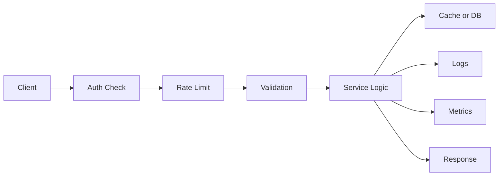

# Production Patterns Every ML Engineer Needs

> **Beyond the Videos** — Essential patterns not in the series that you'll need on Day 1 of any production ML role.

---

## Production Request Flow



## The Gap Between "It Works" and "Production-Ready"

A tutorial API and a production API might look the same from the outside. The differences are entirely internal:

```
Tutorial API                        Production API
────────────────────────────────    ─────────────────────────────────
No authentication (local only)      JWT or API keys on every endpoint
Manual curl testing                 Automated test suite (80%+ coverage)
Stack traces to clients             Structured logs, safe error messages
Hardcoded paths and keys            Environment variables, secrets manager
No rate limiting                    Per-user limits preventing abuse
Single-file app                     Modular, routers, services, schemas
No CORS handling                    CORS configured for specific origins
print() statements                  Structured JSON logging
```

This document covers the most important production patterns concisely.

---

## 1. API Key Authentication

The simplest auth pattern: clients include a secret key in a request header.

```python title="app/core/auth.py"
from fastapi import HTTPException, Security, status
from fastapi.security import APIKeyHeader
from core.config import get_settings

settings = get_settings()

# Define: look for the key in the "X-API-Key" HTTP header
api_key_scheme = APIKeyHeader(
    name="X-API-Key",
    auto_error=False,       # don't auto-raise; we handle the error below
    description="API key for authentication"
)

async def require_api_key(api_key: str = Security(api_key_scheme)) -> str:
    """
    FastAPI dependency that validates API key.
    
    Usage: add Depends(require_api_key) to any endpoint.
    FastAPI calls this first. If it raises, the endpoint never runs.
    """
    if not settings.api_key:
        # Empty api_key in settings = auth disabled (dev mode)
        return "dev-mode"
    
    if not api_key or api_key != settings.api_key:
        raise HTTPException(
            status_code=status.HTTP_403_FORBIDDEN,
            detail="Invalid or missing API key. Include in X-API-Key header.",
        )
    
    return api_key
```

```python
# Apply to a single endpoint:
@app.post("/predict")
def predict(
    data: InsuranceInput,
    _: str = Depends(require_api_key)   # _ = "I don't use the return value"
):
    ...

# Apply to an entire router (every endpoint in the router requires auth):
router = APIRouter(
    prefix="/admin",
    dependencies=[Depends(require_api_key)]
)
```

Test:
```bash
# Without key → 403 Forbidden
curl http://localhost:8000/predict -X POST -d '...'

# With correct key → 200 OK  
curl -H "X-API-Key: your-secret-key" http://localhost:8000/predict -X POST -d '...'
```

---

## 2. Testing with pytest and TestClient

### Why Test?

Refactoring 50 endpoints without tests is terrifying. Tests give you confidence that changes don't silently break things.

```bash
pip install pytest pytest-cov httpx
```

```python title="tests/conftest.py"
import pytest
from fastapi.testclient import TestClient
from unittest.mock import MagicMock
import numpy as np
from main import app, model_store

@pytest.fixture(scope="session")
def client():
    """
    One TestClient for all tests.
    No actual HTTP network — everything happens in-process.
    """
    return TestClient(app)

@pytest.fixture(autouse=True)
def mock_ml_model():
    """
    Replace the real model with a fast, deterministic mock.
    autouse=True: applies to EVERY test automatically.
    
    Without this: tests take 200ms+ to load model, return random results.
    With this: tests take microseconds, return predictable results.
    """
    mock = MagicMock()
    mock.predict.return_value = np.array(["medium"])
    mock.predict_proba.return_value = np.array([[0.1, 0.7, 0.2]])
    mock.classes_ = np.array(["high", "low", "medium"])
    
    original = dict(model_store)
    model_store.update({"model": mock, "classes": ["high", "low", "medium"]})
    yield mock
    model_store.clear()
    model_store.update(original)
```

```python title="tests/test_predict.py"
VALID_INPUT = {
    "age": 35, "sex": "male", "bmi": 27.9,
    "children": 2, "smoker": "no", "region": "southeast"
}

class TestPredictEndpoint:
    def test_valid_input_returns_200(self, client):
        response = client.post("/predict", json=VALID_INPUT)
        assert response.status_code == 200
        data = response.json()
        assert data["prediction"] in ["low", "medium", "high"]
        assert 0.0 <= data["confidence"] <= 1.0
    
    def test_missing_field_returns_422(self, client):
        response = client.post("/predict", json={"age": 35})  # missing most fields
        assert response.status_code == 422
    
    def test_invalid_age_below_minimum_returns_422(self, client):
        response = client.post("/predict", json={**VALID_INPUT, "age": 5})
        assert response.status_code == 422
    
    def test_invalid_smoker_value_returns_422(self, client):
        response = client.post("/predict", json={**VALID_INPUT, "smoker": "sometimes"})
        assert response.status_code == 422
    
    def test_model_unavailable_returns_503(self, client):
        model_store["model"] = None
        response = client.post("/predict", json=VALID_INPUT)
        assert response.status_code == 503
        model_store["model"] = MagicMock()  # restore

class TestHealthEndpoints:
    def test_health_always_returns_200(self, client):
        response = client.get("/health")
        assert response.status_code == 200
        assert response.json()["status"] == "ok"
```

```bash
# Run all tests
pytest tests/ -v

# With coverage report
pytest tests/ -v --cov=. --cov-report=html
# Opens htmlcov/index.html — shows which lines are covered
```

---

## 3. Rate Limiting with slowapi

```bash
pip install slowapi
```

```python
from slowapi import Limiter, _rate_limit_exceeded_handler
from slowapi.util import get_remote_address
from slowapi.errors import RateLimitExceeded

# Identify clients by IP address
limiter = Limiter(key_func=get_remote_address)
app.state.limiter = limiter
app.add_exception_handler(RateLimitExceeded, _rate_limit_exceeded_handler)

@app.post("/predict")
@limiter.limit("10/minute")      # at most 10 requests per IP per minute
async def predict(request: Request, data: InsuranceInput):
    # 'request' parameter is required for slowapi
    ...

@app.post("/batch-predict")
@limiter.limit("2/minute")       # batch is expensive → stricter limit
async def batch_predict(request: Request, batch: BatchInput):
    ...
```

When the limit is exceeded:
```json
HTTP 429 Too Many Requests
{ "error": "Rate limit exceeded: 10 per 1 minute" }
```

---

## 4. CORS — Allow Frontend to Call Your API

Browsers block JavaScript from calling APIs on different domains by default. CORS configures which origins are allowed:

```python
from fastapi.middleware.cors import CORSMiddleware

app.add_middleware(
    CORSMiddleware,
    allow_origins=[
        "https://yourwebapp.com",
        "https://staging.yourwebapp.com",
        "http://localhost:3000",    # local React development
    ],
    allow_methods=["GET", "POST", "PUT", "PATCH", "DELETE"],
    allow_headers=["Content-Type", "Authorization", "X-API-Key"],
    allow_credentials=True,
)
```

---

## 5. Batch Prediction Endpoint

Instead of one prediction per request (slow for many records), process a batch:

```python
class BatchInput(BaseModel):
    inputs: list[InsuranceInput]
    
    @field_validator("inputs")
    @classmethod
    def not_empty(cls, v):
        if not v:
            raise ValueError("Batch cannot be empty")
        if len(v) > 1000:
            raise ValueError("Maximum batch size is 1000")
        return v

class BatchOutput(BaseModel):
    predictions: list[PredictionOutput]
    total: int

@app.post("/batch-predict", response_model=BatchOutput, tags=["prediction"])
def batch_predict(batch: BatchInput):
    """
    Predict for multiple inputs in one request.
    Much more efficient than 1000 separate /predict calls:
    - 1 HTTP overhead vs 1000
    - Vectorized sklearn inference (parallel)
    """
    if not model_store.get("model"):
        raise HTTPException(503, "Model not loaded")
    
    model = model_store["model"]
    
    # Build DataFrame with all inputs at once
    df = pd.DataFrame([inp.model_dump() for inp in batch.inputs])
    
    # Vectorized prediction (much faster than a loop)
    predictions = model.predict(df)
    probabilities = model.predict_proba(df)
    classes = model_store["classes"]
    
    results = [
        PredictionOutput(
            prediction=str(pred),
            confidence=round(float(max(prob)), 4),
            probabilities={c: round(float(p), 4) for c, p in zip(classes, prob)},
            model_version=MODEL_VERSION
        )
        for pred, prob in zip(predictions, probabilities)
    ]
    
    return BatchOutput(predictions=results, total=len(results))
```

---

## 6. Comprehensive Health and Readiness Checks

```python
from datetime import datetime, timezone

startup_time = datetime.now(timezone.utc)

@app.get("/health", tags=["ops"])
def health():
    """
    Liveness probe — is the process running?
    Should always return 200 as long as the process is alive.
    Kubernetes restarts the pod if this returns non-200.
    """
    return {
        "status": "ok",
        "uptime_seconds": int((datetime.now(timezone.utc) - startup_time).total_seconds()),
        "version": MODEL_VERSION,
    }

@app.get("/ready", tags=["ops"])
def readiness():
    """
    Readiness probe — is the service ready to accept traffic?
    Kubernetes stops routing traffic here if this returns non-200.
    """
    checks = {
        "model_loaded": model_store.get("model") is not None,
        # Add more: "database_connected": db is not None, etc.
    }
    all_ready = all(checks.values())
    
    from fastapi.responses import JSONResponse
    return JSONResponse(
        status_code=200 if all_ready else 503,
        content={
            "ready": all_ready,
            "checks": checks,
        }
    )
```

---

## Production Checklist

Before declaring your API production-ready:

```
Security
☐ Authentication on all non-public endpoints
☐ Secrets in environment variables (not code or git)
☐ Non-root user in Docker container
☐ HTTPS only (TLS at load balancer or Nginx)
☐ CORS configured — allow only known origins
☐ Rate limiting enabled

Reliability
☐ /health endpoint responds < 100ms
☐ /ready endpoint checks all dependencies
☐ Model loads at startup (not per-request)
☐ Graceful shutdown (lifespan cleanup)
☐ Auto-restart configured (--restart unless-stopped)

Observability
☐ Structured JSON logging (not print)
☐ Request ID in every log line
☐ Latency logged per endpoint
☐ Error rate monitored with alerting
☐ /health and /ready connected to monitoring

Testing
☐ Unit tests for Pydantic schemas
☐ Integration tests for all endpoints
☐ Test for 422 (bad input) cases
☐ Test for 503 (model unavailable) cases
☐ CI pipeline runs tests on every commit
```

---

## Q&A

**Q: Which auth method should I use — API keys or JWT?**

API keys: simpler, great for M2M (machine-to-machine) calls where a service calls your API. One secret key per client.

JWT (JSON Web Tokens): for user-facing apps where individuals log in with credentials. Each token carries the user's identity and roles. Stateless — no database lookup per request.

For an internal ML API used by your team or other services: API keys are perfect. For a user-facing product with different user roles: JWT.

**Q: What code coverage percentage should I target?**

80% is the common minimum. Don't chase 100% — testing every error handler and edge case is expensive and often tests Python internals rather than your code. Focus on the critical paths: prediction logic, authentication flows, data validation edge cases.

**Q: How do I run tests in CI (GitHub Actions, GitLab CI)?**

```yaml title=".github/workflows/test.yml"
name: Tests
on: [push, pull_request]
jobs:
  test:
    runs-on: ubuntu-latest
    steps:
      - uses: actions/checkout@v4
      - uses: actions/setup-python@v5
        with:
          python-version: "3.11"
          cache: "pip"
      - run: pip install -r requirements.txt pytest pytest-cov
      - run: pytest --cov=. --cov-report=xml
```

**Q: Should I return detailed error messages from my API?**

For validation errors (422): yes — be specific. Tell clients exactly which field failed and why. For server errors (500): no — log the full error server-side, return a generic "Internal error" message to clients. Detailed 500 messages can leak file paths, database info, or model internals.
