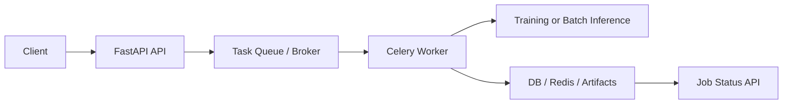

# Celery — Background Jobs for Long-Running ML Tasks

> **Advanced Topic** — Processing model training, batch inference, and scheduled jobs outside your API.

---

## Background Job Flow



## The Problem: HTTP Requests Can't Wait Forever

HTTP has a fundamental constraint: clients expect a response in seconds (typically under 30). But ML operations can take minutes or hours:

- Model training on a large dataset: 30 minutes
- Batch prediction on 100,000 records: 5 minutes
- Generating a weekly analytics report: 2 minutes

If you run these inside an HTTP endpoint, the client must hold the connection open the entire time. Most HTTP clients timeout after 30-60 seconds. Even if they don't, the user is stuck looking at a loading spinner for 30 minutes.

```
Synchronous (wrong approach for long tasks):
Client → POST /train → [server training for 30 min] → client TIMEOUT! 😱

Background Jobs (correct approach):
Client → POST /train → 202 Accepted + {"job_id": "abc123"}  (instant!)
                ↓
         Background worker trains the model independently
                ↓
Client → GET /jobs/abc123 → {"status": "completed", "accuracy": 0.89}
```

This is the **job queue pattern**: accept work, return a job ID immediately, process in the background, let clients poll for the result.

---

## Why Celery Specifically?

FastAPI has `BackgroundTasks` for simple background work (sending emails, logging). But it has limits:

| | FastAPI BackgroundTasks | Celery |
|-|------------------------|--------|
| **Duration** | < 30 seconds | Hours if needed |
| **Runs in** | Same process as API | Separate worker process |
| **Survives crash?** | No | Yes (tasks are persistent) |
| **Retry on failure** | No | Yes (configurable) |
| **Monitoring** | Nothing | Flower web dashboard |
| **Scheduled tasks** | No | Yes (Celery Beat) |
| **Scale workers** | Can't | Add more worker processes |

Use `BackgroundTasks` for fire-and-forget lightweight tasks. Use Celery for anything that takes more than a few seconds, requires retry logic, or needs to run on a schedule.

---

## How Celery Works — The Architecture

```
┌───────────────┐         ┌───────────────┐         ┌───────────────┐
│  FastAPI App  │         │  Message      │         │  Celery       │
│  (Producer)   │         │  Broker       │         │  Worker       │
│               │─ task → │  (Redis)      │─ task → │  (Consumer)   │
│  /train       │         │               │         │               │
│               │         │  Queue:       │         │  Runs train() │
│  Returns:     │         │  [task1]      │         │  Saves result │
│  {"job_id"}   │         │  [task2]      │         │               │
└───────────────┘         └───────────────┘         └───────┬───────┘
        │                                                    │
        │              ┌───────────────┐                    │
        └── poll ─────►│  Result       │◄── store result ───┘
                       │  Backend      │
                       │  (Redis)      │
                       └───────────────┘
```

**Broker**: Where tasks are queued. Redis acts as a message queue — tasks are messages pushed by the API, consumed by workers.

**Worker**: A separate Python process that reads tasks from the queue, executes them, and stores results.

**Backend**: Where results are stored after execution. Also Redis — the API polls this to check task status.

---

## Installation

```bash
pip install celery[redis]   # Celery with Redis support
pip install redis           # Redis client
pip install flower          # Celery web monitoring dashboard

# Run Redis (or use Docker):
docker run -d --name redis -p 6379:6379 redis:7-alpine
```

---

## Step 1: Celery Application Configuration

```python title="app/worker/celery_app.py"
from celery import Celery
from core.config import get_settings

settings = get_settings()

celery_app = Celery(
    "ml_worker",                    # name of this Celery application
    broker=settings.redis_url,      # where tasks are sent (Redis queue)
    backend=settings.redis_url,     # where results are stored (Redis)
    include=[                       # Python modules containing task definitions
        "worker.tasks.training",
        "worker.tasks.batch_inference",
    ],
)

celery_app.conf.update(
    # ─── Serialization ───────────────────────────────────────────
    # Use JSON instead of pickle (pickle can execute arbitrary code!)
    task_serializer="json",
    result_serializer="json",
    accept_content=["json"],
    
    # ─── Time limits ─────────────────────────────────────────────
    # soft limit: raises SoftTimeLimitExceeded exception in the task
    #             gives the task a chance to clean up gracefully
    task_soft_time_limit=3600,      # 1 hour
    # hard limit: kills the worker process after this time
    task_time_limit=3660,           # 1 hour 1 minute
    
    # ─── Retry defaults ──────────────────────────────────────────
    task_max_retries=3,
    task_default_retry_delay=60,    # wait 60 seconds between retries
    
    # ─── Result storage ──────────────────────────────────────────
    result_expires=86400,           # keep results for 24 hours in Redis
    
    # ─── Worker behavior ─────────────────────────────────────────
    # prefetch_multiplier=1: worker picks up one task at a time
    # This is important for long ML tasks — don't grab 4 training jobs
    # if you can only run one at a time without running out of memory
    worker_prefetch_multiplier=1,
    
    # ─── Task routing — separate queues by task type ──────────────
    # Training is heavy (1 task at a time), inference is lighter (many at once)
    task_routes={
        "worker.tasks.training.*": {"queue": "training"},
        "worker.tasks.batch_inference.*": {"queue": "inference"},
    },
)
```

---

## Step 2: Defining Tasks

```python title="app/worker/tasks/training.py"
import time
import uuid
import joblib
import pandas as pd
from sklearn.ensemble import RandomForestClassifier
from sklearn.pipeline import Pipeline
from sklearn.model_selection import train_test_split
from celery import Task
from celery.exceptions import SoftTimeLimitExceeded
from worker.celery_app import celery_app
import logging

logger = logging.getLogger(__name__)


@celery_app.task(
    bind=True,           # 'self' refers to the task instance (for retry, update_state)
    name="worker.tasks.training.train_model",
    max_retries=2,       # try 3 times total (1 initial + 2 retries)
    soft_time_limit=3600,
)
def train_model(
    self,                # the task instance (because bind=True)
    experiment_id: int,
    dataset_path: str,
    hyperparams: dict,
    created_by: str,
) -> dict:
    """
    Train an ML model as a background task.
    
    bind=True gives us access to 'self' which lets us:
    1. self.update_state(): update progress so clients can see it
    2. self.retry(): retry the task on failure
    3. self.request.id: the unique task ID
    """
    task_id = self.request.id
    logger.info(f"Starting training task {task_id} for experiment {experiment_id}")
    
    try:
        # ─── Stage 1: Load Data ───────────────────────────────────
        # Update state so clients polling /jobs/{id} see progress
        self.update_state(
            state="TRAINING",
            meta={"stage": "loading_data", "progress": 5, "message": "Loading dataset..."}
        )
        
        df = pd.read_csv(dataset_path)
        logger.info(f"[{task_id}] Loaded {len(df)} rows from {dataset_path}")
        
        # ─── Stage 2: Prepare Features ────────────────────────────
        self.update_state(
            state="TRAINING",
            meta={"stage": "preparing_features", "progress": 15, "message": "Preparing features..."}
        )
        
        feature_cols = hyperparams.get("feature_columns", [])
        target_col = hyperparams.get("target_column", "label")
        
        X = df[feature_cols]
        y = df[target_col]
        X_train, X_test, y_train, y_test = train_test_split(
            X, y, test_size=0.2, random_state=42
        )
        
        # ─── Stage 3: Train Model ─────────────────────────────────
        self.update_state(
            state="TRAINING",
            meta={"stage": "training", "progress": 20, "message": "Training model..."}
        )
        
        model = Pipeline([
            ("classifier", RandomForestClassifier(
                n_estimators=hyperparams.get("n_estimators", 100),
                max_depth=hyperparams.get("max_depth", None),
                random_state=42,
                n_jobs=-1
            ))
        ])
        
        # Long-running step — we could update progress during this
        model.fit(X_train, y_train)
        
        # ─── Stage 4: Evaluate ───────────────────────────────────
        self.update_state(
            state="TRAINING",
            meta={"stage": "evaluating", "progress": 85, "message": "Evaluating model..."}
        )
        
        train_acc = float(model.score(X_train, y_train))
        test_acc = float(model.score(X_test, y_test))
        
        logger.info(f"[{task_id}] Train acc: {train_acc:.4f}, Test acc: {test_acc:.4f}")
        
        # ─── Stage 5: Save Model ─────────────────────────────────
        self.update_state(
            state="TRAINING",
            meta={"stage": "saving", "progress": 95, "message": "Saving model artifact..."}
        )
        
        version = uuid.uuid4().hex[:8]
        artifact_path = f"artifacts/model_{version}.pkl"
        joblib.dump(model, artifact_path)
        
        logger.info(f"[{task_id}] Training complete. Saved to {artifact_path}")
        
        # Return value is stored in the result backend
        # Clients can retrieve this via /jobs/{task_id}
        return {
            "status": "completed",
            "experiment_id": experiment_id,
            "version": version,
            "artifact_path": artifact_path,
            "metrics": {
                "train_accuracy": round(train_acc, 4),
                "test_accuracy": round(test_acc, 4),
            },
            "training_rows": len(X_train),
            "created_by": created_by,
        }
    
    except SoftTimeLimitExceeded:
        # Time limit reached — task must stop
        logger.error(f"[{task_id}] Training timed out after 1 hour")
        raise  # re-raise so Celery knows the task failed
    
    except FileNotFoundError as e:
        # Don't retry file not found errors — retrying won't help
        logger.error(f"[{task_id}] Dataset not found: {e}")
        raise  # fail immediately
    
    except Exception as exc:
        logger.error(f"[{task_id}] Training failed: {exc}", exc_info=True)
        # Retry with exponential backoff
        # countdown: seconds to wait before retry (increases each attempt)
        raise self.retry(
            exc=exc,
            countdown=60 * (self.request.retries + 1)  # 60s, 120s, 180s
        )
```

---

## Step 3: Job Management Endpoints

```python title="app/routers/jobs.py"
from fastapi import APIRouter, Depends, HTTPException
from pydantic import BaseModel
from typing import Optional
from celery.result import AsyncResult
from worker.celery_app import celery_app
from worker.tasks.training import train_model
from core.dependencies import require_ds_or_admin

router = APIRouter(prefix="/jobs", tags=["background-jobs"])


class TrainRequest(BaseModel):
    """Request to start a training job."""
    experiment_id: int
    dataset_path: str
    hyperparams: dict = {}


class JobStatusResponse(BaseModel):
    """Response when checking a job's status."""
    job_id: str
    status: str              # "queued", "running", "completed", "failed"
    progress: Optional[int] = None   # 0-100
    stage: Optional[str] = None      # "loading_data", "training", etc.
    message: Optional[str] = None    # human-readable status message
    result: Optional[dict] = None    # only set when completed
    error: Optional[str] = None      # only set when failed


@router.post("/train", status_code=202)
async def start_training(
    data: TrainRequest,
    current_user=Depends(require_ds_or_admin),
):
    """
    Start a model training job in the background.
    
    Returns 202 Accepted immediately — NOT 200 OK.
    202 means "I've accepted your request and will process it asynchronously."
    The actual training happens in a Celery worker.
    
    The client uses the job_id to poll for status.
    """
    # apply_async() enqueues the task and returns immediately
    task = train_model.apply_async(
        kwargs={
            "experiment_id": data.experiment_id,
            "dataset_path": data.dataset_path,
            "hyperparams": data.hyperparams,
            "created_by": current_user.username,
        },
        queue="training",   # send to the training queue (handled by training workers)
    )
    
    return {
        "job_id": task.id,
        "status": "queued",
        "message": "Training job queued. Poll /jobs/{job_id} for status.",
        "poll_url": f"/jobs/{task.id}"
    }


@router.get("/{job_id}", response_model=JobStatusResponse)
async def get_job_status(job_id: str):
    """
    Check the current status of a background job.
    
    Client should poll this every few seconds to track progress.
    
    Celery task states:
    - PENDING: task hasn't started yet (or doesn't exist)
    - STARTED: task is running (not always visible — depends on task_track_started setting)
    - TRAINING: custom state we set with self.update_state()
    - SUCCESS: task completed successfully
    - FAILURE: task failed
    - REVOKED: task was cancelled
    """
    result = AsyncResult(job_id, app=celery_app)
    
    # Map Celery states to our API's status vocabulary
    status_map = {
        "PENDING": "queued",
        "STARTED": "running",
        "TRAINING": "running",
        "RUNNING": "running",
        "SUCCESS": "completed",
        "FAILURE": "failed",
        "REVOKED": "cancelled",
    }
    
    status = status_map.get(result.state, "unknown")
    
    # result.info is the metadata dict we passed to self.update_state()
    # or the final return value if SUCCESS
    # or the exception if FAILURE
    meta = result.info if isinstance(result.info, dict) else {}
    
    return JobStatusResponse(
        job_id=job_id,
        status=status,
        progress=meta.get("progress"),
        stage=meta.get("stage"),
        message=meta.get("message"),
        result=result.result if result.state == "SUCCESS" else None,
        error=str(result.info) if result.state == "FAILURE" else None,
    )


@router.delete("/{job_id}", status_code=204)
async def cancel_job(
    job_id: str,
    current_user=Depends(require_ds_or_admin),
):
    """
    Cancel a pending or running job.
    
    terminate=True sends SIGTERM to the worker process handling this task.
    Without terminate=True, only pending (not yet started) tasks can be cancelled.
    """
    result = AsyncResult(job_id, app=celery_app)
    result.revoke(terminate=True, signal="SIGTERM")
    
    from fastapi import Response
    return Response(status_code=204)
```

---

## Step 4: Running Workers

```bash
# Start a worker for the training queue (heavy tasks, 1 at a time)
celery -A worker.celery_app worker \
  --queues training \
  --concurrency 1 \
  --loglevel info \
  --hostname training-worker@%h

# Start a worker for the inference queue (lighter, 4 concurrent)
celery -A worker.celery_app worker \
  --queues inference \
  --concurrency 4 \
  --loglevel info \
  --hostname inference-worker@%h

# Start the Flower monitoring dashboard
celery -A worker.celery_app flower --port=5555
# Open http://localhost:5555 to see:
# - All tasks (pending, running, completed, failed)
# - Worker status
# - Task rate graphs
# - Retry and failure counts
```

---

## Step 5: Scheduled Tasks with Celery Beat

Celery Beat is a scheduler that automatically triggers tasks at set intervals — like a cron job but managed by Python:

```python title="app/worker/tasks/scheduled.py"
from celery.schedules import crontab
from worker.celery_app import celery_app

# Define scheduled tasks
celery_app.conf.beat_schedule = {
    "weekly-model-retrain": {
        "task": "worker.tasks.training.train_model",
        "schedule": crontab(hour=2, minute=0, day_of_week=0),  # Sunday at 2 AM
        "kwargs": {
            "experiment_id": 0,
            "dataset_path": "data/latest_training_data.csv",
            "hyperparams": {},
            "created_by": "scheduler",
        },
    },
    "daily-drift-check": {
        "task": "worker.tasks.monitoring.check_drift",
        "schedule": crontab(hour=6, minute=0),  # Every day at 6 AM
    },
    "hourly-performance-report": {
        "task": "worker.tasks.reporting.generate_hourly_report",
        "schedule": crontab(minute=0),  # Top of every hour
    },
}
```

```bash
# Start Celery Beat (the scheduler process)
celery -A worker.celery_app beat --loglevel info
```

Beat must run as a single process (not multiple instances — otherwise tasks get scheduled multiple times).

---

## Docker Compose for the Full Stack

```yaml title="docker-compose.yml"
services:
  redis:
    image: redis:7-alpine
    ports: ["6379:6379"]

  api:
    build: .
    ports: ["8000:8000"]
    environment:
      REDIS_URL: redis://redis:6379/0
    command: uvicorn app.main:app --host 0.0.0.0 --port 8000

  training-worker:
    build: .
    environment:
      REDIS_URL: redis://redis:6379/0
    command: celery -A worker.celery_app worker --queues training --concurrency 1

  inference-worker:
    build: .
    environment:
      REDIS_URL: redis://redis:6379/0
    command: celery -A worker.celery_app worker --queues inference --concurrency 4

  beat:
    build: .
    environment:
      REDIS_URL: redis://redis:6379/0
    command: celery -A worker.celery_app beat --loglevel info

  flower:
    build: .
    ports: ["5555:5555"]
    command: celery -A worker.celery_app flower --port=5555
```

---

## Q&A

**Q: What's the difference between `apply_async()` and `.delay()`?**

`.delay()` is a shortcut for `apply_async()` with no extra options:
```python
train_model.delay(experiment_id=1, ...)
# is exactly the same as:
train_model.apply_async(kwargs={"experiment_id": 1, ...})
```
Use `apply_async()` when you need to specify `queue`, `countdown`, `eta`, or other options. Use `.delay()` for simple cases.

**Q: What happens if the worker crashes mid-training?**

The task stays in the broker queue (Redis) with status STARTED. When the worker restarts, it picks up the task again and retries it (up to `max_retries`). If the task is truly one-off (training from a specific dataset), this means it runs from the beginning again. To handle this properly, implement checkpointing — save intermediate state to disk so a restarted task can resume from where it left off.

**Q: How do I pass large data (like a DataFrame) to a Celery task?**

Don't. Celery tasks are serialized as JSON and stored in Redis. A large DataFrame would be megabytes of JSON. Instead, save the data to a file or S3, and pass the file path to the task. The task loads the data directly.

**Q: What's the difference between Celery concurrency and number of workers?**

A **worker** is a process. **Concurrency** is how many tasks that process handles simultaneously. `--concurrency 4` means one worker process handles 4 tasks at a time (using threads or forked processes). You can also run multiple worker processes each with their own concurrency.

**Q: Can I use Celery without Redis?**

Yes — RabbitMQ is another common broker. But Redis is simpler to set up and already in your stack (for caching). For production with very high message volumes, RabbitMQ has better reliability guarantees.
