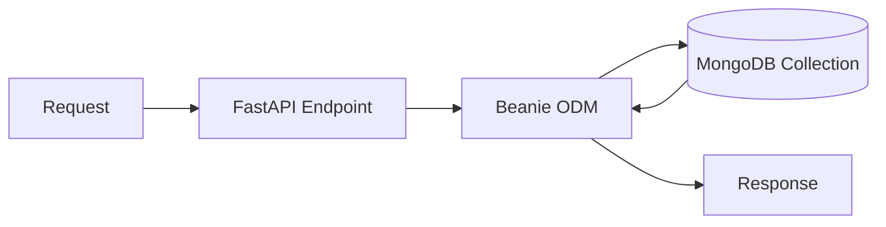

# MongoDB ODM — Document Databases with FastAPI

> **Advanced Topic** — Extending database integration beyond SQL ORMs by using MongoDB with an ODM, so the course covers both ORM and ODM styles cleanly.

---

## ODM Flow



## Why This Topic Exists

The course already covers SQL integration very well through PostgreSQL + SQLAlchemy + Alembic.

But your module list also mentions **ORMs/ODMs**. That distinction matters:

- **ORM** maps Python objects to relational tables
- **ODM** maps Python objects to document database records

MongoDB is the most common document database FastAPI learners encounter, so this page fills that gap.

---

## When MongoDB Makes Sense

MongoDB is often a good fit when:

- schema changes frequently
- nested JSON-like data is natural
- document reads are more important than complex joins
- you want to store flexible metadata around models, experiments, or logs

It is less ideal when:

- complex relational joins are central
- strict relational consistency is the dominant concern

---

## ORM vs ODM in One Minute

Relational ORM style:

```text
User table
Task table
Task.user_id -> User.id
```

Document ODM style:

```json
{
  "user_id": "u123",
  "name": "Ravi",
  "recent_predictions": [
    {"model": "v1", "score": 0.81},
    {"model": "v2", "score": 0.92}
  ]
}
```

In MongoDB, nested structures are natural. In SQL, they are usually normalized into multiple tables.

---

## FastAPI + MongoDB Stack

A common async stack is:

- FastAPI
- Motor or PyMongo Async driver
- Beanie ODM
- Pydantic models

---

## Example with Beanie

```python
from beanie import Document
from pydantic import Field


class PredictionLog(Document):
    user_id: str
    model_name: str
    score: float = Field(ge=0.0, le=1.0)
    approved: bool

    class Settings:
        name = "prediction_logs"
```

### Code explanation

This is a MongoDB document model.

- `Document` is Beanie's base class, similar in spirit to a SQLAlchemy model base
- each field becomes part of the stored MongoDB document
- `Settings.name` chooses the MongoDB collection name

Compared with a SQL ORM:

- there is no table schema migration flow like Alembic by default
- nested fields and flexible shapes are more natural

---

## Initializing the ODM

```python
from contextlib import asynccontextmanager
from fastapi import FastAPI
from motor.motor_asyncio import AsyncIOMotorClient
from beanie import init_beanie


@asynccontextmanager
async def lifespan(app: FastAPI):
    client = AsyncIOMotorClient("mongodb://localhost:27017")
    db = client["ml_api"]
    await init_beanie(database=db, document_models=[PredictionLog])
    yield
    client.close()


app = FastAPI(lifespan=lifespan)
```

### Code explanation

- `AsyncIOMotorClient` opens the MongoDB connection
- the `lifespan` hook initializes the database once at startup
- `init_beanie(...)` tells Beanie which document models exist
- the client is closed on shutdown

This is the MongoDB equivalent of SQLAlchemy engine/session setup.

---

## CRUD Endpoint Example

```python
from fastapi import APIRouter

router = APIRouter(prefix="/logs", tags=["logs"])


@router.post("/")
async def create_log(log: PredictionLog):
    await log.insert()
    return log


@router.get("/{user_id}")
async def get_logs_for_user(user_id: str):
    return await PredictionLog.find(PredictionLog.user_id == user_id).to_list()
```

### Code explanation

- the POST endpoint receives a validated Pydantic/Beanie document
- `insert()` stores it in MongoDB
- the GET endpoint queries all logs for a user and returns them as a list

This feels very natural when the stored data is already JSON-like.

---

## When I Would Choose SQL vs MongoDB for an ML API

Choose SQL when:

- users, roles, permissions, billing, and transactions are central
- reporting and joins matter
- data integrity rules are tight

Choose MongoDB when:

- payloads are semi-structured
- experiment metadata changes often
- nested request/response logs are important
- document-style access dominates

In real systems, both may exist together.

---

## Important Interview Questions

- What is the difference between an ORM and an ODM?
- When would you choose MongoDB over PostgreSQL for an API?
- Why is MongoDB often useful for logs, metadata, and flexible documents?
- What tradeoffs do you accept when using a document database?

---

## Quick Revision

- the course already covered ORM with SQLAlchemy
- this page completes the ODM side using MongoDB
- choose databases based on access patterns, not trendiness
