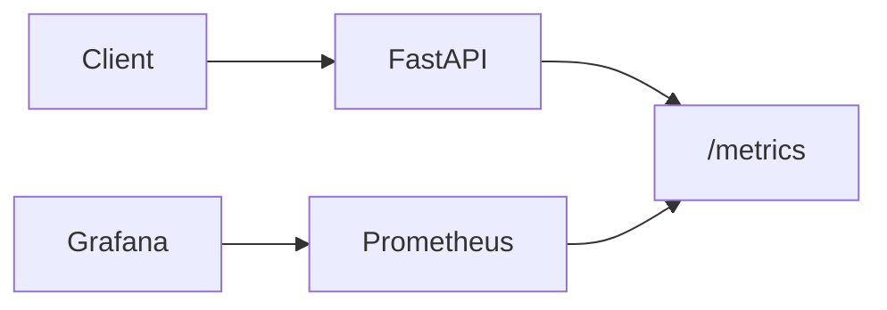

# Monitoring with Prometheus & Grafana

> **Advanced Topic** — Caching is already covered in performance optimization. This page adds the other half of the screenshot module: production monitoring with Prometheus and Grafana.

---

## Visual References


Source: [Wikimedia Commons - Prometheus software logo](https://commons.wikimedia.org/wiki/File:Prometheus_software_logo.svg)


Source: [Wikimedia Commons - Grafana logo](https://commons.wikimedia.org/wiki/File:Grafana_logo.svg)

## Why Monitoring Is Non-Negotiable

A FastAPI app can appear healthy while actually failing users.

Examples:

- p95 latency jumps from 60ms to 4s
- error rate spikes for one endpoint only
- model loading is fine but database calls are timing out
- Redis cache is down, but requests still technically succeed more slowly

Without monitoring, you discover problems from angry users.

With monitoring, you detect and fix them before users notice.

---

## What Prometheus and Grafana Do

- **Prometheus** collects metrics over time
- **Grafana** visualizes those metrics in dashboards

Typical questions they answer:

- How many requests per second are hitting the API?
- What is the latency by endpoint?
- What percentage of requests are failing?
- Is the model endpoint slower than the health endpoint?

---

## Monitoring Architecture



---

## Adding Metrics to FastAPI

```python
from fastapi import FastAPI, Request
from prometheus_client import Counter, Histogram, generate_latest
from fastapi.responses import Response
import time

app = FastAPI()

REQUEST_COUNT = Counter(
    "fastapi_requests_total",
    "Total number of HTTP requests",
    ["method", "endpoint", "status"]
)

REQUEST_LATENCY = Histogram(
    "fastapi_request_duration_seconds",
    "Request latency in seconds",
    ["method", "endpoint"]
)


@app.middleware("http")
async def metrics_middleware(request: Request, call_next):
    start = time.perf_counter()
    response = await call_next(request)
    duration = time.perf_counter() - start

    endpoint = request.url.path
    REQUEST_COUNT.labels(request.method, endpoint, response.status_code).inc()
    REQUEST_LATENCY.labels(request.method, endpoint).observe(duration)
    return response


@app.get("/metrics")
def metrics():
    return Response(generate_latest(), media_type="text/plain")
```

### Code explanation

This is a minimal metrics setup.

- `Counter` tracks how many requests happened
- `Histogram` tracks how long requests take
- middleware wraps every request
- `/metrics` exposes the values in Prometheus-readable format

Why middleware is the right place:

- every request passes through it
- you do not need to duplicate timing code in every endpoint

---

## What to Measure for ML APIs

At minimum:

- request count
- error count
- latency
- model inference time
- cache hit/miss rate
- queue depth for background jobs

For ML APIs specifically, also consider:

- model version currently serving
- prediction throughput
- feature-validation failure rate
- drift metrics from upstream data

---

## Grafana Dashboard Ideas

Build panels for:

- requests per minute
- p50, p95, p99 latency
- error rate by endpoint
- top slow endpoints
- model inference duration
- Redis cache hit rate
- Celery queue backlog

---

## Prometheus Scrape Config Example

```yaml
scrape_configs:
  - job_name: "fastapi"
    static_configs:
      - targets: ["localhost:8000"]
```

### Explanation

- Prometheus periodically calls the FastAPI app
- it reads the `/metrics` endpoint
- it stores time-series values for later querying and visualization

---

## Common Mistakes

- exposing `/metrics` publicly without access control
- tracking too many high-cardinality labels
- monitoring request count but not latency
- building dashboards but never alerting on bad states

High-cardinality trap example:

- labeling every request by `user_id` is usually a mistake
- it explodes metric cardinality and hurts monitoring performance

---

## Important Interview Questions

- Why are logs not enough without metrics?
- What is the purpose of `/metrics` in a FastAPI app?
- Why are histograms useful for request latency?
- What is high-cardinality labeling and why is it dangerous?
- What metrics matter most for an ML inference API?

---

## Quick Revision

- Prometheus collects metrics
- Grafana visualizes metrics
- middleware is a clean place to instrument FastAPI
- monitoring should cover latency, errors, throughput, and ML-specific behavior
