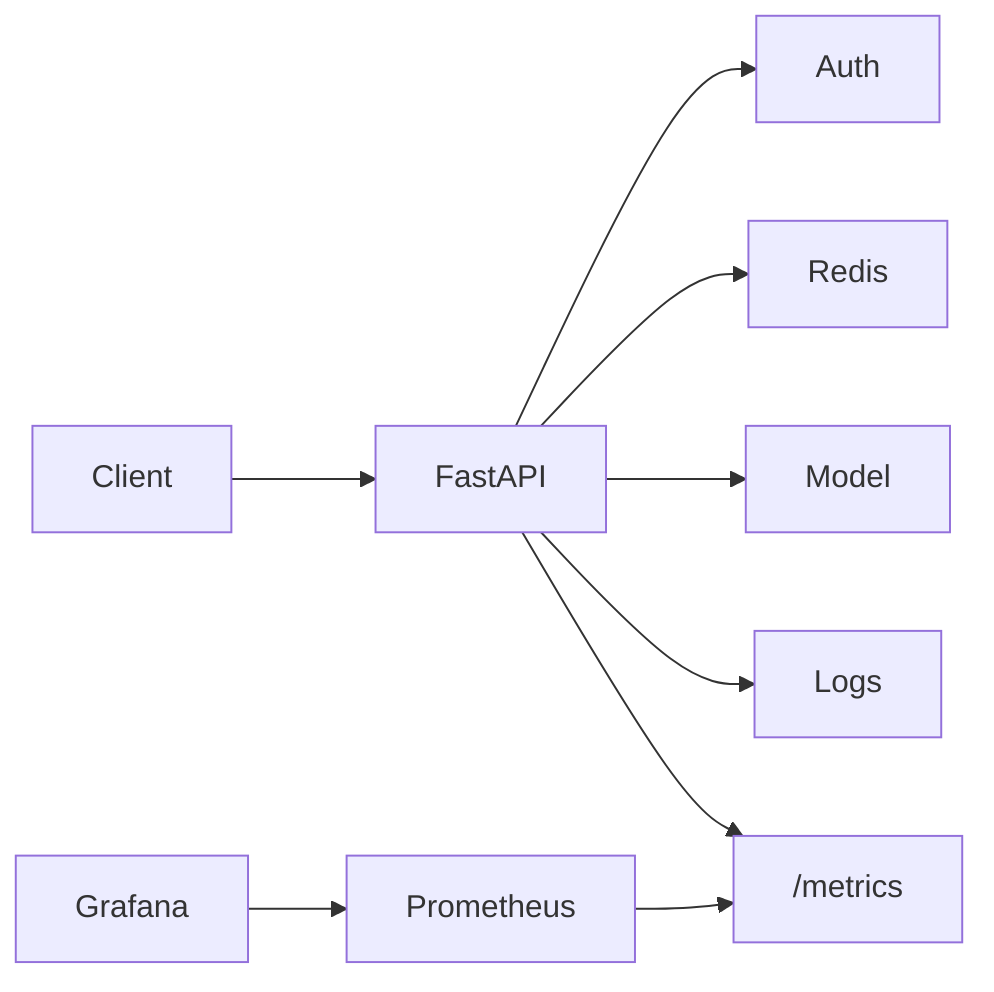

# Project 4 Solution · Car Price Prediction ML API

> **Capstone Project** — A complete Car Price Prediction ML API with auth, caching, logging, monitoring, Docker, and deployment using Render.

---

## Visual Reference


Source: [Wikimedia Commons - Render logo](https://commons.wikimedia.org/wiki/File:Render_logo.svg)

## Why This Project Exists

Your screenshot’s capstone asks for something very specific:

- car price prediction
- authentication
- caching
- logging
- monitoring
- Docker deployment
- Render deployment

The current FastAPI-in-depth section already had strong advanced projects, but not this exact capstone. This page fills that gap directly.

---

## What You Will Build

A production-style API that predicts used car prices from features such as:

- brand
- model
- manufacturing year
- kilometers driven
- fuel type
- transmission
- owner count
- engine size

Example response:

```json
{
  "predicted_price": 735000,
  "currency": "INR",
  "model_version": "car-price-xgb-v3",
  "confidence_band": {
    "low": 690000,
    "high": 775000
  }
}
```

---

## Recommended Architecture



---

## Features This Capstone Should Demonstrate

- FastAPI request validation with Pydantic
- secure endpoint with API key or JWT
- model loaded once at startup
- Redis caching for repeated inputs
- structured JSON logging
- Prometheus metrics endpoint
- Dockerized deployment
- Render deployment configuration

---

## Request Schema Example

```python
from pydantic import BaseModel, Field
from typing import Literal


class CarPriceInput(BaseModel):
    brand: str = Field(min_length=2, max_length=40)
    model: str = Field(min_length=1, max_length=60)
    year: int = Field(ge=1995, le=2035)
    kilometers_driven: int = Field(ge=0, le=1_000_000)
    fuel_type: Literal["petrol", "diesel", "cng", "electric", "hybrid"]
    transmission: Literal["manual", "automatic"]
    owner_count: int = Field(ge=1, le=10)
    engine_cc: int = Field(ge=600, le=7000)
```

### Code explanation

- fields are strongly typed and constrained
- categorical values are restricted with `Literal`
- invalid payloads fail before reaching the model

This is exactly what you want in a capstone: the API should be robust at the input boundary.

---

## Prediction Endpoint Example

```python
from fastapi import Depends, FastAPI

app = FastAPI()
model_store = {}


def require_api_key():
    return "validated"


@app.post("/predict")
def predict_car_price(
    data: CarPriceInput,
    _: str = Depends(require_api_key)
):
    model = model_store["model"]
    features = [[
        data.brand,
        data.model,
        data.year,
        data.kilometers_driven,
        data.fuel_type,
        data.transmission,
        data.owner_count,
        data.engine_cc,
    ]]
    prediction = model.predict(features)[0]
    return {"predicted_price": float(prediction), "currency": "INR"}
```

### Code explanation

- the endpoint is auth-protected
- input is validated before use
- the model is assumed to be loaded into `model_store` at startup
- the returned payload is simple and frontend-friendly

In a real project, you would likely also:

- preprocess categorical features with a saved pipeline
- return model version
- return confidence intervals or prediction bands

---

## Redis Caching Pattern

Why caching helps:

- car-price requests often repeat common combinations
- repeated showroom/demo use cases can benefit from quick cache hits

Suggested strategy:

- hash the normalized input payload
- store the prediction in Redis with a TTL
- invalidate cache on model version change

---

## Logging and Monitoring

You should log:

- request ID
- model version
- latency
- cache hit or miss
- auth failures

You should monitor:

- requests per minute
- p95 latency
- prediction endpoint error rate
- cache hit rate
- model inference time

---

## Dockerfile Sketch

```dockerfile
FROM python:3.11-slim
WORKDIR /app
COPY requirements.txt .
RUN pip install --no-cache-dir -r requirements.txt
COPY . .
CMD ["uvicorn", "main:app", "--host", "0.0.0.0", "--port", "8000"]
```

### Explanation

- lightweight Python base image
- install dependencies first for better layer caching
- expose the app through Uvicorn

---

## Deploying on Render

Render is a good beginner-friendly deployment platform because it can run a Dockerized FastAPI service with simple setup.

Typical steps:

1. Push code to GitHub.
2. Connect the repo to Render.
3. Create a new Web Service.
4. Choose Docker deployment.
5. Set environment variables.
6. Add Redis if needed.
7. Point health check to `/health`.

Recommended env vars:

- `API_KEY`
- `MODEL_PATH`
- `REDIS_URL`
- `LOG_LEVEL`

---

## Suggested Folder Structure

```text
car-price-api/
  app/
    main.py
    routers/
      predict.py
      health.py
    schemas/
      car.py
    services/
      predictor.py
      cache.py
      auth.py
    core/
      config.py
      logging.py
      metrics.py
  artifacts/
    car_price_pipeline.pkl
  Dockerfile
  requirements.txt
```

---

## Why This Is a Strong Capstone

It combines nearly everything from the course:

- APIs and HTTP
- FastAPI app structure
- request/response validation
- ML model serving
- auth
- caching
- logging
- monitoring
- Docker
- cloud deployment

That makes it a much better portfolio piece than a toy CRUD app.

---

## Important Interview Questions

- How do you prevent loading the model on every request?
- How would you invalidate Redis cache after a new model deployment?
- Why would you choose API key auth vs JWT for this service?
- What metrics would you expose for this capstone?
- Why is Render a good learning deployment target, and when would you outgrow it?

---

## Quick Revision

- this capstone matches the screenshot requirement directly
- it is a realistic ML-serving project, not just a demo endpoint
- the strongest version includes auth, caching, logging, monitoring, Docker, and deployment
