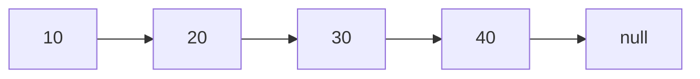

# Linked Lists

Linked lists store values in nodes connected by pointers or references.

## Introduction

Linked lists are one of the first data structures that force you to think beyond simple indexing. In an array, the main idea is position. In a linked list, the main idea is connection.

That shift matters because many interview problems are not really about list values. They are about:

- rewiring pointers safely
- preserving access to the remaining structure
- handling edge cases like empty lists, one-node lists, and cycles

If arrays teach you indexing, linked lists teach you pointer discipline.

## Visual intuition



Open-source visual reference:


Image source: [Wikimedia Commons - Singly-linked-list.svg](https://commons.wikimedia.org/wiki/File:Singly-linked-list.svg)

## Why linked lists matter

- dynamic insertion and deletion after a known node
- pointer discipline
- common in interview patterns and cache designs

## Array vs linked list intuition

An array stores elements next to each other in memory. A linked list stores elements separately and connects them through references.

That means:

- arrays are great for random access
- linked lists are great when rewiring connections matters more than indexing

Tradeoff summary:

- array lookup by index is fast
- linked list traversal is sequential
- linked list insertion after a known node can be cheap
- linked lists usually use extra memory for pointers

## Node definition

```python
class ListNode:
    def __init__(self, val: int = 0, next=None):
        self.val = val
        self.next = next
```

### In-depth explanation

This is the minimal node structure for a singly linked list.

- `val` stores the payload
- `next` stores the reference to the next node

Why `next=None` matters:

- it allows the last node to terminate the list cleanly
- it also makes it easy to create standalone nodes before linking them

## Reverse a linked list

```python
def reverse_list(head: ListNode | None) -> ListNode | None:
    prev = None
    curr = head
    while curr:
        nxt = curr.next
        curr.next = prev
        prev = curr
        curr = nxt
    return prev
```

### Explanation

- store `next` before overwriting it
- redirect current node backward
- move pointers forward

### In-depth code walkthrough

Variable roles:

- `prev` = already reversed part of the list
- `curr` = node currently being processed
- `nxt` = saved pointer to the not-yet-processed remainder

Loop invariant:

- nodes before `curr` have already been reversed
- nodes from `curr` onward are still in original forward order

Inside the loop:

- `nxt = curr.next` saves the rest of the original list
- `curr.next = prev` flips the direction of the current link
- `prev = curr` extends the reversed prefix
- `curr = nxt` moves to the next original node

Why return `prev`:

- when the loop ends, `curr` is `None`
- `prev` points to the new head of the reversed list

Complexity:

- time: `O(n)`
- space: `O(1)`

You can mentally treat reversal as flipping one arrow at a time while carefully not losing the rest of the chain.

Before:

```text
1 -> 2 -> 3 -> null
```

After:

```text
1 <- 2 <- 3 <- null
```

The main danger is overwriting `curr.next` before saving where the rest of the list continues.

## Find middle node

```python
def middle_node(head: ListNode | None) -> ListNode | None:
    slow = fast = head
    while fast and fast.next:
        slow = slow.next
        fast = fast.next.next
    return slow
```

### In-depth explanation

This is the slow-fast pointer pattern.

- `slow` moves one step at a time
- `fast` moves two steps at a time

By the time `fast` reaches the end:

- `slow` has covered half the distance

Why the loop condition is:

```python
while fast and fast.next:
```

- `fast` must exist
- `fast.next` must exist because we move `fast` two steps

For even-length lists, this version returns the second middle node.

Complexity:

- time: `O(n)`
- space: `O(1)`

## Detect cycle

```python
def has_cycle(head: ListNode | None) -> bool:
    slow = fast = head
    while fast and fast.next:
        slow = slow.next
        fast = fast.next.next
        if slow == fast:
            return True
    return False
```

### In-depth explanation

This is Floyd's cycle detection algorithm.

Why it works:

- if there is no cycle, `fast` reaches `None`
- if there is a cycle, the faster pointer eventually laps the slower pointer and they meet

Think of it like two runners on a circular track:

- one runs 1 step per turn
- one runs 2 steps per turn
- the faster one must eventually catch the slower one

This avoids extra memory unlike a hash-set approach.

Complexity:

- time: `O(n)`
- space: `O(1)`

## Merge two sorted lists

```python
def merge_two_lists(a: ListNode | None, b: ListNode | None) -> ListNode | None:
    dummy = ListNode()
    tail = dummy
    while a and b:
        if a.val <= b.val:
            tail.next = a
            a = a.next
        else:
            tail.next = b
            b = b.next
        tail = tail.next
    tail.next = a or b
    return dummy.next
```

### In-depth explanation

This merges two sorted linked lists into one sorted list.

Why use `dummy`:

- it gives a stable starting node
- avoids special cases for the first inserted element

Variable roles:

- `tail` always points to the last node in the merged list so far
- `a` and `b` point to the unmerged remainder of each input list

Inside the loop:

- compare `a.val` and `b.val`
- attach the smaller node to `tail.next`
- advance whichever list supplied that node
- move `tail` forward

After the loop:

- one list is exhausted
- the other remaining part is already sorted
- `tail.next = a or b` attaches the remainder directly

Why return `dummy.next`:

- `dummy` is only a helper node
- the real merged list starts after it

Complexity:

- time: `O(n + m)`
- space: `O(1)` extra

## Doubly linked lists

Each node stores:

- value
- next pointer
- previous pointer

These are useful in:

- LRU caches
- browser navigation
- undo and redo systems

## When linked lists are a poor choice

Linked lists are not a magic upgrade over arrays.

They are usually a poor choice when:

- frequent random access is required
- cache locality matters a lot
- pointer overhead is undesirable

This is why many real-world systems still prefer arrays, vectors, or array lists unless rewiring behavior is central to the problem.

## Common mistakes

- losing the next pointer during rewiring
- forgetting edge cases like empty list or single node
- not using a dummy node when it simplifies code

## Practice prompts

- remove nth node from end
- reorder list
- intersection of two linked lists
- reverse nodes in `k` groups

## Quick revision

- linked lists trade random access for flexible rewiring
- slow and fast pointers are a core pattern
- dummy nodes often simplify edge cases
