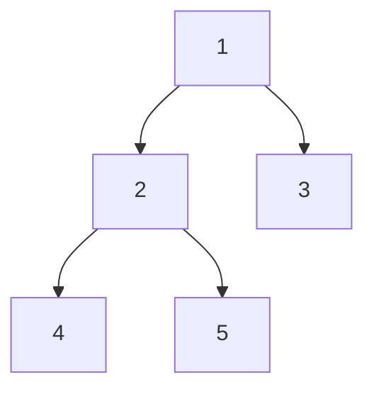

# Trees

Trees model hierarchical structure. They are one of the most important DSA topics because recursion becomes very natural on trees.

## Introduction

Trees appear everywhere in computer science:

- file systems
- HTML and XML documents
- database indexes
- organization charts
- expression parsing

A tree is useful whenever data has a natural parent-child relationship rather than a simple linear order.

What makes trees powerful is that each subtree is itself a smaller tree. That is exactly why recursive thinking works so well here.

## Basic terminology

- root
- parent
- child
- leaf
- height
- depth

## Binary tree visual



Open-source visual reference:


Image source: [Wikimedia Commons - Tree structure representation](https://commons.wikimedia.org/wiki/File:Tree_structure_representation.svg)

## Tree node

```python
class TreeNode:
    def __init__(self, val=0, left=None, right=None):
        self.val = val
        self.left = left
        self.right = right
```

### In-depth explanation

This is the standard binary-tree node model.

- `val` stores the node value
- `left` points to left child
- `right` points to right child

If either child is `None`, that branch ends there.

## DFS traversals

Depth-first traversals differ only in when the root is processed relative to its children.

Preorder:

```python
def preorder(root):
    if not root:
        return []
    return [root.val] + preorder(root.left) + preorder(root.right)
```

### In-depth explanation

Preorder means:

1. visit root
2. visit left subtree
3. visit right subtree

Why this code works:

- base case: empty subtree returns empty list
- otherwise combine current node value with recursive results from left and right

This traversal is useful when:

- serializing structure
- copying trees
- processing parent before children

Inorder:

```python
def inorder(root):
    if not root:
        return []
    return inorder(root.left) + [root.val] + inorder(root.right)
```

### In-depth explanation

Inorder means:

1. left subtree
2. root
3. right subtree

For a valid BST, inorder traversal yields values in sorted order. That is why inorder is especially important in BST problems.

Postorder:

```python
def postorder(root):
    if not root:
        return []
    return postorder(root.left) + postorder(root.right) + [root.val]
```

### In-depth explanation

Postorder means:

1. left subtree
2. right subtree
3. root

This is useful when a node depends on already processed children, such as:

- deleting a tree bottom-up
- computing subtree-based values
- evaluating expression trees

## BFS traversal

Breadth-first traversal processes nodes level by level. It is useful when distance in levels matters more than deep recursive structure.

```python
from collections import deque


def level_order(root):
    if not root:
        return []
    result = []
    q = deque([root])
    while q:
        level = []
        for _ in range(len(q)):
            node = q.popleft()
            level.append(node.val)
            if node.left:
                q.append(node.left)
            if node.right:
                q.append(node.right)
        result.append(level)
    return result
```

### In-depth explanation

This is breadth-first search using a queue.

Why a queue:

- BFS processes nodes in arrival order
- the earliest discovered nodes should be processed first

Meaning of the outer loop:

- each iteration handles one level

Meaning of:

```python
for _ in range(len(q)):
```

- `len(q)` is captured before the level starts
- so only the current level is processed in that iteration
- children added during the loop belong to the next level

This is why the function returns a list of levels, not just a flat sequence.

Complexity:

- time: `O(n)`
- space: up to width of tree

## Binary search tree

BST property:

- left subtree values are smaller
- right subtree values are larger

This allows efficient search in balanced cases.

Do not confuse a binary tree with a binary search tree.

- every BST is a binary tree
- not every binary tree is a BST

That distinction matters in interviews because many wrong solutions accidentally assume BST ordering where none exists.

## Example: maximum depth

```python
def max_depth(root):
    if not root:
        return 0
    return 1 + max(max_depth(root.left), max_depth(root.right))
```

### In-depth explanation

This is one of the cleanest examples of recursive tree thinking.

Meaning of the function:

- it returns the maximum depth of the subtree rooted at `root`

Base case:

- empty tree has depth `0`

Recursive case:

- depth of current tree = `1` for current node plus deeper of left or right subtree

Complexity:

- time: `O(n)`
- space: `O(h)` recursion stack where `h` is tree height

## Example: validate BST

```python
def is_valid_bst(root, low=float("-inf"), high=float("inf")):
    if not root:
        return True
    if not (low < root.val < high):
        return False
    return is_valid_bst(root.left, low, root.val) and is_valid_bst(root.right, root.val, high)
```

### Why the bounds approach is better

Checking only a node against its immediate children is not enough.

For example, if a value deep inside the left subtree is greater than the root, the tree is invalid even if every parent-child pair locally looks fine. The `low` and `high` bounds carry global constraints down the tree.

### In-depth code walkthrough

Meaning of parameters:

- `low` = smallest allowed value for this subtree
- `high` = largest allowed value for this subtree

At the root:

- any value is allowed initially, so bounds are `(-inf, +inf)`

When recursing left:

- everything must stay less than current node value
- so new upper bound becomes `root.val`

When recursing right:

- everything must stay greater than current node value
- so new lower bound becomes `root.val`

This is a global-validity approach, not just a local-child comparison.

Complexity:

- time: `O(n)`
- space: `O(h)`

## How to think recursively on trees

When solving tree problems, ask:

- what does my function return for one node
- how do I combine left and right subtree results
- what should happen for an empty subtree

Examples:

- maximum depth returns an integer
- balanced-tree check may return both height and validity
- path-sum check may return a boolean

## Advanced topics

- balanced BSTs
- segment trees
- Fenwick Trees
- tree DP

## Common mistakes

- not defining what recursion returns
- checking only parent-child comparisons in BST validation
- forgetting that skewed trees can behave like linked lists

## Practice prompts

- diameter of binary tree
- lowest common ancestor
- serialize and deserialize tree
- path sum

## Quick revision

- trees are recursive by nature
- DFS and BFS are the main traversal families
- in tree problems, define the recursive contract clearly
