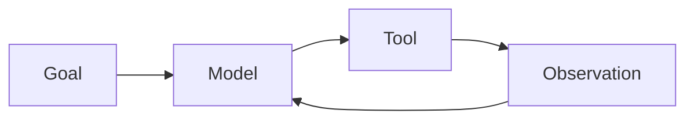

# AI Agents and AI System Design

An AI agent is a model-driven system that can plan, use tools, observe results, and continue toward a goal.

## Introduction

Agents are one of the most exciting and most overhyped parts of GenAI. The useful way to think about them is not "the AI is autonomous now." It is:

- the model can decide steps
- the model can use tools
- the system can feed results back into the next decision

That loop is powerful, but it also creates new failure modes: looping, tool abuse, hidden state drift, and unpredictable costs.

## Agent building blocks

- model
- instructions
- tools
- memory
- planner or loop
- evaluator

## Simple agent loop



## When agents help

- multi-step tasks
- tool use
- retrieval plus action
- workflow orchestration

## When agents are a bad fit

- simple single-shot answers
- deterministic automation better handled with regular code
- safety-critical flows without tight control

## Important design concerns

- tool permissions
- retry policy
- memory boundaries
- latency and cost
- observability
- human approval points

## Agent workflow patterns

- planner-executor
- react-style observe-act loops
- retrieval plus action
- multi-agent handoff
- evaluator-critic loop

## Example pseudo-code

```python
def agent_step(goal, model, tools, memory):
    prompt = f"Goal: {goal}\nMemory: {memory}"
    action = model.generate(prompt)
    if action.startswith("TOOL:search"):
        result = tools["search"](action)
        memory.append(result)
        return result
    return action
```

### Code explanation

This pseudo-code shows the essential control loop.

- the goal and prior memory are packed into a prompt
- the model proposes an action
- if the action asks for a tool, the tool is executed
- the observation is appended to memory
- future steps can use that new information

This is the core idea behind many agent systems, even when the real implementation is much more structured.

## Safety concerns

- prompt injection
- tool abuse
- data exfiltration
- looping behavior

## Important interview questions

- What makes an AI system an agent instead of a single model call?
- When should you avoid agents?
- How do tool permissions reduce risk?
- What kinds of memory should an agent have?
- How would you debug a failing agent workflow?

## System design for AI apps

A real AI system may include:

- API gateway
- orchestration layer
- vector store
- model provider
- guardrail layer
- logs and evaluations

## Quick revision

- an agent is a control loop around a model
- tools and memory are powerful but risky
- agent systems require stronger safety and observability than plain chat systems
