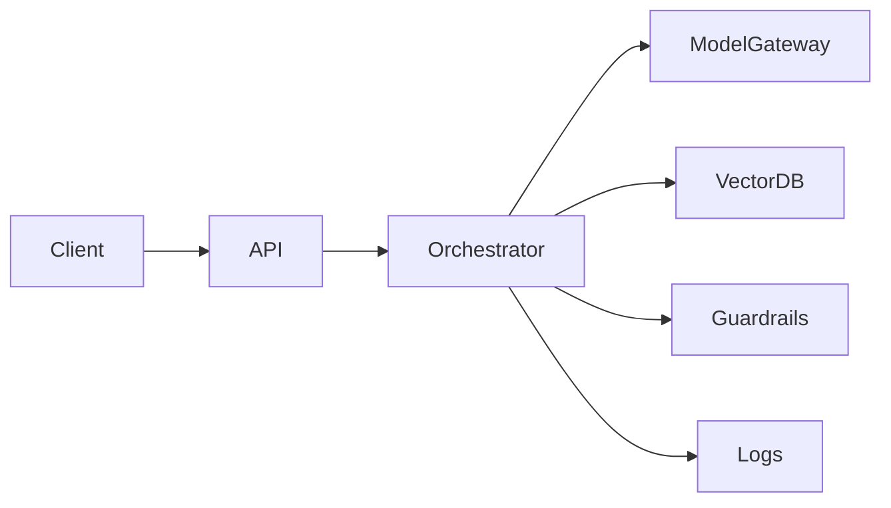

# LLM Serving, Optimization, and LLMOps

Knowing model concepts is not enough. Real GenAI systems need to be deployed, observed, optimized, and governed in production.

## What LLMOps includes

- serving
- prompt management
- versioning
- observability
- evaluation
- cost control
- rollback strategy
- security and compliance

## Common production concerns

- high latency
- high token cost
- GPU memory limits
- prompt regressions
- unreliable retrieval quality
- missing monitoring

## Serving architecture



## Optimization levers

- batching
- streaming
- prompt compression
- retrieval quality improvements
- caching
- model selection by request type
- quantization

## Toy batching queue example

```python
def batch_requests(requests: list[str], batch_size: int) -> list[list[str]]:
    batches = []
    for i in range(0, len(requests), batch_size):
        batches.append(requests[i:i + batch_size])
    return batches
```

### Code explanation

This is a tiny illustration of batching.

- requests are grouped into chunks
- serving frameworks often process batches together for better throughput

In real LLM systems, batching must balance:

- throughput
- latency
- memory constraints

## What to monitor

- latency
- tokens per request
- error rate
- retrieval hit quality
- refusal rate
- user feedback
- cost per task

## Important interview questions

- What is the difference between latency and throughput?
- How does batching help?
- Why is observability critical in GenAI systems?
- What metrics would you monitor in production?
- How would you reduce cost without wrecking quality?

## Quick revision

- LLMOps is the operational discipline around GenAI systems
- production success depends on serving, observability, and evaluation as much as model choice
