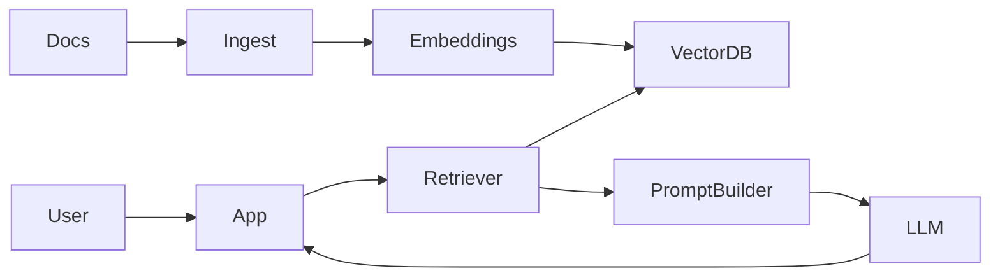

# GenAI Project Solution: RAG Assistant

This is a high-value GenAI project because it demonstrates retrieval, prompting, evaluation, and application engineering together.

## Problem statement

Build a document-grounded assistant that answers questions about a private knowledge base.

## Core features

- document upload
- chunking and indexing
- semantic retrieval
- answer generation
- source citation

## Architecture



## Main pipeline

1. ingest docs
2. split into chunks
3. create embeddings
4. store vectors plus metadata
5. retrieve top relevant chunks for each query
6. build grounded prompt
7. generate answer with citations

## Example pseudo-code

```python
def answer_question(query, retriever, llm):
    chunks = retriever.retrieve(query, top_k=5)
    context = "\n\n".join(f"[{i+1}] {c['text']}" for i, c in enumerate(chunks))
    prompt = f"""
Answer the question using only the context below.
If the answer is not in the context, say you do not know.

Context:
{context}

Question:
{query}
"""
    return llm.generate(prompt)
```

## Why this project is strong

- uses modern GenAI patterns
- demonstrates retrieval quality concerns
- shows prompt design plus safety
- can be evaluated meaningfully

## Evaluation ideas

- answer faithfulness
- citation correctness
- retrieval relevance
- latency

## Extensions

- chat memory
- hybrid search
- feedback loop
- admin dashboard for failed queries
- reranking

## Interview talking points

- why RAG instead of fine-tuning
- how chunking and metadata affect retrieval
- how you reduce hallucinations
- how you evaluate grounded answers
