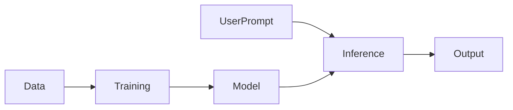

# GenAI Foundations

Generative AI creates new content such as text, code, images, audio, or video based on patterns learned from data.

## Introduction

Generative AI is different from traditional software in one important way: instead of following a fixed set of handwritten rules, it produces outputs by learning statistical patterns from large datasets.

That means GenAI systems feel powerful, flexible, and creative, but they also behave probabilistically. The same prompt can yield different outputs, and a confident answer is not always a correct answer.

That is why learning GenAI foundations is not only about "how to call a model." It is about understanding:

- what the model is actually doing
- where it is reliable
- where it can fail
- what extra system components are needed in production

## High-level picture



## Main categories

- text generation
- code generation
- image generation
- speech generation
- multimodal generation

## Core concepts

- tokens
- probability distributions
- context window
- training data
- inference
- sampling

## What an LLM does

At a high level, a language model predicts the next token based on previous tokens.

```text
P(next token | previous tokens)
```

This seems almost too simple, but it is the core idea. By repeating this prediction step over and over, the model can generate paragraphs, code, summaries, explanations, and dialogue.

## Tokens

Models do not usually process raw words directly. They process tokens.

A token may be:

- a whole word
- part of a word
- punctuation

## Training vs inference

Training:

- learns model parameters
- expensive
- happens offline

Inference:

- uses trained parameters to generate outputs
- happens at runtime

You can think of training as building the model's internal pattern memory, and inference as using that memory to respond to a prompt.

## Sampling ideas

- greedy decoding
- temperature
- top-k
- top-p

Higher temperature generally gives more variety but also more randomness.

## Why GenAI systems are more than a model call

Real products need:

- prompting
- retrieval
- memory
- evaluation
- safety checks
- observability

For example, a customer-support AI assistant may need:

- company policy retrieval
- prompt templates
- refusal logic
- logging and audits
- human handoff rules

So production GenAI is really a system-design topic as much as an AI topic.

## Common failures

- hallucination
- prompt injection
- stale knowledge
- unsafe or non-compliant outputs

## Quick revision

- GenAI is probabilistic generation
- LLMs operate on tokens and context
- production GenAI requires retrieval, evaluation, and safety around the model
