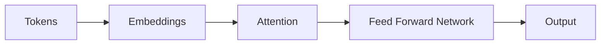

# Transformers and Attention

Transformers are the neural architecture behind modern large language models.

## Introduction

Before transformers, sequence models like RNNs and LSTMs were widely used for language tasks. They worked, but they struggled with very long dependencies and were harder to parallelize efficiently at scale.

Transformers changed that by centering the architecture around attention. Instead of processing sequence information strictly one step at a time, they let each token weigh the relevance of other tokens in the context.

That shift is one of the main reasons modern LLMs became practical and scalable.

## Open-source visual reference


Image source: [Wikimedia Commons - Transformer, full architecture](https://commons.wikimedia.org/wiki/Image:Transformer%2C_full_architecture.png)

## Why transformers matter

- handle long-range token relationships better than older sequence models
- train efficiently in parallel
- scale well with data and compute

## Embeddings

Tokens are first converted into vectors called embeddings.

These vectors represent semantic information in numeric form.

## Self-attention intuition

Each token asks:

- which other tokens matter for me right now

This is why attention helps with context.

Example:

In the sentence:

```text
The animal didn't cross the street because it was too tired.
```

the token `it` should pay attention to `animal`, not `street`. Attention helps the model learn that kind of relationship.

## Query, key, value

For each token, the model computes:

- query
- key
- value

Attention score is based on query-key similarity, and the result is used to combine values.

An intuitive analogy:

- query = what this token is looking for
- key = what each other token offers
- value = the information carried by that token

## Simplified flow



## Multi-head attention

Instead of one attention computation, the model uses multiple heads so it can learn different relationship types in parallel.

One head may focus more on local syntax, while another may focus more on long-range dependency or role relationships. The model learns these useful patterns from data.

## Positional encoding

Transformers need positional information because self-attention by itself does not know token order.

Without positional information, the model would know which tokens are present but not their arrangement in the sentence.

## Why scaling works

Larger transformers tend to improve because:

- more parameters
- more data
- more compute

But scaling also raises:

- cost
- latency
- safety and evaluation complexity

## Toy attention code

```python
import math


def attention_score(query, key):
    dot = sum(q * k for q, k in zip(query, key))
    return dot / math.sqrt(len(query))
```

This is only a tiny conceptual piece, not a full transformer implementation.

## Common mistakes

- thinking attention is "search over documents"
- assuming transformers inherently know truth
- mixing embeddings for retrieval with token embeddings inside the model

## Quick revision

- transformers process tokens through embeddings and attention
- attention lets each token weigh other relevant tokens
- modern LLMs are transformer-based systems

## Important interview questions

- Why did transformers replace RNNs and LSTMs in many NLP workloads?
- What problem does self-attention solve?
- What are query, key, and value vectors?
- Why is positional encoding required?
- What is the intuition behind multi-head attention?
