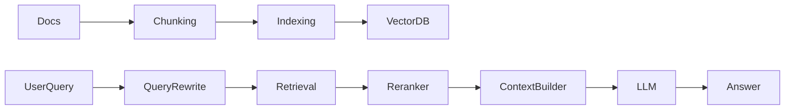

# RAG Systems

RAG is one of the most important GenAI patterns for practical applications.

## Introduction

RAG stands for Retrieval-Augmented Generation. Instead of depending only on what the model memorized during training, a RAG system retrieves relevant external context at query time and injects that context into the model prompt.

This matters because most real AI products need one or more of the following:

- private knowledge
- fresh knowledge
- explainability through citations
- lower hallucination risk
- cheaper adaptation than retraining

## High-level architecture



## Core subtopics to master

- document ingestion
- chunking strategy
- embeddings
- vector search
- metadata filtering
- hybrid retrieval
- reranking
- prompt grounding
- citation and faithfulness
- evaluation
- production failures

## RAG workflow

1. split documents into chunks
2. create embeddings
3. store vectors
4. embed incoming query
5. retrieve relevant chunks
6. add retrieved context to prompt
7. generate answer

## Why RAG helps

- reduces hallucination
- brings in private or updated knowledge
- avoids retraining for every knowledge change

## Beginner implementation example

```python
def rag_answer(query, embedder, vectordb, llm):
    query_vec = embedder.embed(query)
    chunks = vectordb.search(query_vec, top_k=4)
    context = "\n\n".join(chunk["text"] for chunk in chunks)
    prompt = f"Answer using the context only.\n\nContext:\n{context}\n\nQuestion: {query}"
    return llm.generate(prompt)
```

### Code explanation

This code captures the core logic of a minimal RAG system.

- `embedder.embed(query)` converts the query into a vector representation
- `vectordb.search(...)` retrieves the most semantically similar chunks
- retrieved chunk text is joined into one context block
- the prompt instructs the model to answer using only that context

Why this works:

- the model is no longer answering from raw memory alone
- it is answering from a selected evidence set

What this simple version still lacks:

- metadata filters
- reranking
- citations
- prompt-injection defense
- evaluation
- fallback behavior when retrieval is weak

## Chunking strategy matters

Poor chunking causes poor retrieval.

Consider:

- chunk size
- overlap
- preserving section boundaries
- storing metadata

## Chunking deep dive

Chunking is one of the most underestimated parts of RAG.

If chunks are:

- too small, they lose context
- too large, retrieval becomes noisy
- cut at bad boundaries, important facts are split apart

Good chunking often tracks:

- section titles
- page numbers
- source URL
- document type
- semantic boundary

## Advanced retrieval layers

As systems mature, retrieval often expands beyond plain vector similarity.

Common upgrades:

- hybrid search combining keyword and vector retrieval
- metadata filtering such as product, customer, region, or date
- reranking with a stronger relevance model
- parent-child retrieval
- query rewriting

## Common failure modes

## Common failure modes

- irrelevant retrieval
- missing retrieval due to bad chunking
- prompt injection from retrieved content
- overly long context

## Important interview questions

- What problem does RAG solve better than fine-tuning?
- How do chunk size and overlap affect quality?
- What is hybrid retrieval, and when is it better than pure vector search?
- Why is reranking useful?
- How would you evaluate a RAG system end to end?

## Quick revision

- embeddings power semantic retrieval
- RAG = retrieve relevant context, then generate
- chunk quality and retrieval quality heavily affect answer quality
