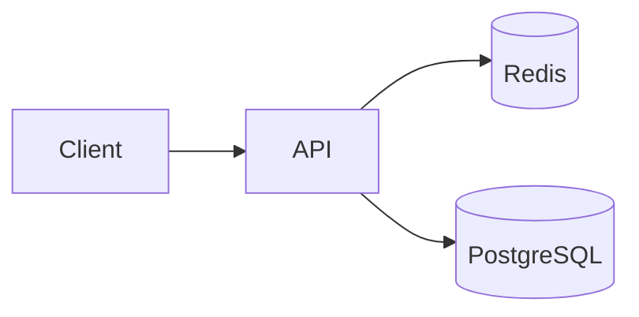

# Backend Project Solution: URL Shortener

This is a strong beginner-to-intermediate backend project because it combines API design, database design, redirects, caching, and rate limiting.

## Problem statement

Build a service that:

- accepts a long URL
- generates a short code
- redirects users from short code to original URL
- tracks click counts

## Core requirements

- create short URL
- resolve short URL
- count visits
- avoid duplicate short-code collisions

## Architecture



## Schema

```sql
CREATE TABLE short_urls (
  id BIGSERIAL PRIMARY KEY,
  original_url TEXT NOT NULL,
  short_code VARCHAR(12) UNIQUE NOT NULL,
  created_at TIMESTAMP NOT NULL DEFAULT NOW(),
  clicks BIGINT NOT NULL DEFAULT 0
);
```

## API design

- `POST /shorten`
- `GET /:code`
- `GET /stats/:code`

## Example backend code

```python
import random
import string


ALPHABET = string.ascii_letters + string.digits


def generate_code(length: int = 6) -> str:
    return "".join(random.choice(ALPHABET) for _ in range(length))
```

Shorten handler logic:

```python
def shorten_url(original_url: str, db) -> dict:
    code = generate_code()
    while db.exists(code):
        code = generate_code()
    db.save(original_url, code)
    return {"short_url": f"https://sho.rt/{code}", "code": code}
```

Resolve handler:

```python
def resolve(code: str, db, cache):
    cached = cache.get(code)
    if cached:
        return cached
    row = db.find_by_code(code)
    if not row:
        return None
    cache.set(code, row["original_url"], ttl=300)
    db.increment_clicks(code)
    return row["original_url"]
```

## Explanation

- generated code is stored uniquely
- cache speeds up redirects
- database stores durable mapping and analytics

## Production concerns

- URL validation
- abuse prevention
- rate limiting
- custom aliases
- expiration dates

## Extensions

- QR code generation
- analytics dashboard
- per-user link management
- custom domains

## What to say in interviews

- why cache helps redirects
- how collisions are handled
- how to scale reads
- what to do for analytics at large scale
