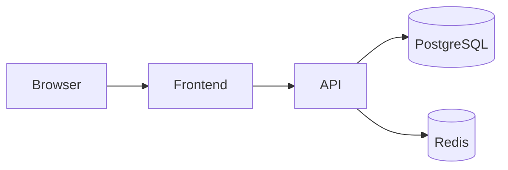

# Full-stack Project Solution: Task Platform

This project shows system thinking from UI to backend to storage.

## Problem statement

Build a collaborative task management platform with:

- sign up and login
- workspaces
- tasks
- comments
- role-based access

## Architecture



## Schema sketch

- users
- workspaces
- workspace_members
- tasks
- comments

## Example API endpoints

- `POST /auth/login`
- `GET /workspaces/:id/tasks`
- `POST /tasks`
- `PATCH /tasks/:id`
- `POST /tasks/:id/comments`

## Backend snippet

```python
def create_task(payload: dict, user_id: int, db):
    if not payload.get("title"):
        raise ValueError("title required")
    return db.insert_task(
        title=payload["title"],
        workspace_id=payload["workspace_id"],
        assignee_id=payload.get("assignee_id"),
        created_by=user_id,
    )
```

## Frontend snippet

```tsx
type Task = {
  id: number;
  title: string;
  status: string;
};

function TaskList({ tasks }: { tasks: Task[] }) {
  return (
    <ul>
      {tasks.map((task) => (
        <li key={task.id}>
          {task.title} - {task.status}
        </li>
      ))}
    </ul>
  );
}
```

## Important implementation details

- validate permissions on backend, not just frontend
- paginate tasks for large workspaces
- index frequent lookups like `workspace_id` and `assignee_id`
- add optimistic UI carefully for status changes

## Extension ideas

- activity feed
- notifications
- attachments
- search
- analytics

## Interview talking points

- why relational schema fits collaborative data
- how roles and permissions were modeled
- where caching helps and where it does not
