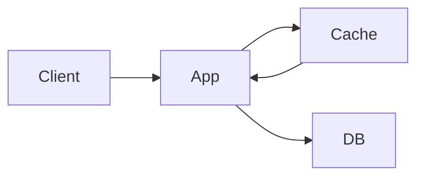

# Caching

Caching stores frequently used data in a faster layer to reduce latency and load.

## Introduction

Caching is one of the highest-leverage performance ideas in software engineering. Instead of recomputing or refetching the same expensive result every time, you keep a faster copy closer to where it is needed.

The key idea sounds simple:

- slow source of truth
- faster temporary copy

But real-world caching becomes tricky because the cached copy can become stale. That is why good caching is not just about speed. It is about balancing speed, freshness, and operational simplicity.

## Visual intuition


Image source: [Wikimedia Commons - Mem hierarchy](https://commons.wikimedia.org/wiki/File:Mem_hierarchy.svg)

This image comes from hardware memory hierarchy, but the same intuition carries into application caching: the closer and faster the storage, the smaller and more expensive it usually is.

## Why caching matters

- faster responses
- lower database load
- better resilience during traffic spikes

## Where caching helps most

Caching is most useful when:

- reads are much more frequent than writes
- data is expensive to compute or fetch
- slightly stale data is acceptable for a short time

Caching is much less useful when:

- data changes constantly
- strict freshness is mandatory
- cache invalidation complexity outweighs the speed gain

## Cache layers

- browser cache
- CDN edge cache
- application in-memory cache
- distributed cache like Redis

## Core terms

- cache hit
- cache miss
- TTL
- invalidation
- eviction

## Common strategies

### Cache-aside

1. app checks cache
2. on miss, fetch from DB
3. app stores result in cache

### Write-through

Write to DB and cache together.

### Write-back

Write to cache first, flush later.

## Mini architecture



## Example pseudocode

```python
def get_user(user_id: int):
    key = f"user:{user_id}"
    cached = redis.get(key)
    if cached:
        return cached
    user = db.fetch_user(user_id)
    redis.set(key, user, ex=300)
    return user
```

## Cache invalidation

The hardest part is deciding when cached data becomes stale.

Common approaches:

- TTL-based expiration
- explicit invalidation after writes
- versioned keys

Real design maturity shows up here. Anyone can say "use Redis." A stronger answer explains:

- what exactly is cached
- how long it lives
- what event makes it stale
- what happens on cache miss or cache failure

## Failure patterns

- stale data
- cache stampede
- hot keys
- thundering herd

## Example: product page caching

Imagine an e-commerce product page.

Possible strategy:

- cache product details for `5` minutes
- invalidate product cache immediately after product update
- keep review summary on a shorter TTL if it changes often

This shows a useful rule: different data on the same page may deserve different cache strategies.

## Common mistakes

- saying "use Redis" without invalidation strategy
- caching data that changes too frequently
- ignoring fallback behavior when cache is down

## Quick revision

- caching improves speed but creates consistency concerns
- every cache design answer needs an invalidation plan
