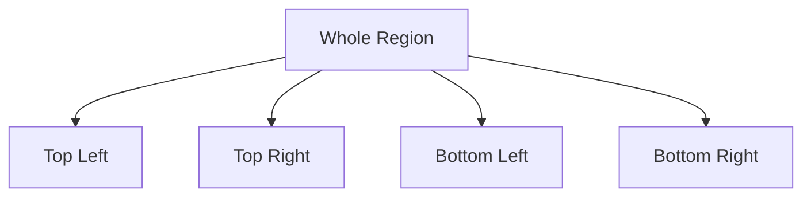

# Quad Trees

The Scaler curriculum page appears to refer to `Quad Tress`, which corresponds to `Quad Trees`.

Quad trees recursively divide 2D space into four quadrants.

## Why they matter

- spatial indexing
- image compression
- map search
- collision detection

## Visual intuition



## Core idea

If a region is too dense or too large, split it into four smaller regions.

This helps avoid scanning the entire space.

## Use cases

- nearest-point queries
- 2D region queries
- game-world spatial partitioning

## Simple Python structure

```python
class QuadTreeNode:
    def __init__(self, boundary, points=None):
        self.boundary = boundary
        self.points = points or []
        self.children = []
```

## Tradeoffs

Benefits:

- efficient search in sparse or uneven spatial data

Costs:

- more complex than simple grids
- not ideal for every 2D workload

## Common mistakes

- using quad trees when a simple matrix scan is sufficient
- ignoring balance and splitting thresholds

## Quick revision

- quad trees partition 2D space hierarchically
- they are useful when locality matters
