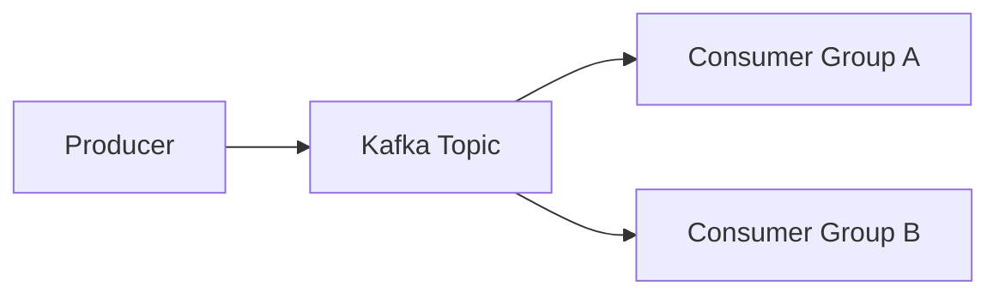

# Kafka and BookKeeper Concepts

The Scaler page lists `Bookeeper + Kafka`, which is best interpreted as distributed log and event-streaming concepts around Apache Kafka and Apache BookKeeper style systems.

## Why distributed logs matter

- events can be replayed
- producers and consumers stay decoupled
- throughput can scale through partitioning

## Kafka basics

- topic
- partition
- producer
- consumer
- offset
- consumer group
- broker

## Event flow

## Partitioning

Partitions improve scalability and parallelism.

Tradeoff:

- more throughput
- ordering is only guaranteed within a partition, not across the whole topic

## Replication

Replication improves durability and availability.

## Delivery semantics

- at-most-once
- at-least-once
- exactly-once style guarantees

Understand the idea, and be careful not to oversimplify exactly-once claims.

## BookKeeper intuition

BookKeeper is built around durable append-only ledgers.

Conceptually, it helps with:

- persistent log storage
- replication
- fault tolerance

## Example use cases

- order events
- analytics pipelines
- notification systems
- log aggregation

## Common mistakes

- saying Kafka is a queue and stopping there
- ignoring replay and retention
- forgetting that partition choice affects ordering

## Quick revision

- Kafka is a distributed event log
- offsets let consumers track progress
- partitions scale throughput
- logs are powerful because history can be replayed
