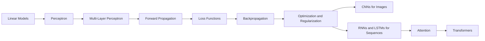

# Deep Learning Master Notes

This section is organized as a serious learning track. Treat it like a guided set of notes for building deep learning from first principles:

- start with perceptrons, MLPs, loss, and backpropagation
- move into training stability, initialization, normalization, and optimizers
- then learn CNNs for vision
- then RNNs, LSTMs, and sequence modeling
- finish with attention and transformers

## How to use this section

If you are new, follow the sequence in order.

If you already know the basics:

- revise `04` to `18` for ANN foundations
- revise `27` to `38` for training stabilization and optimization
- revise `40` to `53` for CNNs
- revise `55` to `70` for sequence models and attention
- revise `71` to `84` for transformers

## The Big Picture

## Core Mathematical Backbone

Almost the entire section can be understood through five recurring equations:

### 1. Linear layer

$$
z = W x + b
$$

This is the weighted combination step. Every neural network keeps reusing this idea.

### 2. Activation

$$
a = \phi(z)
$$

Non-linearity is what lets the model learn curves, boundaries, and compositional patterns instead of just one straight separator.

### 3. Loss

$$
\mathcal{L}(\hat{y}, y)
$$

Loss tells the model how wrong it is.

### 4. Gradient

$$
\frac{\partial \mathcal{L}}{\partial \theta}
$$

The gradient says how much the loss changes when parameter $\theta$ changes.

### 5. Update rule

$$
\theta \leftarrow \theta - \eta \frac{\partial \mathcal{L}}{\partial \theta}
$$

This is learning in one line.

## Module Map

### Module 1: Foundations of Neural Computation

- [01. Course roadmap, prerequisites, and learning strategy](./01-course-roadmap-prerequisites-and-learning-strategy.md)
- [02. What deep learning is and how it differs from machine learning](./02-what-deep-learning-is-and-how-it-differs-from-machine-learning.md)
- [03. Neural network types, deep learning history, and applications](./03-neural-network-types-deep-learning-history-and-applications.md)
- [04. Perceptron basics, neuron analogy, and geometric intuition](./04-perceptron-basics-neuron-analogy-and-geometric-intuition.md)
- [05. Perceptron training and the perceptron trick](./05-perceptron-training-and-the-perceptron-trick.md)
- [06. Perceptron losses, sigmoid, hinge loss, and binary cross-entropy](./06-perceptron-losses-sigmoid-hinge-loss-and-binary-cross-entropy.md)
- [07. Why a single perceptron fails on nonlinear problems](./07-why-a-single-perceptron-fails-on-nonlinear-problems.md)
- [08. MLP notation, inputs, weights, biases, layers, and shapes](./08-mlp-notation-inputs-weights-biases-layers-and-shapes.md)
- [09. Multi-layer perceptron intuition](./09-multi-layer-perceptron-intuition.md)
- [10. Forward propagation and how a neural network predicts](./10-forward-propagation-and-how-a-neural-network-predicts.md)

### Module 2: Training Neural Networks

- [14. Loss functions in deep learning](./14-loss-functions-in-deep-learning.md)
- [15. Backpropagation part 1: what backpropagation is](./15-backpropagation-part-1-what-backpropagation-is.md)
- [16. Backpropagation part 2: how backpropagation works](./16-backpropagation-part-2-how-backpropagation-works.md)
- [17. Backpropagation part 3: why backpropagation works](./17-backpropagation-part-3-why-backpropagation-works.md)
- [18. Vanishing gradients and exploding gradients](./18-vanishing-gradients-and-exploding-gradients.md)
- [19. MLP memoization and caching intermediate values](./19-mlp-memoization-and-caching-intermediate-values.md)
- [20. Gradient descent in neural networks: batch, SGD, and mini-batch](./20-gradient-descent-in-neural-networks-batch-sgd-and-mini-batch.md)

### Module 3: Making Training Stable and Fast

- [21. How to improve neural network performance](./21-how-to-improve-neural-network-performance.md)
- [22. Early stopping in neural networks](./22-early-stopping-in-neural-networks.md)
- [23. Data scaling and feature scaling for neural networks](./23-data-scaling-and-feature-scaling-for-neural-networks.md)
- [24. Dropout in deep learning](./24-dropout-in-deep-learning.md)
- [26. Regularization, weight decay, L1, and L2 in neural networks](./26-regularization-weight-decay-l1-and-l2-in-neural-networks.md)
- [27. Activation functions: sigmoid, tanh, and ReLU](./27-activation-functions-sigmoid-tanh-and-relu.md)
- [28. ReLU variants: Leaky ReLU, PReLU, ELU, and SELU](./28-relu-variants-leaky-relu-prelu-elu-and-selu.md)
- [29. Weight initialization basics and what not to do](./29-weight-initialization-basics-and-what-not-to-do.md)
- [30. Xavier/Glorot and He initialization](./30-xavier-glorot-and-he-initialization.md)
- [31. Batch normalization in deep learning](./31-batch-normalization-in-deep-learning.md)
- [32. Optimizers in deep learning: why they matter](./32-optimizers-in-deep-learning-why-they-matter.md)
- [33. Exponentially weighted moving average](./33-exponentially-weighted-moving-average.md)
- [34. SGD with momentum](./34-sgd-with-momentum.md)
- [35. Nesterov accelerated gradient](./35-nesterov-accelerated-gradient.md)
- [36. Adagrad](./36-adagrad.md)
- [37. RMSProp](./37-rmsprop.md)
- [38. Adam optimizer](./38-adam-optimizer.md)
- [39. Hyperparameter tuning for neural networks](./39-hyperparameter-tuning-for-neural-networks.md)

### Module 4: CNNs and Vision

- [40. What a convolutional neural network is](./40-what-a-convolutional-neural-network-is.md)
- [41. CNN visual cortex intuition and the cat experiment](./41-cnns-visual-cortex-intuition-and-the-cat-experiment.md)
- [42. The convolution operation in CNNs](./42-the-convolution-operation-in-cnns.md)
- [43. Padding and stride in CNNs](./43-padding-and-stride-in-cnns.md)
- [44. Pooling layers and max pooling](./44-pooling-layers-and-max-pooling.md)
- [45. CNN architecture with LeNet-5](./45-cnn-architecture-with-lenet-5.md)
- [46. CNN versus ANN](./46-cnn-versus-ann.md)
- [47. Backpropagation in CNNs part 1](./47-backpropagation-in-cnns-part-1.md)
- [48. Backpropagation in CNNs part 2](./48-backpropagation-in-cnns-part-2.md)
- [49. Cat vs dog image classification project](./49-cat-vs-dog-image-classification-project.md)
- [50. Data augmentation in CNNs](./50-data-augmentation-in-cnns.md)
- [51. Pretrained CNN models and ImageNet](./51-pretrained-cnn-models-and-imagenet.md)
- [52. What a CNN sees: filters and feature maps](./52-what-a-cnn-sees-filters-and-feature-maps.md)
- [53. Transfer learning: feature extraction vs fine-tuning](./53-transfer-learning-feature-extraction-vs-fine-tuning.md)

### Module 5: Sequential Modeling

- [55. Why RNNs are needed and how they differ from ANNs](./55-why-rnns-are-needed-and-how-they-differ-from-anns.md)
- [56. Recurrent neural network architecture and forward propagation](./56-recurrent-neural-network-architecture-and-forward-propagation.md)
- [57. RNN sentiment analysis in PyTorch](./57-rnn-sentiment-analysis-in-pytorch.md)
- [58. Types of RNN mappings](./58-types-of-rnn-mappings.md)
- [59. Backpropagation through time](./59-backpropagation-through-time.md)
- [60. Problems with RNNs](./60-problems-with-rnns.md)
- [61. What LSTM is and why it was created](./61-what-lstm-is-and-why-it-was-created.md)
- [62. LSTM architecture and gate-by-gate computation](./62-lstm-architecture-and-gate-by-gate-computation.md)
- [64. GRU and how it simplifies LSTM](./64-gru-and-how-it-simplifies-lstm.md)
- [65. Deep and stacked recurrent networks](./65-deep-and-stacked-recurrent-networks.md)
- [66. Bidirectional RNNs and BiLSTMs](./66-bidirectional-rnns-and-bilstms.md)
- [68. Encoder-decoder and sequence-to-sequence architecture](./68-encoder-decoder-and-sequence-to-sequence-architecture.md)
- [69. Attention mechanism for Seq2Seq models](./69-attention-mechanism-for-seq2seq-models.md)
- [70. Bahdanau attention versus Luong attention](./70-bahdanau-attention-versus-luong-attention.md)

### Module 6: Transformers — Core Architecture

- [71. Introduction to transformers](./71-introduction-to-transformers.md)
- [72. What self-attention is](./72-what-self-attention-is.md)
- [73. Self-attention in transformers with code](./73-self-attention-in-transformers-with-code.md)
- [74. Scaled dot-product attention](./74-scaled-dot-product-attention.md)
- [75. Geometric intuition for self-attention](./75-geometric-intuition-for-self-attention.md)
- [76. Why self-attention is called self-attention](./76-why-self-attention-is-called-self-attention.md)
- [77. Multi-head attention in transformers](./77-multi-head-attention-in-transformers.md)
- [78. Positional encoding in transformers](./78-positional-encoding-in-transformers.md)
- [79. Layer normalization versus batch normalization](./79-layer-normalization-versus-batch-normalization.md)
- [80. Transformer encoder architecture](./80-transformer-encoder-architecture.md)
- [81. Masked self-attention in the transformer decoder](./81-masked-self-attention-in-the-transformer-decoder.md)
- [82. Cross-attention in transformers](./82-cross-attention-in-transformers.md)
- [83. Transformer decoder architecture](./83-transformer-decoder-architecture.md)
- [84. Transformer inference step by step](./84-transformer-inference-step-by-step.md)

### Module 7: Pre-training and Model Families

- [85. Transformer training objectives: MLM, CLM, span corruption](./85-transformer-training-objectives.md)
- [86. Tokenization: BPE, WordPiece, and SentencePiece](./86-tokenization-bpe-wordpiece-sentencepiece.md)
- [87. BERT: encoder-only pre-training](./87-bert-encoder-pretraining.md)
- [88. GPT: decoder-only causal language modeling](./88-gpt-decoder-only-causal-lm.md)
- [89. T5 and encoder-decoder pre-training](./89-t5-encoder-decoder-pretraining.md)

### Module 8: Adapting and Deploying LLMs

- [90. Fine-tuning transformers for downstream tasks](./90-fine-tuning-transformers.md)
- [91. Parameter-efficient fine-tuning: LoRA, adapters, and prefix tuning](./91-parameter-efficient-fine-tuning-lora.md)
- [92. FlashAttention and efficient transformers](./92-flashattention-efficient-transformers.md)
- [93. Transformer scaling laws](./93-transformer-scaling-laws.md)
- [94. In-context learning and prompting](./94-in-context-learning-and-prompting.md)
- [95. RLHF and instruction tuning](./95-rlhf-and-instruction-tuning.md)

## What to revise before interviews

If you only have a few hours:

1. Perceptron vs MLP
2. Why non-linearity is required
3. Forward pass, loss, backpropagation, gradient descent
4. Vanishing gradients and why ReLU helps
5. Xavier vs He initialization
6. BatchNorm vs LayerNorm
7. CNN: convolution, padding, stride, pooling
8. RNN vs LSTM vs GRU
9. Attention, self-attention, multi-head attention
10. Why transformers scale better than RNNs

## Visual Anchors

### Perceptron / MLP visual

Source: [Wikimedia Commons - Perceptron.png](https://commons.wikimedia.org/wiki/File:Perceptron.png)

### CNN visual

Source: [Wikimedia Commons - Convolutional Neural Network.png](https://commons.wikimedia.org/wiki/File:Convolutional_Neural_Network.png)

### Transformer visual

Source: [Wikimedia Commons - The-Transformer-model-architecture.png](https://commons.wikimedia.org/wiki/File:The-Transformer-model-architecture.png)

## Learning Strategy

- never memorize formulas before you understand the information flow
- always track tensor shapes
- ask what the model can represent, what objective it optimizes, and where training can fail
- learn each topic at three levels: intuition, math, implementation
- use the project lessons only after the core theory is stable

## What makes someone "good" at deep learning

The strongest learners are not the ones who know the most buzzwords. They are the ones who can do all of the following:

- explain a model in plain English
- derive the important equations without panic
- debug shapes, gradients, and training curves
- pick the right architecture for the data type
- justify trade-offs in memory, speed, data, and performance

That is the standard this section should help you reach.
