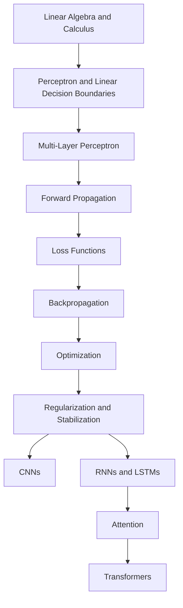

# Course roadmap, prerequisites, and learning strategy

Deep learning feels difficult when the dependency order is broken. If someone starts with transformers before understanding linear layers, activations, loss functions, backpropagation, and optimization, the entire subject looks like disconnected tricks instead of one continuous system.

This note is the map for the rest of the course.

## Why this lesson matters

Most people fail at deep learning for one of three reasons:

- they learn architectures before they understand training
- they memorize jargon without building mathematical intuition
- they jump into projects before they can diagnose why a model is failing

This lesson fixes that. It gives you the correct mental order for learning the
field.

## The right order to learn deep learning

Deep learning is not a random list of topics. It has a dependency chain.

If you skip a prerequisite in this chain, later topics become black boxes.

*Source: [Wikimedia Commons — Artificial Neural Network](https://commons.wikimedia.org/wiki/File:Artificial_neural_network.svg) (CC BY-SA 4.0)*

## Prerequisites

### Math you should know

- vectors, matrices, transpose, matrix multiplication
- dot product and why it measures weighted alignment
- functions and derivatives
- chain rule
- basic probability: sigmoid output as probability, softmax as normalized scores

### Programming you should know

- Python functions, loops, classes, lists, dictionaries
- NumPy-style tensor thinking
- basic PyTorch usage

### ML concepts you should know

- train/validation/test split
- overfitting vs underfitting
- feature engineering
- loss vs metric

## The three levels of learning

For every topic, study it at three levels:

### 1. Intuition

What problem does this concept solve?

### 2. Mathematics

What exactly is being computed?

### 3. Implementation

How does it look in code and how does it fail in practice?

If one of these levels is missing, your understanding is incomplete.

## The main deep learning pipeline

Every supervised neural network training loop is a version of this:

$$
x \rightarrow \text{model}(x) \rightarrow \hat{y} \rightarrow \mathcal{L}(\hat{y}, y) \rightarrow \nabla_\theta \mathcal{L} \rightarrow \text{update } \theta
$$

Expanded:

1. Take input data $x$
2. Run a forward pass to get prediction $\hat{y}$
3. Compare prediction with target $y$
4. Compute loss $\mathcal{L}$
5. Compute gradients using backpropagation
6. Update parameters
7. Repeat over many batches

This is the continuity to remember for the whole DNN section:

$$
\text{data} \rightarrow \text{representation} \rightarrow \text{prediction} \rightarrow \text{loss} \rightarrow \text{gradient} \rightarrow \text{update}
$$

The model architecture changes from chapter to chapter, but this training logic remains the same.

## What changes as the course progresses

The basic learning loop stays the same. What changes is the architecture and the
training tricks.

| Stage                    | Main question                                        |
| ------------------------ | ---------------------------------------------------- |
| Perceptron / MLP         | How does a neural network represent functions?       |
| Backpropagation          | How does it learn?                                   |
| Optimization             | How do we make learning faster and stabler?          |
| CNNs                     | How do we model images?                              |
| RNNs / LSTMs             | How do we model sequences?                           |
| Attention / Transformers | How do we model long-range dependencies efficiently? |

## How to study each note

Use this checklist:

1. Can I explain the topic in plain English?
2. Can I write the key formula?
3. Can I track the tensor shapes?
4. Can I say what problem this solves?
5. Can I name at least one failure mode?
6. Can I implement the simplest version in PyTorch?

If the answer is no to any of these, revise the note again.

## A realistic beginner strategy

### Week 1 to 2

- perceptron
- sigmoid
- decision boundary
- MLP
- forward propagation

### Week 3 to 4

- loss functions
- backpropagation
- gradient descent
- vanishing gradients
- ReLU and initialization

### Week 5 to 6

- regularization
- batch normalization
- optimizers
- hyperparameter tuning

### Week 7 onward

- CNNs
- RNNs, LSTMs, GRUs
- attention
- transformers

## Common beginner mistakes

- thinking deep learning starts with transformers
- trying to memorize formulas without understanding flow
- confusing loss with accuracy
- not checking tensor shapes
- changing many hyperparameters at once
- debugging architecture before debugging data and preprocessing

## Advanced perspective

Deep learning is really the study of:

- representation learning
- differentiable optimization
- inductive bias
- scale
- generalization under imperfect data

Architectures are just different ways of imposing structure on the function
class. CNNs impose locality and weight sharing. RNNs impose recurrence over
time. Transformers impose attention-based token interaction with high
parallelism.

That is the advanced unifying picture.

## Interview questions

What should someone learn before starting deep learning?

Linear algebra, derivatives, basic probability, Python, and the machine-learning basics of training, validation, and evaluation.

Why should perceptron and MLP come before CNNs and transformers?

Because later architectures still rely on the same core machinery: linear layers, activations, loss functions, gradients, and optimization.

What is the single most important concept in the whole course?

Backpropagation plus optimization. If you do not understand how learning happens, the later architectures become memorized patterns rather than systems you can reason about.

Why do many learners feel deep learning is hard?

Because multiple abstractions stack at once: tensors, matrix operations, derivatives, architecture, optimization, and software tooling.

Why is continuity important in a deep learning course?

Because each topic depends on the previous one. Forward propagation makes sense before loss, loss before backpropagation, and backpropagation before optimization.

What is the biggest beginner mistake in sequencing topics?

Jumping directly to transformers, LLMs, or production systems before understanding perceptrons, MLPs, activations, loss functions, and gradient-based learning.

## References

- CampusX YouTube playlist: 100 Days of Deep Learning

## Final takeaway

The smartest way to learn deep learning is not to chase the newest model. It is
to build a chain of understanding where each topic makes the next one feel
obvious.
