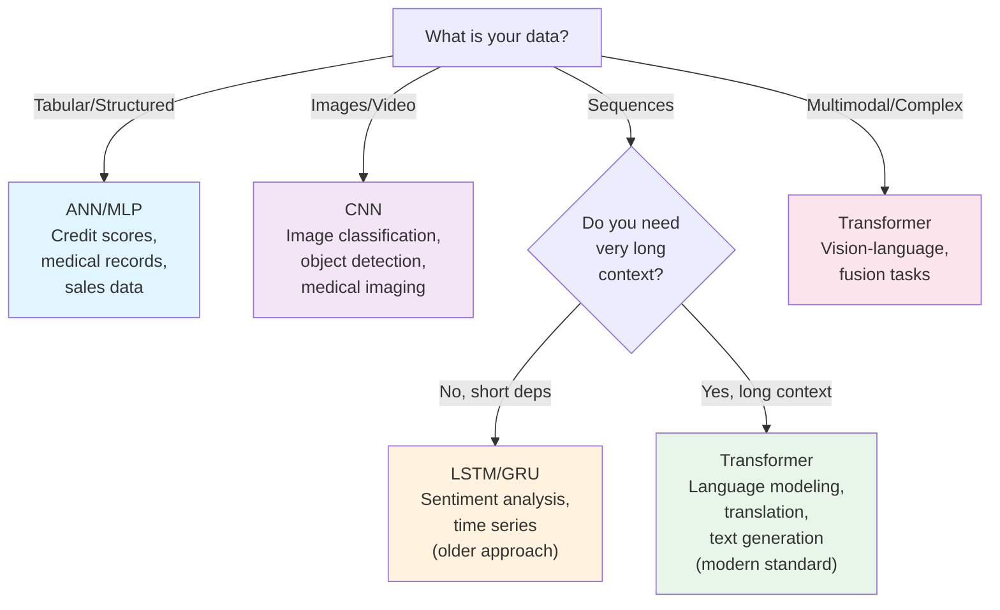
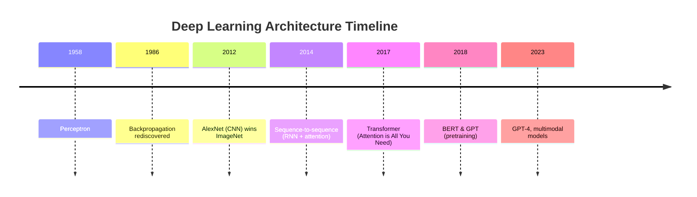

# Neural network types, deep learning history, and applications

After understanding what deep learning is (note 2), the next critical question is: **not all neural networks are built for the same kind of data**. This note maps the landscape of neural network families, shows why each one emerged, and gives you a decision framework for choosing which architecture to use.

## One-line definition

Different neural network families (ANN, CNN, RNN, Transformer) are specialized for different data structures: ANNs for dense tabular data, CNNs for spatial/image data, RNNs for sequential data, and Transformers for long-range dependencies and parallel processing.

## Why this topic matters

Choosing the wrong architecture for your data is like trying to read a book by analyzing pixels instead of letters — technically possible but impractical. This note shows you the right tool for each job, and prepares you for the detailed study of each family in later stages.

---

## The Four Main Neural Network Families

### 1. Artificial Neural Networks (ANN / Multilayer Perceptron)

**Best for**: Tabular/structured data, when no spatial or temporal structure exists

**Data examples**:
- Spreadsheet data: age, income, credit score → loan approval
- Medical records: blood pressure, cholesterol → disease risk
- House prices: square footage, location, bedrooms → price

**Architecture**:
```
Input (d) → Dense Layer (h₁) → ReLU → Dense Layer (h₂) → ReLU → Output (c)
```

**Core formula** (covered in note 9):
$$
a^{(l)} = \phi(W^{(l)} a^{(l-1)} + b^{(l)})
$$

**Key properties**:
- Every input connects to every neuron (fully connected / dense)
- No spatial or temporal assumptions
- Largest number of parameters for given layer sizes
- **Problem**: For images, flattens spatial structure (loses locality)

**Typical performance**:
- Tabular data: 85–95% accuracy
- Images: ~65% (bad compared to CNN)

---

### 2. Convolutional Neural Networks (CNN)

**Best for**: Images, video, spatial data with translation invariance

**Data examples**:
- Image classification: "is this a cat or dog?"
- Medical imaging: CT scans → tumor detection
- Satellite imagery: detect buildings, roads, crops

**Architecture pattern**:
```
Input (H×W×C) → Conv → ReLU → MaxPool → Conv → ReLU → MaxPool → Dense → Output
```

**Core idea** (covered in notes 40-54):

Instead of fully connected layers, use **convolutional filters** that:
- **Slide over the image** (convolution operation)
- **Share weights** across spatial positions (translation equivariance)
- **Use local receptive fields** (each neuron sees only a small patch)

**Example: 3×3 filter detecting horizontal edges**:
```
Filter:  [-1  0  +1]     Applied to image at each position
         [-2  0  +2]
         [-1  0  +1]
```

**Key properties**:
- Parameter reduction: 1 filter for entire image (not one per position)
- Spatial hierarchy: early layers detect edges, later layers detect objects
- Pooling layers provide spatial invariance (small shifts don't change output)
- **Weakness**: Designed for 2D spatial data; RNNs are better for sequences

**Typical performance**:
- ImageNet (1000 classes): ~95% (ResNet-50)
- MNIST: ~99.5%

---

### 3. Recurrent Neural Networks (RNN, LSTM, GRU)

**Best for**: Sequential data where order matters and past context is important

**Data examples**:
- Language: "the cat sat on the..." → predict "mat"
- Time series: stock prices yesterday, today → tomorrow's price
- Sentiment analysis: "this movie is amazing because..." → positive/negative

**Architecture pattern**:
```
h₀ → LSTM(x₁) → h₁ → LSTM(x₂) → h₂ → LSTM(x₃) → h₃ → Output
```

**Core idea** (covered in notes 55-66):

Process sequence step-by-step, carrying a **hidden state** forward:
$$
h_t = f(x_t, h_{t-1})
$$

**Vanilla RNN**: Simple but suffers from vanishing gradients (note 60)

**LSTM** (Long Short-Term Memory): Adds gates to control information flow:
- **Forget gate**: decide what to discard from previous state
- **Input gate**: decide what new information to add
- **Output gate**: decide what to output

**Example: predicting next word**
```
Input:  ["the", "cat", "sat"]
Hidden: h₀=0 → h₁ → h₂ → h₃
Output:           ["cat"] ["sat"] ["on"]
```

**Key properties**:
- Handles variable-length sequences
- Captures long-range dependencies (with LSTM/GRU)
- Naturally sequential (hard to parallelize)
- **Weakness**: Slow training (must process one step at a time); Transformers parallelize this

**Typical performance**:
- Machine translation: ~30 BLEU (before transformers)
- Sentiment classification: ~90%

---

### 4. Transformers

**Best for**: Long sequences, parallel computation, and tasks requiring flexible context (language, multimodal)

**Data examples**:
- Language modeling: GPT, BERT, LLaMA
- Machine translation: Seq2Seq attention-based
- Multimodal: Vision + text (CLIP, GPT-4V)

**Architecture pattern** (covered in notes 71-85):
```
Input tokens → Positional Encoding → Self-Attention → FFN → Output
           (repeated 12-24 times in encoder and decoder)
```

**Core idea**:

Replace recurrence with **self-attention**: every token attends to every other token in parallel
$$
\text{Attention}(Q,K,V) = \text{softmax}\left(\frac{QK^T}{\sqrt{d_k}}\right)V
$$

**Key properties**:
- Fully parallelizable (no sequential bottleneck)
- Can attend to any position (no local receptive field limit)
- Scales well with more data (transformer + large dataset = breakthrough)
- Requires careful tokenization (notes 86)
- **Strength**: Can be pretrained on huge text corpus, then fine-tuned
- **Weakness**: More compute at inference time (compared to LSTM)

**Typical performance**:
- Language modeling: GPT-4 is state-of-the-art for text
- Machine translation: >40 BLEU (better than LSTM)

---

## Decision Tree: Which Architecture to Use



---

## Deep Learning Timeline: Why Each Family Emerged

### **1950s–1960s: Perceptron Era**
- Rosenblatt invents perceptron (1958)
- Excitement: simple learning rule works
- **Limitation**: XOR problem (note 7) — single layer can't solve it

### **1970s–1980s: AI Winter**
- Minsky & Papert show perceptron limitations
- Interest in neural networks fades
- **But**: Backpropagation discovered (1986), revives interest in multi-layer networks

### **1990s–2000s: MLPs Dominate, Then SVMs Win**
- Multi-layer networks work (MLPs) but training is slow
- Support Vector Machines (SVMs) become popular — faster, simpler, better on small datasets
- Deep networks are still difficult to train (vanishing gradients, slow convergence)
- **Key issue**: Nobody had discovered ReLU, batch normalization, or good initialization

### **2009: ImageNet Created**
- 1.2 million labeled images, 1000 classes
- Benchmark for computer vision

### **2012: AlexNet (Deep CNN) Wins ImageNet**
- Krizhevsky, Sutskever, Hinton win ImageNet with 8-layer CNN
- Achieves 85% top-5 accuracy (vs 74% for best traditional method)
- Uses ReLU (avoids vanishing gradients), dropout (regularization), GPU training
- **Result**: Deep learning revolution begins

### **2014–2016: CNN Dominance for Vision**
- VGG (2014): Simple, very deep CNNs work
- ResNet (2015): Even deeper with skip connections
- Vision becomes "solved" (95%+ on ImageNet)

### **2014–2016: RNN/LSTM Progress for Language**
- Sequence-to-sequence models with attention (Bahdanau, 2014)
- Neural machine translation beats SMT (statistical MT)
- LSTMs dominate language modeling, translation, speech recognition

### **2017: Transformer Revolution**
- "Attention is All You Need" (Vaswani et al., 2017)
- Transformers beat RNNs on translation (50+ BLEU vs 28 BLEU)
- No recurrence = parallelization = fast training on huge datasets

### **2018–2020: Pretraining Era**
- BERT (2018): Bidirectional transformer pretraining
- GPT (2018): Causal transformer pretraining
- Both show that pretraining on raw text → fine-tune on tasks
- Transfer learning becomes dominant

### **2020–Now: Scale and Multimodal**
- GPT-3 (2020): 175B parameters, shows in-context learning
- CLIP (2021): Vision + language joint pretraining
- GPT-4 (2023): Multimodal (text + images)
- **Insight**: Transformer + huge data + billions of parameters = foundation models



---

## Comparison Table: When to Use Each Architecture

| | ANN/MLP | CNN | RNN/LSTM | Transformer |
|---|---|---|---|---|
| **Best for** | Tabular | Images | Sequences | Language, long context |
| **Data structure** | Unstructured | 2D spatial grid | 1D temporal | Sequence with long-range deps |
| **Parameters (given size)** | Highest | Medium | Medium | Medium |
| **Training speed** | Fast | Medium | Slow (sequential) | Fast (parallel) |
| **Inference speed** | Fast | Medium | Slow | Slow (auto-regressive) |
| **Long-range context?** | No | Limited (receptive field) | Ok (LSTM helps) | Excellent |
| **Parallelizable?** | Yes | Yes | No | Yes |
| **Interpretability** | Low | Medium (filters) | Low | Very low (attention complex) |
| **Typical accuracy** | 80–90% (tabular) | 95%+ (ImageNet) | 90% (sentiment) | 95%+ (downstream tasks) |
| **Example use** | Loan approval | Cat detection | Stock prediction | LLM, chatbot |
| **When introduced** | 1980s | 2012 | 1990s–2000s | 2017 |
| **Current trend** | Baseline only | Still strong for vision | Fading (→ Transformer) | Dominant |

---

## The Unifying Principle: Inductive Bias

Why do different architectures exist? **Inductive bias** — the assumptions a model makes about the data:

| Architecture | Inductive Bias |
|---|---|
| **ANN** | No structure assumed |
| **CNN** | Spatial locality + translation invariance |
| **RNN** | Temporal order + causal dependence |
| **Transformer** | Flexible long-range attention (no locality bias) |

Good inductive bias matches your data structure → model learns faster with less data.

**Bad bias example**: Using ANN on images (flattens spatial structure) forces the model to learn locality from scratch — wastes capacity.

**Good bias example**: Using CNN on images (assumes locality) lets the model focus on *what* features to detect, not *how* locality works.

---

## PyTorch Code Examples: The Same Problem, Four Architectures

**Task**: Classify data (binary classification)

```python
import torch
import torch.nn as nn

# Same data, four different architectures

# 1. ANN: best for tabular data
class ANN(nn.Module):
    def __init__(self, input_size=10):
        super().__init__()
        self.net = nn.Sequential(
            nn.Linear(input_size, 64),
            nn.ReLU(),
            nn.Linear(64, 32),
            nn.ReLU(),
            nn.Linear(32, 1),
            nn.Sigmoid()
        )
    
    def forward(self, x):
        return self.net(x)

# 2. CNN: best for images
class CNN(nn.Module):
    def __init__(self):
        super().__init__()
        self.conv = nn.Sequential(
            nn.Conv2d(3, 16, kernel_size=3, padding=1),
            nn.ReLU(),
            nn.MaxPool2d(2),
            nn.Conv2d(16, 32, kernel_size=3, padding=1),
            nn.ReLU(),
            nn.MaxPool2d(2),
        )
        self.fc = nn.Sequential(
            nn.Linear(32 * 8 * 8, 64),
            nn.ReLU(),
            nn.Linear(64, 1),
            nn.Sigmoid()
        )
    
    def forward(self, x):
        x = self.conv(x)
        x = x.view(x.size(0), -1)
        return self.fc(x)

# 3. LSTM: best for sequences
class LSTM_Model(nn.Module):
    def __init__(self, input_size=10, hidden_size=32):
        super().__init__()
        self.lstm = nn.LSTM(input_size, hidden_size, batch_first=True)
        self.fc = nn.Sequential(
            nn.Linear(hidden_size, 16),
            nn.ReLU(),
            nn.Linear(16, 1),
            nn.Sigmoid()
        )
    
    def forward(self, x):
        _, (h_n, _) = self.lstm(x)  # x shape: (batch, seq_len, input_size)
        return self.fc(h_n.squeeze(0))

# 4. Transformer: best for language and long sequences
class TransformerModel(nn.Module):
    def __init__(self, input_size=10, d_model=32, nhead=4):
        super().__init__()
        self.embedding = nn.Linear(input_size, d_model)
        self.pos_enc = nn.Parameter(torch.randn(100, d_model))  # positional encoding
        self.encoder = nn.TransformerEncoderLayer(
            d_model=d_model, nhead=nhead, batch_first=True, dim_feedforward=64
        )
        self.fc = nn.Sequential(
            nn.Linear(d_model, 16),
            nn.ReLU(),
            nn.Linear(16, 1),
            nn.Sigmoid()
        )
    
    def forward(self, x):
        # x shape: (batch, seq_len, input_size)
        x = self.embedding(x)  # → (batch, seq_len, d_model)
        x = x + self.pos_enc[:x.size(1)]  # add positional encoding
        x = self.encoder(x)  # → (batch, seq_len, d_model)
        x = x.mean(dim=1)  # pool across sequence
        return self.fc(x)

# All can be used identically:
models = [ANN(), CNN(), LSTM_Model(), TransformerModel()]
x_tab = torch.randn(8, 10)  # tabular
x_img = torch.randn(8, 3, 32, 32)  # image
x_seq = torch.randn(8, 20, 10)  # sequence

for model in models:
    try:
        if model.__class__.__name__ in ["CNN"]:
            out = model(x_img)
        else:
            out = model(x_seq if model.__class__.__name__ != "ANN" else x_tab)
        print(f"{model.__class__.__name__}: {out.shape}")
    except:
        pass
```

---

## Continuity: Where Each Family Appears in the Course

```
Foundation (notes 01-09)
    ↓
Forward & Loss (notes 10-14)
    ↓
Backpropagation (notes 15-20)
    ↓
    ├→ ANNs (implicit, in all projects 11-13)
    │
    ├→ CNNs (notes 40-54, followed by projects)
    │
    ├→ RNNs (notes 55-66)
    │
    └→ Transformers (notes 71-95, culminating in LLMs)
```

---

## Next Steps in This Course

This note is a **landscape view**. The course now zooms in:

**Next** (notes 4–9): Focus on the perceptron and MLP, because:
- They are the foundation all other architectures build on
- Every architecture contains linear + activation layers (the MLP core)
- Understanding perceptron → MLP → forward pass is prerequisite for CNN, RNN, Transformer

Later stages explore each family in depth:
- **Stage 7**: Deep dive into CNNs (notes 40–54)
- **Stage 8**: Deep dive into RNNs (notes 55–66)
- **Stage 9**: Deep dive into Transformers (notes 71–95)

---

## Interview questions

<details>
<summary>Why do we need different network types if backpropagation works for all of them?</summary>

Backpropagation is the learning mechanism (same for all architectures). But different data has different structure. Using the right architecture matches your data structure, so the model learns faster with fewer parameters. Using ANN on images works but wastes capacity; CNN exploits spatial locality and learns better.
</details>

<details>
<summary>Is ANN/MLP outdated now that transformers exist?</summary>

No. Every transformer contains dense (MLP) layers within each attention block. MLPs are still used for tabular data where there's no spatial or temporal structure. Transformers are for sequences; MLPs are for unstructured vectors.
</details>

<details>
<summary>Why did CNNs emerge before transformers, even though transformers are more powerful?</summary>

Because CNNs were designed specifically for images (where locality matters), and they worked very well. Transformers are more general but slower and require more data to train. CNNs were the right tool for vision in 2012; transformers only became practical at scale after 2017 with large pretraining.
</details>

<details>
<summary>Can you use a transformer for tabular data?</summary>

Technically yes, but it's overkill. Transformers are designed for long sequences and are slower than ANNs. For tabular data, ANN + some gradient boosting usually beats transformer. Use the simplest tool that fits the problem.
</details>

<details>
<summary>Why does the course start with perceptron if transformers are more powerful?</summary>

Because transformers are built on top of the same core machinery: linear transformation + activation + loss + backpropagation. Mastering these basics makes transformers understandable. Skipping to transformers without understanding forward pass and backprop would be like learning to fly a plane without understanding gravity.
</details>

<details>
<summary>What is "inductive bias" and why does it matter?</summary>

Inductive bias is the set of assumptions a model makes about the data. CNN assumes spatial locality; RNN assumes temporal order; transformer assumes flexible attention. Good inductive bias matches your data → faster learning. Bad inductive bias → wastes capacity. Choosing architecture = choosing inductive bias.
</details>

---

## Common mistakes

- Using ANN on images when CNN is available (loses spatial structure)
- Using RNN when you have short, fixed-length sequences (overkill; ANN is simpler)
- Assuming transformer is always best (it's not; use the simplest appropriate architecture)
- Thinking architectures are completely separate (they're all made of linear + activation + loss + backprop)
- Not matching architecture to data structure

---

## Advanced perspective

From an information theory viewpoint, each architecture exploits different forms of structure in data:

- **ANN**: General-purpose, no structure exploited (maximum flexibility, minimum bias)
- **CNN**: Exploits spatial locality and translation equivariance (2D structure)
- **RNN**: Exploits temporal order and causal dependence (1D temporal structure)
- **Transformer**: Exploits token relationships without positional locality (permutation equivariance after attention)

The more structure you correctly exploit, the fewer parameters you need and the faster you learn.

---

## Final takeaway

This note widens the map showing all neural network families. The course now narrows focus back to the simplest building block — the perceptron (note 4) — because understanding the foundation makes all architectures comprehensible. Every CNN, RNN, and Transformer is built from the same core ingredients: learnable weights, nonlinear activations, differentiable loss, and backpropagation.

---

## References

- Krizhevsky, A., Sutskever, I., & Hinton, G. E. (2012). ImageNet classification with deep convolutional neural networks. NIPS 2012.
- Vaswani, A., Shazeer, N., et al. (2017). Attention Is All You Need. NIPS 2017.
- LeCun, Y., Bengio, Y., & Hinton, G. (2015). Deep learning. Nature, 521(7553), 436-444.
- CS231n: Convolutional Neural Networks for Visual Recognition (Stanford)
