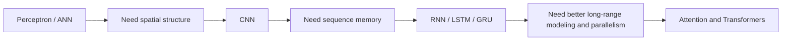

# Neural network types, deep learning history, and applications

After understanding what deep learning is, the next step is to understand that not all neural networks are built for the same kind of data.

## Main neural network families

### Artificial Neural Networks (ANN / MLP)

Used mainly for:

- tabular data
- dense feature vectors
- small to medium classification or regression tasks

Core idea:

$$
a^{(l)} = \phi(W^{(l)} a^{(l-1)} + b^{(l)})
$$


*Source: [Wikimedia Commons — MultiLayerPerceptron](https://commons.wikimedia.org/wiki/File:MultiLayerPerceptron.svg) (CC BY-SA 4.0)*

### Convolutional Neural Networks (CNN)

Used mainly for:

- images
- video
- spectrogram-like data

Core idea:

- local receptive fields
- shared filters
- spatial hierarchy

### Recurrent Neural Networks (RNN, LSTM, GRU)

Used mainly for:

- sequences
- time series
- language before transformers became dominant

Core idea:

$$
h_t = f(x_t, h_{t-1})
$$

### Transformers

Used mainly for:

- language modeling
- translation
- code
- multimodal systems

Core idea:

$$
\text{Attention}(Q,K,V)=\text{softmax}\left(\frac{QK^T}{\sqrt{d_k}}\right)V
$$

## Why these types appeared in this order

The history of deep learning is not random. Each family emerged because the previous tools had limitations.



## A short historical arc

### 1950s to 1960s

- perceptron introduced
- excitement around simple neural models

### 1970s to 1980s

- limitations such as XOR reduced interest
- backpropagation later revived multi-layer networks

### 1990s to 2000s

- support vector machines and boosted trees became strong alternatives
- deep networks were still difficult to train

### 2010s onward

- big data
- GPUs
- ReLU, dropout, better initialization, batch norm
- CNN breakthroughs in vision
- RNN/LSTM progress in language and speech
- transformer revolution in sequence modeling

## Why application type matters

Architecture choice depends on the structure of the data:

| Data type | Common architecture |
| --- | --- |
| tabular rows | ANN / MLP |
| image grids | CNN |
| sequences and time steps | RNN / LSTM / GRU |
| long-context language and multimodal data | Transformer |

This is the first important continuity principle in the course:

$$
\text{data structure} \rightarrow \text{architecture choice}
$$

## Why ANN comes next in the course

Even though CNNs and transformers are more famous today, the course moves next to perceptrons and MLPs because they provide the foundation:

- learnable weights
- bias
- activation
- forward propagation
- loss
- backpropagation

Those ideas remain inside CNNs, RNNs, and transformers too.

## A simple PyTorch sketch

```python
import torch
import torch.nn as nn

ann = nn.Sequential(nn.Linear(10, 16), nn.ReLU(), nn.Linear(16, 1))
cnn = nn.Conv2d(3, 8, kernel_size=3, padding=1)
rnn = nn.RNN(input_size=20, hidden_size=32, batch_first=True)
transformer = nn.TransformerEncoderLayer(d_model=64, nhead=8, batch_first=True)
```

These four lines are very different in structure, but they all still rely on learnable parameters and gradient-based optimization.

## Interview questions

<details>
<summary>Why do we need different network types?</summary>

Because different data modalities have different structure. Images have spatial locality, sequences have temporal order, and language benefits from flexible context interaction.
</details>

<details>
<summary>Is ANN outdated now that transformers exist?</summary>

No. ANN/MLP layers still appear everywhere, and for tabular data they are still a core baseline.
</details>

<details>
<summary>Why are transformers so important if the course starts with perceptron?</summary>

Because transformers are built on the same core training machinery, just with a much richer architecture.
</details>

<details>
<summary>Why did CNNs become dominant for vision?</summary>

Because they exploit locality and weight sharing, which match the structure of images much better than dense networks.
</details>

<details>
<summary>Why were RNNs introduced after ANNs?</summary>

Because ANNs do not naturally model order or temporal dependence, while RNNs explicitly carry information from one time step to the next.
</details>

<details>
<summary>What is the main historical reason deep learning surged after 2010?</summary>

The combination of large datasets, GPU computation, and improved training methods such as ReLU, better initialization, and stronger optimizers.
</details>

## Final takeaway

This note widens the map. The next notes narrow the focus back down to the simplest building block, the perceptron, because that is where the real mathematical continuity begins.

## References

- CampusX YouTube: Types of Neural Networks | History of Deep Learning | Applications of Deep Learning
