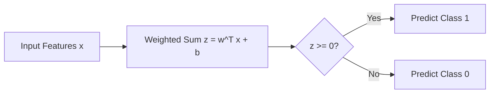

# Perceptron basics, neuron analogy, and geometric intuition

The perceptron is the first mathematical model in the course that behaves like a learnable classifier. It is the bridge between linear algebra and neural networks.

## One-line definition

A perceptron is the simplest neural classifier: it computes a weighted sum of features and then makes a decision based on whether that sum crosses a threshold.


*Source: [Wikimedia Commons — Artificial Neuron](https://commons.wikimedia.org/wiki/File:Artificial_Neuron.svg) (CC BY-SA 4.0)*

## Continuity with the learning path

**Coming from**: [Note 3 — NN Types](neural-network-types-deep-learning-history-and-applications.md) showed you the landscape of all architectures. Now we zoom in on the simplest building block.

**In this note**: You'll learn the perceptron — the atomic unit of all neural networks. Every CNN, RNN, and Transformer is built from perceptrons (or their variants).

**Coming next**: [Note 5 — Perceptron Training](perceptron-training-and-the-perceptron-trick.md) shows how the perceptron learns from mistakes. Then [Note 7 — Why Perceptron Fails](why-a-single-perceptron-fails-on-nonlinear-problems.md) motivates why we need multiple layers ([Note 9 — MLP Intuition](multi-layer-perceptron-intuition.md)).

## Why this topic matters

The perceptron is not important because we still deploy plain perceptrons everywhere. It is important because it teaches the three ideas that power the entire rest of deep learning:

- learnable weights
- a bias term
- a decision rule based on a linear score

If you understand perceptrons deeply, MLPs become much easier.

## Biological neuron vs perceptron

The biological analogy is useful, but only as an intuition aid.

| Biological neuron | Perceptron |
| --- | --- |
| dendrites receive signals | input features $x_1, x_2, ..., x_n$ |
| synaptic strength controls influence | weights $w_1, w_2, ..., w_n$ |
| cell body combines signals | weighted sum |
| neuron fires if activation is high enough | threshold decision / activation |

The analogy helps for intuition, but mathematically the perceptron is a linear model followed by a threshold.

## The core formula

For input vector $x \in \mathbb{R}^n$:

$$
z = w^T x + b = \sum_{i=1}^{n} w_i x_i + b
$$

Then the perceptron predicts:

$$
\hat{y} =
\begin{cases}
1 & \text{if } z \ge 0 \\
0 & \text{if } z < 0
\end{cases}
$$

An equivalent form uses a threshold $\theta$:

$$
\hat{y} =
\begin{cases}
1 & \text{if } w^T x \ge \theta \\
0 & \text{otherwise}
\end{cases}
$$

This is the same as writing:

$$
w^T x - \theta \ge 0
$$

so the bias is simply:

$$
b = -\theta
$$

### Meaning of each term

- $x$: input features
- $w$: importance of each feature
- $b$: bias, which shifts the boundary
- $z$: raw score before decision

## Geometric intuition

The equation

$$
w^T x + b = 0
$$

defines a hyperplane.

- in 2D, it is a line
- in 3D, it is a plane
- in higher dimensions, it is a hyperplane

That hyperplane splits space into two halves:

- one side predicted as class `1`
- the other side predicted as class `0`

So a perceptron is really learning a separating boundary.



## Why the bias term matters

Without bias:

$$
z = w^T x
$$

the decision boundary must pass through the origin.

With bias:

$$
z = w^T x + b
$$

the model can shift the boundary freely.

This makes the classifier much more flexible.

## A concrete 2D example

Suppose:

$$
w = \begin{bmatrix} 2 \\ 1 \end{bmatrix}, \quad b = -3
$$

Then:

$$
z = 2x_1 + x_2 - 3
$$

The decision boundary is:

$$
2x_1 + x_2 - 3 = 0
$$

or

$$
x_2 = 3 - 2x_1
$$

Every point above one side of this line belongs to one class; points on the other side belong to the other class.

If we take:

$$
x = \begin{bmatrix}1 \\ 1\end{bmatrix}
$$

then:

$$
z = 2(1) + 1(1) - 3 = 0
$$

So this point lies exactly on the decision boundary.

## What the perceptron can and cannot learn

### It can learn

- linearly separable datasets
- simple binary decisions
- a single linear boundary

### It cannot learn

- XOR
- concentric circles
- complex curved boundaries
- tasks that need multiple stages of representation learning

That limitation is the reason hidden layers matter.

## Why XOR breaks the perceptron

In XOR:

- `(0, 0) -> 0`
- `(0, 1) -> 1`
- `(1, 0) -> 1`
- `(1, 1) -> 0`

No single straight line can separate the positive and negative examples. The dataset is not linearly separable.

This is the historical reason multi-layer networks became necessary.

This is also the continuity into the next chapter:

- one perceptron learns one linear separator
- multiple perceptrons in hidden layers create piecewise nonlinear boundaries
- that gives us the multi-layer perceptron

## Visual anchor


Source: [Wikimedia Commons - Perceptron.png](https://commons.wikimedia.org/wiki/File:Perceptron.png)

## From perceptron to sigmoid neuron

The original perceptron uses a hard threshold, which is not differentiable in a useful way for gradient-based learning.

So in practice, modern neural networks replace the hard step with smooth activations such as sigmoid, tanh, or ReLU.

For a sigmoid neuron:

$$
\hat{y} = \sigma(z) = \frac{1}{1 + e^{-z}}
$$

Now the output is continuous and differentiable, which makes backpropagation possible.

## PyTorch example

```python
import torch

# AND gate dataset
X = torch.tensor([
    [0.0, 0.0],
    [0.0, 1.0],
    [1.0, 0.0],
    [1.0, 1.0],
])
y = torch.tensor([0.0, 0.0, 0.0, 1.0])

w = torch.zeros(2, requires_grad=True)
b = torch.zeros(1, requires_grad=True)
lr = 0.1

for _ in range(300):
    z = X @ w + b
    y_hat = torch.sigmoid(z)
    loss = torch.nn.functional.binary_cross_entropy(y_hat, y)
    loss.backward()
    with torch.no_grad():
        w -= lr * w.grad
        b -= lr * b.grad
        w.grad.zero_()
        b.grad.zero_()

print("weights:", w)
print("bias:", b)
print("probabilities:", torch.sigmoid(X @ w + b))
```

## How to think about the code

- `X @ w` computes the weighted sum for all samples
- `b` shifts the decision boundary
- `sigmoid` turns the raw score into a probability-like number
- `binary_cross_entropy` measures error for binary classification
- gradient descent adjusts weights to reduce the loss

## Interview questions

<details>
<summary>What is the perceptron actually learning?</summary>

It is learning the orientation and position of a linear decision boundary.
</details>

<details>
<summary>Why are weights important in a perceptron?</summary>

Weights determine which features matter more and in which direction they influence the prediction.
</details>

<details>
<summary>Why do we need bias?</summary>

Bias lets the separator shift away from the origin. Without bias, the boundary must pass through the origin.
</details>

<details>
<summary>Is perceptron the same as logistic regression?</summary>

Not exactly. Both use a linear score, but classical perceptron uses a hard threshold and a different update logic, while logistic regression uses a probabilistic sigmoid model and log-loss.
</details>

<details>
<summary>Why is the perceptron called a neuron?</summary>

Because it loosely mimics combining signals and firing based on total activation, but it is a mathematical abstraction rather than a biological simulation.
</details>

<details>
<summary>What is the geometric meaning of <code>w^T x + b = 0</code>?</summary>

It defines the decision boundary: a line in 2D, a plane in 3D, or a hyperplane in higher-dimensional space.
</details>

<details>
<summary>Why is a perceptron limited?</summary>

Because it can only learn one linear separator, so it fails on nonlinear problems like XOR.
</details>

## Common mistakes

- treating weights as fixed feature importance instead of learnable parameters
- forgetting that a single perceptron is only linear
- confusing thresholded output with probability
- ignoring the geometric meaning of the boundary

## Advanced insight

A perceptron can be viewed as a hyperplane classifier in feature space. Deep networks become powerful because hidden layers learn a new representation where the classes become easier to separate linearly.

That is why the final layer of a deep network often still looks like a perceptron: the deep part learns the right features, and the last layer does the linear separation.

## Final takeaway

The perceptron is the first serious bridge between geometry, algebra, and learning. Once you internalize that it is just "weighted sum plus decision boundary," the rest of neural networks starts to feel much less mysterious.

## References

- CampusX YouTube: Perceptron, neuron analogy, and geometric intuition
