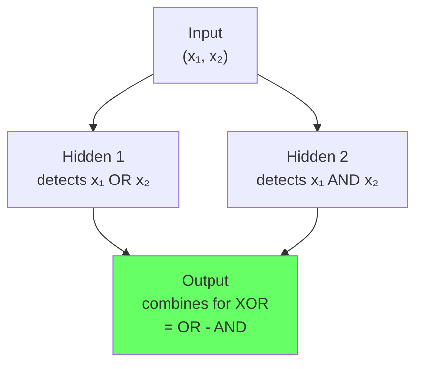

# Multi-layer perceptron intuition

The perceptron ([Note 4](perceptron-basics-neuron-analogy-and-geometric-intuition.md)) failed on nonlinear problems like XOR ([Note 7](why-a-single-perceptron-fails-on-nonlinear-problems.md)) because one linear separator is insufficient. The MLP fixes that by stacking multiple layers with nonlinear activations, allowing the network to learn hierarchical intermediate representations.


*Source: [Wikimedia Commons — MultiLayerPerceptron](https://commons.wikimedia.org/wiki/File:MultiLayerPerceptron.svg) (CC BY-SA 4.0)*

## Continuity guide

**From**: [Note 8 — MLP Notation](mlp-notation-inputs-weights-biases-layers-and-shapes.md) (how to write multi-layer equations)

**In this note**: **Why hidden layers work** — the conceptual foundation of all deep learning. This is the most important insight in the course.

**Next**: [Note 10 — Forward Propagation](forward-propagation-and-how-a-neural-network-predicts.md) (step-by-step: how input flows through the network) → Projects ([Notes 11-13](handwritten-digit-classification-with-an-ann-in-pytorch.md))

**Then**: [Note 14 — Loss Functions](loss-functions-in-deep-learning.md) (what to minimize) → [Note 15 — Backpropagation](backpropagation-part-1-what-backpropagation-is.md) (how to minimize it)

**Why this is crucial**: This is the inflection point where you transition from "how single neurons work" to "how networks learn". Everything after this depends on understanding representation learning.

## One-line definition

A multi-layer perceptron is a feedforward neural network with one or more hidden layers, where each layer applies a nonlinear activation to a linear transformation, enabling the network to learn nonlinear decision boundaries.

## Why this topic matters

The perceptron is limited to linearly separable problems. The MLP removes that limitation by showing that nonlinear problems can be solved by composing many linear separators through hidden layers. This is the conceptual bridge from simple classifiers to deep learning: understanding why hidden layers are necessary is essential for understanding all neural networks that follow.

## The problem: XOR is not linearly separable

XOR (exclusive OR) is a simple nonlinear function:

| x₁ | x₂ | XOR |
|----|----|----|
| 0  | 0  | 0  |
| 0  | 1  | 1  |
| 1  | 0  | 1  |
| 1  | 1  | 0  |

No single line in 2D space separates the two classes. A perceptron cannot solve XOR with any choice of weights and bias. This is the **XOR limitation**.


## The MLP solution: learn intermediate representations

Instead of learning a decision boundary directly from input, learn an intermediate representation first. An MLP with one hidden layer has the structure:

$$
h = \phi(W_1 x + b_1) \quad \text{(hidden layer)}
$$

$$
\hat{y} = g(W_2 h + b_2) \quad \text{(output layer)}
$$

where:
- $W_1 \in \mathbb{R}^{h \times d}$ (input → hidden weights)
- $W_2 \in \mathbb{R}^{c \times h}$ (hidden → output weights)
- $\phi$ is a nonlinear activation (sigmoid, tanh, ReLU)
- $g$ is the output activation (sigmoid for binary classification, softmax for multi-class)

**Key insight**: The hidden layer does not directly solve the problem. Instead, it learns a representation $h$ in which the problem becomes linearly separable.

## Why nonlinearity is essential

**Claim**: Without nonlinear activations, stacking layers provides no additional power.

**Proof**: If every layer is linear:

$$
h = W_1 x + b_1
$$

$$
\hat{y} = W_2(W_1 x + b_1) + b_2 = (W_2 W_1) x + (W_2 b_1 + b_2)
$$

The composition collapses into a single linear transformation:

$$
\hat{y} = W x + b
$$

where $W = W_2 W_1$ and $b = W_2 b_1 + b_2$ are a single equivalent weight matrix and bias. **No amount of stacking linear layers increases expressiveness.**

**Solution**: Insert a nonlinear function $\phi$ between layers:

$$
h = \phi(W_1 x + b_1)
$$

Now:

$$
\hat{y} = W_2 h = W_2 \phi(W_1 x + b_1)
$$

**cannot** be collapsed into a single linear transformation. Nonlinearity is non-negotiable for learning nonlinear functions.

## How hidden units divide the input space

Each hidden neuron implements a linear decision boundary:

$$
h_j = \phi(w_j^T x + b_j)
$$

is the activation of hidden neuron $j$. Before the activation, it computes $z_j = w_j^T x + b_j$, which is a hyperplane in the input space.

**With $h$ hidden neurons**, you have $h$ hyperplanes, each carving the input space. Their combination through the output layer creates a nonlinear decision surface.

### XOR example with 2 hidden neurons

For the XOR problem, two hidden neurons suffice:

- **Neuron 1**: $h_1 = \phi(x_1 + x_2 - 0.5)$ activates when the sum of inputs is large
- **Neuron 2**: $h_2 = \phi(x_1 + x_2 - 1.5)$ activates differently

The output layer then combines $h_1$ and $h_2$ to learn XOR.



The hidden layer has **transformed the problem** into a space where the output layer can solve it linearly.

## Core MLP architecture patterns

### Single hidden layer (shallow MLP)

```
Input (d) → Hidden (h) → Output (c)
```

- Weights: $W_1 \in \mathbb{R}^{h \times d}$ (e.g., 100 × 28)
- Biases: $b_1 \in \mathbb{R}^h$
- Activation: ReLU or tanh
- Output weights: $W_2 \in \mathbb{R}^{c \times h}$ (e.g., 10 × 100)

**Capacity**: grows with hidden layer size $h$. Larger $h$ → more complex boundaries possible, but higher overfitting risk.

### Multiple hidden layers (deep MLP)

```
Input (d) → H1 (h₁) → H2 (h₂) → ... → Hₙ (hₙ) → Output (c)
```

Each layer further transforms the representation. Deeper networks can learn hierarchical features with fewer parameters than wide shallow networks (though training becomes harder).

## Representation learning intuition

Consider image classification: a raw $28 \times 28$ MNIST digit image is hard to classify directly.

The hidden layers could learn intermediate representations:

- **Layer 1**: edge detectors (lines, corners)
- **Layer 2**: stroke detectors (curves, combined edges)
- **Layer 3**: digit-part detectors (loops, stems)
- **Output**: combines parts to classify the digit

This **hierarchical feature learning** is why deep networks work so well — early layers discover simple patterns, deeper layers compose them into complex concepts.

## Width vs depth trade-off

| Dimension | Shallow, wide MLP | Deep, narrow MLP |
|-----------|---|---|
| Number of layers | 2–3 | 10–50+ |
| Neurons per layer | Very large | Moderate |
| Parameters needed | More | Often fewer |
| Training difficulty | Easier | Harder (vanishing gradients) |
| Universal approximation | Yes (1 hidden layer) | Yes (depth helps generalization) |
| Practical performance | OK | Usually better |

**Universal approximation theorem** (Cybenko, 1989): A single hidden layer with enough neurons can approximate any continuous function. However, this does not mean one layer is practical — depth allows learning with far fewer parameters.

## PyTorch implementation

```python
import torch
import torch.nn as nn

# ============================================================
# Single hidden layer MLP for XOR
# ============================================================
class XOR_MLP(nn.Module):
    def __init__(self, hidden_size=4):
        super().__init__()
        self.fc1 = nn.Linear(2, hidden_size)  # input → hidden
        self.fc2 = nn.Linear(hidden_size, 1)  # hidden → output
    
    def forward(self, x):
        h = torch.relu(self.fc1(x))  # nonlinearity is essential
        return torch.sigmoid(self.fc2(h))  # binary classification

# Verify XOR learning
model = XOR_MLP(hidden_size=4)
optimizer = torch.optim.Adam(model.parameters(), lr=0.01)
criterion = nn.BCELoss()

# XOR training data
x_xor = torch.tensor([[0., 0.], [0., 1.], [1., 0.], [1., 1.]])
y_xor = torch.tensor([[0.], [1.], [1.], [0.]])

for epoch in range(1000):
    logits = model(x_xor)
    loss = criterion(logits, y_xor)
    optimizer.zero_grad()
    loss.backward()
    optimizer.step()
    if epoch % 200 == 0:
        print(f"Epoch {epoch}: loss = {loss.item():.4f}")

# Test predictions
with torch.no_grad():
    preds = model(x_xor)
    print(f"\nPredictions: {preds.squeeze().numpy().round(2)}")
    print(f"Ground truth: {y_xor.squeeze().numpy()}")

# ============================================================
# Multi-layer MLP for MNIST (3 hidden layers)
# ============================================================
class DeepMLP(nn.Module):
    def __init__(self, in_features=784, hidden_sizes=(256, 128, 64), num_classes=10):
        super().__init__()
        layers = []
        prev_size = in_features
        for h_size in hidden_sizes:
            layers.append(nn.Linear(prev_size, h_size))
            layers.append(nn.ReLU())
            prev_size = h_size
        layers.append(nn.Linear(prev_size, num_classes))
        self.net = nn.Sequential(*layers)
    
    def forward(self, x):
        x = x.view(x.size(0), -1)  # flatten
        return self.net(x)

model_deep = DeepMLP()
x_batch = torch.randn(32, 784)
output = model_deep(x_batch)
print(f"\nDeep MLP output shape: {output.shape}")  # (32, 10)

# Count parameters
total_params = sum(p.numel() for p in model_deep.parameters())
print(f"Total parameters: {total_params:,}")
```

## Common naming confusion

- **"Layer"**: sometimes means a linear transformation, sometimes means linear + activation. Be precise.
- **"Hidden layer"**: any layer that is not the input or output.
- **"Width"**: number of neurons in a layer.
- **"Depth"**: number of layers (including hidden layers, not counting input).

A 2-layer MLP (one hidden, one output) is often called "shallow." A 10-layer MLP is called "deep."

## Continuity with the next topics

Now that we understand why MLPs work, the next steps are:

1. **Notation (note 8)**: Formalize the shapes of weights, biases, and activations
2. **Forward propagation (note 10)**: How input flows through the network step by step
3. **Loss functions (note 14)**: How to measure if predictions are correct
4. **Backpropagation (notes 15–17)**: How to learn the weights

Each hidden neuron's weights are random initially. Backpropagation will adjust them so that hidden neurons learn useful features.

## Interview questions

<details>
<summary>Why is a single hidden layer sufficient to approximate any continuous function, yet deep networks are better in practice?</summary>

The universal approximation theorem says one hidden layer suffices theoretically, but the number of neurons required grows exponentially with input dimension. Deep networks can learn the same function with far fewer neurons because depth allows learning hierarchical features — early layers solve simple sub-problems, later layers compose them. Additionally, depth provides implicit regularization that improves generalization.
</details>

<details>
<summary>What happens if you compose multiple linear transformations without nonlinearities?</summary>

They collapse into a single linear transformation. Mathematically, $W_3(W_2(W_1 x + b_1) + b_2) + b_3 = Wx + b$ for some composite $W$ and $b$. Without nonlinearity between layers, adding more layers provides zero benefit.
</details>

<details>
<summary>Can you use a different nonlinearity at each layer?</summary>

Yes. Common choices are ReLU (modern standard), sigmoid, and tanh. There is no requirement to use the same activation everywhere. Modern practice favors ReLU throughout because it is computationally cheap and avoids vanishing gradient problems.
</details>

<details>
<summary>Why do hidden neurons not need to correspond to human-interpretable concepts?</summary>

Hidden units are learned features, not hand-engineered features. Their job is to extract patterns useful for the downstream task, not to be understandable. A neuron might respond to combinations of inputs in ways that have no semantic meaning but are useful for the classifier.
</details>

<details>
<summary>How many hidden neurons should you use?</summary>

This is a hyperparameter that must be tuned. Too few hidden neurons → underfitting (the network cannot learn the task). Too many → overfitting (the network memorizes noise). A typical starting point is to use 1–3 times the output size, then adjust based on validation performance.
</details>

<details>
<summary>Is a network with 1000 hidden neurons "deep"?</summary>

No. Depth refers to the number of layers, not the number of neurons. A network with one hidden layer of 1000 neurons is shallow. A network with 5 layers of 100 neurons each is deeper.
</details>

## Common mistakes

- Stacking multiple linear layers without activations and expecting increased capacity — they collapse into one layer.
- Using a nonlinearity at the output layer for regression tasks — the output should be linear for continuous predictions.
- Not recognizing that hidden layer size is a hyperparameter that must be tuned per task.
- Assuming deeper is always better — very deep networks without proper training techniques (batch norm, skip connections) suffer from vanishing gradients.
- Confusing the number of neurons with the number of layers — depth and width are independent dimensions.

## Advanced perspective

The MLP is a universal approximator: given enough hidden neurons and enough data, an MLP can learn any function. However, the generalization properties depend on depth and architecture. Deep networks with the right inductive biases (skip connections, normalization) often generalize better than wide shallow networks because depth allows learning with fewer parameters and enables transfer learning of hierarchical features.

The number of hidden neurons required to approximate a function depends on its complexity — functions with more structure require fewer neurons, while chaotic functions may require exponentially many. This is why network size must be chosen based on the problem, not set universally.

## Final takeaway

An MLP works by learning intermediate representations. Hidden layers do not solve the problem directly — they transform the input into a space where the output layer can solve it linearly. Nonlinearity is essential because without it, layers collapse into one. Hidden layers are the foundation of deep learning: every architecture that follows (CNNs, RNNs, Transformers) contains nonlinear hidden transformations.

## References

- Cybenko, G. (1989). Approximation by superpositions of a sigmoidal function. Mathematics of Control, Signals and Systems.
- Minsky, M., & Papert, S. (1969). Perceptrons: An Introduction to Computational Geometry. MIT Press.
- Nielsen, M. (2015). Neural Networks and Deep Learning. [Online book](http://neuralnetworksanddeeplearning.com/)
