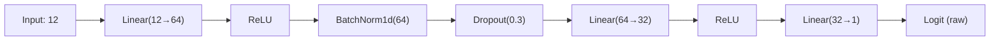

# Customer churn classification with an ANN in PyTorch

Forward propagation gave us the mechanics of prediction. This project puts those mechanics to work on a real business problem: predicting whether a bank customer will churn based on structured tabular features.

## One-line definition

Customer churn classification is a binary classification task where a neural network takes tabular customer features as input and outputs a probability that the customer will leave.

## Why this topic matters

Tabular data is the dominant data type in industry — most business ML applications work with structured tables, not images or text. Building a solid binary classification pipeline in PyTorch teaches you the universal template: preprocess, split, define architecture, choose the right loss, train in mini-batches, and evaluate with task-appropriate metrics. This same template applies to fraud detection, medical diagnosis, and any other binary outcome problem.

## Dataset overview

The Telco or Bank Customer Churn dataset typically contains:


*Source: [Wikimedia Commons — MultiLayerPerceptron](https://commons.wikimedia.org/wiki/File:MultiLayerPerceptron.svg) (CC BY-SA 4.0)*

| Feature | Type | Notes |
|---|---|---|
| CreditScore | Numeric | Continuous |
| Geography | Categorical | Needs one-hot encoding |
| Gender | Categorical | Binary encode |
| Age | Numeric | Continuous |
| Tenure | Numeric | Integer |
| Balance | Numeric | Often log-scaled |
| NumOfProducts | Numeric | Integer |
| HasCrCard | Binary | 0 / 1 |
| IsActiveMember | Binary | 0 / 1 |
| EstimatedSalary | Numeric | Continuous |
| Exited | Target | 0 = stayed, 1 = churned |

Class imbalance is common: roughly 20% positive class. This matters for evaluation metrics.

## Preprocessing pipeline


Standardizing numeric features to zero mean and unit variance is critical. Dense networks are not scale-invariant. A feature with range 0–800,000 will dominate gradients if left unscaled.

## Architecture design

For a 12-feature input (after one-hot encoding), a compact MLP works well:



The output is a single logit (unnormalized score). The sigmoid is not applied inside the model — it is absorbed into the loss function.

## The loss function for binary classification

`BCEWithLogitsLoss` combines a sigmoid and binary cross-entropy in one numerically stable operation:

$$
\mathcal{L}_{\text{BCE}} = -\frac{1}{N}\sum_{i=1}^{N}\left[y_i \log(\sigma(z_i)) + (1-y_i)\log(1-\sigma(z_i))\right]
$$

where $z_i$ is the raw logit and $\sigma(z_i) = \frac{1}{1 + e^{-z_i}}$.

Using `BCELoss` after manually applying `sigmoid` is numerically less stable because $\log(\sigma(z))$ can underflow for large negative $z$. PyTorch implements the log-sum-exp trick internally when you pass raw logits to `BCEWithLogitsLoss`.

## Key hyperparameters

| Hyperparameter | Typical Range | Notes |
|---|---|---|
| Hidden units | 32–256 | Scale with dataset size |
| Dropout rate | 0.2–0.5 | Tune via validation AUC |
| Learning rate | 1e-4 to 1e-2 | Adam default 1e-3 |
| Batch size | 32–256 | Larger = faster but less noise |
| Epochs | 50–200 | Use early stopping |

## PyTorch example

```python
import torch
import torch.nn as nn
from torch.utils.data import TensorDataset, DataLoader
from sklearn.preprocessing import StandardScaler
from sklearn.model_selection import train_test_split
import numpy as np

# ── Simulated data (replace with pd.read_csv for real data) ──────────────────
np.random.seed(42)
X_raw = np.random.randn(1000, 12).astype(np.float32)
y_raw = (np.random.rand(1000) > 0.8).astype(np.float32)  # ~20% churn rate

# ── Preprocessing ─────────────────────────────────────────────────────────────
X_train, X_val, y_train, y_val = train_test_split(
    X_raw, y_raw, test_size=0.2, random_state=42
)

scaler = StandardScaler()
X_train = scaler.fit_transform(X_train)  # fit on training set only
X_val   = scaler.transform(X_val)        # apply same transform to validation

# ── Build DataLoaders ─────────────────────────────────────────────────────────
def to_loader(X, y, batch_size=64, shuffle=True):
    ds = TensorDataset(torch.tensor(X), torch.tensor(y).unsqueeze(1))
    return DataLoader(ds, batch_size=batch_size, shuffle=shuffle)

train_loader = to_loader(X_train, y_train)
val_loader   = to_loader(X_val,   y_val,   shuffle=False)

# ── Architecture ──────────────────────────────────────────────────────────────
class ChurnNet(nn.Module):
    def __init__(self, n_features=12):
        super().__init__()
        self.net = nn.Sequential(
            nn.Linear(n_features, 64),
            nn.BatchNorm1d(64),
            nn.ReLU(),
            nn.Dropout(0.3),
            nn.Linear(64, 32),
            nn.ReLU(),
            nn.Linear(32, 1),           # output: single logit
        )

    def forward(self, x):
        return self.net(x)

model     = ChurnNet()
loss_fn   = nn.BCEWithLogitsLoss()       # numerically stable
optimizer = torch.optim.Adam(model.parameters(), lr=1e-3, weight_decay=1e-4)

# ── Training loop ─────────────────────────────────────────────────────────────
def accuracy(logits, targets):
    preds = (torch.sigmoid(logits) > 0.5).float()
    return (preds == targets).float().mean().item()

for epoch in range(1, 21):
    model.train()
    train_loss = 0
    for xb, yb in train_loader:
        logits = model(xb)
        loss   = loss_fn(logits, yb)
        optimizer.zero_grad()
        loss.backward()
        optimizer.step()
        train_loss += loss.item()

    # ── Validation ────────────────────────────────────────────────────────────
    model.eval()
    with torch.no_grad():
        val_logits = torch.cat([model(xb) for xb, _ in val_loader])
        val_targets = torch.cat([yb for _, yb in val_loader])
        val_acc = accuracy(val_logits, val_targets)

    if epoch % 5 == 0:
        print(f"Epoch {epoch:3d} | train_loss={train_loss/len(train_loader):.4f} | val_acc={val_acc:.4f}")
```

## Evaluation beyond accuracy

Accuracy is misleading for imbalanced datasets. If only 20% of customers churn and you always predict "no churn", accuracy is 80% but the model is useless.

Better metrics:

- **AUC-ROC**: measures ranking quality across all thresholds
- **Precision / Recall**: for the minority (churn) class
- **F1 score**: harmonic mean of precision and recall
- **Confusion matrix**: to see false negatives (missed churns, high business cost)

```python
from sklearn.metrics import roc_auc_score, classification_report

model.eval()
with torch.no_grad():
    all_logits  = torch.cat([model(xb) for xb, _ in val_loader])
    all_targets = torch.cat([yb for _, yb in val_loader])

probs = torch.sigmoid(all_logits).numpy().flatten()
y_true = all_targets.numpy().flatten()

print("AUC:", roc_auc_score(y_true, probs))
print(classification_report(y_true, (probs > 0.5).astype(int)))
```

## Interview questions

<details>
<summary>Why use BCEWithLogitsLoss instead of sigmoid + BCELoss?</summary>

`BCEWithLogitsLoss` applies the log-sum-exp trick internally, avoiding numerical underflow when logits are very negative. Separately applying sigmoid and then log can produce `-inf` values.
</details>

<details>
<summary>Why must feature scaling be fit only on the training set?</summary>

Fitting the scaler on the full dataset leaks validation statistics into training, giving an optimistic estimate of generalization. The scaler must be fit on training data only, then applied (without refitting) to validation and test sets.
</details>

<details>
<summary>How do you handle class imbalance in a binary classification ANN?</summary>

Options include: class-weighted loss (`pos_weight` argument in `BCEWithLogitsLoss`), oversampling the minority class (SMOTE), undersampling the majority class, or adjusting the decision threshold after training.
</details>

<details>
<summary>Why is accuracy a misleading metric for churn prediction?</summary>

With 80% non-churners, a trivial "always predict no churn" classifier achieves 80% accuracy. AUC-ROC, F1, and precision-recall curves are more informative because they account for class imbalance.
</details>

<details>
<summary>What is the output dimension for binary classification, and why?</summary>

A single output logit, not two. One logit with sigmoid is equivalent to two-class softmax but is more efficient. The probability of class 1 is `sigmoid(z)` and class 0 is `1 - sigmoid(z)`.
</details>

<details>
<summary>When should you use Dropout in a small tabular network?</summary>

Dropout is most useful when the network is large enough to memorize the training data. For very small networks or small datasets, it may hurt performance. Monitor the training vs. validation loss gap to decide.
</details>

## Common mistakes

- Applying sigmoid inside the model when also using `BCEWithLogitsLoss` (double sigmoid)
- Fitting the StandardScaler on the full dataset instead of only the training split
- Reporting only accuracy on an imbalanced dataset
- Forgetting `optimizer.zero_grad()`, causing gradient accumulation across batches
- Leaving the model in training mode during evaluation (BatchNorm and Dropout behave differently)
- Not setting a threshold — the default 0.5 is rarely optimal for imbalanced classes

## Advanced perspective

For severely imbalanced tabular data, the choice of decision threshold matters as much as the architecture. After training, sweep the threshold over the range 0.1 to 0.9 and pick the value that maximizes the F1 score or business-specific cost function (e.g., false negatives cost 5x more than false positives). This post-hoc calibration is standard in production churn systems.

Batch normalization in dense networks normalizes the pre-activation distribution for each mini-batch during training, which reduces sensitivity to weight initialization and can allow higher learning rates. However, it introduces a discrepancy between training (batch statistics) and inference (running statistics), which is why `model.eval()` must be called before evaluation.

## Final takeaway

The churn project encodes the canonical binary-classification pipeline: standardize tabular features, define a small dense network with a single logit output, use `BCEWithLogitsLoss`, train with mini-batch Adam, and evaluate with AUC and F1 rather than raw accuracy. This template transfers directly to any tabular binary classification task.

## References

- CampusX YouTube: Customer Churn Prediction using ANN in PyTorch
- Telco Customer Churn dataset: Kaggle
