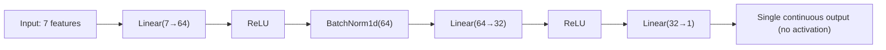

# Graduate admission prediction with an ANN in PyTorch

The previous two projects handled binary and multi-class classification. This project completes the trilogy with regression: predicting a continuous probability of admission rather than a discrete class label.

## One-line definition

Graduate admission prediction is a regression task where an ANN maps seven academic features to a continuous probability of admission in the range [0, 1].

## Why this topic matters

Regression with a neural network differs from classification in three precise ways: the output layer has no activation function, the loss function is MSE or MAE instead of cross-entropy, and evaluation uses RMSE or R² instead of accuracy. Understanding these differences prevents a class of common bugs where classification patterns are applied to regression problems.

## Dataset overview

The Jamboree Graduate Admissions dataset (from Kaggle, originally from UCLA) contains 500 student records:

| Feature | Range | Notes |
|---|---|---|
| GRE Score | 290–340 | Standardized test score |
| TOEFL Score | 92–120 | English proficiency |
| University Rating | 1–5 | Categorical, treat as ordinal |
| SOP | 1–5 | Statement of purpose strength |
| LOR | 1–5 | Letter of recommendation strength |
| CGPA | 6.8–9.9 | Undergraduate GPA |
| Research | 0 or 1 | Research experience flag |
| Chance of Admit | 0.34–0.97 | **Target variable** (continuous) |

The target is bounded in (0, 1) but is not a probability in the strict probabilistic sense — it is a score. **Do not apply sigmoid to the output.** Let the network predict it as a real number and supervise with MSE.

## Architecture for regression



The output layer is a `Linear(32→1)` with **no activation**. The network learns to map to whatever range the target occupies. StandardScaler on inputs ensures the hidden layers receive well-conditioned inputs.

## Regression loss functions

### Mean Squared Error

$$
\mathcal{L}_{\text{MSE}} = \frac{1}{N}\sum_{i=1}^{N}(\hat{y}_i - y_i)^2
$$

MSE penalizes large errors quadratically. This makes it sensitive to outliers — a prediction error of 0.4 contributes 16× more than an error of 0.1.

### Mean Absolute Error

$$
\mathcal{L}_{\text{MAE}} = \frac{1}{N}\sum_{i=1}^{N}|\hat{y}_i - y_i|
$$

MAE is linear in error magnitude, making it more robust to outliers but less smooth near zero (non-differentiable at 0).

For the admission dataset where targets are concentrated in [0.4, 0.9] with few outliers, MSE is the standard choice.

## Evaluation metrics for regression

After training, report:

$$
\text{RMSE} = \sqrt{\frac{1}{N}\sum_{i=1}^{N}(\hat{y}_i - y_i)^2}
$$

$$
R^2 = 1 - \frac{\sum_{i=1}^{N}(\hat{y}_i - y_i)^2}{\sum_{i=1}^{N}(\bar{y} - y_i)^2}
$$

$R^2 = 1$ means perfect fit. $R^2 = 0$ means the model performs no better than predicting the mean. Negative $R^2$ means the model is worse than the mean predictor.

## PyTorch example

```python
import torch
import torch.nn as nn
import numpy as np
from sklearn.preprocessing import StandardScaler
from sklearn.model_selection import train_test_split
from sklearn.metrics import r2_score
from torch.utils.data import TensorDataset, DataLoader

# ── Simulated data (replace with pd.read_csv) ─────────────────────────────────
np.random.seed(0)
n = 500
X_raw = np.column_stack([
    np.random.randint(290, 341, n),      # GRE
    np.random.randint(92,  121, n),      # TOEFL
    np.random.randint(1,   6,   n),      # University Rating
    np.random.uniform(1,   5,   n),      # SOP
    np.random.uniform(1,   5,   n),      # LOR
    np.random.uniform(6.8, 9.9, n),      # CGPA
    np.random.randint(0,   2,   n),      # Research
]).astype(np.float32)

y_raw = (0.02 * X_raw[:, 0] / 340 +
         0.02 * X_raw[:, 1] / 120 +
         0.56 * X_raw[:, 5] / 9.9 +
         0.2  * X_raw[:, 6] +
         np.random.normal(0, 0.02, n)).clip(0.3, 0.97).astype(np.float32)

# ── Preprocessing ─────────────────────────────────────────────────────────────
X_tr, X_val, y_tr, y_val = train_test_split(X_raw, y_raw, test_size=0.2, random_state=42)

scaler = StandardScaler()
X_tr  = scaler.fit_transform(X_tr)      # fit only on training data
X_val = scaler.transform(X_val)

def to_loader(X, y, batch_size=32, shuffle=True):
    ds = TensorDataset(
        torch.tensor(X, dtype=torch.float32),
        torch.tensor(y, dtype=torch.float32).unsqueeze(1)
    )
    return DataLoader(ds, batch_size=batch_size, shuffle=shuffle)

train_loader = to_loader(X_tr,  y_tr)
val_loader   = to_loader(X_val, y_val, shuffle=False)

# ── Model ─────────────────────────────────────────────────────────────────────
class AdmissionNet(nn.Module):
    def __init__(self):
        super().__init__()
        self.net = nn.Sequential(
            nn.Linear(7, 64),
            nn.BatchNorm1d(64),
            nn.ReLU(),
            nn.Linear(64, 32),
            nn.ReLU(),
            nn.Linear(32, 1),       # no final activation for regression
        )

    def forward(self, x):
        return self.net(x)

model     = AdmissionNet()
loss_fn   = nn.MSELoss()
optimizer = torch.optim.Adam(model.parameters(), lr=1e-3)

# ── Training ──────────────────────────────────────────────────────────────────
for epoch in range(1, 51):
    model.train()
    for xb, yb in train_loader:
        preds = model(xb)
        loss  = loss_fn(preds, yb)
        optimizer.zero_grad()
        loss.backward()
        optimizer.step()

    if epoch % 10 == 0:
        model.eval()
        with torch.no_grad():
            val_preds   = torch.cat([model(xb) for xb, _ in val_loader]).numpy()
            val_targets = torch.cat([yb         for _, yb in val_loader]).numpy()
        rmse = np.sqrt(np.mean((val_preds - val_targets) ** 2))
        r2   = r2_score(val_targets, val_preds)
        print(f"Epoch {epoch:3d} | RMSE={rmse:.4f} | R²={r2:.4f}")
```

## Output layer considerations for bounded regression

The target is in (0, 1). Three options:

1. **No final activation**: let the network predict freely and use MSE. The model may occasionally predict values outside [0, 1], but this rarely causes practical problems.
2. **Sigmoid final activation + MSE**: forces predictions into (0, 1), but gradient saturation near the bounds can slow convergence.
3. **Clamp predictions at test time**: apply `torch.clamp(pred, 0.0, 1.0)` after training without changing the training objective.

Option 1 is standard for this dataset because the data is concentrated well inside (0, 1).

## Hyperparameter lessons from this project

| Decision | Reasoning |
|---|---|
| StandardScaler before training | Features have very different scales (GRE: 290–340 vs. Research: 0–1) |
| No output activation | Target is a score, not a probability in the information-theoretic sense |
| MSE loss | Penalizes large errors more, appropriate when outliers are rare |
| Small LR (1e-3) | Dataset is small (500 rows); smaller batches + lower LR reduce overfitting |
| Batch size 32 | Balances gradient noise and epoch speed for a 400-sample training set |

## Interview questions

<details>
<summary>Why is there no activation function on the output layer for regression?</summary>

Activation functions like sigmoid or ReLU constrain the output range. For regression, the network should be free to predict any real number (or any range where the target lies). Applying sigmoid would bound predictions to (0, 1) and introduce gradient saturation at the extremes.
</details>

<details>
<summary>When would you choose MAE over MSE as a regression loss?</summary>

Choose MAE when the target variable has outliers that should not dominate training, since MAE is linear in error magnitude. MSE is preferred when all errors matter equally and the data is well-distributed, because MSE is smooth everywhere and has cleaner gradient properties near the optimum.
</details>

<details>
<summary>What does R² measure, and what does R² = 0.92 mean?</summary>

$R^2$ measures the proportion of variance in the target explained by the model. $R^2 = 0.92$ means the model explains 92% of the variance in admission probabilities; 8% of variance is unexplained noise or missing features.
</details>

<details>
<summary>Why should StandardScaler be fit only on training data?</summary>

Fitting on the full dataset, including the validation and test sets, is data leakage. The scaler would encode information from held-out samples into the normalization parameters, giving an artificially optimistic estimate of model generalization.
</details>

<details>
<summary>How is this regression task different from predicting a class probability?</summary>

A class probability like sigmoid output is trained with binary cross-entropy, which has a specific probabilistic interpretation. The admission score is a continuous label supervised directly with MSE. Despite being bounded in (0, 1), it is a regression target, not a Bernoulli probability.
</details>

<details>
<summary>How would you detect overfitting in a regression model?</summary>

Plot training loss and validation loss over epochs. If training MSE keeps decreasing while validation MSE plateaus or increases, the model is overfitting. Add dropout, reduce model capacity, or use early stopping based on validation loss.
</details>

## Common mistakes

- Adding a sigmoid activation on the output layer (introduces gradient saturation and incorrect predictions outside training distribution)
- Using `BCEWithLogitsLoss` for regression because the target looks like a probability
- Not calling `model.eval()` before validation (BatchNorm uses batch statistics instead of running statistics)
- Forgetting to unsqueeze the target tensor: `y.unsqueeze(1)` is needed when y has shape `(N,)` but the model outputs shape `(N, 1)`
- Fitting the StandardScaler on the full dataset before splitting
- Reporting only MSE without RMSE or R², which are easier to interpret in the original units

## Advanced perspective

For small regression datasets (N < 1000), classical baselines such as Ridge regression, gradient-boosted trees (XGBoost, LightGBM), or Gaussian process regression often outperform dense networks. Deep networks require enough data to learn useful feature interactions. On the graduate admission dataset specifically, a simple linear model with regularization achieves R² ~ 0.82, while a tuned MLP achieves R² ~ 0.88–0.92. The practical lesson is to always benchmark against a simple baseline before adding model complexity.

## Final takeaway

Regression with a neural network differs from classification in exactly three places: no output activation, MSE or MAE loss, and RMSE/R² metrics. The rest of the pipeline — preprocessing, mini-batch training, validation loop — is identical. Recognizing what changes between task types and what stays the same is the mark of a solid PyTorch practitioner.

## References

- CampusX YouTube: Graduate Admission Prediction using ANN in PyTorch
- Jamboree Graduate Admissions dataset: Kaggle
