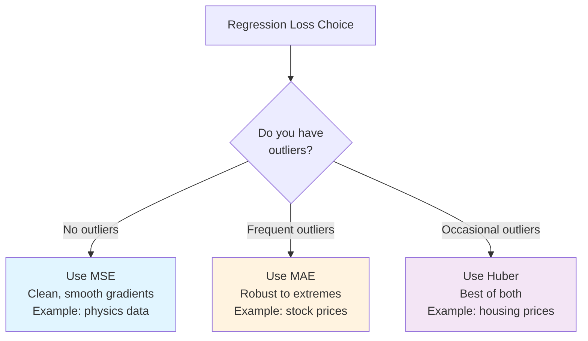
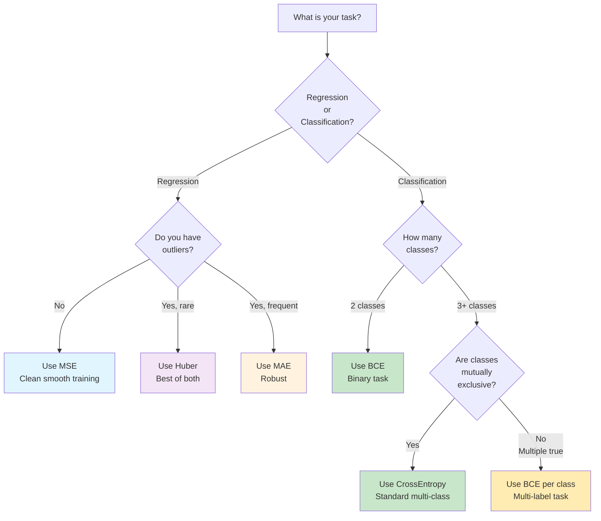

# Loss functions in deep learning

The three projects ([Notes 11-13](12-handwritten-digit-classification-with-an-ann-in-pytorch.md)) each used a different loss function. This note formalizes why each was chosen, derives their gradients, and explains the mathematical properties that determine their behavior during training.

**Critical insight**: The loss function is the objective you're optimizing. Choose the wrong loss, and you're training for the wrong goal.

## Continuity guide

**From**: [Note 10 — Forward Propagation](10-forward-propagation-and-how-a-neural-network-predicts.md) (network makes a prediction)

**In this note**: **Loss functions** — how to measure if a prediction is correct

**Next**: [Note 15 — Backpropagation](15-backpropagation-part-1-what-backpropagation-is.md) (how to minimize the loss) → [Notes 16-17](16-backpropagation-part-2-how-backpropagation-works.md) (mathematical details)

**Why this matters**: You must understand loss before backprop. Backprop computes $\frac{\partial \ell}{\partial \theta}$ — the derivative of *this* loss function.

## One-line definition

A loss function maps the network's prediction and the ground-truth label to a single non-negative scalar that training minimizes.


*Source: [Wikimedia Commons — Artificial neural network](https://commons.wikimedia.org/wiki/File:Artificial_neural_network.svg) (CC BY-SA 4.0)*

## Why this topic matters

The loss function is the objective the optimizer minimizes. Choosing the wrong loss leads to training a model for the wrong goal:
- **MSE for classification**: Suppresses logit magnitudes; doesn't penalize confident wrong predictions
- **CrossEntropy for regression**: Undefined (expects categorical targets)
- **Wrong activation-loss pairing**: Nasty gradients, slow convergence

Understanding loss functions illuminates:
1. **Why certain pairs are standard** (sigmoid + BCE, softmax + CE)
2. **How gradient magnitude changes** with different losses
3. **Why numerically stable implementations matter** (overflow, underflow)
4. **When to use each loss** (task, data distribution, and goals)

## The universal structure

For a dataset of $N$ samples, the training loss is always:

$$
\mathcal{L} = \frac{1}{N}\sum_{i=1}^{N}\ell(\hat{y}_i, y_i)
$$

where $\ell$ is the per-sample loss. Backpropagation differentiates through $\mathcal{L}$ to obtain $\frac{\partial \mathcal{L}}{\partial \theta}$.

## Regression losses

### Mean Squared Error (MSE / L2 loss)

$$
\ell_{\text{MSE}}(\hat{y}, y) = (\hat{y} - y)^2
$$

$$
\mathcal{L}_{\text{MSE}} = \frac{1}{N}\sum_{i=1}^{N}(\hat{y}_i - y_i)^2
$$

Gradient with respect to the prediction:

$$
\frac{\partial \ell_{\text{MSE}}}{\partial \hat{y}} = 2(\hat{y} - y)
$$

**Intuition**: Penalty grows quadratically with error. A 2× larger error = 4× larger loss. This emphasizes large errors.

**Properties**: 
- ✓ Smooth everywhere; differentiable everywhere
- ✓ Gradient is proportional to error (signals "how wrong" clearly)
- ✗ Quadratic penalty means large errors dominate training
- ✗ Can cause large gradient updates near outliers → unstable training

**Gradient behavior**:
- Small error (0.1): gradient = 0.2
- Medium error (1.0): gradient = 2.0
- Large error (10.0): gradient = 20.0

The gradient grows linearly with error → a single outlier can cause massive weight updates.

**Use when**: 
- Errors are roughly Gaussian-distributed
- Outliers are rare and acceptable
- You want smooth, differentiable training

**Not for**:
- Data with frequent large outliers (stock price jumps)
- Safety-critical systems (you can't ignore 10× prediction errors)

### Mean Absolute Error (MAE / L1 loss)

$$
\ell_{\text{MAE}}(\hat{y}, y) = |\hat{y} - y|
$$

Gradient:

$$
\frac{\partial \ell_{\text{MAE}}}{\partial \hat{y}} = \text{sign}(\hat{y} - y) \in \{-1, 0, +1\}
$$

**Intuition**: Penalty grows **linearly** with error. A 10× larger error = 10× larger loss (not 100×). This treats all errors proportionally.

**Properties**: 
- ✓ Robust to outliers (gradient is always ±1, even for extreme errors)
- ✓ Constant gradient magnitude (stable training, even with outliers)
- ✗ Non-differentiable at zero (|0| has undefined gradient)
- ✗ Gradient is constant → no smooth "signal strength" (either -1 or +1)

**Gradient behavior**:
- Small error (0.1): gradient = -1
- Medium error (1.0): gradient = -1
- Large error (10.0): gradient = -1

The gradient is always ±1 → each error contributes equally to learning, regardless of magnitude.

**Use when**: 
- Data has outliers/heavy tails (stock prices, house prices with market crashes)
- You want to treat all errors equally
- Outliers shouldn't dominate training

**Not for**:
- Tasks where you need smooth gradients (difficult to converge)
- Well-behaved data without outliers (MSE is simpler)

### Huber Loss (Smooth L1)

$$
\ell_{\delta}(\hat{y}, y) = \begin{cases}
\frac{1}{2}(\hat{y} - y)^2 & \text{if } |\hat{y} - y| \leq \delta \\
\delta\left(|\hat{y} - y| - \frac{\delta}{2}\right) & \text{otherwise}
\end{cases}
$$

**Intuition**: "Best of both worlds" — quadratic (smooth) for small errors, linear (outlier-robust) for large errors.

**Behavior**:
- **If error < δ**: Use MSE-like quadratic penalty (smooth gradients for fine-tuning)
- **If error ≥ δ**: Switch to MAE-like linear penalty (outliers don't explode)

**Properties**: 
- ✓ Smooth and differentiable everywhere
- ✓ Quadratic near optimum (fine gradients for convergence)
- ✓ Linear for outliers (prevents outlier explosion)
- ✓ Single hyperparameter δ (default: 1.0) controls the crossover

**Gradient behavior**:
- Small error (0.1, δ=1): gradient = 0.1 (like MSE, smooth)
- Medium error (1.0, δ=1): gradient ≈ 1.0 (transition)
- Large error (10.0, δ=1): gradient = 1.0 (capped, like MAE)

**Example**: For δ=1, loss transitions from quadratic to linear at error=1.

**Use when**: 
- Data has **occasional outliers** (not frequent, not dominant)
- You want smooth training **and** outlier robustness
- Example: Boston housing (prices mostly stable, rare market crashes)

**Not for**:
- Clean data without outliers (MSE is simpler)
- Frequent/dominant outliers (MAE is better)

## Loss Function Comparison: Regression



## Classification losses

### Binary Cross-Entropy (BCE)

For binary classification where $y \in \{0, 1\}$ and $\hat{p} = \sigma(z)$:

$$
\ell_{\text{BCE}}(\hat{p}, y) = -\left[y\log(\hat{p}) + (1-y)\log(1-\hat{p})\right]
$$

Written in terms of the raw logit $z$:

$$
\ell_{\text{BCE}}(z, y) = -\left[yz - \log(1 + e^z)\right]
$$

Gradient with respect to $z$ (for sigmoid activation):

$$
\frac{\partial \ell_{\text{BCE}}}{\partial z} = \sigma(z) - y = \hat{p} - y
$$

**Intuition**: BCE penalizes confident wrong predictions **exponentially**. 

- Predict 0.9 when truth is 0: loss = $-\log(0.1) \approx 2.3$ (huge penalty)
- Predict 0.5 when truth is 0: loss = $-\log(0.5) \approx 0.7$ (moderate penalty)
- Predict 0.1 when truth is 0: loss = $-\log(0.9) \approx 0.1$ (small penalty)

**Properties**: 
- ✓ Gradient is zero when $\hat{p} = y$ (correct prediction)
- ✓ Exponential penalty for confident wrong predictions
- ✓ Elegant simplification: $\sigma(z) - y$ (elegant gradient!)
- ✓ Works naturally with sigmoid activation

**The magical pair**: Sigmoid + BCE give $\frac{\partial \ell}{\partial z} = \hat{p} - y$ — a clean, interpretable gradient. This is not coincidence; it's by design.

**Use when**: 
- Binary classification (yes/no, positive/negative)
- Example: spam detection, cancer prediction

**Critical**: Always use `BCEWithLogitsLoss` (takes raw logits), not `BCELoss` (takes probabilities). The numerically stable version subtracts $\max(z)$ to prevent overflow.

### Cross-Entropy Loss for Multi-Class Classification

For $C$-class classification with one-hot target $y$ and logit vector $z \in \mathbb{R}^C$:

$$
\hat{p}_j = \frac{e^{z_j}}{\sum_{k=1}^{C}e^{z_k}} \quad \text{(softmax)}
$$

$$
\ell_{\text{CE}}(z, y) = -\sum_{j=1}^{C} y_j \log(\hat{p}_j) = -\log(\hat{p}_{y^*})
$$

where $y^*$ is the index of the true class. Since only one $y_j = 1$, this reduces to: **just penalize the probability of the true class**.

Gradient with respect to logit $z_j$:

$$
\frac{\partial \ell_{\text{CE}}}{\partial z_j} = \hat{p}_j - y_j
$$

**Interpretation**:
- For the **true class**: $\frac{\partial \ell}{\partial z_{y^*}} = \hat{p}_{y^*} - 1$ (negative if $\hat{p}_{y^*} < 1$, meaning "increase this logit")
- For **other classes**: $\frac{\partial \ell}{\partial z_j} = \hat{p}_j$ (positive, meaning "decrease these logits")

**Intuition**: When you predict class 0 when truth is class 2:
- Class 0 gradient: $0.4 - 0 = 0.4$ (decrease logit for class 0)
- Class 1 gradient: $0.3 - 0 = 0.3$ (decrease logit for class 1)  
- Class 2 gradient: $0.3 - 1 = -0.7$ (increase logit for class 2)

**Properties**:
- ✓ Softmax + CE give clean gradients: $\hat{p}_j - y_j$
- ✓ Natural for multi-class problems (one true class)
- ✓ Exponential penalty for confident wrong predictions (via softmax)

**Use when**: 
- Multi-class classification with **mutually exclusive classes** (one true label per sample)
- Example: MNIST (digit is one of 0-9), ImageNet (image is one class)
- Example: spam/ham/promotions (email is one category)

### Negative Log-Likelihood (NLL)

$$
\ell_{\text{NLL}}(\log \hat{p}, y) = -\log \hat{p}_{y^*}
$$

NLL takes **log-probabilities** as input, not raw logits. PyTorch's `NLLLoss` expects the output of `LogSoftmax`. The relationship:

$$
\text{CrossEntropyLoss}(z, y) = \text{NLLLoss}(\text{LogSoftmax}(z), y)
$$

**Use when**: You have a model that explicitly computes log-probabilities (e.g., language models, VAEs).

## Numerical stability: why not apply softmax before CrossEntropyLoss

Naive computation of $\log(\text{softmax}(z))$:

$$
\log\left(\frac{e^{z_j}}{\sum_k e^{z_k}}\right) = z_j - \log\sum_k e^{z_k}
$$

If $z_j$ is large, $e^{z_j}$ overflows. PyTorch uses the log-sum-exp trick:

$$
\log\sum_k e^{z_k} = m + \log\sum_k e^{z_k - m}, \quad m = \max_k z_k
$$

Subtracting $m$ before exponentiation prevents overflow. `CrossEntropyLoss` implements this internally.

## Loss Function Quick Reference

| Loss | Best For | Input | Gradient Structure | Outlier Robust? | Training Speed |
|------|----------|-------|---|---|---|
| **MSE** | Regression, clean data | Raw predictions | Linear in error (2·error) | ✗ No | Fast (smooth) |
| **MAE** | Regression, outliers | Raw predictions | Constant (±1) | ✓ Yes | Slower (constant grad) |
| **Huber** | Regression, occasional outliers | Raw predictions | Quadratic then linear | ✓ Medium | Fast (smooth near optimum) |
| **BCE** | Binary classification | Raw logits | $\hat{p} - y$ (clean!) | — | Very fast (smooth) |
| **CrossEntropy** | Multi-class classification | Raw logits | $\hat{p}_j - y_j$ (clean!) | — | Very fast (smooth) |
| **NLL** | Classification (explicit log-probs) | Log-probabilities | Requires custom grad | — | Depends |

## Decision Tree: Which Loss to Use



## PyTorch example

```python
import torch
import torch.nn as nn
import torch.nn.functional as F

# ── Regression losses ─────────────────────────────────────────────────────────
preds   = torch.tensor([2.5, 0.0, 2.0, 8.0])
targets = torch.tensor([3.0, 0.0, 2.0, 0.5])  # one outlier at index 3

mse  = F.mse_loss(preds, targets)          # (0.25 + 0 + 0 + 56.25) / 4
mae  = F.l1_loss(preds, targets)           # (0.5  + 0 + 0 + 7.5)  / 4
huber = F.huber_loss(preds, targets, delta=1.0)

print(f"MSE  = {mse:.4f}")     # 14.1250  (dominated by outlier)
print(f"MAE  = {mae:.4f}")     # 2.0000   (linear, less dominated)
print(f"Huber= {huber:.4f}")   # intermediate

# ── Binary cross-entropy ──────────────────────────────────────────────────────
logits  = torch.tensor([[2.1], [-1.5], [0.3]])     # raw logits
targets_bin = torch.tensor([[1.0], [0.0], [1.0]])  # binary targets
bce = F.binary_cross_entropy_with_logits(logits, targets_bin)
print(f"BCE  = {bce:.4f}")

# ── Multi-class cross-entropy ─────────────────────────────────────────────────
logits_mc = torch.tensor([
    [2.0, 1.0, 0.1],   # sample 0: high logit for class 0
    [0.1, 3.0, 0.2],   # sample 1: high logit for class 1
])
labels_mc = torch.tensor([0, 1])           # true class indices
ce = F.cross_entropy(logits_mc, labels_mc)
print(f"CE   = {ce:.4f}")

# ── NLL loss (requires log-softmax input) ─────────────────────────────────────
log_probs = F.log_softmax(logits_mc, dim=1)
nll = F.nll_loss(log_probs, labels_mc)
print(f"NLL  = {nll:.4f}")     # identical to CE above
```

## Worked numerical example: BCE gradient

Let $z = 1.2$, $y = 1$. Then:

$$
\hat{p} = \sigma(1.2) = \frac{1}{1 + e^{-1.2}} \approx 0.769
$$

$$
\ell_{\text{BCE}} = -(1 \cdot \log(0.769) + 0 \cdot \log(0.231)) = -\log(0.769) \approx 0.263
$$

$$
\frac{\partial \ell_{\text{BCE}}}{\partial z} = \hat{p} - y = 0.769 - 1.0 = -0.231
$$

The negative gradient tells the optimizer: increase $z$ (i.e., become more confident that the label is 1).

## Interview questions

<details>
<summary>Why does sigmoid + BCE give such a clean gradient formula?</summary>

The sigmoid derivative is $\sigma'(z) = \sigma(z)(1 - \sigma(z))$, and the BCE derivative with respect to the probability is $\frac{\partial \ell}{\partial \hat{p}} = -\frac{y}{\hat{p}} + \frac{1-y}{1-\hat{p}}$. Multiplying via the chain rule yields $\frac{\partial \ell}{\partial z} = \hat{p} - y$, a beautifully simple expression.
</details>

<details>
<summary>What happens if you use MSE for binary classification?</summary>

MSE treats the output as a continuous target in [0, 1], but the gradients near decision boundaries are very small (the MSE gradient is linear in error while CE gradients grow for confident wrong predictions). MSE also doesn't encode the probabilistic interpretation. The result is slower convergence and often worse performance.
</details>

<details>
<summary>What is the difference between CrossEntropyLoss and NLLLoss in PyTorch?</summary>

`NLLLoss` expects log-probabilities as input (output of `LogSoftmax`). `CrossEntropyLoss` expects raw logits and applies `log_softmax` internally with numerical stability tricks. They are mathematically equivalent but `CrossEntropyLoss` is more numerically stable and more convenient.
</details>

<details>
<summary>When is Huber loss preferable to MSE or MAE?</summary>

When the dataset has occasional outliers but you still want smooth gradients near the optimum. MSE is dominated by outliers; MAE has gradient discontinuity at zero. Huber is smooth everywhere and is linear for large errors, providing outlier robustness without sacrificing gradient smoothness.
</details>

<details>
<summary>Why can't you use cross-entropy for multi-label classification?</summary>

Cross-entropy with softmax assumes exactly one correct class (mutually exclusive). Multi-label classification allows multiple correct labels per sample. Use independent sigmoid outputs with `BCEWithLogitsLoss` for each label, applied independently.
</details>

<details>
<summary>What does "numerically stable" mean in the context of loss functions?</summary>

It means computing the loss in a way that avoids floating-point overflow or underflow. For example, `log(softmax(z))` can overflow because `exp(z)` grows unboundedly. The log-sum-exp trick subtracts the maximum logit before exponentiation, keeping values in a numerically safe range while producing the same result mathematically.
</details>

## Common mistakes

- Applying sigmoid inside the model AND using `BCEWithLogitsLoss` (double sigmoid corrupts training)
- Using `CrossEntropyLoss` for multi-label classification (wrong model — each class needs an independent sigmoid)
- Passing one-hot encoded labels to `CrossEntropyLoss` (it expects integer class indices)
- Using MSE for classification and wondering why the model converges slowly
- Forgetting that `NLLLoss` expects log-probabilities, not probabilities or logits
- Ignoring the loss gradient properties when debugging — MSE gradient is 0 at the minimum, but BCE can be 0 even when prediction is wrong if the network is very confident

## Advanced perspective

Loss functions have probabilistic interpretations through the maximum likelihood principle. MSE is the maximum likelihood estimator under a Gaussian noise assumption: $p(y \mid x, \theta) = \mathcal{N}(\hat{y}, \sigma^2)$. BCE is the maximum likelihood estimator under a Bernoulli model. Cross-entropy is the maximum likelihood estimator under a categorical model. This unification means every loss function implicitly assumes a noise model for the data, and choosing the loss is equivalent to choosing that noise model.

For imbalanced classification, `BCEWithLogitsLoss` accepts a `pos_weight` parameter that scales the gradient for positive samples: $\ell = -[w \cdot y \log\hat{p} + (1-y)\log(1-\hat{p})]$. Setting `pos_weight = N_neg / N_pos` rebalances the loss to treat each class equally.

## Final takeaway

The loss function defines what "wrong" means to the optimizer. MSE and its variants assume Gaussian-like errors; BCE and cross-entropy assume categorical distributions. The numerically stable PyTorch implementations (`BCEWithLogitsLoss`, `CrossEntropyLoss`) always accept raw logits and must not receive pre-activated outputs.

## References

- PyTorch documentation: torch.nn loss functions
- CampusX YouTube: Loss Functions in Deep Learning
- Goodfellow et al. (2016): Deep Learning, Chapter 6
