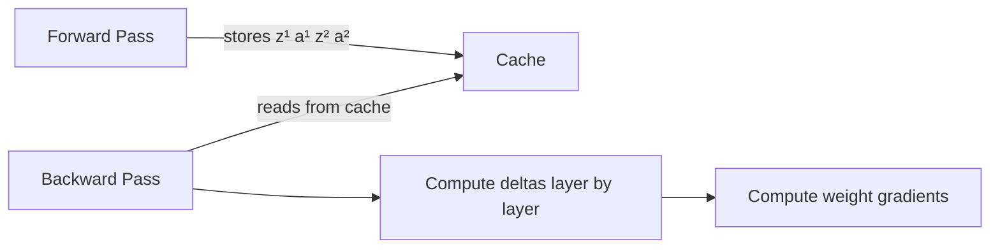

# Backpropagation part 2: how backpropagation works

Part 1 (note 15) explained *what* backpropagation is: the efficient algorithm for computing how much each parameter contributed to the loss. This note shows *how* it works in detail — the exact equations, the delta (error signal) notation, and a full worked example for a two-layer network.

## One-line definition

Backpropagation computes gradients layer by layer from output to input, using the delta (error signal) to carry blame backward and the stored forward-pass activations to compute the actual gradient for each weight matrix.

## The setup: notation for an L-layer network

For layer $l$ ($l = 1, \ldots, L$):

$$
z^{(l)} = W^{(l)} a^{(l-1)} + b^{(l)}
$$

$$
a^{(l)} = \phi(z^{(l)})
$$

where $a^{(0)} = x$ is the input and $a^{(L)} = \hat{y}$ is the output. $\phi$ is the activation function.

## The delta (error signal)

Define the **delta** for layer $l$ as the gradient of the loss with respect to the pre-activation:

$$
\delta^{(l)} = \frac{\partial \mathcal{L}}{\partial z^{(l)}}
$$

This is the "blame" assigned to each neuron before its activation: how much does the loss change if this pre-activation changes?


*Source: [Wikimedia Commons — Artificial Neural Network](https://commons.wikimedia.org/wiki/File:Artificial_neural_network.svg) (CC BY-SA 4.0)*

## The four backpropagation equations

These four equations are the complete algorithm:

**Equation 1** — Output layer delta (binary classification with sigmoid + BCE):

$$
\delta^{(L)} = a^{(L)} - y
$$

This beautiful simplification comes from the cancellation when differentiating BCE loss through sigmoid.

**Equation 2** — Hidden layer delta (propagate backward):

$$
\delta^{(l)} = \left( (W^{(l+1)})^T \delta^{(l+1)} \right) \odot \phi'(z^{(l)})
$$

The transpose of the next layer's weight matrix routes the upstream delta back; $\odot$ is element-wise multiplication by the local activation derivative.

**Equation 3** — Gradient for weight matrix:

$$
\frac{\partial \mathcal{L}}{\partial W^{(l)}} = \delta^{(l)} (a^{(l-1)})^T
$$

**Equation 4** — Gradient for bias:

$$
\frac{\partial \mathcal{L}}{\partial b^{(l)}} = \delta^{(l)}
$$

## Complete worked example: 2-layer network

Architecture: $x \in \mathbb{R}^2 \to$ hidden layer (2 units, ReLU) $\to$ output (1 unit, sigmoid) $\to$ loss (BCE).

**Forward pass** (stored for backward):

$$
z^{(1)} = W^{(1)} x + b^{(1)}, \quad a^{(1)} = \text{ReLU}(z^{(1)})
$$

$$
z^{(2)} = W^{(2)} a^{(1)} + b^{(2)}, \quad a^{(2)} = \sigma(z^{(2)})
$$

$$
\mathcal{L} = -\left[ y \log a^{(2)} + (1-y)\log(1-a^{(2)}) \right]
$$

**Backward pass**:

Step 1 — Output delta (using Equation 1):

$$
\delta^{(2)} = a^{(2)} - y
$$

Step 2 — Gradients for layer 2 (using Equations 3 and 4):

$$
\frac{\partial \mathcal{L}}{\partial W^{(2)}} = \delta^{(2)} (a^{(1)})^T, \qquad \frac{\partial \mathcal{L}}{\partial b^{(2)}} = \delta^{(2)}
$$

Step 3 — Hidden layer delta (using Equation 2):

$$
\delta^{(1)} = \left( (W^{(2)})^T \delta^{(2)} \right) \odot \text{ReLU}'(z^{(1)})
$$

where $\text{ReLU}'(z^{(1)})_i = \mathbf{1}[z^{(1)}_i > 0]$ (1 for positive pre-activations, 0 for negative).

Step 4 — Gradients for layer 1:

$$
\frac{\partial \mathcal{L}}{\partial W^{(1)}} = \delta^{(1)} x^T, \qquad \frac{\partial \mathcal{L}}{\partial b^{(1)}} = \delta^{(1)}
$$

## The forward cache

The backward pass needs $a^{(l-1)}$ (for weight gradients) and $z^{(l)}$ (for activation derivatives). Both are computed during the forward pass and must be stored. This is called the **forward cache**.



The memory cost of training is dominated by the forward cache, not the model parameters. For large models with long sequences, this is a significant constraint.

## PyTorch implementation from scratch

```python
import torch

# Minimal 2-layer network: manual forward + backward
torch.manual_seed(0)
x = torch.tensor([[1.0, 2.0]])   # shape (1, 2)
y = torch.tensor([[1.0]])         # shape (1, 1)

W1 = torch.randn(2, 3, requires_grad=False)
b1 = torch.zeros(1, 3)
W2 = torch.randn(3, 1, requires_grad=False)
b2 = torch.zeros(1, 1)
lr = 0.01

# Forward pass — store z1, a1, z2, a2
z1 = x @ W1 + b1                        # (1, 3)
a1 = torch.relu(z1)                      # (1, 3)
z2 = a1 @ W2 + b2                        # (1, 1)
a2 = torch.sigmoid(z2)                   # (1, 1)

# Loss (BCE)
eps = 1e-8
loss = -(y * torch.log(a2 + eps) + (1-y) * torch.log(1-a2 + eps))

# Backward pass — Equations 1-4
delta2 = a2 - y                          # (1, 1)  — Eq. 1
dW2 = a1.T @ delta2                      # (3, 1)  — Eq. 3
db2 = delta2.sum(dim=0)                  # (1,)    — Eq. 4

delta1 = (delta2 @ W2.T) * (z1 > 0).float()  # (1, 3) — Eq. 2
dW1 = x.T @ delta1                       # (2, 3)  — Eq. 3
db1 = delta1.sum(dim=0)                  # (1,)    — Eq. 4

# Parameter update
W2 -= lr * dW2
b2 -= lr * db2
W1 -= lr * dW1
b1 -= lr * db1

print("Loss:", loss.item())
```

## Interview questions

<details>
<summary>What is the delta in backpropagation and what does it represent?</summary>

The delta δ^(l) = ∂L/∂z^(l) is the gradient of the loss with respect to the pre-activation at layer l. It represents how much the loss changes if the pre-activation of each neuron in that layer changes slightly — the "blame" assigned to each neuron before its nonlinearity. It is the key intermediate quantity that flows backward through the network.
</details>

<details>
<summary>Why does the output delta simplify to a² - y for sigmoid + BCE?</summary>

The sigmoid derivative is σ'(z) = σ(z)(1-σ(z)). The derivative of BCE loss ∂L/∂a = -(y/a - (1-y)/(1-a)). Multiplying these: δ^(L) = ∂L/∂a · ∂a/∂z = -(y/a - (1-y)/(1-a)) · a(1-a) = -(y(1-a) - (1-y)a) = a - y. This elegant cancellation is why sigmoid + BCE is a standard pairing.
</details>

<details>
<summary>Why does the hidden layer delta multiply by (W^(l+1))^T?</summary>

The weight matrix W^(l+1) connects layer l activations to layer l+1 pre-activations: z^(l+1) = W^(l+1) a^(l). When propagating ∂L/∂a^(l), we need the transpose W^(l+1)^T because we are going backward: the gradient of z^(l+1) w.r.t. a^(l) is W^(l+1), so by the chain rule, the gradient flows back as (W^(l+1))^T δ^(l+1).
</details>

<details>
<summary>What information from the forward pass does the backward pass require?</summary>

The backward pass needs: (1) all pre-activations z^(l) — to compute the activation derivatives φ'(z^(l)) in Equation 2; (2) all post-activations a^(l) — to compute weight gradients in Equation 3. Both are produced and cached during the forward pass.
</details>

## Common mistakes

- Forgetting to include the activation derivative $\phi'(z^{(l)})$ in the hidden layer delta (Equation 2) — this is the most common backprop derivation error.
- Confusing $a^{(l-1)}$ (activation from previous layer) with $z^{(l)}$ (pre-activation of current layer) when computing weight gradients.
- Not transposing: $\partial \mathcal{L}/\partial W^{(l)} = \delta^{(l)} (a^{(l-1)})^T$, not $\delta^{(l)} a^{(l-1)}$.
- Treating the output delta formula $\delta^{(L)} = a^{(L)} - y$ as universal — it only holds for sigmoid + BCE. Other loss/activation combinations have different output deltas.

## Advanced perspective

Backpropagation is reverse-mode automatic differentiation applied to the computational graph of a neural network. The "reverse mode" terminology refers to propagating the scalar loss gradient backward through the graph — which is efficient when outputs are scalar (as loss functions are). Forward-mode autodiff is more efficient for computing Jacobians when inputs are scalar, but for deep learning (millions of parameters, one scalar output) reverse mode is the right choice by a factor of millions.

## Final takeaway

Backpropagation reduces to four equations applied repeatedly from output to input: output delta, hidden delta, weight gradient, bias gradient. The only information needed is the forward cache of activations and pre-activations. Everything else follows from the chain rule.

## References

- Rumelhart, D., Hinton, G., & Williams, R. (1986). Learning representations by back-propagating errors. Nature.
- Nielsen, M. (2015). Neural Networks and Deep Learning, Chapter 2.
