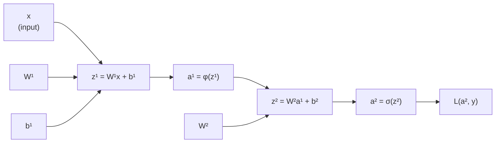

# Backpropagation part 3: why backpropagation works

Parts 1 and 2 showed what backpropagation is and how to compute it mechanically. This note addresses the deeper question: *why* does it work? Why does the chain rule applied recursively give us exactly what we need, and why is backpropagation the computationally efficient way to do it?

## One-line definition

Backpropagation works because a neural network is a composition of differentiable functions, and the chain rule gives us the exact relationship between the loss gradient and every upstream parameter — with the efficiency coming from reusing intermediate computations in reverse order.

## The chain rule: the mathematical core

For a composition of functions $y = f(g(x))$:

$$
\frac{dy}{dx} = \frac{dy}{dg} \cdot \frac{dg}{dx}
$$

For a deeper composition $y = f_L(f_{L-1}(\cdots f_1(x) \cdots))$:

$$
\frac{dy}{dx} = \frac{\partial f_L}{\partial f_{L-1}} \cdot \frac{\partial f_{L-1}}{\partial f_{L-2}} \cdots \frac{\partial f_1}{\partial x}
$$

A neural network is exactly this: a composition of linear and nonlinear functions. The chain rule is not an approximation — it gives the exact gradient.

## The computational graph perspective

Every operation in a neural network can be represented as a **computational graph** — a directed acyclic graph where nodes are variables/operations and edges represent data flow.

For a 2-layer network:




*Source: [Wikimedia Commons — Artificial Neural Network](https://commons.wikimedia.org/wiki/File:Artificial_neural_network.svg) (CC BY-SA 4.0)*
    B2["b²"] --> Z2
```

The forward pass traverses this graph left to right, computing values. The backward pass traverses right to left, computing derivatives. At each node, the local derivative is multiplied by the upstream gradient coming from the right.

## Why the backward pass is efficient: avoiding repeated computation

Naïve approach: for each parameter $\theta_i$, compute $\partial \mathcal{L} / \partial \theta_i$ from scratch. For $n$ parameters, this requires $n$ forward passes. For a network with $10^9$ parameters, this is completely infeasible.

**The key insight of backpropagation**: the gradient computation for earlier parameters shares intermediate results with later parameters.

Consider layers $1, 2, 3$ of a network. To compute $\partial \mathcal{L}/\partial W^{(1)}$, we need:

$$
\frac{\partial \mathcal{L}}{\partial W^{(1)}} = \frac{\partial \mathcal{L}}{\partial z^{(3)}} \cdot \frac{\partial z^{(3)}}{\partial a^{(2)}} \cdot \frac{\partial a^{(2)}}{\partial z^{(2)}} \cdot \frac{\partial z^{(2)}}{\partial a^{(1)}} \cdot \frac{\partial a^{(1)}}{\partial z^{(1)}} \cdot \frac{\partial z^{(1)}}{\partial W^{(1)}}
$$

But we also need $\partial \mathcal{L}/\partial W^{(2)}$:

$$
\frac{\partial \mathcal{L}}{\partial W^{(2)}} = \frac{\partial \mathcal{L}}{\partial z^{(3)}} \cdot \frac{\partial z^{(3)}}{\partial a^{(2)}} \cdot \frac{\partial a^{(2)}}{\partial z^{(2)}} \cdot \frac{\partial z^{(2)}}{\partial W^{(2)}}
$$

The prefix $\frac{\partial \mathcal{L}}{\partial z^{(3)}} \cdot \frac{\partial z^{(3)}}{\partial a^{(2)}} \cdot \frac{\partial a^{(2)}}{\partial z^{(2)}}$ is the **same** in both. By computing the backward pass in order from the output layer to the input layer, each partial product (the delta $\delta^{(l)}$) is computed once and reused.

Total cost: one forward pass + one backward pass ≈ **2× the cost of a single forward pass** for all gradients simultaneously.

## Reverse-mode vs forward-mode autodiff

**Forward-mode** computes $\frac{\partial y_i}{\partial x_j}$ for one input $x_j$ at a time. Efficient when inputs are few.

**Reverse-mode** computes $\frac{\partial y_i}{\partial x_j}$ for one output $y_i$ at a time. Efficient when outputs are few.

Neural networks have:
- Many inputs: $n$ parameters (millions to billions)
- One output: scalar loss $\mathcal{L}$

So reverse-mode autodiff (backpropagation) is the right choice. It computes $\nabla_\theta \mathcal{L}$ — the gradient of one scalar with respect to millions of parameters — in one backward pass.

## Local gradient + upstream gradient = backward message

At every node in the computational graph:

$$
\text{gradient passing backward} = \text{local derivative} \times \text{gradient coming from output}
$$

Concretely, for any intermediate variable $v$ that was computed as $v = f(u)$:

$$
\frac{\partial \mathcal{L}}{\partial u} = \frac{\partial \mathcal{L}}{\partial v} \cdot \frac{\partial v}{\partial u} = \underbrace{\frac{\partial \mathcal{L}}{\partial v}}_{\text{upstream (given)}} \cdot \underbrace{\frac{\partial v}{\partial u}}_{\text{local}}
$$

The upstream gradient $\partial \mathcal{L}/\partial v$ arrives from the output side. The local gradient $\partial v / \partial u$ is computed from the forward-pass operation at this node. No global information is needed — only local derivatives and the upstream message.

## Analogy: the assembly line

Imagine a factory where workers stand in a line, each doing one operation. At the end, a quality inspector reports a final score. To find out which worker most affected the score:

- Without backprop: ask each worker independently, running the whole line again each time ($n$ times total)
- With backprop: the inspector passes a "blame" note backward, each worker reads the note, writes their local contribution, and passes the updated note further back. One pass backward gives everyone's contribution.

## PyTorch autograd demonstration

```python
import torch

# Build a computational graph by recording operations
x = torch.tensor([[1.0, 2.0]])
W1 = torch.randn(2, 3, requires_grad=True)
b1 = torch.zeros(1, 3, requires_grad=True)
W2 = torch.randn(3, 1, requires_grad=True)
b2 = torch.zeros(1, 1, requires_grad=True)
y = torch.tensor([[1.0]])

# Forward pass — builds computational graph
z1 = x @ W1 + b1
a1 = torch.relu(z1)
z2 = a1 @ W2 + b2
a2 = torch.sigmoid(z2)
loss = torch.nn.functional.binary_cross_entropy(a2, y)

print("Computational graph leaf:", W1.is_leaf)          # True
print("Graph node (not leaf):", z1.is_leaf)              # False
print("Gradient function:", z1.grad_fn)                  # AddmmBackward

# Backward pass — reverse-mode autodiff
loss.backward()

# All gradients computed in one pass
print("dL/dW1:", W1.grad.shape)  # (2, 3)
print("dL/dW2:", W2.grad.shape)  # (3, 1)
```

## Why differentiable operations are essential

Backpropagation requires every operation to be differentiable (or at least subgradient-available). This is why:
- Activations moved from step functions (non-differentiable) to sigmoid, tanh, ReLU
- Loss functions are designed to be smooth
- Any custom operation in PyTorch needs a `.backward()` implementation

## Interview questions

<details>
<summary>Why is reverse-mode autodiff more efficient than forward-mode for training neural networks?</summary>

Reverse-mode computes the gradient of one output (the scalar loss) with respect to all inputs in a single backward pass. Forward-mode computes the gradient with respect to one input at a time, requiring N forward passes for N parameters. Since neural networks have millions of parameters but one scalar loss, reverse-mode is O(1) backward passes vs O(N) forward passes — a factor of N improvement.
</details>

<details>
<summary>What is the role of the computational graph in backpropagation?</summary>

The computational graph records the sequence of operations in the forward pass, tracking which variable depends on which. During the backward pass, PyTorch traverses this graph in reverse, computing gradients at each node using the chain rule. Without the graph, we would not know which upstream gradients to multiply at each step.
</details>

<details>
<summary>What does it mean for an operation to be differentiable in the context of backprop?</summary>

A differentiable operation can provide a local gradient: given an upstream gradient ∂L/∂output, it can compute the downstream gradient ∂L/∂input = ∂L/∂output · ∂output/∂input. Every layer in a neural network must support this local backward computation. Non-differentiable operations (argmax, step function) break the gradient flow unless replaced with smooth approximations.
</details>

<details>
<summary>What does backpropagation share between gradient computations that makes it efficient?</summary>

The delta δ^(l) = ∂L/∂z^(l) computed for layer l is reused in computing gradients for all layers below l. Without reuse, computing the gradient for layer 1 would require re-deriving all the chain rule products from L down to 1. With backpropagation, deltas computed in order from L to 1 each get reused by the next layer — total work is proportional to the forward pass, not to the number of parameters.
</details>

## Common mistakes

- Thinking backpropagation is an approximation — it is the exact gradient, not an estimate.
- Confusing backpropagation (gradient computation) with gradient descent (parameter update) — they are distinct steps.
- Assuming PyTorch's `autograd` is different from backpropagation — autograd is reverse-mode autodiff, which is exactly backpropagation generalized to arbitrary computational graphs.
- Calling `.backward()` twice without clearing gradients — PyTorch accumulates gradients by default (`grad += new_grad`), so `.zero_grad()` is needed before each backward pass.

## Advanced perspective

Backpropagation generalizes naturally to any directed acyclic computational graph, not just layered feedforward networks. This is why PyTorch's autograd can handle arbitrary Python code as long as it uses differentiable PyTorch operations. The broader framework is called automatic differentiation (autodiff). In research contexts, higher-order gradients (Jacobians, Hessians) can be computed by applying autograd to the output of a first backward pass — this is how second-order optimization methods and meta-learning algorithms (like MAML) are implemented.

## Final takeaway

Backpropagation works because the chain rule allows exact gradient computation by factoring the end-to-end derivative into a product of local derivatives. The efficiency comes from computing the chain right-to-left, reusing intermediate results (deltas) rather than recomputing the full chain for each parameter. This is reverse-mode autodiff, and it is why training neural networks with millions of parameters is computationally feasible.

## References

- Rumelhart, D., Hinton, G., & Williams, R. (1986). Learning representations by back-propagating errors.
- Baydin et al. (2018). Automatic Differentiation in Machine Learning: a Survey.
