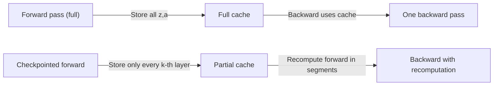

# MLP memoization and caching intermediate values

Backpropagation computes gradients by traversing the network backward. But the backward pass is not self-contained — it needs values computed during the forward pass: the activations $a^{(l)}$ and pre-activations $z^{(l)}$ at every layer. These values must be stored during the forward pass and retrieved during the backward pass. This is the **forward cache** or **activation cache**.

## One-line definition

MLP memoization refers to the practice of caching all intermediate values (pre-activations $z^{(l)}$ and activations $a^{(l)}$) during the forward pass so that the backward pass can compute weight gradients without re-running the forward pass.

## Why this topic matters

Understanding the forward cache is essential for understanding the memory cost of training, why training uses far more memory than inference, and the tradeoff in gradient checkpointing. It also explains why large batch sizes and deep networks strain GPU memory during training.

## What the backward pass needs from the forward pass

Recall the backpropagation equations:

**Weight gradient** (Equation 3):

$$
\frac{\partial \mathcal{L}}{\partial W^{(l)}} = \delta^{(l)} \cdot (a^{(l-1)})^T
$$

This requires $a^{(l-1)}$ — the activation from the previous layer during the forward pass.


*Source: [Wikimedia Commons — Artificial Neural Network](https://commons.wikimedia.org/wiki/File:Artificial_neural_network.svg) (CC BY-SA 4.0)*

**Hidden delta** (Equation 2):

$$
\delta^{(l)} = \left((W^{(l+1)})^T \delta^{(l+1)}\right) \odot \phi'(z^{(l)})
$$

This requires $z^{(l)}$ — the pre-activation during the forward pass.

**Both $a^{(l)}$ and $z^{(l)}$ must be cached for every layer $l$.**

## The memory cost of the forward cache

For a batch of size $B$, the activations at layer $l$ have shape $(B, n_l)$ where $n_l$ is the number of units. For an $L$-layer network:

$$
\text{Cache memory} = B \cdot \sum_{l=0}^{L} 2 n_l \cdot \text{bytes\_per\_float}
$$

The factor of 2 accounts for both $z^{(l)}$ and $a^{(l)}$.

For a typical network:
- 3 hidden layers of 512 units
- Batch size 128
- Float32 (4 bytes)

$$
\text{Cache} = 128 \times (3 \times 512 \times 2) \times 4 = 1.57 \text{ MB}
$$

This is modest for a small MLP, but for CNNs with millions of activations or transformers with long sequences, the cache dominates GPU memory. A 1024-token transformer can require several GB just for the activation cache.

## Inference vs training memory

**Inference** (no gradients needed):

```python
with torch.no_grad():
    output = model(x)   # Forward pass only, no cache stored
```

No cache is needed — PyTorch skips storing intermediate values. Memory usage is proportional only to the current layer's activations.

**Training** (gradients required):

```python
output = model(x)       # Forward pass — cache ALL activations
loss = criterion(output, y)
loss.backward()         # Backward pass — reads from cache
```

All intermediate values are stored until `loss.backward()` completes and the cache is freed.

This is why training uses 3–5× more memory than inference.

## PyTorch's automatic caching

PyTorch's autograd builds a computational graph during the forward pass, storing all intermediate tensors needed for the backward pass. This is transparent:

```python
import torch
import torch.nn as nn

model = nn.Sequential(
    nn.Linear(64, 128), nn.ReLU(),
    nn.Linear(128, 64), nn.ReLU(),
    nn.Linear(64, 10)
)

x = torch.randn(32, 64)
# Forward pass: PyTorch automatically caches all intermediate values
output = model(x)

# Check if cache is attached
print("Graph retained:", output.grad_fn is not None)  # True

# After backward, cache can be freed
loss = output.sum()
loss.backward()
# Cache freed here (retain_graph=False by default)
```

## Gradient checkpointing: trading compute for memory

For very deep networks or long sequences, storing the full activation cache may exceed GPU memory. **Gradient checkpointing** recomputes activations during the backward pass instead of storing them:

- **Standard training**: store all activations during forward → read from cache during backward
- **Checkpointing**: store only activations at checkpoint boundaries → recompute activations in each segment during backward



**Memory tradeoff**: With $L$ layers and checkpointing every $k$ layers, memory reduces from $O(L)$ to $O(\sqrt{L})$ with the optimal $k = \sqrt{L}$. The cost is ~33% more compute (one extra forward pass per segment).

```python
import torch.utils.checkpoint as checkpoint

# Use gradient checkpointing for a memory-intensive block
def forward(x):
    return checkpoint.checkpoint(model, x)
```

## Interview questions

<details>
<summary>Why does the backward pass need forward-pass activations?</summary>

The weight gradient is ∂L/∂W^(l) = δ^(l) · (a^(l-1))^T — it requires the activation a^(l-1) from the forward pass. The hidden delta is δ^(l) = (W^(l+1))^T δ^(l+1) ⊙ φ'(z^(l)) — it requires the pre-activation z^(l). Both of these are only available from the forward pass. Without caching them, the backward pass would need to rerun the forward pass for every layer — multiplying training cost by L.
</details>

<details>
<summary>Why does training use much more memory than inference?</summary>

During inference, only the current layer's activations are needed — previous activations can be discarded immediately. During training, all activations must be kept until the backward pass completes, because they are needed for gradient computation. For a deep network, this means keeping activations from all L layers simultaneously. The cache size scales as O(L × batch_size × layer_width), which can easily require several GB for transformers.
</details>

<details>
<summary>What is gradient checkpointing and when should you use it?</summary>

Gradient checkpointing saves only activations at selected checkpoint points instead of all layers. During the backward pass, it recomputes the activations within each segment by rerunning the forward pass. This reduces memory from O(L) to approximately O(√L) at the cost of ~33% extra compute. Use it when GPU memory is the bottleneck and training time is less critical — common for large language models, long-sequence tasks, or very deep CNNs.
</details>

## Common mistakes

- Calling `model.forward(x)` inside `torch.no_grad()` during training — this prevents gradient computation.
- Not calling `optimizer.zero_grad()` before each backward pass — gradients accumulate by default, so the cache builds up across batches.
- Expecting gradient checkpointing to have no performance cost — it recomputes the forward pass for checkpointed segments, so each backward step is slower.

## Advanced perspective

The activation cache is a specific instance of the time-memory tradeoff in dynamic programming. The standard approach (cache everything) is analogous to memoized dynamic programming — maximum reuse at maximum memory. Gradient checkpointing is analogous to selective memoization — recompute some subproblems to save memory. For very deep transformers (GPT-3, GPT-4), the activation cache for long sequences can require terabytes — this is why gradient checkpointing and memory-efficient attention (FlashAttention) are essential for training frontier models.

## Final takeaway

The forward cache is the reason training requires more memory than inference. Every activation and pre-activation must be stored for the backward pass to compute weight gradients. Understanding this tradeoff is essential for debugging out-of-memory errors, choosing batch sizes, and deciding when to apply gradient checkpointing.

## References

- Chen, T., et al. (2016). Training Deep Nets with Sublinear Memory Cost. (Gradient checkpointing paper.)
