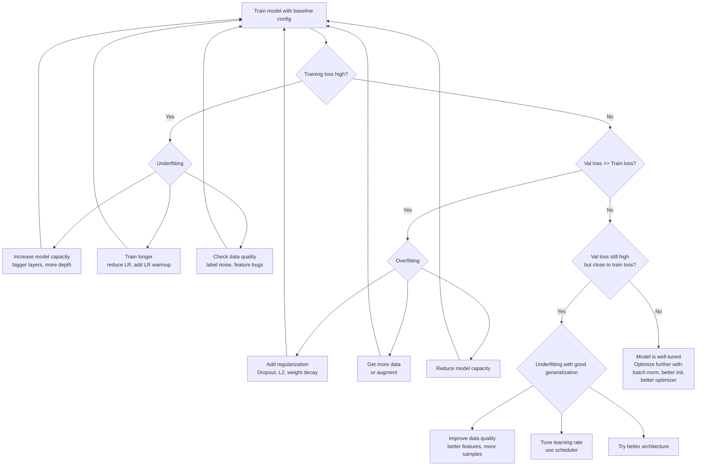

# How to Improve Neural Network Performance

After establishing how gradient descent and mini-batch training work, the natural next question is: my network trains but the results are not good enough — what do I do? This note provides a structured framework for answering that question systematically rather than by random trial and error.

## One-line definition

Improving neural network performance means identifying which bottleneck — data quality, model capacity, learning dynamics, or generalization — limits your current results and applying the right tool to fix it.

## Why this topic matters

Most practitioners waste time applying fixes in the wrong order: adding dropout when the real problem is insufficient data, or enlarging the network when the model is already overfitting. A systematic diagnostic framework saves experiment time and prevents contradictory interventions. The tools covered in the next ten notes (early stopping, scaling, dropout, regularization, activations, initialization, batch norm) are all levers in this same system — understanding their shared framework first makes each individual tool easier to apply correctly.

## The diagnostic hierarchy

Before applying any fix, determine which regime your model is in. The regime dictates which lever to pull first.


*Source: [Wikimedia Commons — Artificial Neural Network](https://commons.wikimedia.org/wiki/File:Artificial_neural_network.svg) (CC BY-SA 4.0)*



## Data quality: the highest-leverage lever

No amount of architectural refinement compensates for corrupted labels, missing features, or distribution mismatch between train and test. Before tuning any hyperparameter:

- Inspect label distributions for class imbalance.
- Check for data leakage (test-set statistics used during preprocessing).
- Verify that your validation split reflects the real deployment distribution.
- Remove or fix outliers that dominate gradient updates.

A rough empirical rule: doubling clean training data improves performance more reliably than any single architectural change.

## Architecture sizing: capacity vs. generalization

The goal is to find a model that is large enough to fit the training data but not so large that it memorizes noise.

**Underfitting signals**: training loss plateaus high, train and validation loss are both high and close together.

**Overfitting signals**: training loss continues decreasing while validation loss stops decreasing or increases.

A practical sizing strategy:

1. Start with a model that clearly overfits (verify you can memorize a tiny subset).
2. Add regularization (dropout, weight decay) until the validation gap closes.
3. Do not start small and scale up — you cannot distinguish underfitting from a poorly-tuned large model.

## Learning rate: the most important hyperparameter

The learning rate controls the step size in parameter space. It interacts with batch size, optimizer, and regularization.

$$
\theta_{t+1} = \theta_t - \eta \cdot \nabla_\theta \mathcal{L}(\theta_t)
$$

Where $\eta$ is the learning rate. Practical guidance:

- **Too high**: loss oscillates or diverges.
- **Too low**: training is slow; the model may get stuck in flat regions.
- **Learning rate finder**: sweep $\eta$ from $10^{-7}$ to $10^{-1}$ over one epoch and plot loss vs. $\eta$; choose $\eta$ just before loss starts rising.
- **Schedulers**: use cosine annealing or `ReduceLROnPlateau` to decay $\eta$ as training progresses.

## Regularization: preventing overfitting

Regularization constrains the effective model capacity without changing the architecture. The main techniques are:

| Technique | Mechanism | When to use |
|---|---|---|
| Dropout | Randomly zero activations during training | Dense layers in MLP, FC in CNNs |
| L2 / Weight decay | Penalize large weights | Almost always; default with AdamW |
| L1 | Penalize absolute weight magnitude | When sparsity is desirable |
| Early stopping | Stop when val loss stops improving | Always |
| Data augmentation | Increase effective training set size | Image, audio, text |
| Batch normalization | Stabilizes layer inputs | Deep networks |

## Normalization: stabilizing gradient flow

When input features or intermediate activations have very different scales, gradients flowing through the network also have very different magnitudes. This causes some weights to update quickly and others to barely move, slowing convergence or causing numerical instability. Batch normalization (applied to intermediate layers) and feature scaling (applied to inputs) both address this.

## PyTorch example

The following shows a complete training skeleton with the key improvement levers in place:

```python
import torch
import torch.nn as nn

# Architecture with dropout and batch normalization
model = nn.Sequential(
    nn.Linear(20, 128),
    nn.BatchNorm1d(128),   # Normalize activations before nonlinearity
    nn.ReLU(),
    nn.Dropout(0.3),       # 30% dropout for regularization
    nn.Linear(128, 64),
    nn.BatchNorm1d(64),
    nn.ReLU(),
    nn.Dropout(0.3),
    nn.Linear(64, 1)
)

# AdamW provides weight decay (L2 regularization) built-in
optimizer = torch.optim.AdamW(model.parameters(), lr=1e-3, weight_decay=1e-4)

# ReduceLROnPlateau decays LR when validation loss stalls
scheduler = torch.optim.lr_scheduler.ReduceLROnPlateau(
    optimizer, mode="min", patience=5, factor=0.5
)

criterion = nn.MSELoss()

best_val_loss = float("inf")
patience_counter = 0
PATIENCE = 10

for epoch in range(200):
    model.train()
    # ... training loop ...
    train_loss = 0.0  # placeholder

    model.eval()
    with torch.no_grad():
        val_loss = 0.0  # placeholder

    scheduler.step(val_loss)

    # Early stopping
    if val_loss < best_val_loss:
        best_val_loss = val_loss
        patience_counter = 0
        torch.save(model.state_dict(), "best_model.pt")
    else:
        patience_counter += 1
        if patience_counter >= PATIENCE:
            print(f"Early stop at epoch {epoch}")
            break

# Restore best checkpoint before evaluation
model.load_state_dict(torch.load("best_model.pt"))
```

## Interview questions

<details>
<summary>What is the first thing you should check when a neural network performs poorly?</summary>

Check which regime the model is in: underfitting (training loss is high) or overfitting (training loss is low but validation loss is high). The interventions are opposite — underfitting requires more capacity or better optimization; overfitting requires regularization or more data. Skipping this diagnosis leads to contradictory interventions.
</details>

<details>
<summary>Why should you verify the model can overfit a small training subset before adding regularization?</summary>

If the model cannot memorize even a tiny batch (e.g., 32 samples), the problem is in the architecture, loss function, or learning rate — not overfitting. Confirming that the model *can* overfit verifies the forward pass, loss, and optimizer are all correct. Only then does regularization make sense.
</details>

<details>
<summary>Why does the learning rate matter more than most other hyperparameters?</summary>

The learning rate directly controls the scale of every parameter update. If it is too large, the optimizer overshoots minima; if too small, convergence is extremely slow or the optimizer gets trapped. It also interacts with batch size: a rule of thumb is to scale $\eta$ linearly with batch size when using SGD.
</details>

<details>
<summary>What is the difference between weight decay and L2 regularization?</summary>

Mathematically they are equivalent with SGD: L2 adds $\lambda \|w\|^2$ to the loss, and the gradient of this term is $2\lambda w$, which is equivalent to decaying weights by $2\lambda$ every step. With adaptive optimizers like Adam, however, they diverge — weight decay applies directly to the parameter update whereas L2 regularization is scaled by the second-moment estimate. AdamW implements true weight decay.
</details>

## Common mistakes

- Tuning multiple hyperparameters simultaneously, making it impossible to attribute changes in performance to any one factor.
- Evaluating the model on the test set during development (this is data leakage; use a separate validation set).
- Computing scaling statistics (mean, std) on the full dataset instead of only on the training split.
- Using a fixed learning rate throughout training when a scheduler would meaningfully improve convergence.
- Adding regularization before verifying that the model can overfit; the model may simply lack capacity.

## Advanced perspective

The bias-variance tradeoff provides a theoretical lens: training error measures bias (underfitting), and the gap between validation and training error measures variance (overfitting). Modern neural networks operate in a regime called "double descent" — very large models can simultaneously have low bias and low variance if enough data and regularization are present. This means the old heuristic of finding the "sweet spot" capacity is no longer universally valid for overparameterized models.

## Final takeaway

Improving neural network performance is a diagnostic process, not a bag of tricks. Always diagnose the regime first (underfitting vs. overfitting), then apply the appropriate lever. Data quality and learning rate are the two highest-leverage interventions. The remaining tools — early stopping, scaling, dropout, regularization, initialization, and batch normalization — are refinements within a well-scoped model.

## References

- Goodfellow, Bengio, Courville — *Deep Learning*, Chapter 11: Practical Methodology
- Andrej Karpathy — "A Recipe for Training Neural Networks" (2019)
- He et al. — "Deep Residual Learning for Image Recognition" (2016) for capacity scaling intuition
