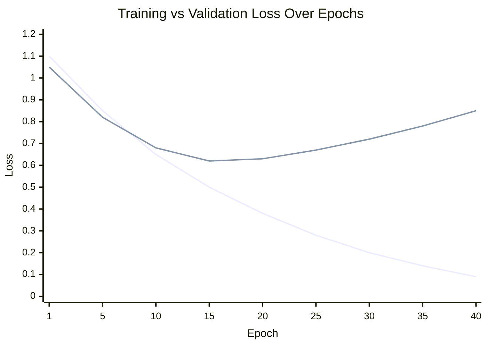
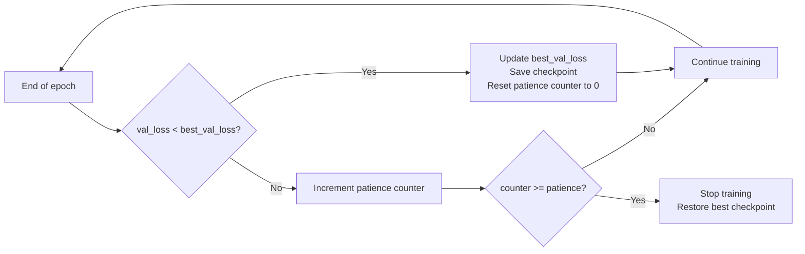

# Early Stopping in Neural Networks

In the previous note, we established that overfitting is the state where training loss continues decreasing while validation loss stagnates or increases. Early stopping is the simplest and most broadly applicable technique to prevent this: instead of training for a fixed number of epochs, you monitor the validation loss and halt as soon as it stops improving.

## One-line definition

Early stopping terminates training when the validation loss has not improved for a specified number of consecutive epochs (the patience), and restores the weights from the best checkpoint.

## Why this topic matters

Neural networks have enough capacity to eventually memorize the training set. Continuing to train past the optimal point does not improve — and actively degrades — generalization to unseen data. Early stopping effectively treats the number of training epochs as a regularization hyperparameter without requiring any change to the model architecture, loss function, or optimizer. It is free regularization.

## Train vs. validation loss curves

The characteristic early-stopping pattern shows two distinct phases:



The optimal stopping point is at the minimum of the validation curve, not where the training curve flattens. After that point, the network is learning patterns specific to the training set that do not transfer to the validation set.


*Source: [Wikimedia Commons — Artificial Neural Network](https://commons.wikimedia.org/wiki/File:Artificial_neural_network.svg) (CC BY-SA 4.0)*

## The patience parameter

Running one epoch is computationally expensive. A strict rule "stop as soon as validation loss does not improve" is too aggressive — it would terminate training after any single noisy epoch. The **patience** parameter $p$ specifies how many consecutive non-improving epochs to tolerate before stopping.



Typical patience values: 5–20 epochs. Larger datasets with slower per-epoch improvement warrant higher patience.

## Restoring best weights

The model at the final epoch is **not** the best model — it is the most overfit one. Early stopping must be paired with saving and restoring the best checkpoint:

$$
\hat{\theta} = \theta_{t^*}, \quad t^* = \arg\min_{t \leq T} \mathcal{L}_{\text{val}}(\theta_t)
$$

Where $T$ is the epoch at which training terminates and $t^*$ is the epoch with lowest validation loss.

## PyTorch example

```python
import torch
import torch.nn as nn
import copy

def train_with_early_stopping(model, train_loader, val_loader, patience=10, max_epochs=500):
    optimizer = torch.optim.Adam(model.parameters(), lr=1e-3)
    criterion = nn.CrossEntropyLoss()

    best_val_loss = float("inf")
    patience_counter = 0
    best_weights = None  # Will hold a deep copy of the best model state

    for epoch in range(max_epochs):
        # --- Training phase ---
        model.train()
        train_loss = 0.0
        for X_batch, y_batch in train_loader:
            optimizer.zero_grad()
            loss = criterion(model(X_batch), y_batch)
            loss.backward()
            optimizer.step()
            train_loss += loss.item()

        # --- Validation phase ---
        model.eval()
        val_loss = 0.0
        with torch.no_grad():
            for X_batch, y_batch in val_loader:
                val_loss += criterion(model(X_batch), y_batch).item()

        val_loss /= len(val_loader)

        # --- Early stopping logic ---
        if val_loss < best_val_loss:
            best_val_loss = val_loss
            patience_counter = 0
            # Deep copy saves the state, not a reference to the live model
            best_weights = copy.deepcopy(model.state_dict())
        else:
            patience_counter += 1
            if patience_counter >= patience:
                print(f"Early stopping at epoch {epoch + 1}. "
                      f"Best val loss: {best_val_loss:.4f}")
                break

    # Restore best model weights before returning
    if best_weights is not None:
        model.load_state_dict(best_weights)

    return model
```

**Critical detail**: `copy.deepcopy(model.state_dict())` creates a full in-memory copy of the weights. Without `deepcopy`, `best_weights` would be a reference to the live model state and would overwrite itself every epoch.

## Monitoring a metric other than loss

Early stopping can monitor any scalar: validation accuracy, AUC, F1, etc. When monitoring accuracy, the comparison flips — you want to maximize rather than minimize:

```python
# Monitor validation accuracy instead of loss
if val_acc > best_val_acc:
    best_val_acc = val_acc
    patience_counter = 0
    best_weights = copy.deepcopy(model.state_dict())
```

## Interview questions

<details>
<summary>Why is early stopping considered a form of regularization?</summary>

Early stopping constrains how long gradient descent runs, which limits how far parameter values can move from their initialization. In L2-regularization terms, shorter training corresponds to keeping parameters closer to zero (their typical initial values). Goodfellow et al. show that for a quadratic loss, early stopping is mathematically equivalent to L2 regularization — the number of steps plays the same role as the inverse of the regularization coefficient.
</details>

<details>
<summary>What happens if patience is set too low?</summary>

Training may stop prematurely during a temporary plateau in validation loss. Many training regimes have periods where loss stalls before resuming improvement (e.g., when the learning rate scheduler hasn't fired yet, or when the optimizer is navigating a flat region of the loss landscape). A patience that is too low will incorrectly interpret these plateaus as convergence and stop training too early, leaving the model underfitted relative to what it could achieve.
</details>

<details>
<summary>Should you monitor training loss or validation loss for early stopping?</summary>

Always validation loss (or a validation metric). Training loss will continue decreasing as long as the network can memorize data — it gives no signal about generalization. Only the validation loss reveals whether continued training is improving the model's behavior on unseen data or merely fitting training-set noise.
</details>

<details>
<summary>What is the relationship between early stopping and the number of training epochs as a hyperparameter?</summary>

Without early stopping, the number of epochs is an important hyperparameter that must be tuned for each experiment. Early stopping removes this manual tuning burden: you set a large maximum epoch count and let the model run until either the maximum is reached or the patience expires. The effective number of epochs becomes data-driven rather than hand-picked, which is generally more reliable.
</details>

<details>
<summary>Is it valid to restart training after early stopping to include the validation set?</summary>

Yes, this is a known technique. After early stopping, you know the optimal number of epochs $t^*$. You can then retrain from scratch on the combined train + validation set for exactly $t^*$ epochs without any validation monitoring. This gives a final model trained on more data. The risk is that the optimal epoch count may change slightly with the larger dataset, so this is a pragmatic tradeoff rather than a guaranteed improvement.
</details>

## Common mistakes

- Saving only `model.state_dict()` without deep copy, causing best weights to be overwritten each epoch.
- Computing validation loss with `model.train()` active — dropout and batch normalization behave differently in training mode, making validation loss unrepresentative.
- Setting patience so low (e.g., 1–2) that training stops during a normal temporary plateau.
- Monitoring training loss instead of validation loss.
- Not resetting the patience counter when a new best is found (monotonically increasing counter will trigger a false stop).

## Advanced perspective

Early stopping can interact poorly with learning rate schedules. A cyclical learning rate schedule intentionally raises and lowers the learning rate, causing validation loss to temporarily increase during the high-LR phase. A naive early stopping implementation will fire during the high-LR phase and miss the subsequent low-LR improvement. One solution is to synchronize early stopping checks with the end of each learning rate cycle rather than at each epoch.

## Final takeaway

Early stopping is the simplest, most universal regularization technique available: it requires no changes to architecture, loss, or optimizer, and it is effective across virtually all network types. Always implement it with proper validation-set monitoring, deep-copied checkpoint saving, and appropriate patience. The cost is a single additional hyperparameter (patience) and the overhead of saving intermediate checkpoints.

## References

- Prechelt, L. — "Early Stopping — But When?" (1998), the foundational paper defining patience-based stopping criteria
- Goodfellow, Bengio, Courville — *Deep Learning*, Section 7.8: Early Stopping
- PyTorch documentation — `torch.save`, `copy.deepcopy`
