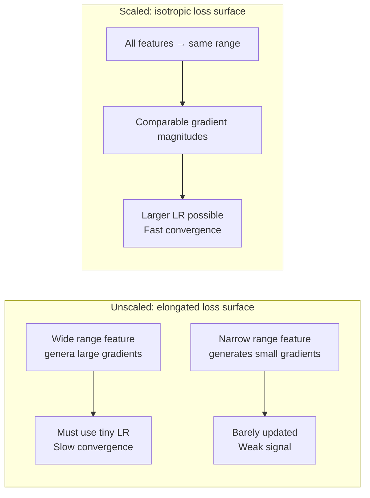
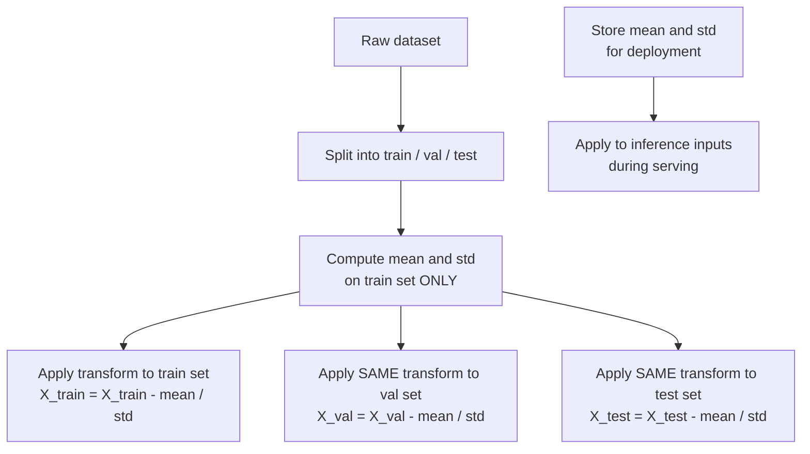

# Data Scaling and Feature Scaling for Neural Networks

Early stopping ensures we do not train too long. But even with optimal training length, unscaled input features create a different problem: they cause gradient descent to take slow, oscillating paths toward the minimum. This note explains why feature scaling matters mechanically, and when to choose between the two main approaches.

## One-line definition

Feature scaling transforms input features to a common numerical range or distribution so that all features contribute comparably to gradient updates and activation magnitudes.

## Why this topic matters

Neural networks learn through gradient descent, and gradients depend on the scale of the input data. A feature measured in kilometers (range: 0–10,000) and a feature measured in seconds (range: 0–1) will generate weight gradients of vastly different magnitudes. This forces the optimizer to take tiny steps to avoid exploding the small-scale feature's weights, while the large-scale feature's weights barely move. Feature scaling eliminates this disparity before any training begins, making it one of the highest-return, lowest-cost preprocessing steps.

## Why unscaled features hurt gradient descent

Consider a two-parameter quadratic loss where $w_1$ corresponds to a feature with range $[0, 1000]$ and $w_2$ to a feature with range $[0, 1]$:

$$
\mathcal{L}(w_1, w_2) = \frac{1}{2}\left[(1000 w_1 - y_1)^2 + (w_2 - y_2)^2\right]
$$

The gradient with respect to $w_1$ is:

$$
\frac{\partial \mathcal{L}}{\partial w_1} = 1000 \cdot (1000 w_1 - y_1)
$$

The gradient with respect to $w_2$ is:

$$
\frac{\partial \mathcal{L}}{\partial w_2} = (w_2 - y_2)
$$

The gradient for $w_1$ is $10^6$ times larger. The loss surface becomes a narrow elongated valley: gradient descent must use a very small learning rate (to avoid overshooting in the $w_1$ direction) and will consequently make minuscule progress in the $w_2$ direction. After scaling both features to $[0,1]$, the loss surface becomes isotropic — the gradient magnitudes are comparable and gradient descent converges efficiently.



## Min-max normalization

Min-max normalization rescales each feature to the interval $[0, 1]$ (or any specified $[a, b]$):

$$
x_{\text{scaled}} = \frac{x - x_{\min}}{x_{\max} - x_{\min}}
$$

For a target range $[a, b]$:

$$
x_{\text{scaled}} = a + \frac{(x - x_{\min})(b - a)}{x_{\max} - x_{\min}}
$$

**Properties**:
- All values are bounded to $[0, 1]$.
- Preserves the original distribution shape (no assumptions about normality).
- Sensitive to outliers: a single extreme value compresses all other values into a narrow band.

**Use when**: the feature distribution is roughly uniform, the algorithm requires bounded inputs (e.g., sigmoid output units), or outliers have been removed.

## Standardization (z-score normalization)

Standardization transforms each feature to have zero mean and unit variance:

$$
x_{\text{scaled}} = \frac{x - \mu}{\sigma}
$$

Where $\mu = \frac{1}{n}\sum_{i=1}^n x_i$ is the training-set mean and $\sigma = \sqrt{\frac{1}{n}\sum_{i=1}^n (x_i - \mu)^2}$ is the training-set standard deviation.

**Properties**:
- Output is unbounded (can produce values outside $[-1, 1]$).
- Robust to outliers compared to min-max (extreme values become large z-scores but do not compress the rest of the data).
- Assumes feature values are approximately Gaussian; works well even when this assumption is violated.

**Use when**: the feature distribution has outliers, the algorithm does not require bounded inputs, or you are using distance-based methods.

## The train-only rule: preventing data leakage

The mean $\mu$ and standard deviation $\sigma$ (or $x_{\min}$, $x_{\max}$) must be computed **exclusively on the training set** and then applied to the validation and test sets.

Computing statistics on the full dataset (train + test) before splitting is **data leakage**: the test-set statistics bleed into the training pipeline, making your evaluation metrics optimistic and your deployed model inconsistent with what was tested.



## PyTorch example

```python
import torch
import torch.nn as nn

# Simulate raw features with very different scales
X_train_raw = torch.cat([
    torch.randn(800, 1) * 1000 + 5000,  # Feature 1: large scale (e.g. income in dollars)
    torch.randn(800, 1) * 0.5 + 0.5,   # Feature 2: small scale (e.g. probability)
    torch.randn(800, 1) * 25 + 37,      # Feature 3: medium scale (e.g. temperature in Celsius)
], dim=1)

X_val_raw = torch.cat([
    torch.randn(200, 1) * 1000 + 5000,
    torch.randn(200, 1) * 0.5 + 0.5,
    torch.randn(200, 1) * 25 + 37,
], dim=1)

# Step 1: Compute statistics on TRAINING SET ONLY
mean = X_train_raw.mean(dim=0, keepdim=True)          # Shape: (1, 3)
std  = X_train_raw.std(dim=0, keepdim=True).clamp(min=1e-8)  # Clamp to avoid div by zero

# Step 2: Standardize using training statistics
X_train = (X_train_raw - mean) / std
X_val   = (X_val_raw   - mean) / std  # Same mean/std as training

# Verify: training features should have mean ≈ 0, std ≈ 1
print("Train mean:", X_train.mean(dim=0).tolist())   # [~0.0, ~0.0, ~0.0]
print("Train std: ", X_train.std(dim=0).tolist())    # [~1.0, ~1.0, ~1.0]

# Step 3: Build and train a network on scaled data
model = nn.Sequential(
    nn.Linear(3, 32),
    nn.ReLU(),
    nn.Linear(32, 1)
)

# At inference time, apply the same scaling with the saved mean/std
def predict(raw_input: torch.Tensor) -> torch.Tensor:
    scaled = (raw_input - mean) / std
    model.eval()
    with torch.no_grad():
        return model(scaled)
```

## Choosing between min-max and standardization

| Criterion | Min-Max | Standardization |
|---|---|---|
| Feature has outliers | Poor (outliers compress data) | Better (robust to extremes) |
| Need bounded output [0,1] | Yes | No |
| Distribution is roughly Gaussian | Either | Preferred |
| Algorithm: neural network | Either works | Generally preferred |
| Algorithm: image pixels | Common (divide by 255) | Also used |

For most neural network applications with tabular data, **standardization is the safer default** because neural networks are not sensitive to unbounded inputs (unlike sigmoid classifiers) and are more commonly harmed by outlier-driven compression.

## Interview questions

<details>
<summary>Why does feature scaling speed up gradient descent convergence?</summary>

Without scaling, features with large ranges generate proportionally large gradients. To prevent overshooting in those dimensions, the learning rate must be set very small, which slows progress in all other dimensions. Scaling makes gradient magnitudes comparable across features, allowing a larger learning rate and a more direct descent path. Geometrically, scaling transforms an elongated elliptical loss surface into a circular one where gradient descent can take steps directly toward the minimum.
</details>

<details>
<summary>Why should you only compute scaling statistics on the training set?</summary>

Computing statistics on the validation or test set constitutes data leakage: information from unseen data has influenced the training pipeline. This makes validation metrics unrealistically optimistic and creates a mismatch between the deployed model (which will see raw incoming data) and the tested model. The correct procedure is to fit the scaler on training data and transform all other splits using those same training-set statistics.
</details>

<details>
<summary>Does feature scaling affect the final predictions of a trained model?</summary>

Scaling affects how the model trains (convergence speed, stability) but not what the model theoretically can represent. A neural network trained on scaled inputs and one trained on unscaled inputs can both converge to the same function — the unscaled one just may require more iterations or may numerically fail. In practice, the scaled model reliably converges to a better solution within the same compute budget.
</details>

<details>
<summary>Do you need to scale the target variable (y) for regression?</summary>

Scaling the target is not always necessary but often beneficial for regression. If the target has a large range (e.g., house prices in millions), the loss gradients with respect to output weights are large, potentially destabilizing training. Scaling the target to a unit range and then inverse-transforming the predictions is a common practice. For classification, the target is a class label — it is not scaled.
</details>

## Common mistakes

- Computing mean and std on the entire dataset before the train/test split.
- Fitting the scaler on validation or test data.
- Not saving the scaling parameters (mean, std) for deployment — inference must use the exact same values.
- Scaling categorical or binary features the same way as continuous features.
- Forgetting to handle features with zero variance (dividing by zero standard deviation); clamp the denominator to a small epsilon.

## Advanced perspective

For very deep networks, input scaling alone is insufficient because internal activations can still shift dramatically from layer to layer. Batch normalization (covered in note 31) addresses internal covariate shift by normalizing activations at each layer during training. However, batch normalization does not replace input scaling — both are needed, and they address different layers of the same problem: batch norm stabilizes intermediate representations, while input scaling stabilizes the first layer's weight updates.

## Final takeaway

Feature scaling is a preprocessing step that costs almost nothing to implement and reliably improves training speed and stability. Standardization (z-score) is the default choice for neural networks: it is robust to outliers, makes no assumption about the range of the output, and is easy to apply consistently to train and inference data. Always compute scaling parameters on the training set only and store them for deployment.

## References

- LeCun, Y. et al. — "Efficient BackProp" (1998), the canonical reference for why scaling accelerates training
- Scikit-learn documentation — `StandardScaler`, `MinMaxScaler`
- Goodfellow, Bengio, Courville — *Deep Learning*, Section 8.1.3: Data Preprocessing
