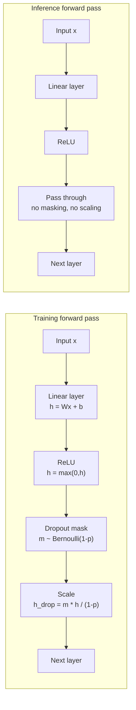

# Dropout in Deep Learning

Feature scaling and early stopping address data and training-time issues. Dropout addresses a structural problem: deep networks develop neurons that depend on each other in brittle ways, learning patterns that are specific to co-occurrence in the training data rather than individually useful features. Dropout breaks these dependencies at training time by randomly removing neurons.

## One-line definition

Dropout is a regularization technique that randomly sets a fraction $p$ of neuron activations to zero on each forward pass during training, forcing the remaining neurons to learn independently useful representations.


*Source: [Wikimedia Commons — MultiLayerPerceptron](https://commons.wikimedia.org/wiki/File:MultiLayerPerceptron.svg) (CC BY-SA 4.0)*

## Why this topic matters

Without regularization, large neural networks can memorize training data by allowing neurons to specialize in correcting each other's mistakes — a phenomenon called co-adaptation. A neuron in layer $l$ may learn a pattern only because a specific neuron in layer $l-1$ always provides a particular signal. If that upstream neuron is sometimes absent, the downstream neuron is forced to develop a more robust, general representation. Dropout achieves this forced independence at very low computational cost and scales to networks of any size.

## The co-adaptation problem

In a fully connected network, imagine neuron $A$ always detects a noisy spurious feature and neuron $B$ in the next layer has learned to cancel out $A$'s noise. Together they produce a clean signal — but this is a brittle collaboration. If the input distribution shifts at test time, or if $A$'s noise pattern changes, $B$ has no useful signal. Dropout prevents $B$ from relying on $A$ by randomly making $A$ absent during training, forcing $B$ to learn something useful from other neurons.

## The ensemble interpretation

Srivastava et al. (2014) showed that training a network with dropout is approximately equivalent to training an ensemble of $2^n$ different thinned networks (where $n$ is the number of dropout-eligible neurons), sharing weights. At inference time, using the full network with scaled activations approximates averaging the predictions of this ensemble. This is why dropout improves generalization: ensemble averaging reduces variance.

## Inverted dropout: the correct implementation

Naively zeroing $p$ of activations would change the expected activation magnitude from $E[h]$ to $(1-p) \cdot E[h]$, causing a mismatch between training and inference behavior. **Inverted dropout** compensates during training by scaling surviving activations up by $\frac{1}{1-p}$:

$$
\tilde{h}_i = \begin{cases} \frac{h_i}{1-p} & \text{with probability } 1-p \\ 0 & \text{with probability } p \end{cases}
$$

This keeps the expected value of activations constant: $E[\tilde{h}_i] = h_i$, so inference uses the full network with no scaling adjustment.

The dropout mask $m_i \sim \text{Bernoulli}(1-p)$ and the operation is:

$$
\tilde{h}_i = \frac{m_i \cdot h_i}{1-p}
$$

## The dropout mask operation



A new mask is sampled independently for every forward pass. This means the same input produces different outputs in different training iterations — which is the source of the stochastic regularization effect.

## Effect on gradient flow

During backpropagation, the gradient of the loss with respect to a dropped activation is zero. The path through zeroed neurons contributes nothing to the weight update. Over many training steps, weights that survived more often receive stronger gradient signals — but because the survival is random, all weights get trained over the full run.

$$
\frac{\partial \mathcal{L}}{\partial h_i} = \frac{m_i}{1-p} \cdot \frac{\partial \mathcal{L}}{\partial \tilde{h}_i}
$$

## PyTorch example

```python
import torch
import torch.nn as nn

class MLPWithDropout(nn.Module):
    def __init__(self, input_dim: int, hidden_dim: int, output_dim: int, drop_prob: float = 0.5):
        super().__init__()
        self.network = nn.Sequential(
            nn.Linear(input_dim, hidden_dim),
            nn.ReLU(),
            nn.Dropout(p=drop_prob),   # PyTorch implements inverted dropout automatically
            nn.Linear(hidden_dim, hidden_dim),
            nn.ReLU(),
            nn.Dropout(p=drop_prob),
            nn.Linear(hidden_dim, output_dim)
        )

    def forward(self, x: torch.Tensor) -> torch.Tensor:
        return self.network(x)

model = MLPWithDropout(input_dim=20, hidden_dim=128, output_dim=10, drop_prob=0.5)

# --- Training mode: dropout is active ---
model.train()
x = torch.randn(4, 20)
out_train1 = model(x)  # Each forward pass produces different output due to random masks
out_train2 = model(x)  # Different from out_train1 even with the same input
print("Outputs are different during training:", not torch.allclose(out_train1, out_train2))

# --- Eval mode: dropout is disabled, full network used ---
model.eval()
with torch.no_grad():
    out_eval1 = model(x)
    out_eval2 = model(x)
print("Outputs are identical during eval:", torch.allclose(out_eval1, out_eval2))
```

## When to use dropout

| Context | Recommended dropout rate |
|---|---|
| Fully connected hidden layers (MLP) | 0.3–0.5 |
| Large final hidden layer before output | 0.5 |
| Convolutional layers | 0.1–0.2 (use sparingly; spatial dropout preferred) |
| LSTM / RNN (variational dropout) | 0.2–0.4 |
| Transformer (attention layers) | 0.1 |
| Output layer | Never |

Do not apply dropout to the output layer — it would corrupt predictions directly.

## Interview questions

<details>
<summary>What is inverted dropout and why is it preferred over standard dropout?</summary>

In standard dropout, activations are zeroed during training without compensation. At test time, the full network is used — but now activations have an expected value that is $\frac{1}{1-p}$ times larger than what was seen during training, requiring explicit scaling of weights at test time. Inverted dropout avoids this by compensating during training: surviving activations are multiplied by $\frac{1}{1-p}$, keeping the expected activation constant. At test time, no adjustment is needed. This is simpler, and it is the version implemented in PyTorch's `nn.Dropout`.
</details>

<details>
<summary>Why does dropout reduce overfitting?</summary>

Two complementary explanations: (1) Ensemble interpretation — dropout approximates training $2^n$ different sparse networks and averaging them, which reduces prediction variance. (2) Co-adaptation prevention — by randomly removing neurons, neurons cannot rely on specific other neurons being present. They must each learn individually useful features. The result is a more redundant, distributed representation that generalizes better.
</details>

<details>
<summary>What is the difference between model.train() and model.eval() in PyTorch with respect to dropout?</summary>

`model.train()` sets the model to training mode: `nn.Dropout` layers sample a new random mask and zero activations with probability $p$. `model.eval()` sets the model to evaluation mode: `nn.Dropout` layers become identity functions — all activations pass through unchanged. Forgetting to call `model.eval()` before validation or inference causes dropout to stay active, making evaluation results noisy and non-deterministic.
</details>

<details>
<summary>Why should dropout not be applied to the output layer?</summary>

The output layer produces the final prediction. Applying dropout to it would randomly zero class logits or regression outputs, making the predictions meaningless. All regularization effects of dropout should come from hidden layer representations, not from corrupting the final output.
</details>

<details>
<summary>Does dropout interact with batch normalization?</summary>

Yes, and poorly when misused. Dropout introduces variance in activations seen by batch norm. When dropout is placed before batch normalization, the batch statistics (mean and variance) are computed over randomly-masked activations, making them noisy and inconsistent with the running statistics used at inference time. The generally recommended order is: Linear → BatchNorm → ReLU → Dropout. Many modern architectures avoid using both in the same layer.
</details>

## Common mistakes

- Forgetting to call `model.eval()` during validation — dropout remains active, making validation loss noisy.
- Applying dropout to the output layer.
- Using very high dropout rates ($p > 0.7$) on small networks — too many neurons are dropped, causing severe underfitting.
- Applying standard (non-inverted) dropout manually, then using the network at test time without rescaling weights.
- Using the same dropout rate for all layers regardless of their size.

## Advanced perspective

Dropout has a Bayesian interpretation: Gal & Ghahramani (2016) showed that a neural network trained with dropout is approximately equivalent to a Gaussian process with a specific kernel. Running the dropout-enabled network multiple times at inference and averaging the outputs (MC Dropout) gives calibrated uncertainty estimates — a form of approximate Bayesian inference. This makes dropout uniquely useful in applications that require uncertainty quantification, such as active learning or safety-critical predictions.

## Final takeaway

Dropout is a stochastic regularizer that forces neurons to learn individually useful representations by randomly removing them during training. The key implementation detail is inverted dropout, which scales surviving activations up during training so no adjustment is needed at inference. Always switch to `model.eval()` before validation and inference — and never apply dropout to the output layer.

## References

- Srivastava, N. et al. — "Dropout: A Simple Way to Prevent Neural Networks from Overfitting" (2014)
- Gal, Y. & Ghahramani, Z. — "Dropout as a Bayesian Approximation" (2016)
- Goodfellow, Bengio, Courville — *Deep Learning*, Section 7.12
