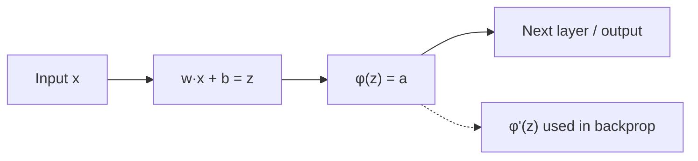
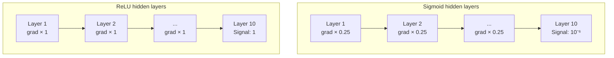

# Activation functions: sigmoid, tanh, and ReLU

Without an activation function, stacking multiple linear layers collapses into one linear transformation:

$$
W_2 (W_1 x + b_1) + b_2 = (W_2 W_1) x + (W_2 b_1 + b_2) = W' x + b'
$$

No matter how many layers you add, the network remains linear. Activation functions break this collapse by introducing nonlinearity at each neuron — the source of every interesting behavior deep networks are capable of.


*Source: [Wikimedia Commons — ReLU Activation Function Plot](https://commons.wikimedia.org/wiki/File:ReLU_Activation_Function_Plot.svg) (CC BY-SA 4.0)*

The choice of activation function directly determines:

- Whether gradients vanish or flow freely (training feasibility)
- What function class the network can represent
- How fast neurons respond to input changes
- Whether the network can be parallelized (modern hardware efficiency)

---

## What is an activation function, exactly?

Given a linear pre-activation $z = w^T x + b$, the activation function $\phi$ produces the neuron's output:

$$
a = \phi(z)
$$

This is applied **element-wise** — each neuron independently applies $\phi$ to its own scalar $z$.

The activation function's job is to:

1. Introduce nonlinearity so the network can represent non-linear decision boundaries
2. Produce a derivative $\phi'(z)$ that backpropagation can multiply
3. Keep activations in a stable range so the signal neither explodes nor vanishes



---

## Sigmoid

### Formula

$$
\sigma(z) = \frac{1}{1 + e^{-z}}
$$

### Derivative

$$
\frac{d\sigma}{dz} = \sigma(z)\bigl(1 - \sigma(z)\bigr)
$$

This is one of the elegant results in neural networks — the derivative can be expressed entirely in terms of the output, requiring no recomputation of $z$.

**Derivation:**

$$
\frac{d\sigma}{dz} = \frac{e^{-z}}{(1+e^{-z})^2} = \frac{1}{1+e^{-z}} \cdot \frac{e^{-z}}{1+e^{-z}} = \sigma(z) \cdot (1 - \sigma(z))
$$

### Behavior

| $z$ | $\sigma(z)$ | $\sigma'(z)$ |
|-----|-------------|--------------|
| $-5$ | 0.007 | 0.007 |
| $-2$ | 0.119 | 0.105 |
| $0$ | 0.500 | **0.250** (maximum) |
| $2$ | 0.881 | 0.105 |
| $5$ | 0.993 | 0.007 |

The maximum derivative is **0.25** at $z=0$. For any $|z| > 2$, the derivative drops below 0.1.

### Saturation and vanishing gradients

When $z$ is large in magnitude, $\sigma(z) \to 0$ or $\sigma(z) \to 1$, and the derivative approaches zero. This is **saturation**.

For backpropagation through $L$ sigmoid layers, each layer multiplies the gradient by at most 0.25:

$$
\prod_{l=1}^{L} \sigma'(z^{(l)}) \leq 0.25^L
$$

For $L = 10$: $0.25^{10} = 9.5 \times 10^{-7}$. The gradient at the first layer is millionths of the signal at the output. Learning stops.

### The zero-centering problem

Sigmoid outputs are always positive: $\sigma(z) \in (0, 1)$. When the activation $a^{(l-1)}$ is always positive, the weight gradient $\partial \mathcal{L}/\partial w^{(l)} = \delta^{(l)} \cdot a^{(l-1)}$ has the same sign as $\delta^{(l)}$ for every weight in a layer. This forces the optimizer to move all weights in the same direction simultaneously — causing zig-zag gradient updates instead of direct paths to the minimum.

### When to use sigmoid

- **Output layer of binary classification**: the output $\sigma(z) \in (0,1)$ is a valid probability
- **Gate mechanisms in LSTMs**: forget, input, and output gates use sigmoid to produce values in $[0,1]$
- **Almost never in hidden layers of deep networks**

### Visual


*Source: [Wikimedia Commons — Logistic function](https://commons.wikimedia.org/wiki/File:Logistic-curve.svg)*

---

## Tanh (Hyperbolic Tangent)

### Formula

$$
\tanh(z) = \frac{e^z - e^{-z}}{e^z + e^{-z}}
$$

**Relationship to sigmoid:**

$$
\tanh(z) = 2\sigma(2z) - 1
$$

Tanh is a rescaled sigmoid: it spans $(-1, 1)$ instead of $(0, 1)$.

### Derivative

$$
\frac{d\tanh}{dz} = 1 - \tanh^2(z)
$$

**Derivation:**

$$
\frac{d}{dz}\tanh(z) = \frac{(e^z + e^{-z})^2 - (e^z - e^{-z})^2}{(e^z + e^{-z})^2} = 1 - \tanh^2(z)
$$

### Behavior

| $z$ | $\tanh(z)$ | $\tanh'(z)$ |
|-----|------------|-------------|
| $-3$ | $-0.995$ | 0.009 |
| $-1$ | $-0.762$ | 0.420 |
| $0$ | $0.000$ | **1.000** (maximum) |
| $1$ | $0.762$ | 0.420 |
| $3$ | $0.995$ | 0.009 |

The maximum derivative is **1.0** at $z=0$ — four times larger than sigmoid. Near $z=0$, gradients flow much more freely.

### Why tanh is better than sigmoid

1. **Zero-centered**: outputs span $(-1, 1)$ — gradients in the next layer can have both signs, allowing more direct optimization paths.
2. **Stronger derivatives**: max derivative is 1.0 vs 0.25 for sigmoid.
3. **Still symmetric**: $\tanh(-z) = -\tanh(z)$.

But tanh still saturates at large $|z|$, causing vanishing gradients in deep networks.

### When to use tanh

- **LSTM cell state update** ($\tilde{C}_t = \tanh(W_C [h_{t-1}, x_t] + b_C)$) and hidden state output ($h_t = o_t \odot \tanh(C_t)$)
- **GRU candidate state**
- **Shallow networks** where saturation is not a deep concern
- **Output layer** when predictions should span $(-1, 1)$ (e.g., normalized targets)

---

## ReLU (Rectified Linear Unit)

### Formula

$$
\text{ReLU}(z) = \max(0, z) = \begin{cases} z & z > 0 \\ 0 & z \leq 0 \end{cases}
$$

### Derivative

$$
\text{ReLU}'(z) = \begin{cases} 1 & z > 0 \\ 0 & z \leq 0 \end{cases}
$$

(At $z=0$, the subgradient is typically defined as 0 or 0.5 in software.)

### Why ReLU changed everything

For positive pre-activations, ReLU's derivative is **exactly 1** — the gradient passes through without any attenuation. For a 100-layer network with ReLU activations and positive pre-activations:

$$
\prod_{l=1}^{100} \text{ReLU}'(z^{(l)}) = 1
$$

Compared to sigmoid's $0.25^{100} \approx 10^{-60}$. This single property made training 10+ layer networks practical.

### Additional benefits

- **Computationally cheap**: no exponentials, just a comparison
- **Sparse activation**: ~50% of neurons output exactly 0 — efficient computation and implicit regularization
- **Linear for positive inputs**: networks with ReLU compose piecewise linear functions — theoretical connections to linear programming

### The dying ReLU problem

If a neuron always receives negative pre-activations ($z \leq 0$ for every training example), its gradient is always 0. The weights receive no update. The neuron is permanently inactive — "dead."

**Causes:**
- Learning rate too large → large negative weight updates → always-negative pre-activations
- Very negative initial biases
- Inappropriate initialization

**Fixes:** Leaky ReLU (note 28), careful initialization (He init, note 30), batch normalization (note 31)

### When to use ReLU

- **Default for hidden layers** in MLPs, CNNs, and most architectures
- Not recommended for output layers
- Not recommended for RNN hidden states (replaced by tanh in LSTMs/GRUs)

---

## Unified comparison

### Formulas and derivatives

| Activation | Formula | Derivative |
|---|---|---|
| Sigmoid | $\sigma(z) = 1/(1+e^{-z})$ | $\sigma(z)(1-\sigma(z))$ |
| Tanh | $(e^z - e^{-z})/(e^z + e^{-z})$ | $1 - \tanh^2(z)$ |
| ReLU | $\max(0, z)$ | $\mathbf{1}[z > 0]$ |

### Properties table

| Property | Sigmoid | Tanh | ReLU |
|---|---|---|---|
| Range | $(0, 1)$ | $(-1, 1)$ | $[0, \infty)$ |
| Max derivative | 0.25 | 1.0 | 1.0 |
| Zero-centered | No | Yes | No |
| Saturates | Both ends | Both ends | Negative side only |
| Dying neurons | No | No | Yes |
| Gradient vanishing | Severe | Moderate | Avoided (positive z) |
| Compute cost | High ($e^{-z}$) | High ($e^z, e^{-z}$) | Minimal |
| Output for $z=5$ | 0.993 | 0.9999 | 5.0 |

### Gradient propagation through 10 layers

$$
\text{Sigmoid}: 0.25^{10} \approx 10^{-6} \quad \text{(essentially zero)}
$$

$$
\text{Tanh (near 0)}: 1.0^{10} = 1.0 \quad \text{(best case, not realistic)}
$$

$$
\text{ReLU (all positive)}: 1^{10} = 1 \quad \text{(no attenuation)}
$$

### The information flow diagram



---

## Historical context: why the field moved from sigmoid to tanh to ReLU

| Era | Dominant activation | Reason for adoption | Reason for replacement |
|---|---|---|---|
| 1960s–1990s | Step function (Heaviside) | Biological analogy | Not differentiable |
| 1990s–2000s | Sigmoid | Differentiable, probability output | Vanishing gradients, slow |
| 2000s–2010s | Tanh | Better gradients, zero-centered | Still saturates |
| 2010s–present | ReLU | No saturation (positive), fast, sparse | Dying neurons (solved by variants) |
| 2017–present | GELU, Swish | Smooth, better for transformers | — |

The key insight from the 2010s: the saturation problem mattered enormously for deep networks. AlexNet (2012) used ReLU and trained a 5-layer CNN in days. The same network with sigmoid would have been practically untrainable.

---

## PyCharm / Python code: complete working examples

### Plotting activation functions

```python
import numpy as np
import matplotlib.pyplot as plt


def sigmoid(z):
    return 1 / (1 + np.exp(-z))


def sigmoid_derivative(z):
    s = sigmoid(z)
    return s * (1 - s)


def tanh(z):
    return np.tanh(z)


def tanh_derivative(z):
    return 1 - np.tanh(z) ** 2


def relu(z):
    return np.maximum(0, z)


def relu_derivative(z):
    return (z > 0).astype(float)


z = np.linspace(-5, 5, 500)

fig, axes = plt.subplots(2, 3, figsize=(15, 8))

activations = [sigmoid, tanh, relu]
derivatives = [sigmoid_derivative, tanh_derivative, relu_derivative]
names = ["Sigmoid", "Tanh", "ReLU"]
colors = ["blue", "green", "red"]

for col, (fn, dfn, name, color) in enumerate(zip(activations, derivatives, names, colors)):
    # Top row: activation function
    axes[0, col].plot(z, fn(z), color=color, linewidth=2)
    axes[0, col].axhline(0, color="black", linewidth=0.5, linestyle="--")
    axes[0, col].axvline(0, color="black", linewidth=0.5, linestyle="--")
    axes[0, col].set_title(f"{name}: φ(z)", fontsize=13)
    axes[0, col].set_xlabel("z")
    axes[0, col].grid(True, alpha=0.3)

    # Bottom row: derivative
    axes[1, col].plot(z, dfn(z), color=color, linewidth=2, linestyle="--")
    axes[1, col].axhline(0, color="black", linewidth=0.5, linestyle="--")
    axes[1, col].set_title(f"{name}: φ'(z)", fontsize=13)
    axes[1, col].set_xlabel("z")
    axes[1, col].grid(True, alpha=0.3)

plt.suptitle("Activation Functions and Their Derivatives", fontsize=15, y=1.02)
plt.tight_layout()
plt.savefig("activation_functions.png", dpi=150, bbox_inches="tight")
plt.show()
```

### Observing vanishing gradients in practice

```python
import torch
import torch.nn as nn


def build_deep_network(activation_fn, n_layers=10, n_units=64):
    """Build a deep network with a specified activation function."""
    layers = []
    for _ in range(n_layers):
        layers.append(nn.Linear(n_units, n_units))
        layers.append(activation_fn())
    return nn.Sequential(*layers)


def measure_gradient_norms(model, input_size=64, n_layers=10):
    """Measure gradient norms at each layer."""
    x = torch.randn(32, input_size)
    y = torch.randn(32, input_size)

    output = model(x)
    loss = nn.MSELoss()(output, y)
    loss.backward()

    norms = []
    for layer in model:
        if isinstance(layer, nn.Linear) and layer.weight.grad is not None:
            norms.append(layer.weight.grad.norm().item())
    return norms


# Compare sigmoid vs ReLU
sigmoid_model = build_deep_network(nn.Sigmoid)
relu_model = build_deep_network(nn.ReLU)

sig_norms = measure_gradient_norms(sigmoid_model)
relu_norms = measure_gradient_norms(relu_model)

print("Sigmoid gradient norms (layer 1 → 10):")
for i, norm in enumerate(sig_norms):
    print(f"  Layer {i+1:2d}: {norm:.2e}")

print("\nReLU gradient norms (layer 1 → 10):")
for i, norm in enumerate(relu_norms):
    print(f"  Layer {i+1:2d}: {norm:.2e}")

# Expected output:
# Sigmoid layer 1: ~1e-7 (near zero)
# ReLU layer 1:    ~1e-2 (meaningful gradient)
```

### Using activations in a classifier

```python
import torch
import torch.nn as nn
import torch.optim as optim


class Classifier(nn.Module):
    def __init__(self, input_dim: int, num_classes: int, hidden_dim: int = 256):
        super().__init__()
        self.network = nn.Sequential(
            nn.Linear(input_dim, hidden_dim),
            nn.ReLU(),                          # hidden: ReLU (no saturation)
            nn.Linear(hidden_dim, hidden_dim),
            nn.ReLU(),
            nn.Linear(hidden_dim, num_classes)  # output: raw logits (no activation)
        )
        self._init_weights()

    def _init_weights(self):
        for module in self.modules():
            if isinstance(module, nn.Linear):
                nn.init.kaiming_normal_(module.weight, nonlinearity="relu")
                nn.init.zeros_(module.bias)

    def forward(self, x: torch.Tensor) -> torch.Tensor:
        return self.network(x)


# Binary classification with sigmoid output
class BinaryClassifier(nn.Module):
    def __init__(self, input_dim: int):
        super().__init__()
        self.network = nn.Sequential(
            nn.Linear(input_dim, 128),
            nn.ReLU(),
            nn.Linear(128, 64),
            nn.ReLU(),
            nn.Linear(64, 1)
            # No sigmoid here — use BCEWithLogitsLoss (numerically stable)
        )

    def predict_proba(self, x: torch.Tensor) -> torch.Tensor:
        """Apply sigmoid only for inference probabilities."""
        return torch.sigmoid(self.forward(x))

    def forward(self, x: torch.Tensor) -> torch.Tensor:
        return self.network(x)


# Training binary classifier
model = BinaryClassifier(input_dim=20)
optimizer = optim.AdamW(model.parameters(), lr=1e-3)
criterion = nn.BCEWithLogitsLoss()  # internally applies sigmoid + BCE

X = torch.randn(256, 20)
y = (X[:, 0] + X[:, 1] > 0).float().unsqueeze(1)  # simple decision rule

model.train()
for epoch in range(50):
    optimizer.zero_grad()
    logits = model(X)
    loss = criterion(logits, y)
    loss.backward()
    optimizer.step()
    if (epoch + 1) % 10 == 0:
        with torch.no_grad():
            probs = model.predict_proba(X)
            acc = ((probs > 0.5).float() == y).float().mean()
            print(f"Epoch {epoch+1:3d} | loss: {loss.item():.4f} | acc: {acc.item():.4f}")
```

---

## Advanced perspective

### The Universal Approximation Theorem

Any continuous activation function that is not polynomial allows a single hidden layer to approximate any continuous function to arbitrary precision (given enough neurons). What the theorem does NOT say:

- It gives no bound on how many neurons are needed
- It says nothing about whether gradient descent will find the right weights
- It applies to infinite precision, not floating point

In practice, depth matters more than width. Multiple layers with ReLU create an exponentially growing number of linear regions — a 10-layer ReLU network with $n$ neurons per layer can represent $O(2^n/n)$ times more linear regions than a shallow network.

### Activation functions as geometric transformations

Each linear layer + activation transforms the feature space. What does ReLU actually do geometrically?

- The linear layer $z = Wx + b$ rotates, scales, and shifts the input
- ReLU $a = \max(0, z)$ **folds** the space: negative regions are collapsed to the hyperplane $a = 0$

After $L$ layers of linear transformations and ReLU folds, complex curved decision boundaries in the original input space become linearly separable in the final layer's feature space. This is the geometric mechanism of deep learning.

### Why GELU replaced ReLU in transformers

The Gaussian Error Linear Unit (GELU):

$$
\text{GELU}(z) = z \cdot \Phi(z)
$$

where $\Phi$ is the standard normal CDF. This weights inputs by their probability of being positive under $\mathcal{N}(0,1)$. Key differences from ReLU:

- Smooth (infinitely differentiable), no kink at $z=0$
- Non-monotonic: has a slight negative region near $z = -0.17$
- Stochastic interpretation: $\text{GELU}(z) \approx z \cdot \mathbf{1}[\mathcal{N}(0,1) \leq z]$

Smooth gradients near zero improved optimization for transformers, which have many layers of attention and feed-forward blocks. BERT, GPT-2, GPT-3, LLaMA — all use GELU.

---

## Interview questions

<details>
<summary>Why can't we use a step function (Heaviside) as an activation?</summary>

The step function has zero derivative everywhere except at $z=0$ where it is undefined. Backpropagation multiplies gradients by the activation's derivative at each layer. If this derivative is zero, no gradient reaches earlier layers and no learning occurs. The perceptron's original step function was replaced by sigmoid precisely to enable gradient-based learning.
</details>

<details>
<summary>Why did ReLU outperform sigmoid in practice even though it is not differentiable at z=0?</summary>

The non-differentiability at z=0 is handled by choosing a subgradient (usually 0). In practice, z=0 occurs with probability zero for continuous inputs, so this is irrelevant. The important property is that ReLU's derivative is exactly 1 for positive z — no attenuation. For deep networks, this is the property that matters, and it completely dominates any theoretical concern about the single non-differentiable point.
</details>

<details>
<summary>Explain the zero-centering problem with sigmoid in detail.</summary>

Sigmoid outputs are always in (0, 1). When the activation a^(l-1) is positive for every sample in the batch, the weight gradient ∂L/∂w = δ · a^(l-1) has the same sign as δ for every weight w. All weights in the layer must either all increase or all decrease in a given step. The optimizer cannot take a diagonal shortcut through weight space — it must zig-zag. Tanh outputs span (-1, 1), so a^(l-1) can be negative, allowing gradients in both directions simultaneously.
</details>

<details>
<summary>What is the dying ReLU problem and give three ways to prevent it?</summary>

A ReLU neuron dies when its pre-activation z is always ≤ 0, giving zero gradient — the neuron never updates. Three prevention strategies: (1) He initialization — sets weight variance to 2/n_in, preventing systematic negative initial pre-activations; (2) Batch normalization — normalizes pre-activations to have zero mean, centering them near ReLU's active region; (3) Leaky ReLU — replaces the zero derivative for negative z with a small constant α=0.01, allowing the neuron to recover from temporary death.
</details>

<details>
<summary>What does it mean geometrically that ReLU creates piecewise linear functions?</summary>

Each ReLU neuron partitions input space into two half-spaces: one where z>0 (linear region) and one where z≤0 (constant 0 region). A network with n ReLU neurons creates at most 2^n regions, each with a different linear function. Depth multiplies this: L layers can create up to (n/L)^L · 2^n distinct linear regions. Deep ReLU networks are universal piecewise linear function approximators, and this piecewise structure is what gives them their representation power.
</details>

<details>
<summary>Why is tanh preferred over sigmoid for hidden layers in shallow networks?</summary>

Three reasons: (1) Zero-centered — tanh outputs span (-1, 1), allowing both positive and negative activations, so gradients can go in both directions simultaneously without zig-zagging; (2) Stronger gradient — max derivative 1.0 vs 0.25 for sigmoid, giving 4× better signal for nearby layers; (3) Symmetric — tanh(-z) = -tanh(z), which can help with internal symmetry during initialization. For deep networks, both fail due to saturation, making ReLU the practical choice.
</details>

<details>
<summary>When would you use sigmoid in a modern deep learning model?</summary>

Sigmoid has three legitimate modern uses: (1) Output layer for binary classification — sigmoid(logit) produces a probability in (0,1) for positive class; (2) Gating mechanisms in LSTMs and GRUs — forget, input, and output gates need values in [0,1] to act as multiplicative masks; (3) Attention probabilities — wherever the model needs to decide "how much of this to keep" rather than "what is the output" in a classification sense.
</details>

---

## Common mistakes

- Using sigmoid in hidden layers of deep networks — vanishing gradients will prevent learning beyond ~3 layers.
- Applying `nn.Sigmoid()` before `nn.BCELoss()` instead of using `nn.BCEWithLogitsLoss()` — the latter combines sigmoid and BCE in a numerically stable way, avoiding underflow.
- Using `nn.CrossEntropyLoss()` with a softmax applied manually — PyTorch's CrossEntropyLoss expects raw logits (it applies softmax internally). Double-applying softmax produces incorrect probabilities.
- Not initializing weights appropriately for the chosen activation — use `kaiming_normal_` for ReLU, `xavier_normal_` for tanh/sigmoid.
- Treating GELU as a "drop-in ReLU replacement" in CNNs — GELU was designed for transformer architectures; ReLU or SiLU are often better for convolutional layers.

---

## Final takeaway

The progression from sigmoid → tanh → ReLU tracks the progression from shallow networks → deep networks. Each activation was a response to a specific failure mode:

- **Sigmoid failed at depth** because 0.25 per layer × 10 layers = 0.
- **Tanh improved gradient strength** but still saturated.
- **ReLU eliminated saturation** for positive inputs, enabling networks with 10–1000 layers.

The activation function is not an implementation detail — it determines whether your network can be trained at all. Default to **ReLU** for hidden layers, **sigmoid** for binary output, and **GELU** for transformer architectures.

---

## Visual reference


*Source: [Wikimedia Commons — Rectifier and softplus functions](https://commons.wikimedia.org/wiki/File:Rectifier_and_softplus_functions.svg)*

---

## References

- Nair, V., & Hinton, G. E. (2010). Rectified Linear Units Improve Restricted Boltzmann Machines. ICML.
- LeCun, Y., Bottou, L., Orr, G., & Müller, K.-R. (1998). Efficient BackProp. Springer.
- Glorot, X., & Bengio, Y. (2010). Understanding the difficulty of training deep feedforward neural networks. AISTATS.
- Hendrycks, D., & Gimpel, K. (2016). Gaussian Error Linear Units. arXiv.
- Goodfellow, I., Bengio, Y., & Courville, A. (2016). Deep Learning, Chapter 6.
