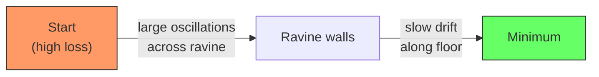
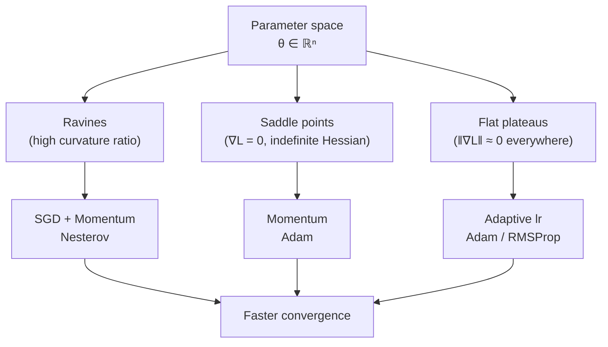

# Optimizers in Deep Learning: Why They Matter

Building on batch normalization (note 31), which stabilizes the loss landscape by normalizing activations, this note asks the next natural question: once we have a stable landscape, what is the best strategy to navigate it to a minimum?

## One-line definition

An optimizer is an algorithm that repeatedly adjusts a neural network's parameters in the direction that most reduces the training loss, using gradient information and (optionally) accumulated history.

## Why this topic matters

The choice of optimizer directly determines whether a model converges at all, how fast it converges, and whether the final solution generalizes. Plain SGD can work, but real loss landscapes contain ravines, saddle points, and regions of wildly varying curvature that cause plain SGD to oscillate, stall, or diverge. Modern optimizers—momentum, Nesterov, Adagrad, RMSProp, Adam—each solve a specific geometric pathology. Understanding the pathology each optimizer targets makes you a better practitioner than memorizing which optimizer is "best."

## The geometry of the loss surface

A neural network with $n$ parameters defines a scalar loss function $L(\theta)$ over an $n$-dimensional parameter space. The optimizer's job is to find a region of low loss. Three geometric features make this hard.

**Ravines.** A ravine is a valley that is much narrower in one direction than another. The gradient across the narrow direction is large, so gradient descent overshoots and oscillates. The gradient along the valley floor is small, so progress toward the minimum is slow.



**Saddle points.** In high dimensions, most critical points (where $\nabla L = 0$) are saddle points, not local minima. The gradient vanishes near them, so gradient descent stalls. The probability that all eigenvalues of the Hessian are positive (true local minimum) decreases exponentially with dimension.

**Noisy gradients.** Mini-batch SGD computes an unbiased but noisy estimate of the true gradient. With a fixed learning rate, the parameter trajectory performs a random walk in the neighborhood of a minimum instead of converging to it.

## The plain SGD update

The simplest update rule is:

$$
\theta_{t+1} = \theta_t - \eta \, \nabla_\theta L(\theta_t)
$$

where $\eta$ is the learning rate and $\nabla_\theta L(\theta_t)$ is the gradient (or mini-batch gradient estimate) at step $t$.


*Source: [Wikimedia Commons — Stochastic Gradient Descent](https://en.wikipedia.org/wiki/Stochastic_gradient_descent) (CC BY-SA 3.0)*

**Problems with plain SGD:**
- A single global learning rate $\eta$ is applied to every parameter, even though different parameters may need very different step sizes.
- No memory of previous steps, so every update ignores direction history.
- In ravines, the update oscillates perpendicular to the ravine while crawling along it.
- Near saddle points with $\nabla L \approx 0$, progress halts entirely.

## The optimizer family tree

| Family | Key Idea | Fixes | New Problem |
|---|---|---|---|
| Plain SGD | Follow negative gradient | Baseline | Oscillates in ravines, stalls at saddle points |
| SGD + Momentum | Accumulate velocity | Ravines, saddle points | Overshoots near minima |
| Nesterov (NAG) | Lookahead gradient | Overshooting of momentum | Slightly more complex |
| Adagrad | Per-parameter adaptive lr | Sparse features | Learning rate decays to zero |
| RMSProp | Decaying squared-grad average | Adagrad's vanishing lr | No bias correction |
| Adam | Momentum + RMSProp + bias correction | Most of the above | Can generalize worse than SGD in some settings |

## Why adaptive learning rates help

Different parameters participate in the loss at very different scales. Weights connected to rare features receive sparse, small gradients; weights connected to common features receive dense, large gradients. A single global $\eta$ is too large for the latter and too small for the former. Adaptive optimizers maintain a per-parameter effective learning rate:

$$
\eta_i^{\text{eff}} = \frac{\eta}{\text{scale}(g_{1:t,i})}
$$

where $\text{scale}(g_{1:t,i})$ is some function of the gradient history for parameter $i$.

## Loss landscape visualization



## PyTorch example

```python
import torch
import torch.nn as nn

# A small network to benchmark optimizers on
model = nn.Sequential(
    nn.Linear(64, 128),
    nn.ReLU(),
    nn.Linear(128, 64),
    nn.ReLU(),
    nn.Linear(64, 10),
)

# Instantiate the four main optimizer classes for comparison
sgd_plain     = torch.optim.SGD(model.parameters(), lr=1e-2)
sgd_momentum  = torch.optim.SGD(model.parameters(), lr=1e-2, momentum=0.9)
sgd_nesterov  = torch.optim.SGD(model.parameters(), lr=1e-2, momentum=0.9, nesterov=True)
rmsprop       = torch.optim.RMSprop(model.parameters(), lr=1e-3, alpha=0.99)
adam          = torch.optim.Adam(model.parameters(), lr=1e-3, betas=(0.9, 0.999), eps=1e-8)

# Typical training loop skeleton
criterion = nn.CrossEntropyLoss()
x = torch.randn(32, 64)   # dummy mini-batch
y = torch.randint(0, 10, (32,))

for optimizer in [sgd_plain, sgd_momentum, sgd_nesterov, rmsprop, adam]:
    optimizer.zero_grad()
    loss = criterion(model(x), y)
    loss.backward()
    optimizer.step()
```

## Interview questions

<details>
<summary>Why does plain SGD oscillate in ravines?</summary>

In a ravine the loss curvature is large perpendicular to the ravine and small along it. The gradient points mostly across the ravine, so each step swings back and forth across the steep walls while making minimal progress along the floor. The effective step in the useful direction is tiny compared to the wasteful oscillating steps.
</details>

<details>
<summary>What is a saddle point and why is it a problem in high dimensions?</summary>

A saddle point is a critical point where the gradient is zero but the Hessian has both positive and negative eigenvalues—it is a minimum in some directions and a maximum in others. Near a saddle point, gradient descent stalls because $\|\nabla L\|$ is close to zero. In high-dimensional spaces almost all critical points are saddle points, not local minima, because the probability of all $n$ eigenvalues being simultaneously positive shrinks exponentially with $n$.
</details>

<details>
<summary>What does it mean for an optimizer to be "adaptive"?</summary>

An adaptive optimizer maintains a separate effective learning rate for each parameter. Parameters whose gradients have historically been large receive smaller effective learning rates (to prevent overshooting), while parameters with small historical gradients receive larger effective learning rates (to make progress). Adagrad, RMSProp, and Adam are adaptive; plain SGD and vanilla momentum are not.
</details>

<details>
<summary>When would you prefer SGD with momentum over Adam?</summary>

SGD with momentum is often preferred when generalization matters more than convergence speed. Empirically, SGD with carefully tuned learning rate schedules frequently finds flatter minima that generalize better than Adam, particularly in image classification (e.g., training ResNets on ImageNet). Adam converges faster but can converge to sharper minima. If you have enough compute to tune the learning rate schedule, SGD + momentum is a strong choice.
</details>

## Common mistakes

- Assuming Adam is always the best optimizer for every task; it is the safest default but not always the best.
- Comparing optimizers at different learning rates and declaring one "better"—always tune the learning rate for each optimizer independently.
- Switching optimizers mid-training without resetting the optimizer state; accumulated moments from one phase distort updates in the next.
- Treating the optimizer as independent of the architecture; batch normalization changes the loss landscape and therefore changes which optimizer works best.

## Advanced perspective

From a second-order optimization viewpoint, the ideal update would use the inverse Hessian: $\theta_{t+1} = \theta_t - H^{-1} \nabla L$. This is Newton's method and converges quadratically, but computing $H^{-1}$ for a network with millions of parameters is intractable. All modern first-order optimizers are approximations to second-order methods. Adagrad and RMSProp approximate the diagonal of the Fisher information matrix (which is related to the Hessian for probabilistic models). Adam combines this with a momentum term, giving a practical and robust approximation that works well across a wide range of architectures and tasks.

## Final takeaway

The optimizer is not a plug-and-play component—it is a geometric strategy for traversing the loss landscape. Plain SGD's failure modes (ravines, saddle points, noisy gradients, uniform learning rates) each inspired a specific algorithmic fix. Understanding these fixes as principled responses to geometric problems—rather than as black-box magic—lets you reason about which optimizer to try first, how to diagnose convergence failures, and when the default (Adam, lr=1e-3) is genuinely suboptimal.

## References

- Ruder, S. (2016). [An overview of gradient descent optimization algorithms](https://arxiv.org/abs/1609.04747)
- Goodfellow, I., Bengio, Y., & Courville, A. (2016). *Deep Learning*, Chapter 8. MIT Press.
- Dauphin, Y. et al. (2014). [Identifying and attacking the saddle point problem in high-dimensional non-convex optimization](https://arxiv.org/abs/1406.2572)
- PyTorch Optimizer Documentation: https://pytorch.org/docs/stable/optim.html
