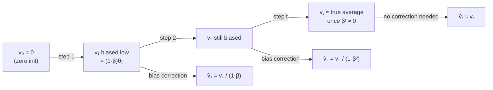

# Exponentially Weighted Moving Average

Note 32 introduced the optimizer family tree. Before deriving any specific optimizer, we need a building block that appears in all momentum-based methods: the exponentially weighted moving average (EWMA). Every optimizer from SGD with momentum to Adam uses this primitive to smooth noisy gradient signals.

## One-line definition

An exponentially weighted moving average (EWMA) is a recurrence $v_t = \beta \, v_{t-1} + (1-\beta) \, \theta_t$ that produces a weighted average of past observations where older values decay geometrically.

## Why this topic matters

Gradient signals from mini-batches are noisy. Applying a raw gradient at every step means the optimizer reacts to statistical fluctuations rather than the underlying loss surface geometry. EWMA provides a principled way to smooth this noise while still tracking recent changes—it is the mathematical foundation of momentum, RMSProp, and both moment estimates in Adam. Understanding EWMA rigorously means you understand why those optimizers behave the way they do.

## The EWMA recurrence

Let $\theta_1, \theta_2, \ldots, \theta_t$ be a sequence of observations (e.g., gradient values). The EWMA $v_t$ is defined by the recurrence:

$$
v_t = \beta \, v_{t-1} + (1-\beta) \, \theta_t
$$

with $v_0 = 0$ and $\beta \in [0, 1)$ called the **decay factor** or **momentum coefficient**.


*Source: [Wikimedia Commons — Artificial Neural Network](https://commons.wikimedia.org/wiki/File:Artificial_neural_network.svg) (CC BY-SA 4.0)*

Unrolling the recurrence reveals that $v_t$ is a weighted sum of all past observations:

$$
v_t = (1-\beta) \sum_{k=0}^{t-1} \beta^k \, \theta_{t-k}
$$

The weight on observation $\theta_{t-k}$ is $(1-\beta)\beta^k$, which decreases geometrically as $k$ increases. Recent observations carry more weight than old ones.

## Effective window size

How many recent observations does $v_t$ effectively average? The weight on an observation $k$ steps ago is $(1-\beta)\beta^k$. This drops below $1/e$ of its initial value when:

$$
\beta^k = \frac{1}{e} \implies k = \frac{1}{1-\beta}
$$

(using the approximation $\beta^{1/(1-\beta)} \approx 1/e$ for $\beta$ close to 1).

Therefore the effective window size is approximately $\frac{1}{1-\beta}$:

| $\beta$ | Effective window |
|---|---|
| 0.5 | 2 steps |
| 0.9 | 10 steps |
| 0.99 | 100 steps |
| 0.999 | 1000 steps |

In Adam, $\beta_2 = 0.999$ means the second moment estimate averages over roughly 1000 recent squared-gradient values.

## The initialization bias problem

At $t=0$, we initialize $v_0 = 0$. This zero initialization pulls the early estimates of $v_t$ strongly toward zero, even when the true moving average of the data should be much larger.

Expanding $v_1$ and $v_2$ explicitly:

$$
v_1 = (1-\beta)\,\theta_1
$$

$$
v_2 = \beta(1-\beta)\,\theta_1 + (1-\beta)\,\theta_2
$$

For $\beta = 0.9$, $v_1 = 0.1\,\theta_1$—only 10% of the actual observation value. This is the initialization bias: the EWMA is biased toward zero in the early steps and converges to the true moving average only after many steps.

## Bias correction

To correct for the zero initialization, we divide by the accumulated weight at time $t$:

$$
\hat{v}_t = \frac{v_t}{1 - \beta^t}
$$

**Derivation.** The sum of all weights in the unrolled recurrence is:

$$
(1-\beta) \sum_{k=0}^{t-1} \beta^k = (1-\beta) \cdot \frac{1-\beta^t}{1-\beta} = 1 - \beta^t
$$

Dividing by $1 - \beta^t$ rescales the weights so they sum to 1, giving an unbiased estimate of the mean of recent observations. As $t \to \infty$, $\beta^t \to 0$ and the correction factor $1 - \beta^t \to 1$, so the correction becomes negligible after the warm-up phase.



## PyTorch example

```python
import math

def ewma_with_bias_correction(observations: list[float], beta: float) -> list[tuple]:
    """
    Compute EWMA and bias-corrected EWMA for a sequence of observations.
    Returns (t, raw_observation, v_raw, v_corrected) for each step.
    """
    v = 0.0
    results = []
    for t, theta in enumerate(observations, start=1):
        v = beta * v + (1 - beta) * theta          # EWMA recurrence
        v_hat = v / (1 - beta ** t)                # bias-corrected estimate
        results.append((t, theta, round(v, 4), round(v_hat, 4)))
    return results

# Example: noisy gradient magnitudes over 10 steps
gradients = [0.8, 1.2, 0.5, 1.5, 0.9, 1.1, 0.7, 1.3, 1.0, 0.6]
beta = 0.9

print(f"{'t':>3}  {'θ_t':>6}  {'v_t (raw)':>12}  {'v_t (corrected)':>16}")
for t, theta, v_raw, v_corr in ewma_with_bias_correction(gradients, beta):
    print(f"{t:>3}  {theta:>6.2f}  {v_raw:>12.4f}  {v_corr:>16.4f}")

# The bias-corrected column stays near the true running mean (≈ 0.96)
# even in the first few steps, while the raw v_t starts near zero.
```

## EWMA as the backbone of momentum optimizers

The EWMA is not used in isolation—it is the sub-routine inside every modern optimizer:

| Optimizer | What EWMA is applied to | $\beta$ role |
|---|---|---|
| SGD + Momentum | Gradient $g_t$ | $\beta$ = momentum coefficient |
| Nesterov | Gradient $g_t$ (at lookahead point) | Same |
| RMSProp | Squared gradient $g_t^2$ | $\beta$ = decay rate $\alpha$ |
| Adam (first moment) | Gradient $g_t$ | $\beta_1$ |
| Adam (second moment) | Squared gradient $g_t^2$ | $\beta_2$ |

## Interview questions

<details>
<summary>What does the decay factor β control in EWMA?</summary>

$\beta$ controls the effective memory of the average. A high $\beta$ (e.g., 0.99) means the estimate changes slowly and averages over many past observations—smooth but slow to respond to sudden changes. A low $\beta$ (e.g., 0.5) means the estimate follows recent observations closely but is noisier. The effective window size is $1/(1-\beta)$.
</details>

<details>
<summary>Why does EWMA initialize to zero, and what problem does this cause?</summary>

Initializing $v_0 = 0$ is the standard convention. The problem is that early estimates are biased toward zero: $v_1 = (1-\beta)\theta_1$, which is much smaller than $\theta_1$ for large $\beta$. For $\beta = 0.9$, $v_1$ is only 10% of the first observation. This bias causes optimizers to take tiny steps early in training when the steps should be normal-sized.
</details>

<details>
<summary>Derive why the bias correction factor is 1 - β^t.</summary>

At time $t$, the unrolled EWMA is $v_t = (1-\beta)\sum_{k=0}^{t-1}\beta^k\theta_{t-k}$. The sum of weights is $(1-\beta)\sum_{k=0}^{t-1}\beta^k = 1 - \beta^t$. If all observations were equal to some constant $\mu$, we would get $v_t = \mu(1-\beta^t)$, not $\mu$. Dividing by $1-\beta^t$ corrects this so the weights sum to 1 and $\hat{v}_t = \mu$ as required.
</details>

<details>
<summary>After how many steps does bias correction become negligible for β = 0.9?</summary>

We need $\beta^t \approx 0$. For $\beta = 0.9$: $0.9^{10} \approx 0.35$, $0.9^{20} \approx 0.12$, $0.9^{50} \approx 0.005$. After roughly 50 steps, the correction factor is $1 - 0.005 = 0.995 \approx 1$ and is negligible. For $\beta_2 = 0.999$ in Adam, it takes about 5000 steps for the correction to become negligible.
</details>

## Common mistakes

- Confusing EWMA (exponential decay of old observations) with a simple moving average (equal weight over a fixed window). They are mathematically different and have different memory properties.
- Omitting bias correction when implementing Adam or momentum from scratch. Without it, the optimizer takes abnormally small steps in the first few iterations.
- Setting $\beta$ too high (e.g., 0.9999) in practice; this makes the optimizer extremely slow to respond to changing gradient directions, effectively removing the memory benefit that motivated the moving average in the first place.
- Treating the effective window size $1/(1-\beta)$ as an exact equality rather than an approximation; it is derived from a geometric series approximation valid for $\beta$ near 1.

## Advanced perspective

EWMA can be interpreted through the lens of exponential smoothing in time series analysis (Holt, 1957). In that literature, the parameter $\beta$ is called the smoothing parameter $\alpha_s = 1 - \beta$. The bias-correction formula corresponds to making the estimator consistent at $t=1$. In the stochastic optimization literature, EWMA with bias correction is closely related to the concept of online estimation of the first and second moments of a distribution—which is exactly what Adam formalizes. The variance of the EWMA estimate at stationarity is $\frac{1-\beta}{1+\beta}\sigma^2$, showing that higher $\beta$ reduces variance at the cost of increased lag.

## Final takeaway

EWMA is the mathematical primitive that converts a noisy gradient sequence into a smooth, reliable signal. Its decay factor $\beta$ controls the memory-variance tradeoff: higher $\beta$ gives smoother but slower-reacting estimates. The zero initialization creates a bias in early steps that must be corrected by dividing by $1 - \beta^t$. This correction is the same formula used in Adam's bias-corrected moment estimates. Master EWMA and the mechanics of every momentum-based optimizer become transparent.

## References

- Kingma, D. P., & Ba, J. (2014). [Adam: A Method for Stochastic Optimization](https://arxiv.org/abs/1412.6980)
- Goodfellow, I., Bengio, Y., & Courville, A. (2016). *Deep Learning*, §8.3. MIT Press.
- Holt, C. C. (1957). Forecasting seasonals and trends by exponentially weighted moving averages. *ONR Research Memorandum*, Carnegie Institute of Technology.
