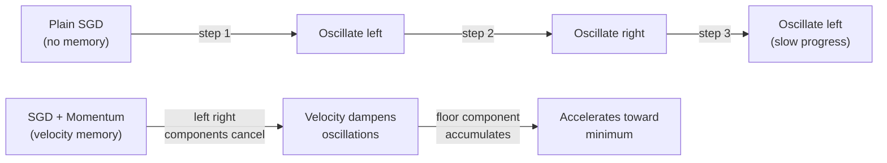

# SGD with Momentum

Note 33 established EWMA as the tool for smoothing noisy sequences. SGD with momentum applies that tool directly to the gradient sequence, accumulating a velocity vector that replaces the raw gradient in the parameter update. This single addition resolves two of plain SGD's most damaging failure modes: oscillation in ravines and stalling near saddle points.

## One-line definition

SGD with momentum replaces the instantaneous gradient with an exponentially weighted running average of past gradients (the velocity), so parameters accelerate in consistent gradient directions and decelerate when the gradient oscillates.

## Why this topic matters

Momentum is arguably the most important algorithmic improvement over plain SGD. It is cheap (one extra vector of the same size as the parameters), it is theoretically well-understood, and it provides the intuition behind every more sophisticated optimizer. Even Adam can be interpreted as momentum applied to normalized gradients. Understanding momentum means understanding the core of modern deep learning optimization.

## The update rule

Let $g_t = \nabla_\theta L(\theta_t)$ be the mini-batch gradient at step $t$. SGD with momentum introduces a velocity vector $v_t$:

**Velocity update (EWMA of gradients):**

$$
v_t = \beta \, v_{t-1} + \eta \, g_t
$$

**Parameter update:**

$$
\theta_{t+1} = \theta_t - v_t
$$

Here $\beta \in [0, 1)$ is the momentum coefficient (typically 0.9) and $\eta$ is the learning rate.


*Source: [Wikimedia Commons — Stochastic Gradient Descent](https://en.wikipedia.org/wiki/Stochastic_gradient_descent) (CC BY-SA 3.0)*

**Alternative convention.** Some texts (and PyTorch's default) scale the gradient by $(1-\beta)$ before adding:

$$
v_t = \beta \, v_{t-1} + (1-\beta) \, g_t, \qquad \theta_{t+1} = \theta_t - \eta \, v_t
$$

Both conventions are equivalent after absorbing the scaling into $\eta$; the PyTorch default uses the first form.

## Unrolled view: what is the velocity?

Unrolling the recurrence shows that $v_t$ is a weighted sum of all past gradients:

$$
v_t = \eta \sum_{k=0}^{t-1} \beta^k \, g_{t-k}
$$

The current gradient has weight $\eta$, the gradient from one step ago has weight $\eta\beta$, from two steps ago $\eta\beta^2$, and so on. Older gradients contribute less. The effective window is $1/(1-\beta) \approx 10$ steps for $\beta = 0.9$.

## The ball-rolling analogy

Imagine a heavy ball rolling down a hilly surface. Without momentum, the ball stops and restarts at every step, always moving exactly along the local slope. With momentum, the ball accumulates speed. When rolling through a consistent downhill direction, it speeds up (velocity accumulates in the same direction). When the terrain oscillates—as in a ravine—the ball's mass dampens the sideways wobbling while the component along the valley floor keeps building.



## How momentum solves the ravine problem

In a ravine, the gradient has two components:
- **Perpendicular to ravine** (large magnitude, alternates sign each step): $g_\perp$
- **Along the ravine floor** (small magnitude, consistent sign): $g_\parallel$

After $T$ steps of momentum:

$$
v_T^\perp = \eta g_\perp \sum_{k=0}^{T-1} \beta^k (-1)^k \approx \frac{\eta g_\perp}{1+\beta}
$$

The alternating signs cause the sum to nearly cancel—oscillations are damped by the factor $1/(1+\beta)$. For $\beta = 0.9$, the perpendicular oscillations are suppressed to about $1/19$ of their raw magnitude.

For the floor direction, where the gradient has consistent sign:

$$
v_T^\parallel = \eta g_\parallel \sum_{k=0}^{T-1} \beta^k = \frac{\eta g_\parallel}{1-\beta}
$$

The velocity grows up to $1/(1-\beta) = 10\times$ the single-step gradient for $\beta = 0.9$, effectively giving a larger step size along the productive direction.

## Effect on the effective learning rate

In a consistent direction, the terminal velocity (steady state) is:

$$
v_\infty = \frac{\eta}{1-\beta} \cdot g
$$

This means momentum effectively multiplies the learning rate by $1/(1-\beta)$ in the direction of consistent gradients. For $\beta = 0.9$, the effective learning rate is $10\times$ larger in consistent directions.

**Practical implication:** When switching from plain SGD to momentum SGD with $\beta = 0.9$, you should reduce the learning rate by roughly $1-\beta = 0.1$ to keep the effective update magnitude similar—or lower it and let momentum handle the acceleration.

## Convergence speed comparison

| Setting | Typical convergence rate |
|---|---|
| Plain SGD (learning rate $\eta$) | $O(1/t)$ for convex problems |
| SGD + Momentum | Faster in practice; theoretically $O(1/\sqrt{t})$ for non-convex |
| Optimal momentum (Polyak, 1964) | $O((1-\sqrt{\eta/L})^t)$ for strongly convex problems |

For strongly convex functions, the optimal momentum coefficient is $\beta = \frac{1 - \sqrt{\eta \mu}}{1 + \sqrt{\eta \mu}}$ where $\mu$ is the strong convexity constant and $L$ is the Lipschitz constant of the gradient. In practice, $\beta = 0.9$ is a robust default.

## PyTorch example

```python
import torch
import torch.nn as nn

# Build a network for binary classification
model = nn.Sequential(
    nn.Linear(20, 64),
    nn.ReLU(),
    nn.Linear(64, 32),
    nn.ReLU(),
    nn.Linear(32, 1),
    nn.Sigmoid(),
)

# Plain SGD for comparison
sgd = torch.optim.SGD(model.parameters(), lr=1e-2)

# SGD with momentum — note: reduce lr relative to plain SGD
# because momentum amplifies the effective step size
sgd_momentum = torch.optim.SGD(
    model.parameters(),
    lr=1e-2,        # can be lower than plain SGD lr
    momentum=0.9,   # standard choice; 0.99 for large-batch training
    dampening=0,    # 0 = pure EWMA velocity; >0 = dampen gradient addition
    nesterov=False, # standard momentum (not Nesterov)
    weight_decay=1e-4,  # L2 regularization can be combined with momentum
)

criterion = nn.BCELoss()
x = torch.randn(64, 20)
y = torch.randint(0, 2, (64, 1)).float()

# Training step
sgd_momentum.zero_grad()
loss = criterion(model(x), y)
loss.backward()
sgd_momentum.step()

# Inspect the velocity (first moment) stored in optimizer state
for group in sgd_momentum.param_groups:
    for p in group['params']:
        state = sgd_momentum.state[p]
        if 'momentum_buffer' in state:
            print(f"Param shape: {p.shape}, velocity norm: {state['momentum_buffer'].norm():.4f}")
```

## Interview questions

<details>
<summary>Write out the full SGD with momentum update in terms of θ, v, η, β, and g.</summary>

$$v_t = \beta \, v_{t-1} + \eta \, g_t$$

$$\theta_{t+1} = \theta_t - v_t$$

where $g_t = \nabla_\theta L(\theta_t)$, $\eta$ is the learning rate, and $\beta$ is the momentum coefficient. The velocity $v_t$ is initialized to the zero vector.
</details>

<details>
<summary>How does momentum dampen oscillations in ravines?</summary>

In a ravine, the gradient component perpendicular to the ravine alternates sign each step. When these alternating gradients are accumulated in the velocity, consecutive terms largely cancel: $\eta g_\perp - \eta\beta g_\perp + \eta\beta^2 g_\perp - \ldots \approx \eta g_\perp / (1+\beta)$. For $\beta = 0.9$, perpendicular oscillations are suppressed to about 5% of their plain SGD magnitude. The consistent floor-direction gradient accumulates instead, accelerating progress toward the minimum.
</details>

<details>
<summary>What is the effective learning rate multiplier due to momentum?</summary>

In steady state with a consistent gradient direction, the velocity reaches $v_\infty = \frac{\eta}{1-\beta} g$. This means momentum effectively scales the learning rate by $\frac{1}{1-\beta}$. For $\beta = 0.9$, the effective learning rate is $10\times$ the nominal $\eta$ in consistent directions. This is why practitioners often reduce $\eta$ when enabling momentum.
</details>

<details>
<summary>What is "dampening" in PyTorch's SGD and how does it differ from standard momentum?</summary>

With `dampening=0` (default), PyTorch uses the standard recurrence: $v_t = \beta v_{t-1} + g_t$ (scaled by $\eta$ in the parameter update). With `dampening=d`, the gradient contribution is reduced: $v_t = \beta v_{t-1} + (1-d) g_t$. Setting `dampening = momentum` gives the EWMA form $v_t = \beta v_{t-1} + (1-\beta) g_t$, which scales the effective learning rate differently. Standard (undamped) momentum is the classical Polyak formulation.
</details>

## Common mistakes

- Not reducing the learning rate when switching from plain SGD to momentum SGD; the terminal effective learning rate is $\eta/(1-\beta)$ which can cause divergence if the original $\eta$ was already near the stability limit.
- Using $\beta > 0.99$ for standard mini-batch training; at this level the optimizer barely responds to the current gradient and can overshoot badly when the loss landscape changes.
- Forgetting that the optimizer state (velocity buffer) persists across mini-batches and must be reset when intentionally restarting training from a checkpoint with different data.
- Confusing the damped and undamped conventions; PyTorch uses the undamped (Polyak) form by default, not the EWMA form.

## Advanced perspective

Sutskever et al. (2013) showed that the specific parameterization matters for neural networks: using the "half-step" formulation $v_{t+1} = \beta v_t - \eta g_t$ followed by $\theta_{t+1} = \theta_t + v_{t+1}$ is equivalent to the standard form but can be more numerically stable. This is also the stepping stone to Nesterov momentum (note 35), which evaluates the gradient at the *anticipated* position $\theta_t + \beta v_t$ rather than the current position. The difference between standard and Nesterov momentum is subtle but matters when the loss landscape changes quickly relative to the effective window of the velocity.

## Final takeaway

SGD with momentum is the simplest and most principled upgrade to plain SGD. By accumulating a velocity vector as an EWMA of past gradients, momentum dampens oscillations in ravines by a factor of $1/(1+\beta)$, accelerates along consistent gradient directions by a factor of $1/(1-\beta)$, and helps the optimizer carry through saddle points where the gradient is transiently small. The cost is one extra vector of memory and one extra hyperparameter $\beta$—almost always worth it.

## References

- Polyak, B. T. (1964). Some methods of speeding up the convergence of iteration methods. *USSR Computational Mathematics and Mathematical Physics*, 4(5), 1–17.
- Sutskever, I., Martens, J., Dahl, G., & Hinton, G. (2013). [On the importance of initialization and momentum in deep learning](http://proceedings.mlr.press/v28/sutskever13.html). *ICML*.
- Ruder, S. (2016). [An overview of gradient descent optimization algorithms](https://arxiv.org/abs/1609.04747)
- PyTorch SGD: https://pytorch.org/docs/stable/generated/torch.optim.SGD.html
