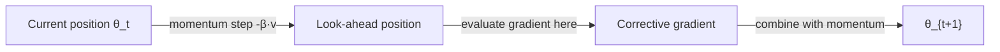

# Nesterov accelerated gradient

Classical SGD with momentum has a subtle problem: the momentum term carries the optimizer forward using gradient information from the current position, but then the momentum itself may overshoot. Nesterov momentum corrects this by computing the gradient at the approximate future position — before applying the update — making it a more prescient version of momentum.

## One-line definition

Nesterov accelerated gradient (NAG) computes the gradient at the look-ahead position $\theta - \beta v_{t-1}$ rather than the current position $\theta$, allowing the optimizer to correct course before overshooting.

## Why this topic matters

On convex problems, Nesterov's method achieves the theoretical optimal $O(1/t^2)$ convergence rate compared to $O(1/t)$ for vanilla gradient descent. In practice, it tends to converge slightly faster than classical momentum near the minimum, where classical momentum tends to oscillate due to overshooting.

## Classical momentum vs Nesterov: the key difference

**Classical SGD with momentum** evaluates the gradient at the *current* position, then moves:

$$
v_t = \beta v_{t-1} + \eta \nabla_\theta \mathcal{L}(\theta_t)
$$

$$
\theta_{t+1} = \theta_t - v_t
$$

**Nesterov** first takes the momentum step to a look-ahead position, then evaluates the gradient there:


*Source: [Wikimedia Commons — Stochastic Gradient Descent](https://en.wikipedia.org/wiki/Stochastic_gradient_descent) (CC BY-SA 3.0)*

$$
\theta_{\text{look-ahead}} = \theta_t - \beta v_{t-1}
$$

$$
v_t = \beta v_{t-1} + \eta \nabla_\theta \mathcal{L}(\theta_{\text{look-ahead}})
$$

$$
\theta_{t+1} = \theta_t - v_t
$$

The difference is where the gradient is evaluated: at $\theta_t$ (current) vs $\theta_t - \beta v_{t-1}$ (where momentum will take us).

## Why the look-ahead helps



With classical momentum, if the velocity is pointing in a slightly wrong direction (perhaps toward a valley wall), the gradient at $\theta_t$ provides only a weak correction because you are still at the current position.

With Nesterov, you first move to the look-ahead position and then compute the gradient. If the look-ahead position is already past the minimum, the gradient there points back — a much stronger corrective signal applied earlier, before the overshoot.

## Intuitive analogy

Classical momentum is like a ball that runs forward, then looks down to see the slope. Nesterov is like a ball that looks ahead to where it will land, then adjusts course mid-flight. The correction is more timely.

## PyTorch example

```python
import torch
import torch.nn as nn

model = nn.Sequential(
    nn.Linear(64, 128),
    nn.ReLU(),
    nn.Linear(128, 10)
)

# Nesterov momentum — just add nesterov=True to SGD
optimizer = torch.optim.SGD(
    model.parameters(),
    lr=0.01,
    momentum=0.9,
    nesterov=True   # enables Nesterov variant
)

criterion = nn.CrossEntropyLoss()
x = torch.randn(32, 64)
y = torch.randint(0, 10, (32,))

optimizer.zero_grad()
loss = criterion(model(x), y)
loss.backward()
optimizer.step()
```

## Nesterov vs classical momentum in practice

| Scenario | Classical momentum | Nesterov |
|---|---|---|
| Convex, smooth loss | Good | Slightly faster, optimal rate |
| Near minimum (oscillation) | May oscillate | Corrects before overshoot |
| Non-convex deep nets | Comparable | Marginally better in some cases |
| Implementation complexity | Simple | Minimal extra cost |

In practice, the difference between Nesterov and classical momentum is often small for deep neural networks, where the loss landscape is highly non-convex. The main benefit appears in simpler convex settings or when training with large momentum values.

## Interview questions

<details>
<summary>What is the key difference between classical momentum and Nesterov momentum?</summary>

Classical momentum evaluates the gradient at the current position $\theta_t$, then updates with the combined gradient and velocity. Nesterov first takes the momentum step to a look-ahead position $\theta_t - \beta v_{t-1}$, evaluates the gradient there, and then computes the update. This means the gradient provides a corrective signal from the future position rather than the current one, which reduces overshooting.
</details>

<details>
<summary>Why does Nesterov achieve better theoretical convergence rates on convex problems?</summary>

Nesterov's analysis shows that by evaluating the gradient at the future position, the algorithm implicitly uses curvature information more effectively than plain momentum. On convex smooth functions, this gives a convergence rate of $O(1/t^2)$ compared with $O(1/t)$ for vanilla gradient descent, which is the optimal rate for first-order methods in that setting.
</details>

<details>
<summary>In PyTorch, what is the one change needed to use Nesterov instead of classical momentum?</summary>

Add `nesterov=True` to `torch.optim.SGD`. The momentum coefficient must also be set (e.g., `momentum=0.9`). PyTorch implements this with no additional computational overhead.
</details>

## Common mistakes

- Expecting dramatic improvements over classical momentum in deep learning — the gains are often marginal on non-convex networks.
- Forgetting that `nesterov=True` requires a nonzero `momentum` value in PyTorch; without it, the flag has no effect.
- Confusing the look-ahead position with an actual parameter update — it is only used for gradient evaluation, not as a new parameter set.

## Advanced perspective

Nesterov's acceleration is a foundational result in optimization theory. The key insight is that gradient descent follows a "greedy" strategy that can be improved by incorporating information about the optimization trajectory (momentum). Nesterov extended this to show that a two-step procedure — move with momentum, then correct — is optimal for smooth convex functions. This influenced not only SGD variants but also the broader field of accelerated proximal methods and operator splitting in optimization.

## Final takeaway

Nesterov momentum is classical momentum with one improvement: evaluate the gradient where you are going, not where you are. The correction is more prescient, reducing oscillations near the minimum. In practice, use `nesterov=True` in SGD as a free improvement — it rarely hurts and occasionally helps.

## References

- Nesterov, Y. (1983). A method for solving the convex programming problem with convergence rate O(1/k²).
- Sutskever et al. (2013). On the importance of initialization and momentum in deep learning.
