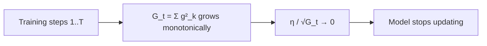

# Adagrad

SGD and momentum use the same learning rate for every parameter. This is suboptimal: frequent parameters (embeddings that appear often) should have small updates, while rare parameters (embeddings seen infrequently) should have large updates to learn as much as possible from each rare appearance. Adagrad was the first optimizer to assign individual learning rates based on gradient history.

## One-line definition

Adagrad adapts the learning rate per parameter by dividing the gradient by the square root of all accumulated squared gradients from the start of training — large past gradients shrink the effective learning rate, small past gradients allow larger updates.

## Why this topic matters

Adagrad was a breakthrough for NLP tasks with sparse inputs, particularly training word embeddings on large vocabularies. Rare words receive larger updates because their accumulated gradient sum is small. Frequent words receive smaller updates because they accumulate large gradient sums. This made it the optimizer of choice for early word vector training, and its core idea (per-parameter scaling) became the foundation for RMSProp and Adam.

## The Adagrad update

**Accumulated squared gradient** (one value per parameter, running sum from step 1 to $t$):

$$
G_t = \sum_{k=1}^{t} g_k^2
$$

where $g_k = \nabla_\theta \mathcal{L}(\theta_{k-1})$ is the gradient at step $k$.

**Parameter update:**

$$
\theta_{t+1} = \theta_t - \frac{\eta}{\sqrt{G_t} + \epsilon} \cdot g_t
$$

- $\eta$: base learning rate (typically 0.01 for Adagrad)
- $G_t$: accumulated squared gradient (larger = smaller effective learning rate)
- $\epsilon$: numerical stability constant ($10^{-8}$)

The effective learning rate per parameter is:

$$
\eta_{\text{eff},i} = \frac{\eta}{\sqrt{G_{t,i}} + \epsilon}
$$

## What Adagrad accomplishes

| Parameter type | $G_t$ behavior | Effective LR |
|---|---|---|
| Frequent (large, consistent gradients) | Grows quickly | Decreases rapidly |
| Rare (small or infrequent gradients) | Grows slowly | Stays large |
| Sparse (gradient = 0 most steps) | Barely grows | Stays at $\eta$ |

This is exactly the right behavior for NLP with one-hot or sparse token features.

## The fatal flaw: monotonically decreasing LR

Because $G_t$ is a **sum** of all past squared gradients, it only ever increases. The effective learning rate therefore only ever decreases and never recovers. For long training runs, $G_t$ becomes so large that the effective learning rate approaches zero — the model stops learning entirely, even if it has not yet converged.



This is the problem that RMSProp (note 37) was designed to fix by replacing the running sum with an exponentially weighted moving average.

## PyTorch example

```python
import torch
import torch.nn as nn

# Adagrad is good for sparse NLP tasks
# Example: word embedding training or text classification

model = nn.Sequential(
    nn.Embedding(10000, 64),  # large vocabulary — sparse gradients
    nn.Linear(64, 2)
)

optimizer = torch.optim.Adagrad(
    model.parameters(),
    lr=0.01,
    eps=1e-8
)

criterion = nn.CrossEntropyLoss()

# Simulate a batch of token IDs (sparse input)
token_ids = torch.randint(0, 10000, (32,))
labels = torch.randint(0, 2, (32,))

optimizer.zero_grad()
embeddings = model[0](token_ids)
logits = model[1](embeddings)
loss = criterion(logits, labels)
loss.backward()
optimizer.step()

# The embedding gradient is sparse (only rows in token_ids receive gradients)
# Adagrad handles this well: rare tokens get larger updates
```

## When to use Adagrad

**Good fit:**
- NLP with large, sparse vocabularies (early word embedding training)
- Feature learning from one-hot encoded inputs
- Short training runs where LR decay is not yet a problem

**Poor fit:**
- Dense feature tasks (CNNs, MLPs on tabular data)
- Long training runs — learning rate collapses
- Anything needing sustained learning (use RMSProp or Adam instead)

## Interview questions

<details>
<summary>What problem does Adagrad solve that plain SGD does not?</summary>

Adagrad assigns individual learning rates per parameter based on historical gradient magnitudes. Parameters that receive large gradients consistently (frequent features) get small effective learning rates, while parameters with small or sparse gradients (rare features) maintain large learning rates. Plain SGD treats all parameters identically, which is inefficient when gradient scales vary widely across parameters (e.g., word embeddings in NLP).
</details>

<details>
<summary>What is the main failure mode of Adagrad?</summary>

The accumulated squared gradient G_t is a monotonically increasing sum — it never decreases. For long training runs, G_t becomes so large that the effective learning rate η/√G_t approaches zero, causing the model to stop learning before convergence. This makes Adagrad impractical for dense, long-training tasks. RMSProp fixes this by using an EWMA of squared gradients instead of a running sum.
</details>

<details>
<summary>Why is Adagrad well-suited for sparse input features?</summary>

For rare features (e.g., infrequent words in a vocabulary), their gradients are nonzero in only a few steps, so G_t stays small and the effective learning rate stays large. These parameters are updated aggressively on the rare steps when they are seen. Frequent features accumulate large G_t quickly, so their learning rate decreases — preventing overcorrection.
</details>

## Common mistakes

- Using Adagrad for dense tasks with long training — the learning rate collapse makes it unsuitable.
- Setting $\eta$ too large (e.g., 0.1 instead of 0.01) — Adagrad already amplifies updates for sparse parameters; a large base rate compounds this.
- Expecting Adagrad to perform as well as Adam on deep networks — for most modern tasks, Adam or AdamW is superior.

## Advanced perspective

Adagrad can be viewed as preconditioned gradient descent, where the preconditioner is the diagonal of the Fisher information matrix (approximated by the outer product of gradients). This preconditioning makes the update geometry-aware: parameters with high curvature (large gradients) take small steps, while parameters in flat directions take large steps. AdaGrad's full matrix version (not the diagonal approximation) is theoretically elegant but computationally infeasible for large models.

## Final takeaway

Adagrad introduced per-parameter adaptive learning rates — a genuinely important idea. It works well for sparse NLP tasks. Its learning rate collapse for dense tasks motivated RMSProp and eventually Adam, both of which inherit the adaptive scaling idea while fixing the monotone decay problem.

## References

- Duchi, J., Hazan, E., & Singer, Y. (2011). Adaptive Subgradient Methods for Online Learning. JMLR.
