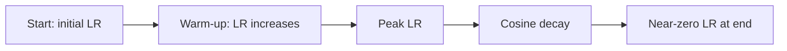

# Hyperparameter tuning for neural networks

A neural network with a perfect architecture can fail entirely with the wrong learning rate. Hyperparameter tuning is the systematic process of finding the combination of settings — learning rate, batch size, depth, dropout, regularization — that makes training converge to a well-generalizing model.

## One-line definition

Hyperparameter tuning is the process of selecting the non-learnable settings of a neural network training process (as opposed to the learned weights) to maximize generalization performance.

## Why this topic matters

Learned parameters ($W$, $b$) are optimized by backpropagation. Hyperparameters are not — they must be set by the practitioner. A suboptimal learning rate can prevent convergence entirely; wrong regularization causes underfitting or overfitting; wrong batch size destabilizes training. Good tuning is the difference between a model that works and one that does not.

## The hyperparameter hierarchy

Not all hyperparameters matter equally. Prioritize in this order:


*Source: [Wikimedia Commons — Artificial Neural Network](https://commons.wikimedia.org/wiki/File:Artificial_neural_network.svg) (CC BY-SA 4.0)*

| Priority | Hyperparameter | Why |
|---|---|---|
| 1 | Learning rate $\eta$ | Most sensitive — right order of magnitude is essential |
| 2 | Batch size | Affects gradient noise, memory, and training speed |
| 3 | Regularization (dropout, weight decay) | Controls overfitting |
| 4 | Network depth and width | Determines model capacity |
| 5 | Momentum / Adam betas | Usually defaults work well |
| 6 | Weight initialization | Usually Xavier/He defaults work |

**Rule**: Tune in order of impact. Do not adjust momentum before fixing the learning rate.

## Learning rate: the most critical hyperparameter

The learning rate determines the step size in parameter space.

| LR too large | LR too small |
|---|---|
| Loss oscillates or diverges | Training is extremely slow |
| Overshoots minima | Gets stuck near initial point |
| NaN loss | Never converges in budget |

### Learning rate range test (LR finder)

Start with a very small LR and increase it exponentially over a short training run. Plot train loss vs. LR. The optimal LR is just before the loss starts diverging:

```python
from torch.optim.lr_scheduler import CyclicLR

# Quick LR range test
lrs = torch.logspace(-5, 0, steps=100)
losses = []
for lr in lrs:
    # reset model, run one batch with this lr, record loss
    pass
# plot losses vs lrs — optimal lr is where loss decreases fastest
```

### Learning rate schedules

Training often benefits from starting with a higher LR (to escape bad regions) and decaying it (to converge precisely):



```python
import torch
from torch.optim.lr_scheduler import CosineAnnealingLR, LinearLR, SequentialLR

optimizer = torch.optim.AdamW(model.parameters(), lr=1e-3)

# Cosine annealing: smooth decay from lr to 0
scheduler = CosineAnnealingLR(optimizer, T_max=100)

for epoch in range(100):
    train_one_epoch()
    scheduler.step()
```

## Batch size

Batch size controls the tradeoff between gradient quality and training speed.

| Small batch (8–64) | Large batch (512–4096) |
|---|---|
| Noisy gradients — often better regularization | Stable, accurate gradients |
| Slow per-epoch (fewer parallelism) | Fast wall-clock time with GPUs |
| Finds flatter minima (empirically) | May converge to sharper minima |
| Less memory required | Requires more GPU memory |

**Key rule**: If you double the batch size, try doubling the learning rate (linear scaling rule). Large-batch training often needs warmup.

## Regularization hyperparameters

**Dropout rate**: typically 0.1–0.5. Higher for wide layers, lower for narrow. Start with 0.0 and increase if validation loss diverges from training loss.

**Weight decay (L2 regularization)**: typically 1e-4 to 1e-2. AdamW's `weight_decay` parameter. Start small (1e-4) and increase if overfitting.

## Architecture hyperparameters

**Depth** (number of layers): deeper networks can represent more complex functions but are harder to train. For most tabular/classification tasks, 2–4 layers suffice. Use residual connections for deeper architectures.

**Width** (neurons per layer): powers of 2 (64, 128, 256, 512) for hardware efficiency. Width matters more than depth for many tasks.

## Search strategies

### Grid search

Try every combination in a predefined grid. Expensive but exhaustive. Only practical for 1–2 hyperparameters.

### Random search

Sample hyperparameters randomly from predefined ranges. Surprisingly effective: for most real problems, only a few hyperparameters matter, and random search finds good values more efficiently than grid search.

### Bayesian optimization

Model the hyperparameter→performance mapping and use it to select the next point to evaluate (expected improvement). More efficient than random search when evaluations are expensive. Implemented in libraries like Optuna and Ray Tune.

```python
import optuna

def objective(trial):
    lr = trial.suggest_float("lr", 1e-5, 1e-2, log=True)
    dropout = trial.suggest_float("dropout", 0.0, 0.5)
    wd = trial.suggest_float("weight_decay", 1e-5, 1e-2, log=True)
    
    model = build_model(dropout=dropout)
    optimizer = torch.optim.AdamW(model.parameters(), lr=lr, weight_decay=wd)
    val_loss = train_and_evaluate(model, optimizer)
    return val_loss

study = optuna.create_study(direction="minimize")
study.optimize(objective, n_trials=50)
print("Best hyperparameters:", study.best_params)
```

## The systematic tuning workflow

1. **Fix the model**: start with a small, simple architecture
2. **Overfit a tiny dataset** (e.g., 10 samples): confirms the training loop is correct
3. **Find the right learning rate**: use LR range test or try [1e-4, 1e-3, 1e-2]
4. **Tune batch size**: based on GPU memory and convergence behavior
5. **Add regularization**: increase dropout or weight decay if val > train loss
6. **Scale the architecture**: increase capacity if both train and val loss are high
7. **Add LR schedule**: cosine decay or step decay to improve final convergence

## Interview questions

<details>
<summary>Why is the learning rate the most important hyperparameter?</summary>

The learning rate directly controls how large each parameter update is. If it is too large, the optimizer overshoots minima and diverges. If too small, convergence is impractically slow. Unlike most hyperparameters, a wrong learning rate can prevent training from working at all, while other hyperparameters usually affect performance by a smaller margin. Finding the right order of magnitude (1e-4 vs 1e-3 vs 1e-2) is the first step in any tuning workflow.
</details>

<details>
<summary>Why is random search often better than grid search for hyperparameter tuning?</summary>

In practice, only a few hyperparameters matter for a given problem — others have little effect. Grid search wastes evaluations on unimportant hyperparameters, examining every combination even when one dimension contributes nothing. Random search, by independently sampling all dimensions, has the same probability of finding the best value of any given important hyperparameter regardless of the unimportant ones. Empirically, random search finds comparable results to grid search with far fewer evaluations.
</details>

<details>
<summary>What is the linear scaling rule for learning rate and batch size?</summary>

When batch size is multiplied by k, multiplying the learning rate by k often maintains similar convergence behavior. The rationale: with k times more data per gradient estimate, the gradient has k times lower variance, so a k times larger step is approximately appropriate. This rule breaks down at very large batch sizes and usually requires a warmup period to stabilize.
</details>

<details>
<summary>How do you know when a model needs more capacity versus more regularization?</summary>

If both training loss and validation loss are high, the model underfits — it needs more capacity (deeper/wider) or a better LR. If training loss is much lower than validation loss, the model overfits — it needs more regularization (dropout, weight decay) or more data. This diagnostic requires separate monitoring of train and validation metrics during every experiment.
</details>

## Common mistakes

- Tuning too many hyperparameters simultaneously — change one at a time to understand its effect.
- Starting with a large, complex architecture before verifying the training loop works.
- Using the test set during tuning — this leaks information and produces optimistic generalization estimates.
- Stopping tuning after finding any improvement rather than confirming the improvement is consistent across multiple runs (variance due to random seeds is significant).
- Neglecting the learning rate schedule — a cosine or step decay often improves final performance significantly even after a good LR is found.

## Advanced perspective

Hyperparameter optimization (HPO) is a subfield of AutoML. Modern approaches include population-based training (PBT), which evolves a population of models during training, and neural architecture search (NAS), which applies optimization to the architecture itself. At scale (e.g., large language model pretraining), hyperparameter sweeps become extremely expensive, motivating proxy tasks: tune on a small model/dataset, then transfer the findings to the large model.

## Final takeaway

Hyperparameter tuning is not guesswork — it is a systematic diagnostic process. Start with the learning rate, fix the training loop, and proceed methodically through the hierarchy. Good tuning intuition comes from understanding what each hyperparameter actually does mechanically, not from trying random values until something works.

## References

- Smith, L.N. (2018). A Disciplined Approach to Neural Network Hyper-Parameters.
- Bergstra, J., & Bengio, Y. (2012). Random Search for Hyper-Parameter Optimization. JMLR.
