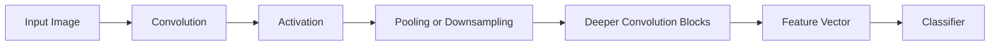

# What a convolutional neural network is

CNNs are easier to understand when seen as the image-specific continuation of ANN ideas. They still use weighted sums, activations, loss functions, backpropagation, and optimizers, but they change the connectivity pattern so that the network respects image structure.

## One-line definition

A convolutional neural network is a neural network designed for grid-like data such as images, using local filters and weight sharing to detect patterns efficiently.


*Source: [CS231n — Convolutional Neural Networks](https://cs231n.github.io/convolutional-networks/) (Stanford)*

## Why CNNs were needed

If you flatten a $224 \times 224 \times 3$ RGB image into one long vector, a fully connected layer loses almost all spatial structure.

Problems with plain dense layers on images:

- nearby pixels are treated like unrelated numbers
- parameter count explodes
- the model does not naturally exploit local patterns such as edges or corners
- the same object shifted slightly in the image may need relearning

CNNs fix this by hard-coding useful inductive bias:

- locality
- weight sharing
- hierarchical feature extraction

## The intuition behind convolution

Instead of connecting every input pixel to every neuron, a convolution uses a small filter, such as $3 \times 3$, and slides it across the image.

That filter learns a reusable pattern detector.

Early filters often learn:

- edges
- corners
- simple textures

Later layers combine those into:

- motifs
- shapes
- object parts
- full object concepts

## Visual flow



## The convolution operation

For an input image $X$ and kernel $K$, a 2D convolution produces:

$$
Y(i,j) = \sum_m \sum_n X(i+m, j+n) K(m,n)
$$

In practical deep learning libraries, this is often implemented as cross-correlation, but the intuition is the same: the filter looks for a specific local pattern.

For multi-channel input, one filter spans all input channels. If the image has $C_{in}$ channels and the kernel size is $k \times k$, then one filter has:

$$
k \times k \times C_{in}
$$

weights, plus one bias.

## Why weight sharing matters

Suppose a dense layer takes a flattened `32 x 32 x 3 = 3072` input and maps it to 100 hidden units:

$$
3072 \times 100 = 307{,}200
$$

That is already large.

A convolution with 16 filters of size `3 x 3` over 3 channels needs only:

$$
16 \times 3 \times 3 \times 3 = 432
$$

plus 16 biases.

This enormous reduction is one reason CNNs became the default for vision.

## Receptive field

The receptive field of a neuron is the region of the input it can "see."

- shallow neurons see small local regions
- deeper neurons indirectly see larger portions of the image

As depth increases, the network moves from local details to global concepts.

## Feature hierarchy

### Early layers

- edges
- gradients
- simple blobs

### Middle layers

- textures
- repeated patterns
- simple parts like eyes or wheels

### Deep layers

- object-level structure
- semantic features

This hierarchy is one of the most important ideas in deep learning.

## Why CNNs generalize better on images than ANNs

CNNs assume that:

- nearby pixels are related
- the same pattern can appear in many locations

These assumptions are usually true for images, so CNNs learn more efficiently than dense networks.

This is called a useful inductive bias.

## Visual anchor


Source: [Wikimedia Commons - Convolutional Neural Network.png](https://commons.wikimedia.org/wiki/File:Convolutional_Neural_Network.png)

## Tensor shapes in CNNs

In PyTorch, image batches usually have shape:

$$
(N, C, H, W)
$$

where:

- $N$ = batch size
- $C$ = channels
- $H$ = height
- $W$ = width

If you apply:

```python
nn.Conv2d(in_channels=3, out_channels=16, kernel_size=3, padding=1)
```

to an input of shape `(8, 3, 32, 32)`, the output shape becomes:

$$
(8, 16, 32, 32)
$$

assuming stride 1 and padding 1.

## Why pooling exists

Pooling reduces spatial size, which:

- lowers computation
- increases effective receptive field
- introduces some robustness to small translations

But too much pooling too early can destroy important detail.

The continuity from previous chapters is:

- ANN: every input connects to every hidden unit
- CNN: only local regions connect to each filter
- both are still trained by the same gradient-based pipeline

## PyTorch example

```python
import torch
import torch.nn as nn

x = torch.randn(8, 3, 32, 32)

model = nn.Sequential(
    nn.Conv2d(3, 16, kernel_size=3, stride=1, padding=1),
    nn.ReLU(),
    nn.MaxPool2d(kernel_size=2),
    nn.Conv2d(16, 32, kernel_size=3, stride=1, padding=1),
    nn.ReLU(),
    nn.AdaptiveAvgPool2d((1, 1)),
    nn.Flatten(),
    nn.Linear(32, 10),
)

logits = model(x)
print(logits.shape)  # (8, 10)
```

## Reading this code correctly

- first convolution learns low-level local patterns
- ReLU adds non-linearity
- pooling halves spatial resolution
- second convolution learns richer feature combinations
- adaptive average pooling compresses each channel to one number
- final linear layer maps the feature vector to class logits

## Important formulas

### Output size after convolution

For one spatial dimension:

$$
\text{output} =
\left\lfloor
\frac{W - K + 2P}{S}
\right\rfloor + 1
$$

where:

- $W$ = input width or height
- $K$ = kernel size
- $P$ = padding
- $S$ = stride

Parameter count in a convolution layer:

$$
\text{params} = (K_h \cdot K_w \cdot C_{in} + 1)\cdot C_{out}
$$

## Interview questions

<details>
<summary>Why not just use an ANN for images?</summary>

Because ANNs ignore spatial locality, require far more parameters, and do not naturally reuse detectors across positions.
</details>

<details>
<summary>What does a kernel learn?</summary>

A reusable local pattern detector.
</details>

<details>
<summary>Why is weight sharing powerful?</summary>

Because the same filter can detect the same pattern anywhere in the image.
</details>

<details>
<summary>What does a deeper CNN mean conceptually?</summary>

It means building more abstract features from simpler ones.
</details>

<details>
<summary>Does CNN give translation invariance automatically?</summary>

Not perfectly. It gives some translation robustness through convolution, pooling, and hierarchical features, but full invariance is not guaranteed.
</details>

<details>
<summary>Why does CNN parameter count stay much smaller than a dense network on images?</summary>

Because each filter is local and shared across positions, instead of learning a separate weight for every pixel-to-neuron connection.
</details>

<details>
<summary>What is the practical role of receptive field?</summary>

It tells us how much of the original image a neuron can effectively use when making its activation decision.
</details>

## Common mistakes

- flattening too early
- using too much downsampling
- ignoring input normalization
- misunderstanding channels and spatial dimensions
- believing filters are manually designed rather than learned

## Advanced perspective

CNNs are not just smaller ANNs. They encode a prior belief about the structure of the world: local correlations matter and patterns repeat across space.

That design prior is exactly why they perform so well on images, audio spectrograms, and some other structured signals.

## Final takeaway

A CNN is a feature hierarchy builder for spatial data. Its power comes from local processing, reused filters, and gradual abstraction from pixels to semantics.

## References

- CampusX YouTube: What is Convolutional Neural Network (CNN)
