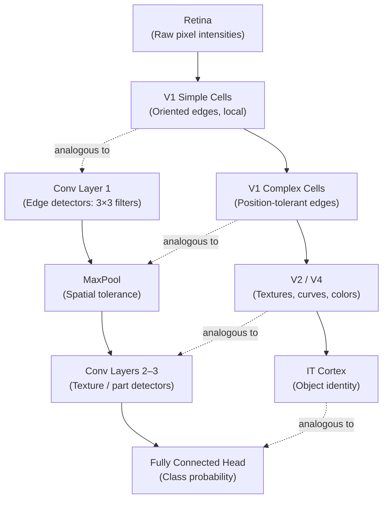

# CNNs, Visual Cortex Intuition, and the Cat Experiment

Convolutional neural networks are not purely an engineering invention. Their core design principles — local connectivity, hierarchical feature composition, and spatial weight sharing — trace directly to neurophysiology experiments conducted in the 1950s and 1960s on cats. Understanding that origin story is not mere trivia: it explains *why* CNNs are structured the way they are and gives you a principled framework for reasoning about their inductive biases.

## One-line definition

A convolutional neural network encodes the inductive bias that visual information is spatially local and hierarchically composable, mirroring the organization discovered in the mammalian visual cortex.


*Source: [CS231n — Convolutional Neural Networks](https://cs231n.github.io/convolutional-networks/) (Stanford)*

## Why this topic matters

CNNs dominated computer vision for over a decade and remain the backbone of deployed production systems in medical imaging, autonomous vehicles, and satellite analysis. The biological motivation explains two critical design decisions that distinguish CNNs from dense networks: filters that respond only to a small local patch (receptive field), and deeper layers that integrate responses from earlier ones (hierarchical composition). Without this intuition, stride, padding, and pooling choices seem arbitrary; with it, they follow naturally from what the network needs to simulate.

## The Hubel and Wiesel Experiment (1959)

David Hubel and Torsten Wiesel at Johns Hopkins University (later Harvard) inserted microelectrodes into the primary visual cortex (area V1) of anesthetized cats and projected light stimuli onto a screen. They recorded the electrical firing of individual neurons.

Their key finding: **neurons in V1 do not respond to diffuse light**. They fire selectively to specific oriented edges or bars at particular positions and orientations in the visual field. This was unexpected — prior models assumed retinal cells simply summed light intensity.

Hubel and Wiesel received the Nobel Prize in Physiology or Medicine in 1981 for this work.

```
Cat visual system pathway:

  Retina → LGN (Lateral Geniculate Nucleus) → V1 (Primary Visual Cortex)
                                                   ↓
                                          Simple Cells → Complex Cells
                                                   ↓
                                          Higher Visual Areas (V2, V4, IT)
```

## Simple Cells vs. Complex Cells

### Simple Cells

Simple cells respond to an oriented edge or bar **at a specific location** in the visual field. If you move the same bar slightly, the cell stops firing. They have well-defined excitatory and inhibitory subregions.

**Analogy to CNNs**: A single convolutional filter applied at one spatial position is analogous to a simple cell. It activates strongly only when a specific pattern appears at that exact location.

### Complex Cells

Complex cells respond to an oriented bar **regardless of its exact position** within a broader region. They show **position tolerance**: the same orientation at slightly different locations still causes firing.

**Analogy to CNNs**: Max pooling over a small spatial window mimics complex cells. After pooling, the network retains evidence that an oriented feature *appeared somewhere in a region*, not exactly where.

```
Simple Cell behavior:
  Input patch must match at exact (x, y) → fires

Complex Cell behavior:
  Input patch must match within region R → fires (position invariant)

CNN analogy:
  Conv filter at (x, y)   → Simple Cell response
  MaxPool over 2×2 region → Complex Cell tolerance
```

### Hypercomplex Cells (End-Stopping)

A third class — end-stopped or hypercomplex cells — fire strongly for short line segments and are suppressed when the line extends beyond a preferred length. These correspond loosely to higher-level feature detectors sensitive to corners, curves, and texture boundaries.

## Receptive Fields

A **receptive field** is the region of the input space that influences a particular neuron's response.

In the retina, each ganglion cell has a small, circular receptive field. In V1 simple cells, receptive fields are elongated (orientation-selective). In higher visual areas like inferotemporal cortex (IT), single neurons have receptive fields spanning the entire visual field and respond to complex objects like faces.

**CNN receptive field grows with depth**:

$$
\text{RF}_{\ell} = \text{RF}_{\ell-1} + (K_\ell - 1) \cdot \prod_{i=1}^{\ell-1} S_i
$$

where $K_\ell$ is the kernel size at layer $\ell$ and $S_i$ is the stride at layer $i$. Stacking 3×3 convolutions with stride 1 gives an effective receptive field of $2\ell + 1$ after $\ell$ layers.

## From Biology to CNN Architecture

The biological hierarchy maps onto CNN layers as follows:



### Local Connectivity

Just as each V1 neuron only processes signals from a small retinal patch, each CNN neuron (output element of a feature map) connects only to a local $K \times K$ patch of the previous layer. This is called **local connectivity** or **sparse interactions**.

### Weight Sharing

The same filter weights are applied at every spatial position. This reflects the biological assumption of **translation equivariance**: an edge detector should work the same way whether the edge is in the top-left or bottom-right corner of the image. Biologically, neighboring V1 columns detecting the same orientation but at different positions share similar connectivity patterns.

### Hierarchical Composition

Low-level features (edges) combine to form mid-level features (contours, textures), which combine to form high-level features (object parts, then objects). This is exactly the cortical hierarchy from V1 → V2 → V4 → IT.

## PyTorch example

```python
import torch
import torch.nn as nn

# A two-layer CNN that roughly mirrors the simple-cell → complex-cell hierarchy.
# Layer 1: local edge detectors (simple cells)
# MaxPool: position tolerance (complex cells)
# Layer 2: texture / pattern detectors

class BiologicallyMotivatedCNN(nn.Module):
    def __init__(self, num_classes: int = 10):
        super().__init__()
        # 3×3 filters mimic simple-cell oriented edge detectors
        self.simple_cells = nn.Conv2d(
            in_channels=1, out_channels=32,
            kernel_size=3, padding=1, bias=False
        )
        # 2×2 max-pool provides position tolerance (complex-cell behavior)
        self.complex_cells = nn.MaxPool2d(kernel_size=2, stride=2)
        # Deeper conv integrates local patterns into global features
        self.higher_visual = nn.Conv2d(32, 64, kernel_size=3, padding=1)
        self.global_pool = nn.AdaptiveAvgPool2d((1, 1))
        self.classifier = nn.Linear(64, num_classes)

    def forward(self, x):
        # x: (B, 1, H, W)
        x = torch.relu(self.simple_cells(x))   # Edge detection
        x = self.complex_cells(x)               # Spatial tolerance
        x = torch.relu(self.higher_visual(x))   # Pattern integration
        x = self.global_pool(x).flatten(1)
        return self.classifier(x)

model = BiologicallyMotivatedCNN(num_classes=10)
x = torch.randn(4, 1, 28, 28)
print(model(x).shape)  # (4, 10)
```

## Interview questions

<details>
<summary>What did Hubel and Wiesel discover in their 1959 cat experiment?</summary>

They discovered that neurons in the cat's primary visual cortex (V1) respond selectively to oriented edges and bars at specific positions, not to diffuse light. They identified two classes: simple cells (position-specific, orientation-selective) and complex cells (position-tolerant within a region). This revealed a hierarchical, locally connected organization in the visual system, which Fukushima formalized in the Neocognitron (1980) and LeCun extended into CNNs.
</details>

<details>
<summary>What is a receptive field and how does it change across CNN layers?</summary>

A receptive field is the region of the input that influences a particular neuron's output. In layer 1 of a CNN with 3×3 filters, each neuron sees a 3×3 input patch. After a second 3×3 conv layer, each neuron effectively sees a 5×5 region of the original input. The effective receptive field grows as: RF = 1 + (K−1) × sum of strides up to that layer. Stacking layers without stride grows the RF as $2\ell + 1$ for $\ell$ layers of 3×3 convolutions with stride 1.
</details>

<details>
<summary>How does weight sharing relate to translation equivariance?</summary>

Weight sharing means the same filter is convolved across the entire spatial extent of the input. If a cat's ear detector fires at position (10, 20), the same filter will fire equally at position (30, 50) if the same pattern appears there — because the weights are identical. This gives the network translation equivariance: shifting the input shifts the output feature map by the same amount. Biological V1 columns detecting the same orientation at different retinal positions have similar connectivity, inspiring this design.
</details>

<details>
<summary>What is the difference between translation equivariance and translation invariance?</summary>

Translation equivariance means shifting the input shifts the feature map correspondingly — the CNN is aware of where features are. Translation invariance means the output does not change at all when the input is shifted — the network no longer cares where. Convolution gives equivariance; pooling (especially global average pooling) moves toward invariance. Most CNNs are equivariant in early layers and increasingly invariant in later layers, which is desirable for classification.
</details>

<details>
<summary>Why do CNNs use local connectivity instead of full connections?</summary>

Three reasons: (1) Pixels far apart in natural images are rarely statistically dependent — locality is a valid inductive bias. (2) Local connectivity reduces parameters from $O(H \cdot W \cdot C_{in} \cdot C_{out})$ per layer to $O(K^2 \cdot C_{in} \cdot C_{out})$, which is independent of spatial size. (3) It mirrors the biology: no single V1 neuron processes the entire visual field.
</details>

## Common mistakes

- Conflating translation equivariance (property of conv layers) with translation invariance (property introduced by pooling or global average pooling).
- Thinking receptive fields only depend on kernel size — stride multiplies the effective growth rate.
- Assuming weight sharing is universal across all CNN variants; capsule networks and deformable convolutions deliberately break this assumption.
- Describing simple and complex cells as two layers of convolution — the complex cell analogy is specifically about pooled responses, not additional convolutions.

## Advanced perspective

The biological analogy breaks down in important ways. V1 neurons are recurrently connected; CNNs are feedforward. V1 processes temporal sequences of signals; standard CNNs process static snapshots. Biological orientation columns develop through unsupervised exposure to natural statistics (critical period plasticity), whereas CNN filters are gradient-optimized for a supervised loss. Modern self-supervised learning (SimCLR, DINO) has begun to recover biologically plausible representations without labels. Additionally, the Neocognitron (Fukushima, 1980) — the direct architectural precursor to LeNet — was explicitly designed to mimic simple and complex cells with handcrafted learning rules, whereas LeCun's breakthrough was replacing those rules with backpropagation.

## Final takeaway

The visual cortex story is not just biological trivia: it provides a first-principles justification for every key CNN design choice. Local connectivity is justified by spatial locality of natural image statistics. Weight sharing is justified by translation equivariance. Pooling is justified by the need for position tolerance. Hierarchical stacking is justified by the cortical hierarchy from edges to objects. Holding these connections in mind makes CNN architecture design an act of principled reasoning rather than empirical guessing.

## References

- Hubel, D. H., & Wiesel, T. N. (1959). Receptive fields of single neurones in the cat's striate cortex. *Journal of Physiology*, 148(3), 574–591.
- Fukushima, K. (1980). Neocognitron: A self-organizing neural network model for a mechanism of pattern recognition unaffected by shift in position. *Biological Cybernetics*, 36(4), 193–202.
- LeCun, Y., et al. (1998). Gradient-based learning applied to document recognition. *Proceedings of the IEEE*, 86(11), 2278–2324.
- Zeiler, M. D., & Fergus, R. (2014). Visualizing and understanding convolutional networks. *ECCV 2014*.
