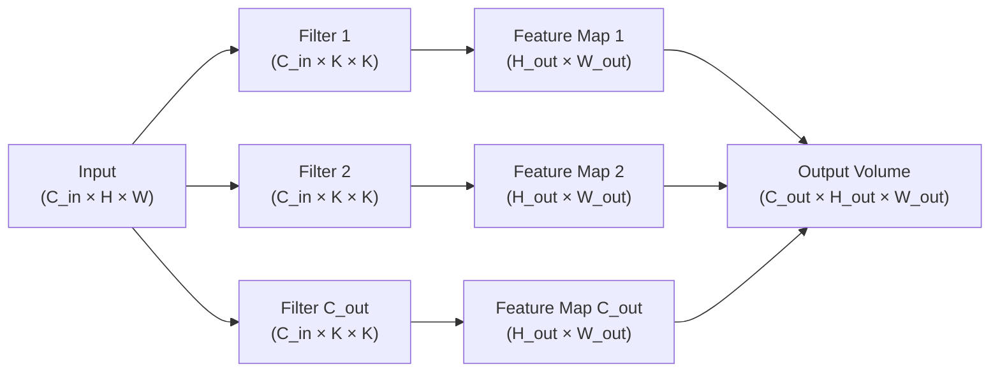

# The Convolution Operation in CNNs

The convolution operation is the computational engine of a CNN. A small matrix of learned weights — called a filter or kernel — slides across the input, computing a local dot product at every position and writing the result into an output feature map. Stacking many such filters produces a rich, multi-channel feature representation. Every design decision in CNN architecture — depth, kernel size, channel count — is an attempt to control what that feature representation captures.

## One-line definition

2D convolution slides a learned $K \times K$ filter over a spatial input, computing element-wise dot products at each position to produce a feature map that encodes the presence and location of the pattern the filter has learned to detect.


*Source: [CS231n — Convolutional Neural Networks](https://cs231n.github.io/convolutional-networks/) (Stanford) — Krizhevsky et al., 2012*

## Why this topic matters

Convolution is the operation that gives CNNs their computational efficiency and their spatial bias. Without understanding it precisely, you cannot reason about output shapes, parameter counts, gradient flow, or why certain features emerge in certain layers. It is also the operation most frequently mis-described in interviews (cross-correlation vs. true convolution, 2D vs. multi-channel, etc.).

## Mathematical Definition

### 2D Discrete Convolution (true)

For a 2D input $X$ of size $H \times W$ and a filter $K$ of size $k_H \times k_W$, the true convolution output at position $(i, j)$ is:

$$
(X \star K)[i, j] = \sum_{m=0}^{k_H - 1} \sum_{n=0}^{k_W - 1} X[i - m,\; j - n] \cdot K[m, n]
$$

True convolution flips the filter before sliding. This is the definition from signal processing.

### 2D Cross-Correlation (what CNNs actually compute)

Deep learning frameworks compute **cross-correlation**, which slides the filter without flipping:

$$
(X \star K)[i, j] = \sum_{m=0}^{k_H - 1} \sum_{n=0}^{k_W - 1} X[i + m,\; j + n] \cdot K[m, n]
$$

The distinction is purely conventional: since filters are learned, the network learns the flipped version if needed. PyTorch's `nn.Conv2d` implements cross-correlation. Both terms are used interchangeably in the deep learning literature.

### Multi-Channel 2D Convolution

A real RGB image has shape $(C_{in}, H, W)$. A filter must span all input channels, so it has shape $(C_{in}, k_H, k_W)$. The output at $(i, j)$ for a single filter is:

$$
Z[i, j] = b + \sum_{c=0}^{C_{in}-1} \sum_{m=0}^{k_H-1} \sum_{n=0}^{k_W-1} X[c,\; i+m,\; j+n] \cdot W[c,\; m,\; n]
$$

where $b$ is the bias scalar for this filter. Using $C_{out}$ independent filters produces an output of shape $(C_{out}, H_{out}, W_{out})$.

## Numerical Example: 3×3 Convolution

Input $X$ (5×5, single channel), filter $W$ (3×3), stride=1, no padding:

```
Input X:
  1  2  3  4  5
  5  4  3  2  1
  1  2  3  2  1
  0  1  2  3  4
  4  3  2  1  0

Filter W (horizontal edge detector):
  1  1  1
  0  0  0
 -1 -1 -1
```

Output at position (0,0) — top-left 3×3 patch:

$$
Z[0,0] = (1 \cdot 1 + 2 \cdot 1 + 3 \cdot 1) + (5 \cdot 0 + 4 \cdot 0 + 3 \cdot 0) + (1 \cdot{-1} + 2 \cdot{-1} + 3 \cdot{-1})
$$

$$
Z[0,0] = 6 + 0 + (-6) = 0
$$

Output at position (0,1) — shift one column right:

$$
Z[0,1] = (2+3+4) + (4+3+2) + (-2-3-2) = 9 + 9 + (-7) = 11
$$

Output shape: $(5 - 3)/1 + 1 = 3$, so the output is $3 \times 3$.

```
Output Z (3×3):
   0  11   6
  -4   4   8
   1   1   2
```

The filter responds strongly where the top row is brighter than the bottom row — a horizontal edge. This is exactly what a Sobel horizontal edge detector computes; in a trained CNN, such filters emerge automatically from data.

## Multiple Filters → Multiple Feature Maps

Using $C_{out}$ filters in parallel:



Each filter learns to detect a different local pattern (vertical edge, horizontal edge, diagonal, color blob, etc.). The output volume stacks these $C_{out}$ feature maps along the channel dimension.

## Output Size Formula

For a single spatial dimension with input size $I$, kernel $K$, padding $P$, stride $S$:

$$
O = \left\lfloor \frac{I + 2P - K}{S} \right\rfloor + 1
$$

Example: $I=32$, $K=3$, $P=1$, $S=1$:

$$
O = \left\lfloor \frac{32 + 2 - 3}{1} \right\rfloor + 1 = 31 + 1 = 32
$$

Padding=1 with $K=3$ and $S=1$ preserves spatial size.

## Parameter Count

A single `Conv2d(C_in, C_out, K)` layer has:

$$
\text{params} = C_{out} \times (C_{in} \times K \times K + 1)
$$

The $+1$ is the per-filter bias. Example: `Conv2d(3, 64, 3)`:

$$
\text{params} = 64 \times (3 \times 3 \times 3 + 1) = 64 \times 28 = 1{,}792
$$

This is independent of the spatial size of the input — the key efficiency advantage of weight sharing.

## PyTorch example

```python
import torch
import torch.nn as nn
import torch.nn.functional as F

# ---- Manual convolution to see the math ----
x = torch.tensor([[
    [1., 2., 3., 4., 5.],
    [5., 4., 3., 2., 1.],
    [1., 2., 3., 2., 1.],
    [0., 1., 2., 3., 4.],
    [4., 3., 2., 1., 0.],
]]).unsqueeze(0)  # shape: (1, 1, 5, 5)

horizontal_edge = torch.tensor([[
    [[ 1.,  1.,  1.],
     [ 0.,  0.,  0.],
     [-1., -1., -1.]]
]])  # shape: (1, 1, 3, 3)  →  1 filter, 1 input channel, 3×3

# F.conv2d: (input, weight, bias, stride, padding)
out = F.conv2d(x, horizontal_edge, stride=1, padding=0)
print("Output shape:", out.shape)   # (1, 1, 3, 3)
print("Feature map:\n", out[0, 0])

# ---- Learned multi-filter convolution ----
conv = nn.Conv2d(in_channels=3, out_channels=16, kernel_size=3, padding=1)
# Parameter count: 16 * (3*3*3 + 1) = 448
print("Params:", sum(p.numel() for p in conv.parameters()))

img_batch = torch.randn(8, 3, 32, 32)   # 8 RGB images
feature_maps = conv(img_batch)
print("Feature map shape:", feature_maps.shape)  # (8, 16, 32, 32)

# ---- Inspecting what the first filter looks like ----
# conv.weight has shape (C_out, C_in, K, K)
filter_0 = conv.weight[0]   # shape: (3, 3, 3) — one filter across 3 channels
print("First filter shape:", filter_0.shape)
```

## Interview questions

<details>
<summary>What is the difference between convolution and cross-correlation in CNNs?</summary>

True convolution (from signal processing) flips the filter 180° before sliding it over the input. Cross-correlation does not flip the filter. PyTorch, TensorFlow, and all major frameworks implement cross-correlation but call it convolution. The distinction is irrelevant in practice because the filter weights are learned — if the optimal filter is the horizontally-flipped version, the optimizer will learn those weights directly. For tasks that genuinely require a specific mathematical convolution (e.g., signal deconvolution), the distinction matters.
</details>

<details>
<summary>Why does parameter count not depend on spatial input size for a conv layer?</summary>

Because the same filter weights are reused (shared) at every spatial position. A 3×3 filter applied to a 32×32 image uses exactly the same 9 parameters (per channel) as when applied to a 224×224 image. Only the number of multiply-add operations (FLOPs) scales with spatial size, not the number of parameters. This is in stark contrast to a fully connected layer, where every spatial position has independent weights.
</details>

<details>
<summary>How does increasing the number of filters (C_out) affect the model?</summary>

More filters means more independent feature detectors, giving the layer higher representational capacity. The parameter count scales linearly with $C_{out}$: each filter adds $C_{in} \times K^2 + 1$ parameters. The output volume's channel dimension equals $C_{out}$, so memory and compute for subsequent layers also increase. Common practice: double $C_{out}$ every time you halve spatial resolution with pooling or stride-2 conv, keeping total representation size approximately constant.
</details>

<details>
<summary>What does a 1×1 convolution do?</summary>

A 1×1 convolution has $K=1$, so it does not aggregate spatial context. It computes a weighted sum across channels at each spatial position independently — functionally identical to applying a shared linear layer across all positions. This is used to: (1) change the channel dimension cheaply (bottleneck in ResNets), (2) introduce nonlinearities across channels without spatial mixing (Network-in-Network), and (3) mix channel information after depthwise separable convolutions (MobileNet).
</details>

<details>
<summary>What are depthwise separable convolutions and why do they reduce parameters?</summary>

A standard $K \times K$ convolution on $C_{in}$ channels to $C_{out}$ channels costs $C_{out} \cdot C_{in} \cdot K^2$ parameters. A depthwise separable convolution factorizes this into: (1) a depthwise conv ($C_{in}$ filters of shape $1 \times K \times K$, one per input channel) plus (2) a pointwise 1×1 conv ($C_{out}$ filters of shape $C_{in} \times 1 \times 1$). Total cost: $C_{in} \cdot K^2 + C_{in} \cdot C_{out}$. The reduction factor is approximately $K^2 / C_{out}$ — for 3×3 conv and 256 output channels, roughly 28× fewer parameters. This is the basis of MobileNet.
</details>

## Common mistakes

- Saying PyTorch computes "true convolution" — it computes cross-correlation.
- Computing output size with the formula but forgetting floor (integer division with non-integer inputs causes shape mismatches in code).
- Treating the bias as having the same shape as the kernel — bias is one scalar per output channel, shape `(C_out,)`.
- Confusing the number of filters ($C_{out}$) with kernel size ($K$) — they are independent hyperparameters.
- Forgetting that a single filter spans **all** input channels: filter shape is $(C_{in}, K, K)$, not $(K, K)$.

## Advanced perspective

The convolution operation can be cast as a matrix multiplication via the im2col transformation: each receptive field patch is unrolled into a row vector, stacking all positions into a matrix of shape $(H_{out} \cdot W_{out}, C_{in} \cdot K^2)$; the filters form a matrix of shape $(C_{in} \cdot K^2, C_{out})$. The convolution output is the product of these two matrices. This is how cuDNN (and most BLAS-accelerated implementations) actually compute convolutions on GPU — they map the operation onto highly-optimized GEMM (General Matrix Multiply) routines. The Winograd algorithm further reduces arithmetic for small kernels (3×3) by minimizing multiplications at the cost of more additions, yielding ~2× speedup over GEMM for common filter sizes.

## Final takeaway

Convolution is a parameter-efficient, spatially-aware dot product. Each filter is a learned pattern template; the output feature map records where in the image that pattern appears and how strongly. Stacking many filters builds a rich, hierarchically composable representation of the visual world. Every subsequent CNN concept — padding, stride, pooling, backpropagation through conv layers — is built on top of this core operation.

## References

- LeCun, Y., et al. (1998). Gradient-based learning applied to document recognition. *Proceedings of the IEEE*, 86(11), 2278–2324.
- Goodfellow, I., Bengio, Y., & Courville, A. (2016). *Deep Learning*, Chapter 9. MIT Press.
- Chetlur, S., et al. (2014). cuDNN: Efficient primitives for deep learning. *arXiv:1410.0759*.
- Howard, A. G., et al. (2017). MobileNets: Efficient convolutional neural networks for mobile vision applications. *arXiv:1704.04861*.
