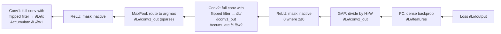

# Backpropagation in CNNs part 2

Part 1 covered the gradient through a single convolutional layer. This part covers the remaining pieces: backprop through max pooling, through multi-channel convolutions, and through the full stack from loss to the first layer. Together these form a complete picture of how a CNN trains.


*Source: [CS231n — Convolutional Neural Networks](https://cs231n.github.io/convolutional-networks/) (Stanford)*

## Backpropagation through max pooling

In the forward pass, `MaxPool2d(2)` selects the maximum value in each $2 \times 2$ window and records which position it came from (the **switch** or **argmax mask**).

In the backward pass, the upstream gradient flows only to the position that was selected in the forward pass:

$$
\frac{\partial \mathcal{L}}{\partial x[p, q]} = \begin{cases}
\frac{\partial \mathcal{L}}{\partial y[i, j]} & \text{if } (p, q) = \arg\max\text{ in window } (i,j) \\
0 & \text{otherwise}
\end{cases}
$$

**Example** (2×2 window, stride 2):

```
Forward:                         Backward (upstream gradient = 3):
Window: [[2, 5],      Max = 5    Gradient mask:  [[0, 3],
          [1, 3]]     at (0,1)                    [0, 0]]
```

The gradient 3 flows only to the position that contained the maximum (top-right). The other three positions receive zero gradient and their parameters do not update based on this pass.

This has an important implication: positions that are never selected during the forward pass never receive gradient. In practice this means max pooling can block gradient flow to certain neurons, though not catastrophically since gradient flows through many positions across different training examples.

## Backpropagation through multi-channel convolutions

In practice, convolutions have $C_{\text{in}}$ input channels and $C_{\text{out}}$ output channels. The filter is a 4D tensor: $w \in \mathbb{R}^{C_{\text{out}} \times C_{\text{in}} \times K \times K}$.

Forward pass (one output channel $c_{\text{out}}$):

$$
y_{c_{\text{out}}}[i, j] = \sum_{c_{\text{in}}=0}^{C_{\text{in}}-1} \sum_{r=0}^{K-1} \sum_{c=0}^{K-1} w[c_{\text{out}}, c_{\text{in}}, r, c] \cdot x_{c_{\text{in}}}[i+r, j+c] + b_{c_{\text{out}}}
$$

**Gradient w.r.t. filter weight** $w[c_{\text{out}}, c_{\text{in}}, r, c]$:

$$
\frac{\partial \mathcal{L}}{\partial w[c_{\text{out}}, c_{\text{in}}, r, c]} = \sum_{i,j} \frac{\partial \mathcal{L}}{\partial y_{c_{\text{out}}}[i, j]} \cdot x_{c_{\text{in}}}[i+r, j+c]
$$

The gradient for the $c_{\text{out}}$-th filter's $c_{\text{in}}$-th slice is the cross-correlation of the $c_{\text{out}}$-th upstream gradient map with the $c_{\text{in}}$-th input channel.

**Gradient w.r.t. input channel** $x_{c_{\text{in}}}[p, q]$:

$$
\frac{\partial \mathcal{L}}{\partial x_{c_{\text{in}}}[p, q]} = \sum_{c_{\text{out}}} \sum_{i,j} \frac{\partial \mathcal{L}}{\partial y_{c_{\text{out}}}[i, j]} \cdot w[c_{\text{out}}, c_{\text{in}}, p-i, q-j]
$$

The input gradient for channel $c_{\text{in}}$ accumulates contributions from all $C_{\text{out}}$ output channels that used it.

## Shape tracking through the full backward pass

For a CNN with the following forward pass (batch size $B = 4$, input $3 \times 32 \times 32$):

| Layer | Forward output shape | Backward gradient shape |
|---|---|---|
| Input | (4, 3, 32, 32) | (4, 3, 32, 32) |
| Conv2d(3→32, K=3, P=1) | (4, 32, 32, 32) | (4, 32, 32, 32) — upstm grad |
| MaxPool2d(2) | (4, 32, 16, 16) | (4, 32, 16, 16) → sparse (argmax mask) |
| Conv2d(32→64, K=3, P=1) | (4, 64, 16, 16) | (4, 64, 16, 16) — upstream grad |
| MaxPool2d(2) | (4, 64, 8, 8) | (4, 64, 8, 8) |
| AdaptiveAvgPool2d(1) | (4, 64, 1, 1) | (4, 64, 1, 1) — divided by pool size |
| Linear(64→10) | (4, 10) | standard dense backprop |

## Backprop through average pooling and global average pooling

Average pooling distributes the upstream gradient equally across all positions in the pooling window:

$$
\frac{\partial \mathcal{L}}{\partial x[p, q]} = \frac{1}{P^2} \cdot \frac{\partial \mathcal{L}}{\partial y[i, j]}
$$

where $(i, j)$ is the output position whose window contains $(p, q)$.

For `AdaptiveAvgPool2d(1)` with a $7 \times 7$ input: each upstream scalar is divided by 49 and broadcast back to all 49 input positions. All positions receive equal gradient — this is why global average pooling is smooth and stable.

## The role of ReLU in gradient flow

Between each conv layer is a ReLU activation. Its gradient is:

$$
\frac{\partial \text{ReLU}(z)}{\partial z} = \begin{cases} 1 & z > 0 \\ 0 & z \le 0 \end{cases}
$$

ReLU passes the gradient unchanged for active neurons, and blocks it entirely for dead neurons (those that output 0). This is why "dead ReLU" is a problem: a neuron that activates 0 for all training inputs never receives gradient and never updates.

In practice, less than 5–10% dead ReLUs is tolerable. If large fractions die, the cause is usually:
- Learning rate too large (weights jump to large negative pre-activations)
- Bad initialization (pre-activations start negative for most inputs)
- No batch normalization (pre-activation statistics drift)

## Complete backward pass PyTorch demonstration

```python
import torch
import torch.nn as nn


# ============================================================
# Full CNN forward and backward — inspect all gradients
# ============================================================
class SmallCNN(nn.Module):
    def __init__(self):
        super().__init__()
        self.conv1 = nn.Conv2d(3, 32, 3, padding=1)
        self.conv2 = nn.Conv2d(32, 64, 3, padding=1)
        self.pool = nn.MaxPool2d(2)
        self.gap = nn.AdaptiveAvgPool2d(1)
        self.fc = nn.Linear(64, 10)
        self.relu = nn.ReLU()

    def forward(self, x):
        x = self.relu(self.conv1(x))   # (B, 32, H, W)
        x = self.pool(x)                # (B, 32, H/2, W/2)
        x = self.relu(self.conv2(x))   # (B, 64, H/2, W/2)
        x = self.gap(x).flatten(1)     # (B, 64)
        return self.fc(x)              # (B, 10)


model = SmallCNN()
criterion = nn.CrossEntropyLoss()

x = torch.randn(4, 3, 32, 32)
y = torch.randint(0, 10, (4,))

# Forward + backward
output = model(x)
loss = criterion(output, y)
loss.backward()

# Inspect gradients at each layer
print("Gradient norms:")
for name, param in model.named_parameters():
    if param.grad is not None:
        print(f"  {name:30s}: grad norm = {param.grad.norm():.4f}")


# ============================================================
# Gradient clipping — important for deep CNNs
# ============================================================
# After backward(), before optimizer.step():
nn.utils.clip_grad_norm_(model.parameters(), max_norm=1.0)

optimizer = torch.optim.AdamW(model.parameters(), lr=1e-3)
optimizer.step()


# ============================================================
# Visualize which max-pool positions received gradient
# ============================================================
x2 = torch.randn(1, 1, 4, 4, requires_grad=True)
pool = nn.MaxPool2d(2)
out2 = pool(x2)
out2.sum().backward()

print("\nMax pool gradient (1 = selected, 0 = not selected):")
print((x2.grad > 0).float())
# Shows exactly which positions were the argmax in each 2×2 window
```

## Gradient flow visualization (mermaid)



## Interview questions

<details>
<summary>How does backpropagation through max pooling differ from through average pooling?</summary>

Max pooling backward: the upstream gradient flows only to the position that held the maximum value in the forward pass (the argmax). All other positions get zero gradient — they contributed nothing to the output, so they receive no learning signal. Average pooling backward: the upstream gradient is divided equally by the pool size ($1/P^2$) and distributed to all positions in the window. Every position receives gradient proportional to its contribution (equal contribution → equal gradient). Max pooling has a sparser gradient; average pooling has a denser, smoother gradient.
</details>

<details>
<summary>In a multi-channel conv layer with C_in=3, C_out=64, K=3, how many gradient computations happen in the backward pass?</summary>

Two sets: (1) gradient w.r.t. weights — for each of the $64 \times 3 = 192$ filter slices (each $3 \times 3$), compute one cross-correlation between the corresponding upstream gradient map and the corresponding input channel — 192 cross-correlations total. (2) gradient w.r.t. input — for each of the 3 input channels, sum the cross-correlations over all 64 output channels that used it — 192 cross-correlations totaling into 3 gradient maps. Both sets use the same convolution primitive as the forward pass.
</details>

## Common mistakes

- Forgetting that gradients accumulate (not replace) when `loss.backward()` is called multiple times — always call `optimizer.zero_grad()` before each forward pass
- Assuming max pooling has no effect on gradient flow — it blocks gradient to all non-maximum positions, which can matter for dense prediction tasks (segmentation, detection)
- Not monitoring gradient norms during training — exploding or vanishing gradients in conv layers are diagnosable by checking `param.grad.norm()` after each backward pass

## Final takeaway

Backprop through max pooling uses the argmax switch mask to route gradients only to the selected position. Multi-channel convolutions require summing gradients over all contributing output channels for the input gradient, and cross-correlating against each input channel independently for the filter gradient. ReLU blocks gradient to inactive neurons, creating dead ReLU risk. All three operations are computed automatically by autograd — but understanding them is essential for debugging gradient flow issues in deep CNNs.
