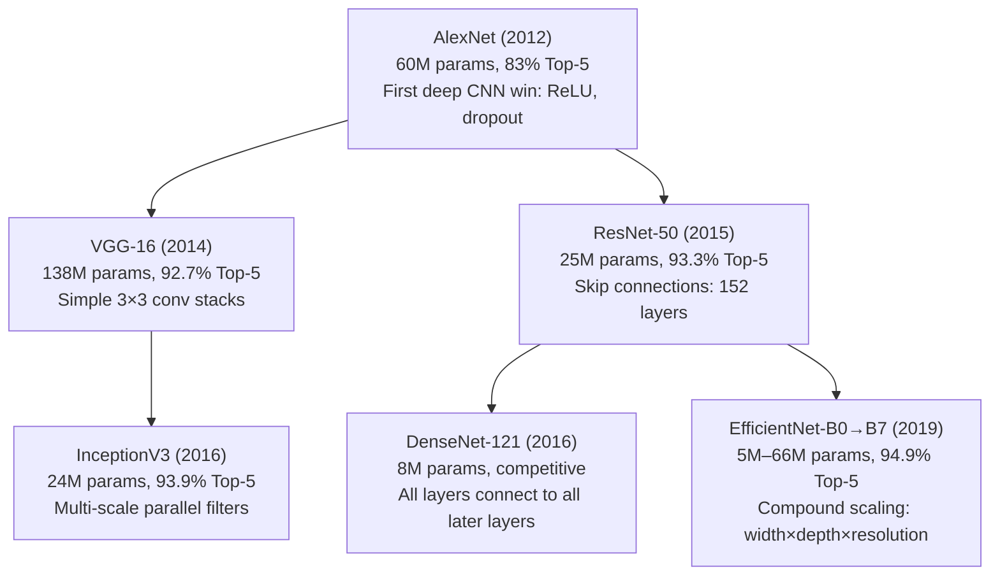

# Pretrained CNN models and ImageNet

ImageNet is a 1.2-million-image, 1000-class dataset that became the standard benchmark for image classification. Training a competitive CNN on ImageNet takes weeks on multiple GPUs. Pretrained models — CNNs trained on ImageNet and made publicly available — give you these learned weights for free. Using pretrained features is almost always better than training from scratch on a new task, even when the new task looks nothing like ImageNet.

## One-line definition

Pretrained CNNs are models whose weights have been optimized on ImageNet. They can be adapted to new tasks via fine-tuning or feature extraction, providing a massive head start over random initialization.


*Source: [CS231n — Convolutional Neural Networks](https://cs231n.github.io/convolutional-networks/) (Stanford) — Krizhevsky et al., 2012*

## The ImageNet benchmark

| Property | Value |
|---|---|
| Training images | ~1.28 million |
| Validation images | 50,000 |
| Classes | 1,000 |
| Top-1 accuracy baseline (random) | 0.1% |
| Human Top-5 accuracy | ~5% error |
| Best model Top-1 accuracy | ~90%+ (EfficientNet-L2, ViT-G) |

The competition (ILSVRC) ran from 2010 to 2017 and drove the major innovations: AlexNet (2012), VGG (2014), GoogLeNet/Inception (2014), ResNet (2015), DenseNet (2016), EfficientNet (2019).

## Architecture evolution



## Key architectures

### AlexNet (2012)

Kicked off the deep learning revolution. Introduced:
- ReLU activations (replaced sigmoid/tanh)
- Dropout regularization
- Data augmentation (random crops, flips)
- GPU training (two GPUs, each with 3GB)

Error rate: 15.3% (vs 26.2% for previous winner). A 10-point leap in one year.

### VGG-16 / VGG-19 (2014)

Key insight: depth with small $3 \times 3$ kernels is better than shallow networks with large kernels. VGG-16 has 13 conv layers (all $3 \times 3$) + 3 FC layers. Simple, regular, easy to understand — still used as a baseline and for feature extraction.

Weakness: 138M parameters. Most are in the three FC layers (102M of 138M). Very slow and memory-heavy.

### ResNet-50 (2015)

Solved the degradation problem: deeper networks trained with naive SGD performed worse than shallow ones (not because of overfitting — training loss was higher). Skip connections solve this:

$$
y = \mathcal{F}(x, \{W_i\}) + x
$$

Instead of learning $H(x)$, the block learns the residual $F(x) = H(x) - x$. When $F(x) = 0$, the block is an identity — the gradient highway. ResNet-152 has 152 layers and trains successfully.

### EfficientNet (2019)

Key insight: scaling model width, depth, and resolution together (compound scaling) is better than scaling any one dimension. A compound scaling coefficient $\phi$ controls all three:

$$
\text{depth} = \alpha^\phi, \quad \text{width} = \beta^\phi, \quad \text{resolution} = \gamma^\phi
$$

where $\alpha \cdot \beta^2 \cdot \gamma^2 \approx 2$. EfficientNet-B0 achieves 77.1% Top-1 with only 5.3M parameters — better accuracy per parameter than any previous architecture.

## PyTorch: loading and using pretrained models

```python
import torch
import torch.nn as nn
from torchvision import models, transforms
from PIL import Image


# ============================================================
# Load pretrained models — all from torchvision.models
# ============================================================

# ResNet-50 with latest weights
resnet = models.resnet50(weights=models.ResNet50_Weights.IMAGENET1K_V2)
resnet.eval()

# EfficientNet-B0
efficientnet = models.efficientnet_b0(weights=models.EfficientNet_B0_Weights.IMAGENET1K_V1)
efficientnet.eval()

# VGG-16
vgg = models.vgg16(weights=models.VGG16_Weights.IMAGENET1K_V1)
vgg.eval()

# Compare parameters
for name, model in [("ResNet-50", resnet), ("EfficientNet-B0", efficientnet), ("VGG-16", vgg)]:
    params = sum(p.numel() for p in model.parameters()) / 1e6
    print(f"{name:20s}: {params:.1f}M parameters")


# ============================================================
# ImageNet inference on a single image
# ============================================================
IMAGENET_MEAN = [0.485, 0.456, 0.406]
IMAGENET_STD  = [0.229, 0.224, 0.225]

preprocess = transforms.Compose([
    transforms.Resize(256),
    transforms.CenterCrop(224),
    transforms.ToTensor(),
    transforms.Normalize(IMAGENET_MEAN, IMAGENET_STD),
])


def classify_imagenet(model: nn.Module, image_path: str,
                       top_k: int = 5) -> list[tuple[str, float]]:
    """Run ImageNet classification and return top-k labels."""
    import urllib.request, json

    # Download ImageNet class labels (if not cached)
    labels_url = "https://raw.githubusercontent.com/anishathalye/imagenet-simple-labels/master/imagenet-simple-labels.json"
    # In practice: load from a local file

    image = Image.open(image_path).convert("RGB")
    tensor = preprocess(image).unsqueeze(0)

    with torch.no_grad():
        logits = model(tensor)
    probs = logits.softmax(dim=1)[0]

    top_probs, top_idxs = probs.topk(top_k)
    return list(zip(top_idxs.tolist(), top_probs.tolist()))


# ============================================================
# Adapting a pretrained model for a new task
# ============================================================
def adapt_resnet50(num_classes: int, freeze: bool = False) -> nn.Module:
    """
    Replace ResNet-50's classifier for a custom number of classes.
    freeze=True: only train the new classifier (feature extraction mode)
    freeze=False: train all layers (fine-tuning mode)
    """
    model = models.resnet50(weights=models.ResNet50_Weights.IMAGENET1K_V2)

    if freeze:
        for param in model.parameters():
            param.requires_grad = False

    # Replace the final FC layer (in_features=2048 for ResNet-50)
    model.fc = nn.Linear(model.fc.in_features, num_classes)
    # model.fc is always trainable (requires_grad=True by default)

    trainable = sum(p.numel() for p in model.parameters() if p.requires_grad)
    total = sum(p.numel() for p in model.parameters())
    print(f"Trainable: {trainable:,} / {total:,} ({100*trainable/total:.1f}%)")
    return model


# Feature extraction (only train final layer):
model_fe = adapt_resnet50(num_classes=2, freeze=True)

# Fine-tuning (train all layers):
model_ft = adapt_resnet50(num_classes=2, freeze=False)


# ============================================================
# Architecture comparison by task
# ============================================================
architecture_guide = {
    "Mobile / edge deployment":     "MobileNetV3, EfficientNet-B0, SqueezeNet",
    "Accuracy-first (cloud)":        "EfficientNet-B7, ConvNeXt, ResNeXt-101",
    "Transfer learning (small data)": "ResNet-50, ResNet-101 (stable, widely benchmarked)",
    "Simple baseline":               "ResNet-18 or ResNet-34",
    "Feature extractor for detection":"ResNet-50 + FPN (standard backbone for YOLO, Faster R-CNN)",
}
```

## The power of pretrained features

Why does a model pretrained on 1000 ImageNet classes help with, say, medical imaging?

The early layers of every CNN learn universal features: edges, corners, curves, color blobs. These are useful for any image recognition task. Even if the ImageNet classes are irrelevant, the low-level filters transfer. Empirically:

- Fine-tuning ResNet-50 on 100 chest X-rays often outperforms training from scratch on 10,000 X-rays
- The key is the generic feature representations, not the specific classes

## Model parameter counts and accuracy

| Model | Parameters | Top-1 Acc | Year | Notes |
|---|---|---|---|---|
| AlexNet | 60M | 63.3% | 2012 | Historical; rarely used now |
| VGG-16 | 138M | 73.4% | 2014 | Simple baseline |
| ResNet-18 | 11M | 70.0% | 2015 | Lightweight baseline |
| ResNet-50 | 25M | 76.1% | 2015 | Go-to workhorse |
| ResNet-101 | 44M | 77.4% | 2015 | Stronger backbone |
| EfficientNet-B0 | 5.3M | 77.1% | 2019 | Best param efficiency |
| EfficientNet-B7 | 66M | 84.4% | 2019 | High accuracy |
| ConvNeXt-Base | 89M | 83.8% | 2022 | Modernized ResNet |
| ViT-B/16 | 86M | 81.1% | 2020 | Transformer, not CNN |

## Interview questions

<details>
<summary>Why does training from scratch fail on small datasets even with a powerful model?</summary>

A large model has millions of parameters. With few training examples, the model can easily memorize them — achieving near-zero training loss while failing on validation. The model lacks the constraints that come from diverse data. Pretrained weights solve this by starting from a point that already encodes general image features (edges, textures, shapes), so the model only needs to adapt the final layer(s) to the new task. It is like hiring an expert who already knows the fundamentals rather than training a beginner from scratch.
</details>

<details>
<summary>What did ResNet solve that VGG could not?</summary>

VGG showed that deeper networks are more accurate, but in practice adding layers beyond a certain depth made training accuracy worse — not due to overfitting (validation would be worse too) but due to degradation during training. The gradient could not flow effectively through 50+ layers of plain convolutions. ResNet solved this with skip connections: $y = F(x) + x$. The identity shortcut provides a gradient highway — even if $F(x)$ gradients vanish, the gradient flows through the $+x$ connection. This enabled training networks of 100–1000 layers effectively.
</details>

## Common mistakes

- Using deprecated `pretrained=True` argument in PyTorch — use `weights=models.ResNet50_Weights.IMAGENET1K_V2` (explicit weight specification)
- Forgetting `model.eval()` for inference — batch norm and dropout behave differently in train vs eval mode
- Not using ImageNet normalization when using ImageNet pretrained weights — the weights assume inputs are normalized with ImageNet mean/std

## Final takeaway

ImageNet pretraining provides a near-universal feature extractor for visual tasks. The evolution from AlexNet to EfficientNet reflects the field's search for better accuracy per parameter: small kernels (VGG), skip connections (ResNet), multi-scale features (Inception), compound scaling (EfficientNet). For any new visual task, start with a pretrained ResNet-50 or EfficientNet — training from scratch is almost never the right choice when labeled data is limited.
