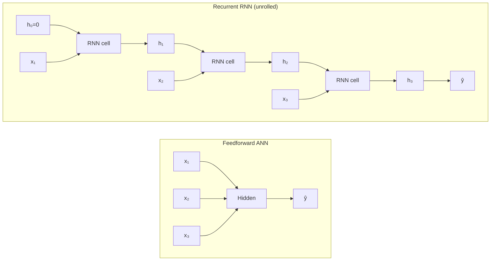

# Why RNNs Are Needed and How They Differ from ANNs

A standard feedforward network takes a fixed-size input vector and maps it to an output. That design is powerful for images and tabular data, but it breaks down the moment the input is a sequence of arbitrary length where order carries meaning. Recurrent Neural Networks (RNNs) were designed precisely to address this failure mode.

## One-line definition

An RNN is a neural network that processes one element of a sequence at a time and passes a hidden state forward, giving the model a form of memory across time steps.


*Source: [Wikimedia Commons — Recurrent neural network unfold](https://commons.wikimedia.org/wiki/File:Recurrent_neural_network_unfold.svg) (CC BY-SA 4.0)*

## Why this topic matters

Natural language, audio, time-series, and video are all sequential: the word "not" completely reverses the meaning of the sentence that follows it, and a stock price today depends on the trajectory of prices over the past week. A feedforward network that ignores order cannot model these dependencies. RNNs introduce a recurrence relation that lets the network accumulate context as it reads a sequence, which is the foundational idea behind every modern sequence model including LSTMs, GRUs, and the attention mechanism in Transformers.

## The ANN limitation for sequential data

### Fixed input size

A fully-connected ANN requires its input to have a predetermined shape. If you want to classify sentences, you must either pad every sentence to the same length or truncate long ones. Both choices waste capacity or lose information. More fundamentally, the model sees padding as real input unless you explicitly mask it.

### No temporal context

In a feedforward pass, every input dimension is processed independently relative to a fixed weight matrix. The position of a word in a sentence is not inherently encoded. You could shuffle the words in the input vector and the network would not know unless you somehow encode position manually (e.g., through positional embeddings, which Transformers do explicitly).

### Parameter explosion for long sequences

If you unroll a sequence of length $T$ and concatenate all tokens into one input vector of size $T \times d$, the first linear layer has weight matrix of shape $H \times (T \times d)$. For $T = 512$ tokens at $d = 300$ dimensions, this is 153,600 parameters just in the first layer, and the model cannot generalise to $T = 513$.

## The recurrent solution

An RNN processes the sequence one step at a time, applying the same parameterised function at every step. The key insight is **parameter sharing across time**: the weight matrices $W_x$, $W_h$, and $W_y$ are reused at every time step rather than having separate weights per position.

$$h_t = \tanh(W_x x_t + W_h h_{t-1} + b_h)$$

$$y_t = W_y h_t + b_y$$

At each step $t$, the network receives the current input $x_t$ and the previous hidden state $h_{t-1}$, and produces a new hidden state $h_t$ that summarises all inputs seen so far.

## Feedforward vs. recurrent computation



The ANN maps all inputs simultaneously to a single output; the RNN reads one token at a time, building up state.

## Key structural differences

| Property | Feedforward ANN | RNN |
|---|---|---|
| Input size | Fixed | Variable (any $T$) |
| Temporal context | None | Accumulated via $h_t$ |
| Parameter sharing | None across positions | Same weights at every $t$ |
| Output | Single vector | One per step or final $h_T$ |
| Handles sequences natively | No | Yes |
| Memory of early inputs | No | Yes (decays over time) |

## What parameter sharing buys you

Because the same $W_x$ and $W_h$ are used at every step, the total number of parameters is independent of sequence length. A network trained on sentences of length 20 can be applied to sentences of length 200. This is the same principle that makes CNNs translation-invariant via shared convolutional filters.

## PyTorch example

```python
import torch
import torch.nn as nn

# Batch of 8 sequences, each 15 tokens long, each token embedded to 32 dims
x = torch.randn(8, 15, 32)  # shape: (batch, seq_len, input_size)

rnn = nn.RNN(
    input_size=32,
    hidden_size=64,
    batch_first=True,        # expect (batch, seq, feature)
    nonlinearity='tanh'      # default activation
)

# outputs: (batch, seq_len, hidden_size) — hidden state at every step
# h_n:     (num_layers, batch, hidden_size) — final hidden state
outputs, h_n = rnn(x)

print("All step outputs:", outputs.shape)   # torch.Size([8, 15, 64])
print("Final hidden state:", h_n.shape)     # torch.Size([1, 8, 64])

# For classification, use only the last hidden state
final_h = h_n.squeeze(0)   # (8, 64)
classifier = nn.Linear(64, 2)
logits = classifier(final_h)  # (8, 2)
```

## Interview questions

<details>
<summary>Why can't a standard MLP handle variable-length sequences?</summary>

An MLP has a fixed input dimension determined at initialisation. A sequence of length $T$ with embedding size $d$ would need a layer of shape $H \times (T \cdot d)$, which is different for every $T$. Moreover, the model learns separate weights for each position, so it cannot generalize to unseen lengths and does not share statistical strength across positions.
</details>

<details>
<summary>What does "parameter sharing across time" mean in an RNN?</summary>

The same weight matrices $W_x$, $W_h$, and $W_y$ are used at every time step. Step 1 and step 100 apply the exact same transformation. This is analogous to a CNN using the same filter kernel at every spatial location. The consequence is that the model generalises to any sequence length and learns time-invariant features.
</details>

<details>
<summary>What is the hidden state and what information does it encode?</summary>

The hidden state $h_t \in \mathbb{R}^H$ is a fixed-size vector that acts as a compressed summary of all inputs seen up to time $t$. Ideally it encodes the information most relevant for predicting future outputs. In practice, vanilla RNNs struggle to retain information from many steps ago due to the vanishing gradient problem.
</details>

<details>
<summary>When would you still prefer an ANN (MLP) over an RNN for sequential data?</summary>

When sequence length is fixed and short (e.g., a 5-day weather feature vector), an MLP may outperform an RNN because it avoids the sequential bottleneck of hidden-state compression. Also, when positional order is irrelevant (bag-of-words), an MLP with global pooling suffices. Finally, when data fits comfortably in GPU memory and parallelism matters, a Transformer is usually better than both.
</details>

## Common mistakes

- Treating time steps as independent samples in a mini-batch (the RNN must see them in order).
- Forgetting to zero-initialize the hidden state between different sequences in the batch.
- Confusing `outputs` (hidden state at every step) with `h_n` (only the final step).
- Using batch size as the sequence length dimension (check `batch_first` setting carefully).
- Assuming RNNs can always learn long-range dependencies — vanilla RNNs typically cannot beyond ~10–20 steps.

## Advanced perspective

From a dynamical systems perspective, an RNN is a discrete-time non-linear dynamical system: $h_t = f(h_{t-1}, x_t; \theta)$. The hidden state is the system's state, and training amounts to fitting a parameterised trajectory through sequence space. This framing reveals why long-range dependencies are hard: the gradient of $h_T$ with respect to $h_0$ involves a product of $T$ Jacobian matrices, which either explodes or vanishes exponentially in $T$. Modern sequence models — LSTMs, GRUs, and ultimately the Transformer — are best understood as different solutions to this fundamental dynamical systems problem.

## Final takeaway

ANNs are powerful but blind to sequence order and confined to fixed input sizes. RNNs solve both problems through a recurrence relation that processes inputs one step at a time, maintains a hidden state as running memory, and reuses the same parameters across every position. This design scales to arbitrary sequence lengths with a constant parameter budget, but it introduces its own challenge: information must squeeze through a fixed-size hidden vector, and gradients must flow backward through every time step. The next lessons build directly on this foundation.

## References

- Rumelhart, Hinton, Williams (1986) — "Learning representations by back-propagating errors"
- Elman (1990) — "Finding structure in time"
- Goodfellow, Bengio, Courville — *Deep Learning*, Chapter 10
- Karpathy (2015) — "The Unreasonable Effectiveness of Recurrent Neural Networks"
