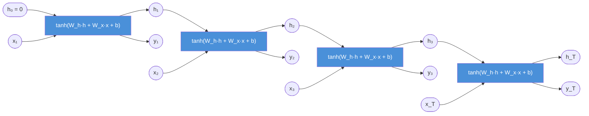

# Recurrent Neural Network Architecture and Forward Propagation

The RNN forward pass is a loop: at every time step $t$, two things enter (the current input and the previous hidden state) and two things exit (the new hidden state and an optional output). The same weight matrices are applied at every step. This section derives those equations from first principles, tracks all tensor shapes, and shows how unrolling reveals the full computation graph.

## One-line definition

An RNN forward pass applies the same affine transformation at every time step: $h_t = \tanh(W_h h_{t-1} + W_x x_t + b_h)$, accumulating a compressed history of the sequence in the hidden state $h_t$.


*Source: [Wikimedia Commons — Recurrent neural network unfold](https://commons.wikimedia.org/wiki/File:Recurrent_neural_network_unfold.svg) (CC BY-SA 4.0)*

## Why this topic matters

The forward equations define exactly what the network can and cannot represent. Every debugging session, every gradient derivation, and every architectural extension (LSTM, GRU, attention) starts from understanding what happens at a single RNN cell. The shapes of $W_h$, $W_x$, and the hidden state determine parameter count and memory requirements. Unrolling the recurrence makes the computation graph explicit, which is the prerequisite for understanding backpropagation through time.

## Core equations

Let $x_t \in \mathbb{R}^{d}$ be the input at step $t$, $h_t \in \mathbb{R}^{H}$ the hidden state, and $y_t \in \mathbb{R}^{K}$ the optional output at step $t$.

**Hidden state update:**

$$h_t = \tanh(W_h \, h_{t-1} + W_x \, x_t + b_h)$$

**Output at each step (optional):**

$$y_t = W_y \, h_t + b_y$$

**Initial hidden state:**

$$h_0 = \mathbf{0} \quad \text{(or learned)}$$

The parameters are:

| Parameter | Shape | Role |
|---|---|---|
| $W_x$ | $H \times d$ | Projects input to hidden space |
| $W_h$ | $H \times H$ | Projects previous hidden state |
| $b_h$ | $H$ | Hidden bias |
| $W_y$ | $K \times H$ | Projects hidden state to output |
| $b_y$ | $K$ | Output bias |

Total trainable parameters: $H(d + H + 1) + K(H + 1)$.

## Tensor shapes through the forward pass

For a batch of $B$ sequences, each of length $T$, with input dimension $d$ and hidden size $H$:

| Tensor | Shape |
|---|---|
| Input batch $X$ | $(B, T, d)$ |
| $x_t$ (one step) | $(B, d)$ |
| $h_{t-1}$ | $(B, H)$ |
| $W_x x_t$ | $(B, H)$ |
| $W_h h_{t-1}$ | $(B, H)$ |
| $h_t$ | $(B, H)$ |
| $y_t$ | $(B, K)$ |
| `outputs` (all steps) | $(B, T, H)$ |
| `h_n` (final step) | $(1, B, H)$ |

## Unrolled RNN diagram



All four cells share identical parameters. The arrows across the top are the recurrent connections.

## Why tanh is the default activation

The $\tanh$ activation maps any real value to $(-1, 1)$, which prevents unbounded growth of hidden state values across long sequences. Its gradient $\frac{d\tanh(z)}{dz} = 1 - \tanh^2(z)$ is in $(0, 1]$, which still causes vanishing gradients but at least prevents the hidden state norm from growing uncontrollably. ReLU is not used here by default because a hidden state growing without bound across $T$ steps would cause numerical instability.

## Compact matrix form

PyTorch and cuDNN implement both weight matrices fused into one multiplication. Writing $[h_{t-1}, x_t]$ for the horizontal concatenation of the two vectors:

$$h_t = \tanh\!\left(W [h_{t-1}; x_t] + b_h\right), \quad W \in \mathbb{R}^{H \times (H+d)}$$

This is numerically equivalent but uses a single GEMM (general matrix multiplication), which is faster on GPU.

## PyTorch example

```python
import torch
import torch.nn as nn

# Hyperparameters
batch_size   = 8
seq_len      = 20
input_size   = 32   # d
hidden_size  = 64   # H
output_size  = 10   # K

x = torch.randn(batch_size, seq_len, input_size)  # (B, T, d)

# ---- Using nn.RNN ----
rnn = nn.RNN(
    input_size=input_size,
    hidden_size=hidden_size,
    num_layers=1,
    nonlinearity='tanh',
    batch_first=True    # input: (B, T, d) instead of (T, B, d)
)

# Explicitly initialise h_0 to zeros (default behaviour)
h0 = torch.zeros(1, batch_size, hidden_size)  # (num_layers, B, H)

outputs, h_n = rnn(x, h0)
# outputs: (B, T, H) — hidden state at every step
# h_n:     (1, B, H) — hidden state at the final step only

print("outputs shape:", outputs.shape)  # torch.Size([8, 20, 64])
print("h_n shape:", h_n.shape)          # torch.Size([1, 8, 64])

# ---- Manual single-step to verify the equation ----
W_x = rnn.weight_ih_l0   # (H, d) = (64, 32)
W_h = rnn.weight_hh_l0   # (H, H) = (64, 64)
b   = rnn.bias_ih_l0 + rnn.bias_hh_l0  # (H,)

h_prev = torch.zeros(batch_size, hidden_size)
x_step = x[:, 0, :]  # first time step: (B, d)

h_manual = torch.tanh(x_step @ W_x.T + h_prev @ W_h.T + b)
h_auto   = outputs[:, 0, :]  # from nn.RNN

print("Max error:", (h_manual - h_auto).abs().max().item())  # ~0.0 (floating-point noise)

# ---- Output projection ----
linear = nn.Linear(hidden_size, output_size)
y_t    = linear(outputs)            # (B, T, K) — output at every step
y_last = linear(h_n.squeeze(0))     # (B, K) — output from final step only
```

## Parameter count

```python
total = sum(p.numel() for p in rnn.parameters())
# For hidden_size=64, input_size=32:
# W_x: 64 * 32 = 2048
# W_h: 64 * 64 = 4096
# b_ih + b_hh: 64 + 64 = 128
# Total: 6272
print(total)  # 6272
```

## Interview questions

<details>
<summary>Write out the full RNN forward equations and explain every term.</summary>

$$h_t = \tanh(W_h h_{t-1} + W_x x_t + b_h)$$

$$y_t = W_y h_t + b_y$$

- $x_t \in \mathbb{R}^d$: current input
- $h_{t-1} \in \mathbb{R}^H$: previous hidden state (context vector)
- $W_x \in \mathbb{R}^{H \times d}$: input projection weights
- $W_h \in \mathbb{R}^{H \times H}$: recurrent weights (applied to the previous state)
- $b_h \in \mathbb{R}^H$: hidden bias
- $\tanh$: squashes the pre-activation into $(-1, 1)$
- $W_y \in \mathbb{R}^{K \times H}$: output projection
- $b_y \in \mathbb{R}^K$: output bias
</details>

<details>
<summary>What are the shapes of W_x and W_h, and why does W_h have to be square?</summary>

$W_x \in \mathbb{R}^{H \times d}$ because it transforms an input of size $d$ into hidden space of size $H$. $W_h \in \mathbb{R}^{H \times H}$ because it transforms the previous hidden state (size $H$) into the same hidden space (size $H$) so the two projected vectors can be summed. Squareness is not a choice — it is forced by the requirement that $h_{t-1}$ and $h_t$ live in the same space.
</details>

<details>
<summary>What is the difference between `outputs` and `h_n` in PyTorch's nn.RNN?</summary>

`outputs` has shape $(B, T, H)$ and contains the hidden state at every single time step. `h_n` has shape $(num\_layers, B, H)$ and contains only the hidden state at the final time step $T$. For many-to-one tasks (e.g., sentiment classification), you only need `h_n`. For sequence labeling, you need all of `outputs`.
</details>

<details>
<summary>How does parameter sharing across time affect generalisation?</summary>

Because the same $W_x$, $W_h$ are used at every step, the model applies the same feature extractor to every position. This is analogous to a CNN's translation invariance. It means the model can handle sequences longer than those seen during training (though performance degrades), and it makes the model data-efficient because patterns at position 5 and position 50 both update the same weights.
</details>

## Common mistakes

- Swapping `batch_first=True` vs `False` — PyTorch's `nn.RNN` defaults to `(T, B, d)` unless `batch_first=True`.
- Reusing the same `h_n` tensor across different batches without detaching, which causes incorrect gradient flow.
- Forgetting that `h_n` for a multi-layer RNN has shape `(num_layers, B, H)`, not `(1, B, H)`.
- Applying a softmax inside the model when `nn.CrossEntropyLoss` already expects raw logits.
- Initialising $h_0$ with random values (noise) rather than zeros, which hurts early training stability.

## Advanced perspective

The recurrent weight matrix $W_h$ is the key object in the dynamics of an RNN. Its eigenvalue spectrum governs whether hidden states grow, shrink, or oscillate over time. If all eigenvalues of $W_h$ have magnitude less than 1, hidden states contract toward zero and the network forgets. If any eigenvalue exceeds 1, hidden states can grow unboundedly. Careful initialisation (e.g., orthogonal initialisation of $W_h$) is crucial for stability: an orthogonal matrix has all eigenvalues on the unit circle, which preserves hidden state norms and keeps gradients well-conditioned at initialisation.

## Final takeaway

The RNN forward pass is a loop of a single equation: $h_t = \tanh(W_h h_{t-1} + W_x x_t + b_h)$. The hidden state $h_t$ accumulates context from all previous steps through the recurrent connection $W_h h_{t-1}$. Every time step uses the same parameters, which makes the network length-agnostic and parameter-efficient. The tension between expressiveness and the vanishing gradient problem motivates the LSTM and GRU extensions we study next.

## References

- Elman (1990) — "Finding structure in time"
- Goodfellow, Bengio, Courville — *Deep Learning*, Chapter 10.2
- PyTorch docs — `torch.nn.RNN`
- Pascanu, Mikolov, Bengio (2013) — "On the difficulty of training recurrent neural networks"
