# RNN Sentiment Analysis in PyTorch

Sentiment analysis is the canonical many-to-one sequence task: read a sentence of variable length, encode it into a fixed-size vector via an RNN, then classify that vector. This note builds the entire pipeline from raw text to prediction, covering tokenisation, embedding, the RNN encoder, padding, `pack_padded_sequence`, and the training loop.

## One-line definition

Sentiment analysis with an RNN maps a variable-length token sequence through an embedding layer and a recurrent encoder to a fixed-size context vector, which a linear head then classifies as positive or negative.


*Source: [Wikimedia Commons — Recurrent neural network unfold](https://commons.wikimedia.org/wiki/File:Recurrent_neural_network_unfold.svg) (CC BY-SA 4.0)*

## Why this topic matters

Sentiment classification is simple enough to implement from scratch but rich enough to expose every important design decision in sequence modelling: vocabulary construction, padding strategy, handling variable-length inputs efficiently, and extracting a single representation from a sequence. The lessons here transfer directly to more complex tasks like text classification, document summarisation, and NLI.

## Pipeline overview

```mermaid
flowchart LR
    raw["Raw Text\n'The movie was great'"] --> tok["Tokeniser\n[3, 15, 7, 204]"]
    tok --> pad["Padding + Sorting\n[3,15,7,204,0,0]"]
    pad --> emb["Embedding Layer\n(vocab, emb_dim)"]
    emb --> pack["pack_padded_sequence"]
    pack --> rnn["nn.RNN / nn.LSTM\nhidden_size=128"]
    rnn --> unpack["pad_packed_sequence"]
    unpack --> pool["Take h_n\n(final hidden state)"]
    pool --> fc["Linear(128, 1)"]
    fc --> sig["Sigmoid → ŷ ∈ (0,1)"]
```



## Step 1 — Vocabulary and tokenisation

```python
from collections import Counter
import re

def simple_tokenise(text: str) -> list[str]:
    return re.findall(r"\b\w+\b", text.lower())

def build_vocab(texts: list[str], min_freq: int = 2) -> dict[str, int]:
    counter = Counter(tok for t in texts for tok in simple_tokenise(t))
    vocab = {"<pad>": 0, "<unk>": 1}
    for word, freq in counter.most_common():
        if freq >= min_freq:
            vocab[word] = len(vocab)
    return vocab

def encode(text: str, vocab: dict[str, int]) -> list[int]:
    return [vocab.get(tok, vocab["<unk>"]) for tok in simple_tokenise(text)]
```

`<pad>` is index 0 — we embed it but zero-out its gradient with `padding_idx=0`. `<unk>` handles out-of-vocabulary words at inference time.

## Step 2 — Dataset and collate function

Variable-length sequences must be padded to the same length within a batch. The recommended approach is dynamic padding (pad to the longest sequence in each batch, not across the entire dataset).

```python
import torch
from torch.utils.data import Dataset, DataLoader
from torch.nn.utils.rnn import pad_sequence, pack_padded_sequence, pad_packed_sequence

class SentimentDataset(Dataset):
    def __init__(self, texts: list[str], labels: list[int], vocab: dict[str, int]):
        self.encoded = [torch.tensor(encode(t, vocab), dtype=torch.long) for t in texts]
        self.labels  = torch.tensor(labels, dtype=torch.float)

    def __len__(self):
        return len(self.labels)

    def __getitem__(self, idx):
        return self.encoded[idx], self.labels[idx]


def collate_fn(batch):
    seqs, labels = zip(*batch)
    lengths = torch.tensor([len(s) for s in seqs])

    # Sort by descending length (required for pack_padded_sequence with enforce_sorted=True)
    lengths, sort_idx = lengths.sort(descending=True)
    seqs   = [seqs[i] for i in sort_idx]
    labels = torch.stack(labels)[sort_idx]

    # Pad to longest sequence in batch; pad value = 0 (<pad> token)
    padded = pad_sequence(seqs, batch_first=True, padding_value=0)
    return padded, lengths, labels
```

## Step 3 — Model definition

```python
import torch.nn as nn

class SentimentRNN(nn.Module):
    def __init__(
        self,
        vocab_size: int,
        emb_dim: int    = 128,
        hidden_size: int = 256,
        n_layers: int   = 2,
        dropout: float  = 0.3,
        pad_idx: int    = 0
    ):
        super().__init__()
        self.embedding = nn.Embedding(
            vocab_size, emb_dim, padding_idx=pad_idx
        )  # padding_idx ensures <pad> embedding stays zero

        self.rnn = nn.RNN(
            input_size=emb_dim,
            hidden_size=hidden_size,
            num_layers=n_layers,
            batch_first=True,
            dropout=dropout if n_layers > 1 else 0.0,
            nonlinearity='tanh'
        )

        self.dropout = nn.Dropout(dropout)
        self.fc      = nn.Linear(hidden_size, 1)

    def forward(self, x: torch.Tensor, lengths: torch.Tensor) -> torch.Tensor:
        # x: (B, T)  lengths: (B,)
        emb = self.dropout(self.embedding(x))   # (B, T, emb_dim)

        # Pack — tells the RNN to ignore padding positions
        packed = pack_padded_sequence(emb, lengths.cpu(), batch_first=True)
        _, h_n = self.rnn(packed)
        # h_n: (n_layers, B, hidden_size)

        # Take the last layer's hidden state
        h_last = self.dropout(h_n[-1])           # (B, hidden_size)
        logits = self.fc(h_last).squeeze(-1)     # (B,)
        return logits                            # raw logits (no sigmoid)
```

## Step 4 — Training loop

```python
import torch.optim as optim
from sklearn.model_selection import train_test_split

def train_epoch(model, loader, criterion, optimiser, device):
    model.train()
    total_loss, correct = 0.0, 0
    for x, lengths, y in loader:
        x, lengths, y = x.to(device), lengths, y.to(device)
        optimiser.zero_grad()
        logits = model(x, lengths)
        loss   = criterion(logits, y)
        loss.backward()
        torch.nn.utils.clip_grad_norm_(model.parameters(), max_norm=1.0)
        optimiser.step()
        total_loss += loss.item() * len(y)
        correct    += ((logits > 0).float() == y).sum().item()
    return total_loss / len(loader.dataset), correct / len(loader.dataset)


def evaluate(model, loader, criterion, device):
    model.eval()
    total_loss, correct = 0.0, 0
    with torch.no_grad():
        for x, lengths, y in loader:
            x, y = x.to(device), y.to(device)
            logits = model(x, lengths)
            loss   = criterion(logits, y)
            total_loss += loss.item() * len(y)
            correct    += ((logits > 0).float() == y).sum().item()
    return total_loss / len(loader.dataset), correct / len(loader.dataset)


# ---- Putting it together ----
device = torch.device('cuda' if torch.cuda.is_available() else 'cpu')

# Example data (replace with real dataset)
texts  = ["I loved this movie", "Terrible film, waste of time",
          "Absolutely fantastic!", "Boring and predictable"]
labels = [1, 0, 1, 0]

vocab     = build_vocab(texts, min_freq=1)
dataset   = SentimentDataset(texts, labels, vocab)
loader    = DataLoader(dataset, batch_size=2, shuffle=True, collate_fn=collate_fn)

model     = SentimentRNN(vocab_size=len(vocab)).to(device)
criterion = nn.BCEWithLogitsLoss()        # numerically stable sigmoid + BCE
optimiser = optim.Adam(model.parameters(), lr=1e-3)

for epoch in range(5):
    tr_loss, tr_acc = train_epoch(model, loader, criterion, optimiser, device)
    print(f"Epoch {epoch+1}: loss={tr_loss:.4f}  acc={tr_acc:.4f}")
```

## Why pack_padded_sequence matters

Without packing, the RNN processes padding tokens as if they were real input. The hidden state changes at every pad position, so $h_T$ (which you use for classification) is polluted by padding noise rather than reflecting the actual end of the sentence. `pack_padded_sequence` tells the RNN to stop updating the hidden state as soon as a sequence's real tokens are exhausted, making `h_n` contain exactly the state at the true end of each sequence.

## Interview questions

<details>
<summary>Why do we use BCEWithLogitsLoss instead of BCELoss + sigmoid?</summary>

`BCEWithLogitsLoss` fuses the sigmoid and binary cross-entropy into a single numerically stable operation using the log-sum-exp trick. Separate `sigmoid` followed by `BCELoss` can produce NaN or Inf when logits are very large or very small because `sigmoid(x)` becomes exactly 0 or 1 in float32, making `log(0)` undefined. The fused version avoids this by computing `log(1 + exp(−x))` in a numerically stable form.
</details>

<details>
<summary>What does padding_idx=0 do in nn.Embedding?</summary>

It forces the embedding vector for index 0 to remain the zero vector throughout training. Gradients for that index are zeroed out during backpropagation. This is important because pad tokens should not contribute any signal to the model — they are artificial, not part of the real input.
</details>

<details>
<summary>Why sort sequences by descending length before pack_padded_sequence?</summary>

`pack_padded_sequence` with `enforce_sorted=True` (the default) expects sequences in descending length order so it can efficiently compute a batch of varying-length sequences by progressively shrinking the active batch. You can bypass sorting by passing `enforce_sorted=False`, but sorted batches are slightly faster on CPU. On GPU the difference is usually negligible.
</details>

<details>
<summary>How would you replace the vanilla RNN with an LSTM in this model?</summary>

Change `nn.RNN` to `nn.LSTM`. The LSTM returns `(outputs, (h_n, c_n))` instead of `(outputs, h_n)`. Update the forward method to unpack both: `_, (h_n, _) = self.lstm(packed)`. Everything else (padding, embedding, classification head) stays the same. The LSTM typically outperforms the vanilla RNN on longer reviews because it better handles long-range dependencies.
</details>

## Common mistakes

- Not sorting sequences before `pack_padded_sequence` with `enforce_sorted=True`.
- Calling `pack_padded_sequence` with GPU tensors for `lengths` — lengths must be on CPU.
- Using `BCELoss` instead of `BCEWithLogitsLoss`, risking numerical instability.
- Forgetting to call `model.eval()` and `torch.no_grad()` during evaluation, which wastes memory and gives incorrect dropout behaviour.
- Not clipping gradients in the RNN — long sequences can still produce large gradients even with tanh.

## Advanced perspective

Production-grade sentiment classifiers rarely use vanilla RNNs today. The BiLSTM (bidirectional LSTM) was the de-facto baseline before Transformers: it reads the sentence in both directions and concatenates the two final hidden states, capturing both prefix and suffix context. BERT-style encoders replaced BiLSTMs for most NLP classification tasks because self-attention allows every token to attend to every other token without the sequential bottleneck. However, RNN-based models remain competitive for streaming inference (one token arrives at a time), on-device NLP, and domains where sequence order is the primary inductive bias.

## Final takeaway

The sentiment analysis pipeline binds together five ideas that recur throughout sequence modelling: tokenisation (map text to integers), embedding (map integers to dense vectors), RNN encoding (compress a variable-length sequence into a fixed-size vector), padding/packing (handle batches of different lengths efficiently), and classification (map the context vector to a label). Mastering this pipeline end-to-end prepares you to understand the encoder half of seq2seq models and the input processing stage of Transformers.

## References

- PyTorch docs — `torch.nn.utils.rnn.pack_padded_sequence`
- Maas et al. (2011) — "Learning Word Vectors for Sentiment Analysis" (IMDB dataset)
- Goodfellow, Bengio, Courville — *Deep Learning*, Chapter 10
